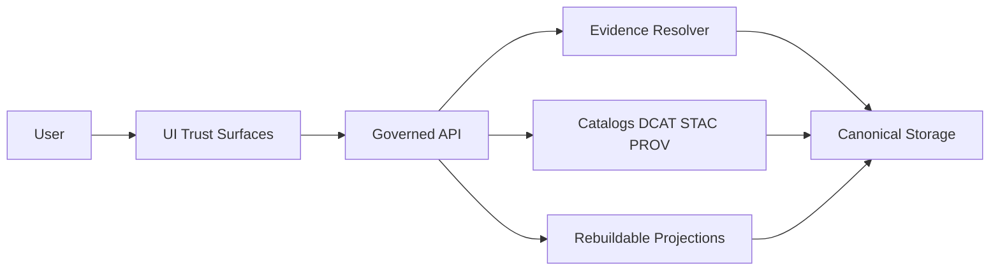

<!-- [KFM_META_BLOCK_V2]
doc_id: kfm://doc/eae2ee68-b46a-4acf-be92-04fa5d94b4b8
title: UI Trust Surfaces Standard
type: standard
version: v1
status: draft
owners: KFM UI + Governance
created: 2026-03-04
updated: 2026-03-04
policy_label: internal
related:
  - kfm://doc/ui/map-explorer
  - kfm://doc/ui/story-nodes
  - kfm://doc/ui/focus-mode
tags:
  - kfm
  - ui
  - trust
  - evidence
  - provenance
  - policy
notes:
  - Defines the minimum trust signals and evidence access patterns required across Map, Story, Catalog, and Focus Mode.
[/KFM_META_BLOCK_V2] -->

# UI Trust Surfaces Standard
Minimum, testable requirements for making evidence, provenance, policy decisions, and freshness visible across the KFM user interface.

> **Status:** draft (normative once published)  
> **Owners:** KFM UI + Governance  
> **Applies to:** Map Explorer, Story Nodes, Catalog, Focus Mode, Download/Export surfaces

**Quick links**
- [Scope](#scope)
- [Trust invariants](#trust-invariants)
- [Trust surface matrix](#trust-surface-matrix)
- [Required UI components](#required-ui-components)
- [Surface requirements](#surface-requirements)
- [Quality gates](#quality-gates)
- [Appendix](#appendix)

---

## Scope

This standard defines **UI trust surfaces**: any UI output where a user could reasonably interpret a **claim** about the world (maps, charts, timelines, Story Nodes, AI answers, dataset pages, exports).

It specifies:
- The **minimum trust signals** that must be visible
- The **minimum interactions** required to inspect evidence and provenance
- **Fail-closed** UX behavior for missing/unauthorized/unresolvable evidence
- A **test checklist** to keep the requirements enforceable

### Where it fits

- **Upstream (inputs):** Governed API responses (policy-filtered), Evidence Resolver outputs (EvidenceBundle), catalogs (DCAT/STAC/PROV), run receipts/attestations.
- **Downstream (consumers):** Map Explorer, Story Nodes publishing & viewing, Focus Mode chat UI, Catalog browsing, Download/export UIs.

### Acceptable inputs

- UI components and interaction patterns
- UI-visible trust fields and badge designs (version, license, policy label, freshness)
- UI contract expectations (what the UI requires from API responses)

### Exclusions

- Backend policy authoring (OPA/Rego), pipeline implementation, storage layout.
- Data model design beyond UI-visible trust fields.
- Visual design tokens (colors/typography) except where needed for accessibility.

---

## Terms

- **Trust surface:** a user-facing surface that can influence belief (map layer, story paragraph, AI answer, dataset listing).
- **Claim:** a statement, visualization, or derived summary that can be true/false (e.g., “storms increased”, “species present”, “this layer is 2021 land cover”).
- **EvidenceRef:** a structured reference used for citations; it **must** resolve via the Evidence Resolver.
- **EvidenceBundle:** the resolved, policy-filtered evidence package (human card + machine metadata + digests + audit references).
- **Audit reference (audit_ref):** an identifier that links a UI action/output to an auditable record (e.g., Focus Mode run receipt).
- **Policy label:** the user-safe classification surfaced in UI (e.g., public, restricted, sensitive-location).
- **Obligation:** a policy-required transformation or handling constraint (e.g., redaction/generalization applied).
- **Freshness:** “how current is this data?” as expressed in a user-visible way (e.g., last updated date + update cadence or “unknown”).

---

## Trust invariants

These are non-negotiable system/UI invariants. They are requirements (not claims about current implementation).

- **INVARIANT (CONFIRMED):** UI and external clients never access databases or storage directly; all access is via the governed API + policy boundary (“trust membrane”).  
- **INVARIANT (CONFIRMED):** Requests fail closed: if evidence cannot be resolved or policy denies access, the UI must show a policy-safe abstention/denial instead of “best effort” guesses.  
- **INVARIANT (CONFIRMED):** Focus Mode and Story publishing must **cite or abstain**; citations must resolve to EvidenceBundles and be verified as policy-allowed.  
- **INVARIANT (CONFIRMED):** The UI must make trust visible (dataset version, license/rights, policy badge, evidence/provenance access) on map, story, and AI surfaces.  
- **INVARIANT (CONFIRMED):** Never reveal restricted existence via “ghost metadata” unless policy explicitly allows it (e.g., differences between 403/404 or listing restricted datasets).

> If any new UI feature cannot satisfy these invariants, it is **non-compliant** and must not ship.

---

## Trust surface matrix

Minimum required trust signals and evidence affordances by surface.

| Surface | User sees / believes | Minimum trust signals (MUST show) | Evidence interaction (MUST) |
|---|---|---|---|
| Map layer list (Layer Panel) | “This layer represents X” | dataset version, policy label badge, license summary, freshness | Open evidence drawer for the layer |
| Map feature inspect | “This feature has attributes A/B/C” | dataset version, policy label badge, license, any generalization indicator | EvidenceRefs per feature; open evidence drawer |
| Timeline control / histogram | “This is the data over time” | dataset version(s), freshness, “derived” label if computed | Link to provenance panel and evidence bundles behind aggregation |
| Story Node viewer | “This narrative is supported” | Story version, review status, citations present, policy label where relevant | Citation list opens evidence drawer; audit_ref if governed output |
| Story Node publish UI | “This story is publishable” | validation status, resolvable citations, review state | Preflight: resolve all citations; block publish if any fail |
| Focus Mode chat answer | “The assistant is reliable” | citations visible, dataset IDs, policy notes, audit_ref | Citation verification status; citations open evidence drawer |
| Dataset catalog list | “These datasets exist” | policy-safe listing only; license summary; last updated | Dataset detail page links to evidence/provenance |
| Dataset/version detail | “This version is authoritative” | dataset_version_id, digest(s), license, provenance/run_id, policy label | Link out to catalogs + receipts + evidence bundles |
| Download/export | “This file corresponds to what I saw” | digest + signature/attestation status, dataset_version_id, license | Provide evidence bundle and provenance link for the export |
| Admin/steward surfaces | “This decision is correct” | policy decision details (role-gated), redaction obligations, audit refs | Deep links to audit logs, evidence bundle, policy test fixtures |

---

## Required UI components

These components are required conceptually; specific implementation names are flexible.

### 1) Trust badges row

A compact badge row that appears on every trust surface.

**MUST include (when applicable):**
- **Version badge:** `dataset_version_id` (or story version)
- **Policy badge:** `policy_label` (public-safe)
- **License badge:** SPDX + attribution shortcut
- **Freshness badge:** `last_updated` (and optionally cadence); otherwise “unknown”
- **Redaction/generalization badge:** if obligations applied

### 2) Evidence Drawer

A shared UI drawer/panel that can be opened from Map/Story/Focus/Catalog.

**MUST show at minimum:**
- EvidenceBundle title + `bundle_id`
- `dataset_version_id`
- policy decision (allow/deny) and obligations applied (public-safe)
- license (SPDX + attribution)
- provenance pointer (e.g., `run_id`)
- artifact list with `href`, `media_type`, and `digest`
- `audit_ref` (if present)

**MUST behaviors:**
- One-click open from each trust surface
- Keyboard navigable + accessible labels
- “Copy citation” action that copies an EvidenceRef (not a raw URL)

### 3) Provenance panel

A panel/page that explains *how this data came to be*.

**MUST provide:**
- ingest/run timeline (who/when/what) where policy allows
- links to DCAT/STAC/PROV artifacts for the dataset/version
- “what changed?” link to a diff viewer when comparing versions

### 4) “What changed?” diff viewer

Where version comparisons exist, a UI that explains differences without forcing users to guess.

**MUST:**
- compare two dataset versions and show high-level diffs (counts, time range, schema changes, coverage changes) when available
- link diffs back to provenance/run receipts

### 5) Audit footer (governed operations)

For governed outputs (Focus Mode runs, Story publish), a small footer:

**MUST:**
- show `audit_ref`
- provide a steward-safe “request review” or “report an issue” action (workflow-specific)

---

## Surface requirements

### Map Explorer

#### Layer panel

**MUST**
- Show per-layer trust badges (version, license, policy, freshness).
- Provide “Evidence” action per layer → opens Evidence Drawer.
- Avoid showing restricted layers in public-safe contexts unless policy allows a “metadata-only” view.

#### Feature inspect

**MUST**
- Display feature attributes *plus* a citation section with EvidenceRefs.
- Provide “Open evidence” for each EvidenceRef.
- Display generalization indicators when present:
  - uncertainty radius (if provided)
  - access level
  - rationale (policy-safe)
  - rule version (if available)

> If a layer/feature cannot provide EvidenceRefs (or they do not resolve), the UI must mark the feature’s claim as **UNKNOWN** and guide the user to allowed alternatives.

### Timeline controls and derived charts

**MUST**
- Treat any aggregation/derived metric as a *claim* that needs evidence support.
- Provide evidence access for the aggregation (either:
  - per-bin EvidenceRefs, or
  - a “method evidence bundle” + dataset version list, depending on scale).
- Label derived outputs as “derived from dataset version(s) …” and link to provenance.

### Story Nodes

#### Viewing a Story Node

**MUST**
- Display story trust badges (story version, review status, citations count, policy notes if needed).
- List citations as EvidenceRefs and open Evidence Drawer on click.
- Persist and display the referenced map state (bbox, time window, layers) where applicable.
- Show an `audit_ref` for published or reviewed Story Node events (if present).

#### Publishing a Story Node

**MUST**
- Preflight resolve all citations via Evidence Resolver.
- Block publish if:
  - any citation is unresolvable
  - policy denies
  - required review state is missing
- Provide clear remediation hints (“replace citation”, “request steward access”, etc.) in policy-safe language.

### Focus Mode

**MUST**
- Show a citation block for every factual answer. If citations cannot be verified: **abstain or narrow scope**.
- Show dataset identifiers in the citation block (DOI/provider keys) and deep links to DCAT + STAC.
- Surface sensitivity flags when generalization/redaction occurred (public-safe).
- Display `audit_ref` for every answer.

#### Abstention UX

Abstention is a feature, not an error.

**MUST**
- Explain *why* in policy-safe terms (e.g., “restricted evidence not available for your role”).
- Suggest allowed alternatives (public datasets, broader time ranges, general views).
- Provide `audit_ref` for follow-up and steward review.

**MUST NOT**
- Reveal restricted dataset existence (“ghost metadata”) via error differences, wording, or UI state.

### Catalog and dataset detail surfaces

**MUST**
- List datasets in a policy-safe way (hide restricted by default; avoid “metadata hints” unless policy allows).
- Provide a dataset detail page that shows license/rights, spatial/temporal coverage, and version list.
- For each version, provide:
  - `dataset_version_id`
  - digest(s)
  - provenance/run_id
  - links to catalogs (DCAT/STAC/PROV) and Evidence Resolver entry points

### Downloads and exports

**MUST**
- Attach evidence/provenance to exports:
  - include dataset_version_id and digests
  - provide an EvidenceBundle for the exported artifact (or link to the bundle that contains it)
- Display license/attribution requirements before download when relevant.
- Provide digest-pinned references where available (e.g., OCI/ORAS digest addressing).

---

## UI-to-API contract expectations

This section defines what the UI *requires* from API responses in order to satisfy this standard.

### EvidenceBundle (minimum fields)

```json
{
  "bundle_id": "sha256:…",
  "dataset_version_id": "YYYY-MM.hash",
  "title": "Human-readable evidence title",
  "policy": {
    "decision": "allow",
    "policy_label": "public",
    "obligations_applied": []
  },
  "license": { "spdx": "CC-BY-4.0", "attribution": "…" },
  "provenance": { "run_id": "kfm://run/…" },
  "artifacts": [
    { "href": "…", "digest": "sha256:…", "media_type": "…" }
  ],
  "checks": { "catalog_valid": true, "links_ok": true },
  "audit_ref": "kfm://audit/…"
}
```

### Error model (policy-safe)

**MUST**
- Provide stable `error_code`, `message` (policy-safe), and `audit_ref`.
- Avoid leaking restricted existence through different error shapes.

### Freshness model

**MUST**
- Provide `last_updated` (or ingest time) and an optional `expected_cadence`.
- If unknown, the UI must display “freshness unknown” (not guess).

---

## Quality gates

These are the minimum tests/gates required to enforce this standard.

### CI / contract tests (required)

- [ ] UI build fails if required trust fields are missing from mocked contract responses for any trust surface route.
- [ ] E2E test: clicking a map feature opens Evidence Drawer and shows license + dataset version.
- [ ] E2E test: Story publish flow blocks when any citation fails to resolve.
- [ ] E2E test: Focus Mode answer rendering blocks (abstains) when citations are missing/unverifiable.
- [ ] Accessibility test: Evidence Drawer is keyboard navigable and screen-reader labeled.

### Release checklist (required)

- [ ] “Trust badges row” present on all trust surfaces.
- [ ] Evidence Drawer reachable from Map/Story/Focus/Catalog.
- [ ] No restricted existence leakage in public-safe mode (manual review + automated regression tests).
- [ ] Telemetry events emitted for citation/evidence interactions (for auditability and UX tuning).

---

## Diagram



---

## Appendix

<details>
<summary>Abstention copy patterns (policy-safe)</summary>

- **Restricted evidence**
  - “I can’t answer that with your current access level because the supporting evidence is restricted.”
  - “Here are public alternatives I *can* use: …”
  - “Audit reference: …”

- **Unresolvable evidence**
  - “I can’t verify the citation(s) required to answer this right now (broken evidence link or missing bundle).”
  - “Try again later or report this to a steward with the audit reference.”

- **Partial answer**
  - “I can answer part of your question based on available evidence, but I’m missing evidence for: …”
  - “Here’s what I can support (with citations): …”

</details>

<details>
<summary>Telemetry event schema (starter)</summary>

```json
{
  "event_name": "ui.evidence.open",
  "surface": "map|story|focus|catalog|download",
  "bundle_id": "sha256:…",
  "dataset_version_id": "YYYY-MM.hash",
  "audit_ref": "kfm://audit/…",
  "ts": "2026-03-04T00:00:00Z"
}
```

</details>

---

[Back to top](#ui-trust-surfaces-standard)
