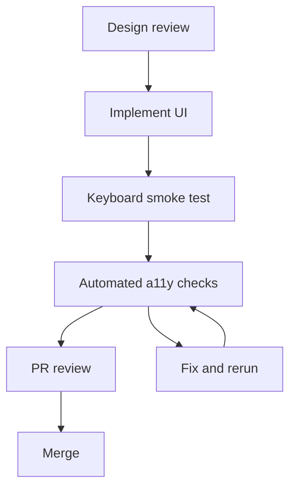

<!-- [KFM_META_BLOCK_V2]
doc_id: kfm://doc/7c41f1f6-f6b6-4d12-9b3b-2b3f2c2a2e76
title: KFM A11Y Minimum Standard
type: standard
version: v1
status: draft
owners: ["TBD-UI", "TBD-Governance"]
created: 2026-03-04
updated: 2026-03-04
policy_label: public
related: ["docs/standards/ui/accessibility/"]
tags: [kfm, ui, accessibility, a11y, standards]
notes: ["Minimum accessibility bar for all KFM UI surfaces; uses CONFIRMED/PROPOSED/UNKNOWN discipline."]
[/KFM_META_BLOCK_V2] -->

<div align="center">

# KFM A11Y Minimum Standard

Minimum accessibility requirements for Kansas Frontier Matrix user interfaces.


**Owners:** TBD (UI + Governance)  
**Applies to:** Map Explorer, Timeline, Story Mode, Focus Mode, Admin and Steward tools

**Quick links:**
[Scope](#scope) ·
[Minimum standard](#minimum-standard) ·
[Component rules](#component-rules) ·
[Testing and CI gates](#testing-and-ci-gates) ·
[Exception process](#exception-process) ·
[Appendix](#appendix)

</div>

---

## Scope

**Purpose:** Define the minimum accessibility bar for all KFM UI surfaces and KFM UI-generated outputs.

**In scope**

- Interactive web UI surfaces (Map Explorer, Story Mode, Focus Mode, Catalog, Admin, Steward tools).
- Common UI trust surfaces (policy badges, evidence drawer, provenance panels, export dialogs).
- UI-generated outputs that users can download or share (HTML, PDF, plain text).

**Out of scope**

- Backend API accessibility (this doc does not change API contract requirements).
- A complete WCAG implementation guide.
- Accessibility for raw datasets themselves (handled by data publishing standards).

## Where it fits

- **Path:** `docs/standards/ui/accessibility/KFM_A11Y_MINIMUM_STANDARD.md`
- **Upstream inputs:** UX designs, component library, KFM governance requirements.
- **Downstream consumers:** UI PR reviews, QA test plans, release gates.

## Acceptable inputs

Content that belongs in this standard:

- Normative requirements (MUST / SHOULD) with a verification method.
- Checklists that can be used in PRs and QA.
- References to external standards and internal KFM guidance.
- Minimal examples demonstrating compliant patterns.

## Exclusions

Do not put the following in this file:

- Component-by-component implementation details for a specific framework.
- Long tutorials on WCAG.
- App-specific styling guides (put those in the design system documentation).

## Vocabulary

**Normative language**

- **MUST** = required for KFM UI to ship.
- **SHOULD** = required unless a documented, time-boxed exception exists.
- **MAY** = optional enhancement.

**Evidence discipline labels**

- **CONFIRMED** = explicitly required by current KFM source guidance.
- **PROPOSED** = recommended to become required; needs governance acceptance to be promoted to CONFIRMED.
- **UNKNOWN** = not determined; includes the smallest verification steps needed.

---

## Minimum standard

This standard is organized into two tiers:

- **Tier 0**: MVP minimum (shipping bar for core KFM UI trust surfaces).
- **Tier 1**: Public launch minimum (alignment with modern web accessibility practice).

### Tier 0 MVP minimum

These requirements are **non-negotiable** for Map Explorer, Story Mode, and Focus Mode.


| Requirement ID | Requirement | Applies to | Verification | Status |
|---|---|---|---|---|
| KFM-A11Y-001 | All layer controls and the evidence drawer MUST be keyboard navigable and MUST show a visible focus state. | Map Explorer, Story Mode, Focus Mode | Keyboard-only walkthrough; focus ring visible on every control | CONFIRMED |
| KFM-A11Y-002 | Policy badges and status indicators MUST include text labels and MUST NOT rely on color alone to convey meaning. | All UI surfaces | Visual inspection + screen reader name check | CONFIRMED |
| KFM-A11Y-003 | All map controls MUST expose an accessible name (ARIA label or native label). | Map Explorer | DOM inspection; screen reader announces control name | CONFIRMED |
| KFM-A11Y-004 | Narrative markdown rendering MUST be safe: enforce CSP and sanitize inputs to prevent XSS. | Story Mode, any markdown rendering | Security test cases + review of sanitization config | CONFIRMED |
| KFM-A11Y-005 | Exported outputs MUST include citations and an audit reference in a readable format. | Focus Mode, Story exports | Export a sample and verify readable citations and audit ref | CONFIRMED |
| KFM-A11Y-006 | Evidence drawer MUST display license and data version information, and keyboard navigation MUST work end-to-end. | Evidence drawer | E2E test or manual walkthrough | CONFIRMED |

### Tier 1 Public launch minimum

Tier 1 is the **recommended** minimum before any broad public release. It is aligned to **WCAG 2.2 Level AA**.


| Requirement ID | Requirement | Verification | Status |
|---|---|---|---|
| KFM-A11Y-101 | Pages and major panes SHOULD use semantic landmarks and headings (main, nav, region). | Screen reader rotor / landmarks list is meaningful | PROPOSED |
| KFM-A11Y-102 | A skip link SHOULD be present to jump to main content, and it MUST be keyboard operable. | Keyboard-only; first Tab exposes skip link | PROPOSED |
| KFM-A11Y-103 | Text contrast SHOULD meet 4.5:1 (3:1 for large text). Non-text UI components SHOULD meet 3:1. | Automated contrast checks + spot checks | PROPOSED |
| KFM-A11Y-104 | Focus order MUST be logical and MUST NOT trap the keyboard; modals and drawers MUST manage focus. | Keyboard-only + screen reader smoke test | PROPOSED |
| KFM-A11Y-105 | UI MUST remain usable at 200% zoom and on narrow layouts; text MUST not be clipped behind fixed panels. | Browser zoom test + responsive test | PROPOSED |
| KFM-A11Y-106 | Dynamic updates (chat responses, evidence loading) SHOULD announce status messages without stealing focus. | Screen reader announcement check | PROPOSED |
| KFM-A11Y-107 | Animations triggered by interaction SHOULD respect reduced motion preferences or provide a static alternative. | prefers-reduced-motion test | PROPOSED |

---

## Component rules

These rules make the Tier 0 and Tier 1 requirements concrete for KFM UI patterns.

### Map Explorer

**Minimum rules**

- **KFM-A11Y-001 (CONFIRMED):** Every control in LayerPanel and TimeControl is reachable by Tab and operable via keyboard.
- **KFM-A11Y-003 (CONFIRMED):** Map controls (zoom, basemap, measure, locate, draw, etc.) have an accessible name.
- **KFM-A11Y-002 (CONFIRMED):** Layer policy badges and automation status badges include visible text.

**PROPOSED additions**

- Provide a keyboard-accessible alternative to purely spatial selection. Example: a FeatureInspectPanel list/table that can be navigated without panning the map.
- Do not use hover-only affordances. If a tooltip contains information, provide a focus-triggered equivalent.

### Evidence drawer

**Minimum rules**

- **KFM-A11Y-006 (CONFIRMED):** License and dataset version information is visible and readable.
- **KFM-A11Y-001 (CONFIRMED):** The drawer can be opened and closed with keyboard, and the user can reach all interactive elements.

**PROPOSED additions**

- Treat the drawer as a named region or dialog:
  - Provide an accessible name, e.g., `aria-label="Evidence"`.
  - If modal, trap focus and close on Escape.
  - Announce loading states (e.g., "Evidence loading") without moving focus.

### Story Mode

**Minimum rules**

- **KFM-A11Y-004 (CONFIRMED):** Markdown rendering is sanitized.
- Citation interactions MUST be keyboard operable and MUST open evidence without requiring precise pointer gestures.

**PROPOSED additions**

- Ensure headings in narrative markdown are ordered and do not skip levels.
- Ensure link text is descriptive (avoid "click here").

### Focus Mode

**Minimum rules**

- **KFM-A11Y-005 (CONFIRMED):** Export includes citations and audit ref.
- Policy notices explaining withholding and generalization MUST be readable and must not rely on color alone.

**PROPOSED additions**

- New assistant messages and evidence loading SHOULD be announced as status messages (aria-live) without stealing focus.
- Inline citations SHOULD be reachable via keyboard and open the evidence drawer.

---

## Testing and CI gates

### Development checklist

- [ ] Keyboard-only pass for the affected surface.
- [ ] Visible focus indicator is present and not obscured.
- [ ] Every icon-only control has an accessible name.
- [ ] No color-only meaning for badges.
- [ ] Evidence drawer: license + version visible; keyboard navigation works.
- [ ] Story markdown sanitization confirmed for any new renderer features.
- [ ] Export output readability confirmed for any changes to exports.

### CI recommendations

**PROPOSED**

- Add an automated accessibility check (axe-core or equivalent) to CI for:
  - Core routes (Map Explorer, Story Mode, Focus Mode)
  - Core components (EvidenceDrawer, PolicyNotice)
- Fail merges on new critical violations.

```bash
# PSEUDOCODE — replace with the repo's actual scripts
# 1) Lint accessibility
<package-manager> run lint:a11y

# 2) Run component tests with an a11y pass
<package-manager> run test:unit

# 3) Run end-to-end a11y smoke checks
<package-manager> run test:e2e:a11y
```

### Diagram



---

## Exception process

Accessibility exceptions are allowed only when:

- The issue is caused by a third-party dependency that cannot be fixed quickly, or
- The remediation is large enough to require staged delivery.

**PROPOSED process**

1. Open an issue labeled `a11y-waiver`.
2. Attach a time-boxed waiver document with:
   - impact summary
   - affected users
   - scope of exception
   - mitigation and remediation plan
   - expiration date
3. Add a regression test to prevent the issue from spreading.

Example waiver template:

```yaml
# PSEUDOCODE — adapt to the repo's governance templates
waiver_id: "A11Y-W-YYYY-NNN"
status: "active"
expires: "YYYY-MM-DD"
affected_surfaces:
  - "Map Explorer"
requirement_ids:
  - "KFM-A11Y-104"
impact:
  summary: "Keyboard focus leaves the evidence drawer in Safari"
  users: ["keyboard", "screen_reader"]
mitigations:
  - "Provide alternate navigation path"
remediation:
  owner: "@tbd"
  plan: "Upgrade dependency and add focus trap"
  target_release: "vNEXT"
```

---

## Evidence and decision ledger

This section clarifies what is already required by KFM guidance vs what is being proposed.


| Item | Status | Notes |
|---|---|---|
| Tier 0 requirements KFM-A11Y-001 to KFM-A11Y-005 | CONFIRMED | Listed as minimum accessibility requirements in current KFM UI guidance. |
| Evidence drawer license and version visibility KFM-A11Y-006 | CONFIRMED | Acceptance criteria for Map Explorer baseline UI requires license and version and keyboard navigation. |
| Tier 1 requirements KFM-A11Y-101 to KFM-A11Y-107 | PROPOSED | Aligns KFM UI with WCAG 2.2 AA and common web app patterns. |

---

## Appendix

<details>
<summary>Manual screen reader smoke test script</summary>

1. Open Map Explorer.
2. Press Tab until the LayerPanel is focused.
3. Toggle a layer and confirm the change is announced or otherwise perceivable.
4. Open the Evidence Drawer using keyboard.
5. Confirm license and version are readable.
6. Navigate citations and open evidence from Story Mode.
7. In Focus Mode, ask a question, then navigate inline citations and export.
8. Confirm export contains citations and audit reference.

</details>

<details>
<summary>External references</summary>

- WCAG 2.2: https://www.w3.org/TR/WCAG22/
- WAI-ARIA 1.2: https://www.w3.org/TR/wai-aria-1.2/
- ARIA Authoring Practices Guide: https://www.w3.org/WAI/ARIA/apg/

</details>

[Back to top](#kfm-a11y-minimum-standard)
