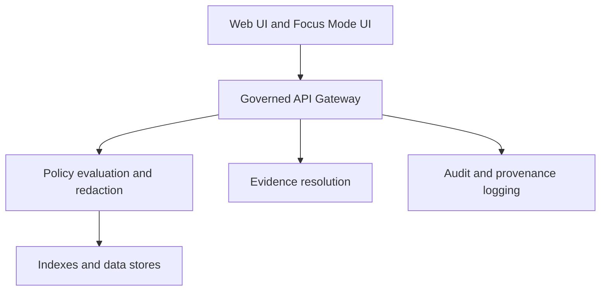

<!-- [KFM_META_BLOCK_V2]
doc_id: kfm://doc/0e0e63c0-1b0e-4b56-b0e7-06e7b0c0c8a6
title: UI Accessibility Standard
type: standard
version: v1
status: draft
owners: KFM UI Standards Working Group (TBD)
created: 2026-03-04
updated: 2026-03-04
policy_label: public
related: [
  "docs/standards/ui/README.md (if present)",
  "docs/standards/governance/ROOT-GOVERNANCE.md (if present)",
  "docs/reports/visualization/README.md (if present)"
]
tags: [kfm, ui, accessibility, wcag, aria, a11y]
notes:
  - Initial scaffold. Treat anything marked PROPOSED/UNKNOWN as not-yet-governed until an ADR + CI gate exists.
[/KFM_META_BLOCK_V2] -->

# UI Accessibility Standard
Build KFM UI that is operable, understandable, and perceivable for as many users as possible — without weakening KFM’s governance boundary (policy + evidence + audit).

> **Status:** Draft · **Owners:** TBD · **Applies to:** Web UI, Story UI, Focus Mode UI, map explorers, dashboards, visualization panels  
> **Default target:** **WCAG 2.2 AA** (PROPOSED)  
>
> 
> 
> -informational)
> 
> 

**Quick links:** [Scope](#scope) · [Non-negotiables](#non-negotiables) · [A11y checklist](#a11y-checklist) · [Testing](#testing) · [Patterns](#patterns-and-anti-patterns) · [References](#references)

---

## Evidence discipline
KFM docs are a production surface. This README follows **Cite-or-abstain** style:

- **CONFIRMED**: backed by a referenced standard or an internal governed document.
- **PROPOSED**: recommended, but not yet enforced by a policy/ADR/CI gate.
- **UNKNOWN**: not verified; include a minimal verification step.

If you can’t meet a requirement, document **why**, the **impact**, and the **smallest safe alternative**.

---

## Scope
This standard covers:

- UI interaction patterns: keyboard, focus, dialogs, navigation, forms
- Content and semantics: headings, landmarks, labels, error messages
- Data/visualization UIs (maps, timelines, charts): “non-visual path” to the same meaning
- A11y testing + CI gates for UI changes
- Policy-safe messaging (e.g., “abstain” states) that remains understandable and accessible

---

## Where it fits
This directory: `docs/standards/ui/accessibility/`

KFM UI is expected to be map- and story-centric and to sit behind a **governed API + policy boundary** (“trust membrane”). Accessibility requirements must not cause policy bypass or data leakage.



**Implication:** if an a11y feature needs data (e.g., text alternatives, transcripts, feature lists), it must come from **policy-filtered API responses**, not direct storage calls.

---

## Acceptable inputs
What belongs here:

- Accessibility standards, checklists, and test recipes
- UI pattern guidance (React/TS patterns, map control patterns)
- ADRs about accessibility tradeoffs (e.g., maps, 3D scenes, virtualized lists)
- “Definition of Done” checklists for PRs touching UI

---

## Exclusions
What must not go here:

- Component implementation code (belongs in UI packages/apps)
- Design tokens / theming source-of-truth (belongs in design system area)
- Any secrets, credentials, or environment-specific configuration

If you need to store screenshots or a11y reports, prefer `docs/reports/` (PROPOSED) with a lightweight index and retention policy.

---

## Directory tree
**Current + proposed layout (do not assume files exist unless listed in-tree):**

```plaintext
docs/standards/ui/accessibility/
├── README.md                        # You are here
├── CHECKLIST.md                     # PROPOSED: PR-ready checklist (copy/paste)
├── patterns/
│   ├── dialogs.md                   # PROPOSED
│   ├── forms.md                     # PROPOSED
│   ├── maps.md                      # PROPOSED (MapLibre/Cesium specifics)
│   └── data-tables-and-virtualization.md  # PROPOSED
├── testing/
│   ├── automated.md                 # PROPOSED (axe, unit + e2e)
│   ├── manual.md                    # PROPOSED (keyboard + screen reader script)
│   └── reporting.md                 # PROPOSED (artifact format and storage)
└── adr/
    └── 0001-accessibility-targets.md # PROPOSED (WCAG target, exceptions)
```

---

## Quickstart
> These commands are **pseudocode** until wired into your repo scripts.

```bash
# PSEUDOCODE — adjust to your package manager and workspace layout

# 1) Install dependencies
pnpm install

# 2) Lint for accessibility issues (JSX semantics, labels, aria misuse)
pnpm lint:a11y

# 3) Run unit a11y tests (axe-based) for components
pnpm test:a11y

# 4) Run e2e a11y smoke tests (keyboard flows + critical pages)
pnpm e2e:a11y

# 5) Produce an accessibility report artifact (CI upload)
pnpm a11y:report
```

---

## Conformance targets and project decisions
| Decision | Status | What this means in practice | Where enforced |
|---|---|---|---|
| Target WCAG level for interactive UI | **PROPOSED** | Default target is **WCAG 2.2 AA** for UI surfaces | ADR + CI gates (TODO) |
| Minimum contrast target for icons/legends | **CONFIRMED (internal standards)** | Visual assets should meet **WCAG AA** contrast rules | Visualization validation workflows (if present) |
| ARIA baseline version | **CONFIRMED (external)** | Use WAI‑ARIA **1.2** semantics; treat ARIA **1.3** as draft | Dev practice + lint rules (TODO) |
| “Abstain” and policy-deny UI copy must be understandable | **CONFIRMED (internal)** | Explain “why” in policy-safe terms and provide an audit reference | UI patterns + contract tests (TODO) |

> **UNKNOWN:** exact CI gate names, scripts, and where reports are stored.  
> **Minimal verification:** inspect `.github/workflows`, `web/` scripts, and existing UI test harness to confirm names + locations.

---

## Non-negotiables
These apply to **all** UI (web, story, focus, admin) unless a documented exception exists.

1) **Keyboard-first navigation**
- Every interactive control is reachable via keyboard
- Tab order is logical and stable
- No keyboard traps (except within correctly-managed modal dialogs)

2) **Visible focus**
- Focus indicators are visible and have sufficient contrast
- Focus is not hidden by sticky headers/footers where reasonably avoidable

3) **Accessible names and roles**
- Every control has an accessible name (label text, `aria-label`, `aria-labelledby`, etc.)
- Prefer native HTML semantics over ARIA

4) **No color-only meaning**
- If color encodes state, include a non-color cue (text label, shape, icon, pattern)
- Especially important for map layers and legends (“safe color semantics”)

5) **Policy-safe, accessible error and abstention states**
- Never leak restricted existence through copy differences or “ghost metadata”
- Provide remediation hints that are safe (“try broader date range”, “use public datasets”)
- Provide an `audit_ref` (or equivalent) so stewards can review

---

## A11y checklist
Use this as the PR-level “Definition of Done” when UI changes are user-facing.

### Interaction
- [ ] Keyboard-only users can complete the primary workflow(s)
- [ ] Focus order matches visual order and task flow
- [ ] Modal dialogs trap focus correctly and return focus on close
- [ ] Escape closes dismissible dialogs (when allowed), with an accessible close button always available

### Semantics
- [ ] Headings are hierarchical (`h1`→`h2`→`h3`…), no skipped levels without reason
- [ ] Landmarks exist for major page regions (header/main/nav/aside/footer)
- [ ] Form fields have labels; errors are associated with fields
- [ ] Status updates are announced appropriately (live regions only when needed)

### Visuals and maps
- [ ] Icons/legend entries have text equivalents (tooltip alone is not enough)
- [ ] Map layers have a non-visual representation for meaning (layer list, feature list, evidence drawer)
- [ ] Color ramps/palettes provide adequate contrast and are color-vision friendly
- [ ] Animations have reduced-motion support and/or textual summaries

### Governance alignment
- [ ] Evidence/provenance links are policy-checked server-side
- [ ] “Abstain” states are explainable without revealing restricted details
- [ ] UI does not require direct storage/DB access for accessibility features

---

## Patterns and anti-patterns

### Prefer semantic HTML
**Pattern**
- Use `<button>`, `<a>`, `<label>`, `<fieldset>`, `<legend>` and real headings
- Use `disabled` for non-interactive state (with accessible explanation)

**Anti-pattern**
- Clickable `<div>`/`<span>` without role, tabIndex, and keyboard handlers

### ARIA: use it deliberately
**Pattern**
- Use ARIA to complete semantics when native HTML cannot represent your widget
- Use ARIA Authoring Practices patterns for complex widgets (menus, comboboxes, tabs)

**Anti-pattern**
- Adding ARIA roles/attributes that conflict with native semantics
- Using `aria-hidden="true"` on focusable/interactive content

### Modals and dialogs (React)
```tsx
// EXAMPLE ONLY — do not copy/paste blindly.
// Ensure focus trap, Escape handling, and proper aria attributes.
// Prefer a well-tested dialog component with known a11y behavior.

export function ExampleDialog({
  title,
  open,
  onClose,
  children,
}: {
  title: string;
  open: boolean;
  onClose: () => void;
  children: React.ReactNode;
}) {
  if (!open) return null;

  return (
    <div role="dialog" aria-modal="true" aria-label={title}>
      <button type="button" onClick={onClose}>
        Close
      </button>
      <h2>{title}</h2>
      <div>{children}</div>
    </div>
  );
}
```

### Maps and 3D views
Maps (2D/3D) can be hard for screen readers; the goal is **equivalent meaning**, not identical rendering.

**Required companion surfaces (PROPOSED, but strongly recommended):**
- A **Layer panel** that is keyboard-operable
- A **Feature list / results list** that can be navigated without the map canvas
- An **Evidence drawer** for license/version/provenance details
- A “jump to content” or “skip map” link for screen reader users

**Map interaction guidance**
- Keep complex interactions in the map, but expose outcomes in an accessible panel
- When a feature is selected on the map, reflect selection in a focusable list item
- Tooltips are not sufficient; provide persistent text alternatives for critical info

---

## Testing
### Automated (CI-friendly)
**Minimum set (PROPOSED):**
- Linting for common a11y mistakes (labels, invalid ARIA)
- Component-level a11y smoke tests (axe on rendered output)
- E2E keyboard flows for critical pages (Map Explorer, Story viewer, Focus Mode)

### Manual spot-checks
**Minimum set (PROPOSED):**
- Keyboard-only run-through of the primary workflow
- Screen reader spot-check on 1–2 critical screens (NVDA/JAWS/VoiceOver depending on platform)
- Zoom and reflow check (200%+)

> Store reports as CI artifacts and link them from PRs (PROPOSED).

---

## PR gates and enforcement
**PROPOSED PR gates (fail-closed once implemented):**
- a11y lint must pass
- unit a11y tests must pass
- e2e a11y smoke must pass for critical routes
- any exception requires:
  - an ADR or a waiver file
  - a remediation plan
  - a re-test date

---

## FAQ
### Do we have to hit WCAG AAA?
No by default. If a surface is public-facing and high-impact, consider AAA criteria selectively.

### Should we use ARIA 1.3 features?
Not unless explicitly approved. ARIA 1.3 is a draft; prefer stable ARIA 1.2 patterns.

### What about “accessibility vs performance” in maps?
Treat it as a product requirement: provide a non-visual representation (lists, summaries, evidence drawer) instead of trying to make the canvas itself fully navigable.

---

## References
External standards (authoritative):
- WCAG 2.2 (W3C Recommendation)
- WAI-ARIA 1.2 (W3C Recommendation)
- ARIA Authoring Practices Guide (APG)

Internal KFM guidance (authoritative within KFM governance):
- Trust membrane / governed API / evidence-first requirements
- Visualization standards referencing WCAG contrast and a11y audits
- “Abstain is a feature” UI behavior guidance

---

<details>
<summary>Appendix: Minimal manual keyboard test script (PROPOSED)</summary>

1) Load the page with keyboard only  
2) Press `Tab` until the first meaningful control is focused  
3) Confirm you can:
   - open/close menus
   - operate forms
   - open/close dialogs
   - reach map controls, layer toggles, evidence drawer
4) Confirm visible focus at all times  
5) Confirm no focus trap outside intended dialogs  
6) Confirm error messages are readable and associated with inputs  
7) Confirm “policy denied / abstain” states explain what happened in policy-safe language and offer safe next steps  

</details>

---

[Back to top](#ui-accessibility-standard)
