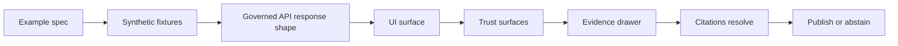

<!-- [KFM_META_BLOCK_V2]
doc_id: kfm://doc/3a3f0a8d-5c54-4b24-a9b6-acde6ce7d27c
title: UI Standards Examples
type: standard
version: v1
status: draft
owners: KFM UI Working Group
created: 2026-03-04
updated: 2026-03-04
policy_label: restricted
related: [
  docs/standards/ui/,
  docs/standards/governance/,
  docs/runbooks/ui/
]
tags: [kfm, ui, standards, examples]
notes: [
  "This folder is for small, copy-pasteable examples that demonstrate KFM UI standards: trust surfaces, evidence rendering, and policy-safe behavior."
]
[/KFM_META_BLOCK_V2] -->

# UI Standards Examples

Practical, minimal examples that demonstrate **KFM UI trust surfaces** and **governed UX patterns** (Map Explorer, Story Mode, Focus Mode) using synthetic fixtures.

> **Status:** draft  
> **Owners:** KFM UI Working Group  
>
> 
> 
> 
>
> **Jump:** [Scope](#scope) · [Where it fits](#where-it-fits-in-the-repository) · [Directory tree](#directory-tree) · [Quickstart](#quickstart) · [Example registry](#example-registry) · [Definition of done](#definition-of-done) · [FAQ](#faq)

---

## Scope

### Evidence labels

This repo uses explicit evidence labels for non-trivial claims:

- **CONFIRMED**: backed by KFM design and governance docs.
- **PROPOSED**: recommended structure or convention for this folder.
- **UNKNOWN**: not verified in-repo yet; includes the smallest step to verify.

### What belongs here

| Item | Status | Notes |
|---|---|---|
| Small example folders that show a single UI standard end-to-end | **PROPOSED** | Keep each example narrow and reviewable. |
| Synthetic fixtures for API responses, evidence bundles, and policy decisions | **PROPOSED** | Fixtures must be non-sensitive and safe to publish. |
| Demonstrations of trust surfaces: dataset version labels, license display, policy notices, evidence drawer | **CONFIRMED** | Trust surfaces are a required part of the UI contract. |
| Full demo applications or production UI code | **PROPOSED** | Put those under `apps/` or `examples/` at repo root, not here. |
| Real PII, restricted locations, or raw sensitive coordinates | **CONFIRMED** | Default-deny and redaction are mandatory. Do not store sensitive data here. |

[Back to top](#ui-standards-examples)

---

## Where it fits in the repository

| Relationship | Status | Details |
|---|---|---|
| This folder is a standards companion | **PROPOSED** | Use this alongside `docs/standards/ui/` to show “what it looks like.” |
| UI is a governed client | **CONFIRMED** | The UI renders what the governed API returns and must make governance visible. |
| The UI must not bypass the API boundary | **CONFIRMED** | No direct access to graph DBs or storage from the frontend. |

**CONFIRMED:** The primary KFM UI surfaces include Map Explorer, Stories, Catalog, Focus Mode, and Admin/Steward tools, with a core user loop of Explore → Focus Mode → Evidence inspection → Story Nodes. Examples in this folder should map clearly to one of those surfaces.

[Back to top](#ui-standards-examples)

---

## Acceptable inputs

| Input type | Status | Requirements |
|---|---|---|
| `README.md` per example | **PROPOSED** | Must explain purpose, boundaries, and what standard it demonstrates. |
| `fixtures/*.json` | **PROPOSED** | Synthetic only; include a policy decision block. |
| Small TypeScript snippets | **PROPOSED** | Keep framework-agnostic when possible. |
| Screenshots or short GIFs | **PROPOSED** | Must include alt text guidance and be safe to share. |
| Mermaid diagrams | **PROPOSED** | Prefer for flows and trust surface explainers. |

---

## Exclusions

| Exclusion | Status | Where it belongs instead |
|---|---|---|
| Direct database calls from UI examples | **CONFIRMED** | Never allowed; all data access must cross the governed API. |
| Production credentials, tokens, keys | **CONFIRMED** | Secrets must never enter the repo. |
| Real user data, sensitive locations, restricted geometries | **CONFIRMED** | Use generalized derivatives or synthetic fixtures. |
| Large binaries | **PROPOSED** | Use an artifacts store and link via catalogs if policy allows. |

[Back to top](#ui-standards-examples)

---

## Directory tree

**PROPOSED expected structure** (add folders as examples land):

```text
docs/standards/ui/examples/
├── README.md
├── _template/
│   ├── README.md
│   └── fixtures/
│       ├── request.json
│       ├── response.json
│       └── evidence_bundle.json
├── map-explorer-evidence-drawer/
│   ├── README.md
│   ├── fixtures/
│   │   ├── feature_inspect_response.json
│   │   └── evidence_bundle.json
│   └── expected/
│       └── expected-ui.md
├── story-node-citation-gate/
│   ├── README.md
│   ├── fixtures/
│   │   ├── story_node.json
│   │   └── evidence_bundle.json
│   └── expected/
│       └── publish-blocked.md
└── focus-mode-cite-or-abstain/
    ├── README.md
    ├── fixtures/
    │   ├── ask_request.json
    │   ├── ask_response.json
    │   └── evidence_bundle.json
    └── expected/
        └── answer-with-citations.md
```

**UNKNOWN:** Whether this repo already contains these example folders.  
Smallest verification step: run `tree docs/standards/ui/examples -L 3` from repo root and update the tree above accordingly.

[Back to top](#ui-standards-examples)

---

## Quickstart

These commands are intentionally minimal and should work in any dev environment:

```bash
# From repo root
cd docs/standards/ui/examples
ls
```

Optional local preview for docs-only review:

```bash
cd docs/standards/ui/examples
python -m http.server 8000
# open http://localhost:8000
```

[Back to top](#ui-standards-examples)

---

## Usage

### How to use an example

1. Pick an example from the [Example registry](#example-registry).
2. Read the example’s `README.md` for:
   - which UI surface it targets
   - which standard it demonstrates
   - fixtures and expected UI behavior
3. Use the fixtures to power:
   - a component story
   - a mocked API call
   - a minimal page route in a dev UI

### Standards each example should demonstrate

**CONFIRMED:** KFM UI examples should make trust visible by default:
- dataset version and license must be visible in the Evidence Drawer
- policy notices must be explicit when something is withheld or generalized
- map state should be treated as reproducible context for Stories and Focus Mode

[Back to top](#ui-standards-examples)

---

## Diagram



---

## Example registry

> **PROPOSED:** Keep this table updated as examples are added.

| Example ID | UI surface | Demonstrates | Status | Path |
|---|---|---|---|---|
| map-explorer-evidence-drawer | Map Explorer | Evidence Drawer shows dataset version, license, and policy info | **PROPOSED** | `./map-explorer-evidence-drawer/` |
| story-node-citation-gate | Story Mode | Publish gate blocks non-resolvable citations | **PROPOSED** | `./story-node-citation-gate/` |
| focus-mode-cite-or-abstain | Focus Mode | Answer must cite evidence or abstain | **PROPOSED** | `./focus-mode-cite-or-abstain/` |

---

## Minimal fixture shapes

### Evidence bundle

**CONFIRMED:** Examples should include an evidence bundle fixture that is compatible with the “resolve evidence” concept (machine metadata + human card + policy decision).

```json
{
  "bundle_id": "sha256:bundle_placeholder",
  "dataset_version_id": "2026-02.example1234",
  "title": "Example evidence bundle",
  "policy": {
    "decision": "allow",
    "policy_label": "public",
    "obligations_applied": []
  },
  "license": {
    "spdx": "CC-BY-4.0",
    "attribution": "Example source org"
  },
  "provenance": {
    "run_id": "kfm://run/2026-02-20T12:00:00Z.example"
  },
  "checks": {
    "catalog_valid": true,
    "links_ok": true
  },
  "audit_ref": "kfm://audit/entry/example"
}
```

### Map view state

**CONFIRMED:** Story Nodes should be able to replay map state; Focus Mode may accept view-state hints for context.

```json
{
  "camera": { "zoom": 6.5, "center_lon": -98.5, "center_lat": 38.5 },
  "layers": [{ "layer_id": "example_layer", "opacity": 0.8 }],
  "time_window": { "start": "1930-01-01", "end": "1939-12-31" },
  "filters": [{ "field": "county", "op": "eq", "value": "Reno" }]
}
```

[Back to top](#ui-standards-examples)

---

## Definition of done

For each example folder added here:

- [ ] **PROPOSED:** Contains a `README.md` explaining the standard being demonstrated.
- [ ] **CONFIRMED:** Uses synthetic fixtures only and avoids sensitive or restricted data.
- [ ] **CONFIRMED:** Demonstrates an Evidence Drawer entry point and shows license and dataset version.
- [ ] **CONFIRMED:** Demonstrates explicit policy notices when scope is narrowed or content is withheld.
- [ ] **CONFIRMED:** Accessible interaction is documented (keyboard path, focus order, non-color-only signals).
- [ ] **PROPOSED:** Includes an `expected/` artifact showing the intended UI state.
- [ ] **CONFIRMED:** Any “publish” flow example includes a resolvable citation check and fails closed if broken.

---

## FAQ

### Why are “trust surfaces” required

**CONFIRMED:** KFM treats trust as a user-visible contract. Evidence and provenance are first-class UI elements, not hidden metadata.

### What do we do when citations cannot resolve

**CONFIRMED:** The system must fail closed: narrow scope or abstain. Examples should include at least one “blocked” or “abstained” case.

### Can examples call production services

**CONFIRMED:** No. Examples must use fixtures or mocked calls so that review is deterministic and safe.

[Back to top](#ui-standards-examples)

---

## Appendix

<details>
<summary>Example folder template</summary>

Create a new example by copying `_template/` and filling in:

- `README.md`
  - purpose and scope
  - the specific UI surface
  - which trust surface or policy behavior it demonstrates
- `fixtures/`
  - request and response JSON
  - an evidence bundle JSON
  - optional view-state JSON
- `expected/`
  - a short markdown note showing expected rendering and interactions

Suggested `README.md` skeleton for an example:

```markdown
# Example name

## What this demonstrates
- Status: CONFIRMED or PROPOSED
- UI surface:
- Trust surface:

## Fixtures
- fixtures/request.json
- fixtures/response.json
- fixtures/evidence_bundle.json

## Expected behavior
- Evidence Drawer entry point:
- License and dataset version shown:
- Policy notice behavior:
- Keyboard path:
```

</details>
