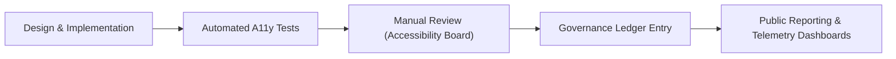

<div align="center">

# ♿ **Kansas Frontier Matrix — User Interface Accessibility & Inclusion Standards**  
`docs/standards/ui_accessibility.md`

**Purpose**  
Establish enforceable standards so that all Kansas Frontier Matrix (KFM) user interfaces, web applications, and documentation are **accessible, inclusive, and equitable**, aligned with **WCAG 2.1 AA**, **Section 508**, and **FAIR+CARE v2**.  

Accessibility is a core pillar of **Master Coder Protocol (MCP-DL v6.3)** and KFM governance — not an optional enhancement.

[](../README.md)
[](../../LICENSE)
[](faircare.md)
[]()

</div>

---

# 📘 Overview

This standard applies to:

- **Web applications** (`web/` directory)  
- **Public dashboards & maps** (`web/src/components/`)  
- **Documentation** (`docs/`)  
- **Data visualizations & AI explanations** (`web/src/components`, `src/ai/explainability/`)  

All user-facing surfaces MUST:

- Meet or exceed **WCAG 2.1 AA**  
- Integrate **FAIR+CARE v2 inclusion principles**  
- Pass automated & manual accessibility audits  
- Be traceable in governance records with telemetry for compliance  

---

# 🗂️ Directory Context

~~~text
docs/
│
└── standards/
    │
    ├── ui_accessibility.md             # ← THIS STANDARD
    ├── markdown_rules.md
    ├── markdown_guide.md
    └── governance/
        └── ROOT-GOVERNANCE.md
~~~

---

# 🧱 Accessibility Framework Overview

KFM adopts the WCAG POUR model:

| Principle        | WCAG Mapping | KFM Implementation Examples                                     |
|------------------|--------------|------------------------------------------------------------------|
| **Perceivable**  | 1.1–1.4      | Alt text, captions, scalable design, high contrast               |
| **Operable**     | 2.1–2.5      | Keyboard navigation, focus states, skip links, no traps         |
| **Understandable** | 3.1–3.3    | Plain language, clear messages, consistent layouts              |
| **Robust**       | 4.1–4.2      | Semantic HTML, proper ARIA, assistive tech compatibility        |

All KFM UIs MUST satisfy these principles.

---

# 🧩 Web UI Accessibility Standards

## 1️⃣ Keyboard Navigation & Focus

**Requirements**

- All interactive elements (links, buttons, toggles, menus, tabs, dialogs) must be operable via keyboard:
  - Navigation via `Tab` / `Shift+Tab`  
  - Activation via `Enter` and/or `Space`  
  - Arrow keys for menus, sliders, and other complex widgets  
- Focus indicators MUST be visible and obvious (outline, underline, or highlight).  
- No keyboard traps — focus can always move in and out of widgets and dialogs.  

**Example**

```html
<button type="button" tabindex="0" aria-label="Open dataset list">Datasets</button>
````

---

## 2️⃣ Color, Contrast & Visual Design

**Requirements**

* Text contrast ratio **≥ 4.5:1** for regular text and **≥ 3:1** for large text (≥18pt or 14pt bold).
* Do NOT rely on color alone to convey meaning (use icons, labels, patterns, or shapes).
* Provide **high-contrast themes** and respect `prefers-color-scheme` when possible.

**Example Token Usage**

```css
:root {
  --color-text-primary: #0d47a1;
  --color-bg-surface: #ffffff;
}
.text-primary {
  color: var(--color-text-primary);
  background-color: var(--color-bg-surface);
}
```

---

## 3️⃣ Text Alternatives (Images, Icons, & SVGs)

**Requirements**

* All meaningful images, icons, and SVGs MUST have alternative text:

  * `alt` attributes on ``
  * `aria-label` or `aria-labelledby` on `<svg>` or icon wrappers
* Decorative images should have empty `alt=""` (for screen-reader skipping).

**Example**

```html

```

---

## 4️⃣ Semantic HTML & ARIA

**Requirements**

* Use semantic HTML for structure:

  * `<main>`, `<header>`, `<nav>`, `<section>`, `<aside>`, `<footer>`
* Use ARIA roles sparingly and only when native semantics are insufficient.
* Labels and roles should match behavior (e.g., `button` not misused as `div`).

**Example**

```html
<nav aria-label="Main navigation">
  <ul>
    <li><a href="/datasets">Datasets</a></li>
    <li><a href="/timeline">Timeline</a></li>
    <li><a href="/accessibility">Accessibility</a></li>
  </ul>
</nav>
```

---

## 5️⃣ Map & Visualization Accessibility

**Applies to:** MapLibre, D3, Cesium, charting libraries.

**Requirements**

* Map canvas must have `role="region"` or `role="application"` with a descriptive `aria-label`.
* Provide keyboard support for essential map actions (zoom, pan, layer toggle).
* Always offer a **non-visual alternative**: tables, lists, or summaries.
* Legends must be accessible:

  * Focusable entries
  * Text descriptions for symbol colors & patterns

**Example**

```html
<div role="region" aria-label="Kansas archaeological map" tabindex="0">
  <!-- MapLibre canvas -->
</div>
```

---

## 6️⃣ Motion, Animation & Reduced Motion

**Requirements**

* Honor `prefers-reduced-motion: reduce`.

  * Disable or reduce non-essential animations for users with reduced motion preference.
* No auto-play looping animations that cannot be paused.
* Avoid flashing content that violates WCAG thresholds (no more than 3 flashes per second in a small area).

**Example**

```css
@media (prefers-reduced-motion: reduce) {
  .animated {
    transition: none;
    animation: none;
  }
}
```

---

# 🧠 Documentation & Content Accessibility

## 7️⃣ Readability & Language

* Aim for **plain English** at ≈ Grade 8 reading level.
* Avoid heavy jargon or explain it inline or via glossary links.

## 8️⃣ Headings, Lists & Links

* Maintain a logical hierarchy: `#`, `##`, `###`.
* Use descriptive link text (no “click here”).

**Example**

```markdown
## 📘 Overview

Explore [Kansas Data Layers](../data/README.md) for hydrology, climate, and historic maps.
```

## 9️⃣ Alt Text & Tables

* All images in docs MUST have meaningful `alt` text.
* Tables MUST have header rows and be used for structured data, not layout.

---

# 🧪 Automated Accessibility Testing & Telemetry

KFM uses automated tools integrated into CI:

| Tool       | Purpose                             | Output Path                                   |
| ---------- | ----------------------------------- | --------------------------------------------- |
| `axe-core` | HTML/ARIA rule checks               | `docs/reports/telemetry/a11y_axe.json`        |
| `Pa11y`    | WCAG 2.1 AA validation              | `docs/reports/telemetry/a11y_pa11y.json`      |
| Lighthouse | Performance + accessibility scoring | `docs/reports/telemetry/a11y_lighthouse.json` |

These outputs are aggregated into:

* `releases/vX.Y.Z/pipeline-telemetry.json`
* Governance ledger entries tracking **accessibility compliance** over time.

---

# ⚖️ FAIR+CARE v2 Integration

Accessibility is deeply linked with FAIR+CARE:

| Principle         | Accessibility Implication                                      |
| ----------------- | -------------------------------------------------------------- |
| **Findable**      | Clear headings, navigation, and landmarks support orientation. |
| **Accessible**    | WCAG compliance ensures disabled users can fully use KFM.      |
| **Interoperable** | Semantic HTML and ARIA enable assistive tech compatibility.    |
| **Reusable**      | Accessible components reused across modules.                   |
| **CARE (Ethics)** | Interfaces avoid exclusionary design and harmful patterns.     |

---

# 📋 Compliance Checklist (UI Components)

| Check                            | Status Requirement |
| -------------------------------- | ------------------ |
| All controls keyboard accessible | 100%               |
| Focus styles visible             | 100%               |
| Text contrast ≥ 4.5:1            | 100% of text       |
| Alt text coverage                | 100% of images     |
| ARIA labels correct & minimal    | 100% of needed     |
| Reduced-motion handling          | Implemented        |
| A11y tests in CI                 | Required           |

Any UI component failing these checks must be fixed before release.

---

# 🧭 Governance & Review Process

Accessibility governance flows:



Example governance entry:

```json
{
  "event": "accessibility_audit",
  "reviewed_components": 164,
  "issues_found": 3,
  "compliance_rate": 98.2,
  "timestamp": "2025-11-16T20:00:00Z",
  "audited_by": "Accessibility Board"
}
```

---

# 🕰️ Version History

| Version | Date       | Author    | Summary                                                                                                         |
| ------: | ---------- | --------- | --------------------------------------------------------------------------------------------------------------- |
| v10.4.2 | 2025-11-16 | Core Team | Upgraded to KFM-MDP v10.4.2; deep-inset directory style; Telemetry v2 alignment; explicit FAIR+CARE v2 mapping. |
| v10.2.2 | 2025-11-12 | A. Barta  | Updated telemetry references; clarified CI integration and governance flow.                                     |
| v10.0.0 | 2025-11-10 | A. Barta  | Initial UI accessibility standard for KFM v10 aligned with WCAG 2.1 AA.                                         |
|  v9.7.0 | 2025-11-05 | A. Barta  | Baseline accessibility & inclusion standard for earlier KFM versions.                                           |

<div align="center">

**© 2025 Kansas Frontier Matrix — CC-BY 4.0**
Maintained under **Master Coder Protocol v6.3** · FAIR+CARE v2 Certified
Diamond⁹ Ω / Crown∞Ω Ultimate Certified

[Back to Standards Index](README.md) · [Root Governance Charter](governance/ROOT-GOVERNANCE.md)

</div>
