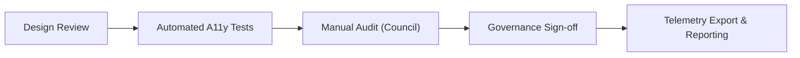

<div align="center">

# ♿ **Kansas Frontier Matrix — User Interface Accessibility & Inclusion Standards**  
`docs/standards/ui_accessibility.md`

**Purpose:**  
Establish guidelines to ensure the Kansas Frontier Matrix (KFM) user interfaces, web applications, and documentation are accessible, inclusive, and compliant with international standards (**WCAG 2.1 AA** and **Section 508**).  
Accessibility is a core pillar of the **Master Coder Protocol (MCP v6.3)** and **FAIR+CARE** framework — ensuring equitable digital participation for all users.

[](../README.md)
[](../../LICENSE)
[](faircare.md)
[]()

</div>

---

## 📘 Overview

Accessibility in KFM ensures that **all users — including those with visual, auditory, cognitive, or motor disabilities — can access, understand, and interact with content and interfaces.**  
This standard applies to:

- Web applications (`web/` directory)  
- Public dashboards and maps (`web/src/components/`)  
- Documentation (`docs/` directory)  
- Data visualizations and AI explanations (`src/ai/explainability/`)

All user-facing components must meet or exceed **WCAG 2.1 Level AA** guidelines and align with **FAIR+CARE inclusion ethics**.

---

## 🧱 Accessibility Framework Overview

| Principle | WCAG Mapping | KFM Implementation |
|---|---|---|
| **Perceivable** | 1.1–1.4 | Text alternatives, captions, scalable visual elements |
| **Operable** | 2.1–2.5 | Keyboard navigation, focus management, skip links |
| **Understandable** | 3.1–3.3 | Plain language, error prevention, consistent structure |
| **Robust** | 4.1–4.2 | Semantic HTML, ARIA labeling, assistive technology support |

---

## 🧩 Web UI Accessibility Standards

### 1️⃣ Keyboard Navigation

- All interactive components (buttons, links, menus, sliders) must be accessible via keyboard (`Tab`, `Shift+Tab`, `Enter`, `Space`, `Arrow` keys).  
- Provide clear, visible focus indicators (outline or underline, not suppressed).  
- Avoid keyboard traps — focus must move freely and escape all components.

**Example**

```html
<button tabindex="0" aria-label="Open dataset list">Datasets</button>
```

---

### 2️⃣ Color Contrast & Visual Design

- Text contrast ratio must be **at least 4.5:1** for standard text and **3:1** for large text.  
- Do not rely on color alone to convey meaning (use icons, labels, or patterns).  
- Provide high-contrast modes and support system preferences (`prefers-color-scheme`).

**Example**

```css
.text-primary {
  color: #0d47a1;
  background-color: #ffffff;
}
```

---

### 3️⃣ Text Alternatives

- Every non-text element must include an equivalent text description (`alt`, `aria-label`, or `role="img"` with `aria-label`).  
- SVG icons and maps require descriptive titles, `aria-label`s, or `aria-describedby`.

**Example**

```html

```

---

### 4️⃣ Semantic HTML & ARIA

- Use semantic elements (`<main>`, `<header>`, `<nav>`, `<section>`, `<footer>`) to structure content.  
- Apply **ARIA roles** only when native HTML semantics are insufficient; avoid overusing ARIA.

**Example**

```html
<nav aria-label="Main navigation">
  <ul>
    <li><a href="/datasets">Datasets</a></li>
    <li><a href="/timeline">Timeline</a></li>
  </ul>
</nav>
```

---

### 5️⃣ Map & Data Visualization Accessibility

Interactive maps (MapLibre, D3, Cesium) must include:

- Focusable controls (`tabindex="0"`) and keyboard shortcuts for pan/zoom.  
- ARIA roles and labels for map containers and legends.  
- Alternative non-visual representations (tables, CSV downloads, summary text).

**Example**

```html
<div role="region" aria-label="Kansas historical map" tabindex="0"></div>
```

---

### 6️⃣ Motion, Animation & Flashing Content

- Respect `prefers-reduced-motion`; provide reduced or no-animation alternatives.  
- Avoid flashing content beyond WCAG per-second thresholds.  
- Provide user controls to pause, stop, or hide moving content.

---

## 🧠 Documentation & Content Accessibility

| Rule | Description | Example |
|---|---|---|
| **Readable Language** | Prefer plain English (≈ Grade 8 reading level); explain jargon. | Use glossary links, definitions inline. |
| **Heading Hierarchy** | Logical structure (H1 → H2 → H3), with emoji where required. | `## 📘 Overview` |
| **Link Text** | Avoid “click here”; use descriptive link text. | `[Explore Kansas Data Layers](../data/README.md)` |
| **Alt Text** | All embedded images must have meaningful `alt` attributes. | `` |
| **Tables** | Use headers and keep width under configured limits. | `| Field | Description | Example |` |
| **Keyboard Testing** | Ensure docs sites and portals are usable without a mouse. | Use `Tab`, `Enter`, `Space`. |

---

## 🧪 Automated Accessibility Validation

| Tool | Purpose | Output |
|---|---|---|
| **axe-core** | Test HTML accessibility and ARIA semantics. | `reports/self-validation/web/a11y_axe.json` |
| **Pa11y** | Evaluate against WCAG 2.1 AA criteria. | `reports/self-validation/web/a11y_pa11y.json` |
| **Lighthouse CI** | Lighthouse accessibility scoring and regression. | `reports/self-validation/web/a11y_lighthouse.json` |

These results are summarized into:

```
docs/reports/telemetry/a11y_summary.json
```

and merged into `releases/v10.2.0/focus-telemetry.json`.

---

## ⚖️ FAIR+CARE Accessibility Integration

| Principle | Accessibility Implementation |
|---|---|
| **Findable** | Consistent navigation, landmarks, and headings make content easy to locate. |
| **Accessible** | WCAG 2.1 AA compliance ensures users with disabilities can fully participate. |
| **Interoperable** | Semantic HTML and ARIA support assistive technologies. |
| **Reusable** | Accessible components and patterns reused across KFM apps. |
| **CARE** | Inclusive language, culturally respectful content, multilingual support where applicable. |

---

## 🧮 Accessibility Checklist

| Requirement | Standard | Compliance Target |
|---|---|---|
| Text Contrast Ratio | WCAG 1.4.3 | ≥ 4.5:1 |
| Keyboard Navigability | WCAG 2.1.1 | 100% operable |
| ARIA Labeling | WCAG 4.1.2 | 100% compliance |
| Alt Text Coverage | WCAG 1.1.1 | 100% |
| Heading Structure | WCAG 2.4.6 | Logical H1–H3 |
| Focus Visibility | WCAG 2.4.7 | Always visible |
| Content Readability | CARE & MCP | ≤ Grade 8 reading level |

---

## 🧭 Accessibility Governance Flow



---

## 🧩 Governance & Review Process

Accessibility audits are conducted **at least quarterly** and logged in:

- `reports/audit/governance-ledger.json`  
- `docs/reports/telemetry/governance_scorecard.json`

**Example Ledger Entry**

```json
{
  "event": "accessibility_audit",
  "reviewed_components": 132,
  "issues_found": 2,
  "compliance_rate": 98.4,
  "timestamp": "2025-11-10T20:00:00Z",
  "audited_by": "Accessibility Board"
}
```

---

## 🕰️ Version History

| Version | Date | Author | Summary |
|---|---|---|---|
| v10.2.2 | 2025-11-12 | A. Barta | Updated telemetry references to v10.2.0; clarified automated validation outputs, governance flow, and FAIR+CARE mapping. |
| v10.0.0 | 2025-11-10 | A. Barta | Telemetry schema v2; added governance flow diagram; clarified tables & testing outputs. |
| v9.7.0 | 2025-11-05 | A. Barta | Created complete accessibility & inclusion standard aligned with WCAG 2.1 AA and FAIR+CARE principles. |
| v9.5.0 | 2025-10-20 | A. Barta | Added automated accessibility testing integration with axe-core and Pa11y. |
| v9.0.0 | 2025-06-01 | KFM Core Team | Established baseline accessibility framework for web and documentation. |

---

<div align="center">

**© 2025 Kansas Frontier Matrix — CC-BY 4.0**  
Maintained under **Master Coder Protocol v6.3** · FAIR+CARE Certified · **Diamond⁹ Ω / Crown∞Ω** Ultimate Certified  
[Back to Standards Index](README.md) · [Root Governance Charter](governance/ROOT-GOVERNANCE.md)

</div>