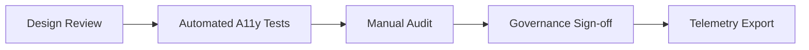

<div align="center">

# ♿ **Kansas Frontier Matrix — User Interface Accessibility & Inclusion Standards**
`docs/standards/ui_accessibility.md`

**Purpose:** Establish guidelines to ensure the Kansas Frontier Matrix (KFM) user interfaces, web applications, and documentation are accessible, inclusive, and compliant with international standards (WCAG 2.1 AA and Section 508).  
Accessibility is a core pillar of the **Master Coder Protocol (MCP v6.3)** and **FAIR+CARE** framework — ensuring equitable digital participation for all users.

[](../README.md)
[](../../LICENSE)
[](faircare.md)
[]()

</div>

---

## 📘 Overview

Accessibility in KFM ensures that **all users — including those with visual, auditory, cognitive, or motor disabilities — can access, understand, and interact with content and interfaces.**  
This standard applies to:
- Web applications (`web/` directory)
- Public dashboards and maps (`web/src/components/`)
- Documentation (`docs/` directory)
- Data visualizations and AI explanations (`src/ai/explainability/`)

All user-facing components must meet or exceed **WCAG 2.1 Level AA** guidelines and align with **FAIR+CARE inclusion ethics**.

---

## 🧱 Accessibility Framework Overview

| Principle | WCAG Mapping | KFM Implementation |
|------------|--------------|--------------------|
| **Perceivable** | 1.1–1.4 | Text alternatives, captions, scalable visual elements |
| **Operable** | 2.1–2.5 | Keyboard navigation, focus management, skip links |
| **Understandable** | 3.1–3.3 | Plain language, error prevention, consistent structure |
| **Robust** | 4.1–4.2 | Semantic HTML, ARIA labeling, assistive technology support |

---

## 🧩 Web UI Accessibility Standards

### 1. **Keyboard Navigation**
- All interactive components (buttons, menus, sliders) must be accessible via keyboard (`Tab`, `Enter`, `Space`, `Arrow` keys).
- Provide visible focus indicators (e.g., outline or underline).
- Avoid keyboard traps — focus must move freely throughout the interface.

**Example:**
```html
<button tabindex="0" aria-label="Open dataset list">Datasets</button>
```

---

### 2. **Color Contrast & Visual Design**
- Text contrast ratio must be **at least 4.5:1** for standard text and **3:1** for large text.
- Do not rely on color alone to convey meaning (use icons or patterns).
- Include dark and light themes for visual comfort.

**Example:**
```css
.text-primary {
  color: #0d47a1;
  background-color: #ffffff;
}
```

---

### 3. **Text Alternatives**
- Every non-text element must include an equivalent text description (`alt`, `aria-label`, or `role="img"`).
- SVG icons and maps require descriptive titles and ARIA roles.

**Example:**
```html

```

---

### 4. **Semantic HTML & ARIA**
- Use semantic elements (`<main>`, `<header>`, `<nav>`, `<section>`, `<footer>`) for page structure.
- Apply **ARIA roles** only when native HTML semantics are insufficient.

**Example:**
```html
<nav aria-label="Main navigation">
  <ul>
    <li><a href="/datasets">Datasets</a></li>
    <li><a href="/timeline">Timeline</a></li>
  </ul>
</nav>
```

---

### 5. **Map & Data Visualization Accessibility**
- Interactive maps (MapLibre, D3) must include:
  - Focusable controls (`tabindex="0"`)
  - ARIA roles for navigation and map layers
  - Keyboard shortcuts for zoom and pan
- Provide alternative non-visual data representations (tables, CSV downloads).

**Example:**
```html
<div role="region" aria-label="Kansas historical map" tabindex="0"></div>
```

---

## 🧠 Documentation & Content Accessibility

| Rule | Description | Example |
|------|--------------|----------|
| **Readable Language** | Use plain English (8th-grade reading level or below). | Replace jargon with definitions in glossary. |
| **Heading Hierarchy** | Logical structure (H1 > H2 > H3). | `## 📘 Overview` |
| **Link Text** | Avoid “click here”; use descriptive labels. | `[Explore Kansas Data Layers](../data/README.md)` |
| **Alt Text** | All embedded images must have descriptive `alt` attributes. | `` |
| **Tables** | Include headers and descriptive captions. | `| Field | Description | Example |` |
| **Keyboard Testing** | Verify that all site features function without a mouse. | Validate with `Tab` and `Enter`. |

---

## 🧪 Automated Accessibility Validation

| Tool | Purpose | Output |
|------|----------|--------|
| **axe-core** | Tests HTML accessibility and ARIA compliance. | `reports/self-validation/ui/axe_report.json` |
| **Pa11y** | Evaluates pages against WCAG 2.1 AA guidelines. | `reports/self-validation/ui/pa11y_summary.json` |
| **Lighthouse CI** | Performance and accessibility scoring. | `reports/self-validation/ui/lighthouse_report.json` |

All results feed into:
```
docs/reports/telemetry/governance_scorecard.json
```

---

## ⚖️ FAIR+CARE Accessibility Integration

| Principle | Accessibility Implementation |
|------------|-------------------------------|
| **Findable** | Consistent navigation structure across all UI components. |
| **Accessible** | WCAG 2.1 AA compliance and assistive technology support. |
| **Interoperable** | Semantic HTML for machine parsing and FAIR+CARE dashboards. |
| **Reusable** | Open components and accessible React libraries (ARIA-friendly). |
| **CARE** | Inclusion of multilingual and culturally contextual content. |

---

## 🧮 Accessibility Checklist

| Requirement | Standard | Compliance Target |
|--------------|-----------|-------------------|
| Text contrast ratio | WCAG 1.4.3 | ≥ 4.5:1 |
| Keyboard navigability | WCAG 2.1.1 | 100% operable |
| ARIA labeling | WCAG 4.1.2 | 100% compliance |
| Alt text coverage | WCAG 1.1.1 | 100% |
| Heading structure | WCAG 2.4.6 | Logical and hierarchical |
| Focus visibility | WCAG 2.4.7 | Always visible |
| Content readability | MCP v6.3 / CARE | ≤ Grade 8 reading level |

---

## 🧭 Accessibility Governance Flow



---

## 🧩 Governance & Review Process

Accessibility audits occur **quarterly** and are recorded in:
- `reports/audit/governance-ledger.json`
- `docs/reports/telemetry/governance_scorecard.json`

**Example Ledger Entry:**
```json
{
  "event": "accessibility_audit",
  "reviewed_components": 132,
  "issues_found": 2,
  "compliance_rate": 98.4,
  "timestamp": "2025-11-10T20:00:00Z"
}
```

---

## 🕰️ Version History

| Version | Date | Author | Summary |
|----------|------|---------|----------|
| v10.0.0 | 2025-11-10 | A. Barta | Upgraded to v10.0.0; telemetry schema v2; added governance flow diagram; clarified tables & testing outputs. |
| v9.7.0 | 2025-11-05 | A. Barta | Created complete accessibility & inclusion standard aligned with WCAG 2.1 AA and FAIR+CARE principles. |
| v9.5.0 | 2025-10-20 | A. Barta | Added automated accessibility testing integration with axe-core and Pa11y. |
| v9.0.0 | 2025-06-01 | KFM Core Team | Established baseline accessibility framework for web and documentation. |

---

<div align="center">

**© 2025 Kansas Frontier Matrix — CC-BY 4.0**  
Maintained under **Master Coder Protocol v6.3** · FAIR+CARE Certified · **Diamond⁹ Ω / Crown∞Ω** Ultimate Certified  
[Back to Standards Index](README.md) · [Root Governance Charter](governance/ROOT-GOVERNANCE.md)

</div>