<div align="center">

# ♿ **Kansas Frontier Matrix — UI Accessibility & Inclusion Super-Standard**  
### *KFM-MDP v11.2.2 · FAIR+CARE v11 · WCAG 2.1 AA+ · ISO 30071-1*  
`docs/standards/ui_accessibility.md`

**Purpose**  
Define the **authoritative, governance-enforced accessibility & inclusion standard** for all interfaces, documentation, dashboards, maps, explainability views, and user-facing interactions across the Kansas Frontier Matrix (KFM).  

Accessibility is not optional—  
It is **governance**, **equity**, and **sovereignty-aware design**, grounded in **FAIR+CARE**, **inclusive UX**, and **Master Coder Protocol (MCP-DL v6.3)**.

</div>

---

## 📘 1. Scope & Applicability (Normative)

This super-standard governs accessibility for **all user-facing KFM systems**, including:

- React & MapLibre UIs (`web/`)  
- Story Node v3 narrative interfaces (`web/src/focus/`)  
- Focus Mode v3 environmental reconstructions  
- Documentation (`docs/`) and rendered HTML  
- AI explainability dashboards  
- Cesium 3D scenes  
- D3 visualizations & charts  
- Internal operations dashboards  

All components MUST meet:

- **WCAG 2.1 AA** minimum  
- **Accessible Rich Internet Applications (WAI-ARIA)** spec  
- **Section 508** baseline  
- **ISO 30071-1** digital accessibility process guidance  
- **FAIR+CARE v11** equity & inclusion principles  
- **KFM-MDP v11** documentation + metadata compliance  

---

## 🧱 2. Accessibility Principles (KFM v11)

KFM extends the WCAG POUR model with two additional principles:

| Principle      | Origin    | Requirement                                                         |
|---------------|-----------|---------------------------------------------------------------------|
| **Perceivable** | WCAG    | Info & UI must be visible, audible, or alternative-presentable      |
| **Operable**    | WCAG    | All controls usable with keyboard & AT                              |
| **Understandable** | WCAG | Clear language, predictable interaction                             |
| **Robust**      | WCAG    | Compatible with assistive tech                                      |
| **Respectful**  | FAIR+CARE | Cultural sensitivity & inclusive phrasing                          |
| **Equitable**   | KFM v11 | Supports diverse cognitive, sensory, and cultural backgrounds       |

These six principles MUST anchor all UI decisions.

---

## 🧭 3. Directory Context

```text
docs/
└── standards/
    ├── ui_accessibility.md        # ← THIS DOCUMENT
    ├── markdown_rules.md
    ├── markdown_guide.md
    ├── faircare.md
    └── governance/
        └── ROOT-GOVERNANCE.md
```

---

## 🎯 4. Global UI Standards (Mandatory for All Components)

### 4.1 Keyboard Requirements (Critical)

- All interactive elements MUST be reachable via `Tab` / `Shift+Tab`.
- Activation MUST work with `Enter` and/or `Space`.
- Arrow keys MUST operate:
  - Dropdowns  
  - Menus  
  - Sliders  
  - Radio groups  
  - Map controls (if implemented)  
- Focus MUST be:
  - **Visible** (≥3px outline or equivalent)  
  - **Consistent** across themes  
  - **Never suppressed**  

Example:

```css
:focus-visible {
  outline: 3px solid #2e7dff;
  outline-offset: 3px;
}
```

---

### 4.2 Color, Contrast & Themes

- Text contrast ≥ **4.5:1**  
- Large text contrast ≥ **3:1**  
- Icons MUST incorporate:
  - Shape  
  - Pattern  
  - Position cues  
- Dark mode & light mode MUST both meet contrast requirements.  
- Color MUST NOT be the sole indicator of state (e.g. error vs success).

---

### 4.3 Alternative Text Requirements

- All `` MUST have meaningful `alt` text.  
- `<svg>` MUST have `aria-label` or `<title>` / `<desc>` with appropriate IDs.  
- Decorative icons MUST have `alt=""` or `role="presentation"`.

Example:

```html

```

For icons:

```html
<svg aria-hidden="true" focusable="false" role="img">
  <title>Information</title>
</svg>
```

---

### 4.4 Semantic HTML & ARIA

Use **native elements** wherever possible:

- `<button>` for actions  
- `<a>` with `href` for navigation  
- `<nav>`, `<main>`, `<header>`, `<footer>` for landmarks  
- `<ul>`, `<ol>`, `<li>` for lists  
- `<table>` with `<caption>`, `<thead>`, `<tbody>`, `<th scope="col">` etc. for tabular data  

ARIA:

- Use ARIA only when semantics cannot be expressed via plain HTML.  
- NEVER override native semantics with redundant ARIA roles.

Correct:

```html
<button aria-label="Open timeline view">Timeline</button>
```

Incorrect:

```html
<div role="button">Timeline</div>  <!-- Violates KFM standard -->
```

---

## 🗺️ 5. map / chart / 3D Accessibility

### 5.1 MapLibre

Maps MUST provide:

- Fallback textual summaries (e.g. “This map shows flood risk across Kansas counties.”)  
- Keyboard zoom/pan:
  - `+` = Zoom in  
  - `-` = Zoom out  
  - Arrow keys = Pan  
- Focusable layer toggles with clear labels  
- Accessible legend with text descriptions of colors & symbology  

Example container:

```html
<div role="region" aria-label="Kansas hydrology map" tabindex="0"></div>
```

Each layer toggle:

```html
<button aria-pressed="true" aria-label="Toggle river floodplains layer">Floodplains</button>
```

---

### 5.2 D3 Charts

Requirements:

- `<title>` + `<desc>` inside `<svg>`.  
- Associate them via `aria-labelledby`.  
- Keyboard-accessible legend (e.g. tabbing through legend items).  
- Sufficient color contrast and non-color cues (patterns, shapes).  
- Tooltips must have textual equivalents (e.g. data table view).

Example:

```html
<svg aria-labelledby="chartTitle chartDesc">
  <title id="chartTitle">Kansas River Flow</title>
  <desc id="chartDesc">
    Line chart showing annual flow rates of the Kansas River from 1900 to 2020.
  </desc>
</svg>
```

---

### 5.3 Cesium 3D Scenes

- MUST support **reduced-motion** mode:
  - Use `prefers-reduced-motion` to disable camera fly-throughs and aggressive animations.
- MUST provide non-3D textual equivalents describing:
  - What the scene shows.  
  - What important features exist.  
  - How to interpret them.
- MUST provide keyboard navigation for essential interactions (e.g. rotation and zoom via keyboard).

Example reduced-motion CSS:

```css
@media (prefers-reduced-motion: reduce) {
  .cesium-animation,
  .cesium-infoBox {
    transition: none !important;
  }
}
```

---

## 🧠 6. Focus Mode v3 Accessibility

Focus Mode orchestrates:

- Story Nodes  
- Timelines  
- Maps  
- Evidence overlays  
- Narrative panels  

Accessibility requirements:

- All focus views MUST be fully keyboard accessible.  
- Screen readers MUST correctly announce:
  - Current Story Node title  
  - Time period  
  - Location summary  
  - Available actions (next / previous / close).  
- Reduced-motion variant MUST be available:
  - No automatic camera flights  
  - No auto-scrolling of timelines  
- Visual transitions MUST NOT be the only indicator of state change; text or ARIA announcements are required.

Example ARIA structure for Focus Mode panel:

```html
<aside role="dialog" aria-modal="true" aria-labelledby="focusTitle" aria-describedby="focusBody">
  <h2 id="focusTitle">Fort Larned (Focus Mode)</h2>
  <div id="focusBody">
    <!-- narrative text -->
  </div>
  <button>Previous node</button>
  <button>Next node</button>
  <button>Close</button>
</aside>
```

---

## 📚 7. Story Node v3 (Narrative Accessibility)

Story Node JSON (external to this doc) MUST support:

- Titles and summaries for screen readers.  
- Explicit reading order (e.g. arrays of content blocks).  
- Alt descriptions for media.  
- Region-level location labels, not sensitive point coordinates, for public content.  

Docs referencing Story Nodes MUST:

- Avoid embedding sensitive coordinates.  
- Use people- and community-approved names.  
- Provide plain-language summaries of complex historical or environmental content.

---

## ♿ 8. Cognitive Accessibility

KFM interfaces MUST support:

- **Clear language**:
  - Aim for ~Grade 8 reading level where possible.  
  - Avoid overly technical jargon in end-user surfaces.  
- **Chunking**:
  - Use headings, short paragraphs, bullet lists.  
- **Predictability**:
  - Persistent navigation placement.  
  - Avoid unexpected context switches.  
- **Assistance**:
  - Provide tooltips or inline help.  
  - Enable user to request more detailed explanations (e.g., Focus Mode expansions).

Time limits:

- Avoid time-limited interactions.  
- If time limits are necessary (e.g., security logouts), provide:
  - Warning  
  - Mechanism to extend time  
  - Explanation of impact  

---

## 🧪 9. CI/CD Accessibility Validation

KFM CI MUST include automated accessibility checks for UI and docs. Typical configuration:

| Tool       | Purpose                      | Output File                      |
|------------|------------------------------|----------------------------------|
| `axe-core` | HTML/ARIA validation         | `a11y_axe.json`                 |
| `Pa11y`    | WCAG 2.1 AA audits           | `a11y_pa11y.json`               |
| `Lighthouse` | A11y + performance scoring | `a11y_lighthouse.json`          |
| `docs-lint.yml` | Markdown structure & alt checks | `docs_lint.json`         |
| `storynode-validate.yml` | Story Node accessibility | `storynode_a11y.json` |

Aggregated into:

```text
releases/v11.0.0/focus-telemetry.json
```

A11y failures MUST block promotion out of `dev` and `staging` until resolved.

---

## 🧾 10. Accessibility Telemetry (v11)

Accessibility metrics SHOULD be recorded per release:

```json
{
  "a11y_compliance": 96.4,
  "a11y_warnings": 2,
  "inclusive_language_score": 98,
  "storybook_components_reviewed": 162,
  "focus_mode_a11y_score": 92,
  "timestamp": "2025-11-20T10:11:00Z"
}
```

These metrics:

- Provide transparency for governance.  
- Help prioritize remediation.  
- Feed into Focus Mode meta-views (e.g., “Explain this interface’s accessibility posture”).

---

## 🔐 11. Governance & Oversight

Governance flow (conceptual):

```mermaid
flowchart TD
    A["UI Build or Release"] --> B["Automated A11y Tests"]
    B --> C{"Pass?"}
    C -->|No| D["Reject · Log to Governance Ledger"]
    C -->|Yes| E["Accessibility Board Review"]
    E --> F["Publish · Update Telemetry"]
```



Each audit record SHOULD include:

```json
{
  "event": "accessibility_audit",
  "components_tested": 213,
  "issues_found": 4,
  "timestamp": "2025-11-20T10:11:00Z",
  "audited_by": "KFM Accessibility Board",
  "notes": "Minor color contrast issues fixed in MapLegend component."
}
```

Governance Board powers:

- Block deployments on critical a11y failures.  
- Require remediation plans for medium severity issues.  
- Approve exceptions only with documented justification and sunset dates.

---

## 📝 12. Inclusive Language Standard (Annex A)

Rules for inclusive language:

- Avoid idioms or metaphors that assume specific abilities (“see below”, “walk through”).
- Use neutral, descriptive phrasing:
  - Prefer “navigate the UI” over “walk through the UI”.  
  - Prefer “details are provided below” over “see details below”.  
- Use community-endorsed names for groups, especially Indigenous Nations and local communities.  
- Avoid deficit framing (“impaired”, “suffering from”) unless medically necessary and contextually appropriate.

Example replacements:

| Avoid                          | Use Instead                     |
|--------------------------------|----------------------------------|
| “walk through the UI”          | “navigate the UI”               |
| “see details below”            | “details are provided below”    |
| “tribe” generically            | The specific Nation name        |
| “the disabled”                 | “disabled people” / “people with disabilities” (local preference) |

---

## 📋 13. Master A11y Checklist (Annex B)

Non-exhaustive, but mandatory high-level checklist:

- [ ] Keyboard-only navigation verified.  
- [ ] Visible focus states on all interactive elements.  
- [ ] Alt text for all content images and icons.  
- [ ] ARIA roles used correctly and minimally.  
- [ ] Color contrast meets WCAG 2.1 AA.  
- [ ] Skip to content / landmark navigation present.  
- [ ] All media (audio/video) captioned or transcribed.  
- [ ] Reduced-motion preferences respected.  
- [ ] Error messages are clear, descriptive, and programmatically associated with inputs.  
- [ ] No layout depends solely on color or position to convey meaning.  
- [ ] Screen reader tests performed on critical workflows.  
- [ ] Story Node reading order validated.  
- [ ] Focus Mode labels, announcements, and controls tested with AT.

---

## 📚 14. Testing Suite (Annex C)

Recommended testing matrix:

- **Assistive Technologies**:
  - NVDA on Windows  
  - VoiceOver on macOS/iOS  
  - TalkBack on Android  
- **Browsers**:
  - Chrome  
  - Firefox  
  - Safari (where supported)  
- **Conditions**:
  - Dark / Light theme  
  - High contrast mode  
  - Reduced-motion enabled  
  - Simulated color-blindness (tools or OS modes)  
- **Devices**:
  - Desktop (mouse + keyboard)  
  - Laptop (keyboard only)  
  - Tablet (touch + AT)  
  - Mobile phones (portrait/landscape)  

Each release SHOULD at minimum test:

- Primary user journeys (landing → search → focus view → map interaction → story node).  
- Telemetry instrumentation for a11y metrics.  

---

## 🕰 15. Version History

| Version | Date       | Author                | Summary                                                                                                                    |
|--------:|------------|-----------------------|----------------------------------------------------------------------------------------------------------------------------|
| v11.0.0 | 2025-11-20 | Accessibility Board   | Full Super-Standard upgrade; WCAG 2.1 AA+, ISO 30071-1 integration, FAIR+CARE v11, a11y telemetry, Focus Mode v3 & Story Node v3 rules, testing annexes, governance pipelines. |
| v10.4.2 | 2025-11-16 | Core Team             | MDP v10.4.2 alignment, expanded keyboard rules, initial MapLibre and D3 a11y guidance.                                     |
| v10.0.0 | 2025-11-10 | A. Barta              | Baseline UI accessibility standard, WCAG 2.0 mapping, initial inclusive language rules.                                     |
| v9.7.0  | 2025-11-05 | Early KFM UI Group    | Initial KFM UI accessibility rules (unified focus states, basic color contrast policies).                                   |

---

<div align="center">

♿ **Kansas Frontier Matrix — UI Accessibility & Inclusion Super-Standard**  
“Accessibility is governance. Inclusion is architecture.”

© 2025 Kansas Frontier Matrix — CC-BY 4.0  
Diamond⁹ Ω / Crown∞Ω Ultimate Certified  
Master Coder Protocol v6.3 · FAIR+CARE Certified  

[⬅ Back to Standards Index](README.md) ·  
[⚖ Root Governance Charter](governance/ROOT-GOVERNANCE.md)

</div>
