<div align="center">

# ♿ **Kansas Frontier Matrix — UI Accessibility & Inclusion Super-Standard**  
### *KFM-MDP v11.0.0 · FAIR+CARE v11 · WCAG 2.1 AA+ · ISO 30071-1*  
`docs/standards/ui_accessibility.md`

**Purpose**  
Define the **authoritative, governance-enforced accessibility & inclusion standard** for all interfaces, documentation, dashboards, maps, explainability views, and user-facing interactions across the Kansas Frontier Matrix (KFM).  

Accessibility is not optional—  
It is **governance**, **equity**, and **sovereignty-aware design**, grounded in **FAIR+CARE**, **inclusive UX**, and **Master Coder Protocol (MCP-DL v6.3)**.

</div>

---

# 📘 1. Scope & Applicability (Normative)

This super-standard governs accessibility for **all user-facing KFM systems**, including:

- React & MapLibre UIs (`web/`)  
- Story Node v3 narrative interfaces (`web/src/focus/`)  
- Focus Mode v3 environmental reconstructions  
- Documentation (`docs/`) and rendered HTML  
- AI explainability dashboards  
- Cesium 3D scenes  
- D3 visualizations & charts  
- Internal operations dashboards  

All components MUST meet:

- **WCAG 2.1 AA** minimum  
- **Accessible Rich Internet Applications (WAI-ARIA)** spec  
- **Section 508** baseline  
- **ISO 30071-1** digital accessibility process guidance  
- **FAIR+CARE v11** equity & inclusion principles  
- **KFM-MDP v11** documentation + metadata compliance  

---

# 🧱 2. Accessibility Principles (KFM v11)

KFM extends the WCAG POUR model with two additional principles:

| Principle | Origin | Requirement |
|----------|--------|-------------|
| **Perceivable** | WCAG | Info & UI must be visible, audible, or alternative-presentable |
| **Operable** | WCAG | All controls usable with keyboard & AT |
| **Understandable** | WCAG | Clear language, predictable interaction |
| **Robust** | WCAG | Compatible with assistive tech |
| **Respectful** | FAIR+CARE | Cultural sensitivity & inclusive phrasing |
| **Equitable** | KFM v11 | Supports users with diverse cognitive, sensory, and cultural backgrounds |

These six principles MUST anchor all UI decisions.

---

# 🧭 3. Directory Context

```text
docs/
└── standards/
    ├── ui_accessibility.md        # ← THIS DOCUMENT
    ├── markdown_rules.md
    ├── markdown_guide.md
    ├── faircare.md
    └── governance/
        └── ROOT-GOVERNANCE.md
```

---

# 🎯 4. Global UI Standards (Mandatory for All Components)

## 4.1 Keyboard Requirements (Critical)

- All interactive elements MUST be reachable via `Tab` / `Shift+Tab`.
- Activation MUST work with `Enter` and/or `Space`.
- Arrow keys MUST operate:
  - Dropdowns  
  - Menus  
  - Sliders  
  - Radio groups  
  - Map controls (if implemented)  
- Focus MUST be:
  - **Visible** (≥3px outline or equivalent)
  - **Consistent** across themes
  - **Never suppressed**

```css
:focus-visible { outline: 3px solid #2e7dff; outline-offset: 3px; }
```

---

## 4.2 Color, Contrast & Themes

- Text contrast ≥ **4.5:1**  
- Large text contrast ≥ **3:1**  
- Icons MUST incorporate:
  - Shape  
  - Pattern  
  - Position cues  
- Dark mode & light mode MUST both meet contrast requirements.

---

## 4.3 Alternative Text Requirements

- All `` MUST have meaningful `alt` text.
- `<svg>` MUST have `aria-label` or `title`.
- Decorative icons MUST have `alt=""`.

Example:

```html

```

---

## 4.4 Semantic HTML & ARIA

### Use native elements:
- `<button>`
- `<nav>`
- `<main>`
- `<footer>`
- `<ul>` / `<li>`
- `<table>` with `<thead>` / `<tbody>`

### ARIA:  
Only when needed.  
NEVER duplicate semantics.

Correct:

```html
<button aria-label="Open timeline view">Timeline</button>
```

Incorrect:

```html
<div role="button">Timeline</div>  <!-- Violates KFM standard -->
```

---

# 🗺️ 5. MapLibre, D3, Cesium & Visualization Accessibility

## 5.1 MapLibre

Maps MUST provide:

- Fallback textual summaries  
- Keyboard zoom/pan:
  - `+` = Zoom in  
  - `-` = Zoom out  
  - Arrow keys = Pan  
- Focusable layer toggles  
- Accessible legend with text descriptions of colors & symbology

```html
<div role="region" aria-label="Kansas hydrology map" tabindex="0"></div>
```

---

## 5.2 D3 Charts

Requirements:

- `<title>` + `<desc>` inside `<svg>`
- Keyboard-accessible legend
- Sufficient color contrast
- Tooltip alternatives for screen readers

```html
<svg aria-labelledby="chartTitle chartDesc">
  <title id="chartTitle">Kansas River Flow</title>
  <desc id="chartDesc">Line chart showing flow rates from 1900 to 2020.</desc>
</svg>
```

---

## 5.3 Cesium 3D Scenes

- MUST support reduced-motion mode
- Camera animation disabled when `prefers-reduced-motion` is active
- Provide non-3D textual equivalent for each 3D layer
- Provide keyboard navigation for essential interactions

---

# 🧠 6. Focus Mode v3 Accessibility

Focus Mode integrates:

- Story Node v3  
- Spatial/temporal anchors  
- UI transitions  
- Narratives  
- Evidence overlays  

Accessibility rules:

- All narrative text MUST meet readability guidelines  
- Audio narration MUST include captions  
- Keyboard MUST control:
  - Story Node progression  
  - Map movements  
  - Timeline navigation  
- Reduced-motion version MUST be available  
- Screen readers MUST announce:
  - Section titles  
  - Event times  
  - Map context summaries  

---

# 📚 7. Story Node v3 (Narrative Accessibility)

Story Nodes MUST include:

- `storyNode:title`  
- `storyNode:summary`  
- `storyNode:readingOrder`  
- `storyNode:altText`  
- `storyNode:regionContext`  
- `storyNode:sensoryModifiers` (reduced motion, alt audio, alt visuals)

Accessibility rules:

- No uncaptioned media  
- All map anchors MUST be region-level (never precise)  
- Avoid cultural generalization unless community reviewed  
- All reading order MUST be linear & screen-reader compatible

---

# ♿ 8. Cognitive Accessibility

KFM MUST support:

- Clear and simple language (~Grade 8 reading level)  
- Chunked content  
- Predictable navigation  
- Visible affordances  
- Avoidance of “mystery meat navigation” 
- Avoid time-limited interactions unless essential  

---

# 🧪 9. CI/CD Accessibility Validation

KFM CI includes:

| Tool | Purpose | Output |
|------|---------|--------|
| `axe-core` | HTML/ARIA validation | `a11y_axe.json` |
| `Pa11y` | WCAG 2.1 AA audits | `a11y_pa11y.json` |
| `Lighthouse` | A11y + performance scoring | `a11y_lighthouse.json` |
| `docs-lint.yml` | Markdown structure & alt text checks | `docs_lint.json` |
| `storynode-validate.yml` | Story Node accessibility | `storynode_a11y.json` |

All outputs merged into:

```
releases/v11.0.0/focus-telemetry.json
```

---

# 🧾 10. Accessibility Telemetry (v11)

Telemetry MUST record:

```json
{
  "a11y_compliance": 96.4,
  "a11y_warnings": 2,
  "inclusive_language_score": 98,
  "storybook_components_reviewed": 162,
  "focus_mode_a11y_score": 92
}
```

---

# 🔐 11. Governance & Oversight

Accessibility governance flows:

```mermaid
flowchart TD
A["UI Build or Release"] --> B["Automated A11y Tests"]
B --> C{"Pass?"}
C -->|No| D["Reject · Log to Governance Ledger"]
C -->|Yes| E["Accessibility Board Review"]
E --> F["Publish + Update Telemetry"]
```



Every audit MUST have:

```json
{
  "event": "accessibility_audit",
  "components_tested": 213,
  "issues_found": 4,
  "timestamp": "2025-11-20T10:11:00Z",
  "audited_by": "KFM Accessibility Board"
}
```

---

# 📝 12. Inclusive Language Standard (Annex A)

Rules:

- Avoid idioms & jargon  
- Avoid metaphors referencing ability (“see”, “walk through”)  
- Avoid culturally insensitive terms  
- Use person-first or community-requested terminology

Example replacements:

| Avoid | Use Instead |
|-------|-------------|
| “walk through the UI” | “navigate the UI” |
| “see details below” | “details are provided below” |
| “tribe” (if incorrect) | the specific Nation name |

---

# 📋 13. Master A11y Checklist (Annex B)

Checklist includes (abbreviated):

- [ ] Keyboard accessible  
- [ ] Visible focus  
- [ ] Alt text for all images  
- [ ] ARIA roles correct  
- [ ] Adequate contrast  
- [ ] Skip navigation links  
- [ ] Captioned media  
- [ ] Reduced-motion support  
- [ ] Accessible error messages  
- [ ] Color not sole indicator  
- [ ] Screen-reader-friendly HTML  
- [ ] Semantic headings  

---

# 📚 14. Testing Suite (Annex C)

Required tests:

- Keyboard-only navigation paths  
- Screen reader tests  
- Color blindness simulation (deuteranopia, protanopia, tritanopia)  
- High contrast mode  
- Dark theme + light theme  
- Reduced-motion mode  
- Mobile + desktop testing  
- Story Node reading-order tests  
- Focus Mode semantic announcement tests  

---

# 🕰 15. Version History

| Version | Date | Author | Summary |
|--------:|------------|---------|---------|
| v11.0.0 | 2025-11-20 | Accessibility Board | Full Super-Standard upgrade; WCAG 2.1 AA+, ISO 30071-1 integration, FAIR+CARE v11, A11y telemetry, Focus Mode v3 & Story Node v3 rules, testing annexes, governance pipelines. |
| v10.4.2 | 2025-11-16 | Core Team | MDP v10.4.2 alignment |
| v10.0.0 | 2025-11-10 | A. Barta | Baseline UI A11y standard |
| v9.7.0 | 2025-11-05 | Early Team | Initial KFM UI accessibility rules |

---

<div align="center">

♿ **Kansas Frontier Matrix — UI Accessibility & Inclusion Super-Standard**  
“Accessibility is governance. Inclusion is architecture.”

© 2025 Kansas Frontier Matrix — CC-BY 4.0  
Diamond⁹ Ω / Crown∞Ω Ultimate Certified  
Master Coder Protocol v6.3 · FAIR+CARE Certified

[⬅ Back to Standards Index](README.md)  
[⚖ Root Governance Charter](governance/ROOT-GOVERNANCE.md)

</div>
~~~~markdown