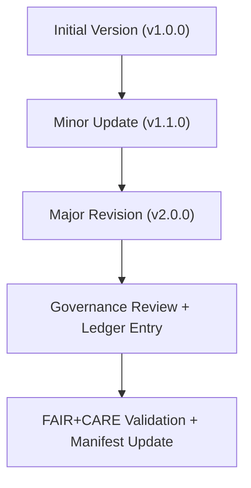

<div align="center">

# 🧾 **Kansas Frontier Matrix — Naming Conventions & File Taxonomy (v2.1.1 · Tier-Ω+∞ Certified)**  
`docs/standards/naming-conventions.md`

**Mission:** Define the **naming conventions, directory taxonomy, and identifier schema**  
for all datasets, documentation, and system components in the **Kansas Frontier Matrix (KFM)** —  
ensuring consistency, traceability, and FAIR+CARE-aligned reproducibility.

[](../../docs/)
[](../../docs/standards/faircare-validation.md)
[](../../data/reports/audit/data_provenance_ledger.json)
[](../../LICENSE)

</div>

---

## 📚 Overview

Naming conventions are essential to **governance traceability**, **metadata interoperability**, and **AI explainability**.  
This standard unifies file and folder naming across all KFM systems to ensure:

- Consistency in documentation and data repositories.  
- Discoverability within STAC/DCAT catalogs and governance ledgers.  
- Compatibility with FAIR+CARE metadata automation.  
- Predictable, machine-readable structures for long-term preservation.

---

## 🧱 General Rules

| Rule | Description | Example |
|:--|:--|:--|
| **Use lowercase** | All filenames and directories must be lowercase. | `data/work/tmp/hazards/` |
| **Use kebab-case for words** | Replace spaces and underscores with hyphens (`-`). | `ai-governance-framework.md` |
| **No spaces or special characters** | Only use `a–z`, `0–9`, and `-`. | `2025-q4-governance-report.md` |
| **Version tagging** | Append `v#.#.#` for schema or document versions. | `data-contract-v3.1.0.json` |
| **Temporal tagging** | Use `YYYY-MM-DD` or `YYYY-Q#` formats for reports. | `2025-Q4` |
| **Descriptive precision** | Names should describe file purpose clearly. | `metadata-standards.md` |
| **Stable extensions** | Use `.md`, `.json`, `.yml`, `.csv`, `.geojson`, `.tif`, etc. | `stac-validation-report.json` |

---

## 🧩 Directory Naming Taxonomy

| Directory | Purpose | Example |
|:--|:--|:--|
| `data/` | All datasets and metadata catalogs. | `data/stac/catalog.json` |
| `docs/` | Documentation, governance, and standards. | `docs/standards/README.md` |
| `src/` | Source code for ETL and AI pipelines. | `src/pipelines/etl/` |
| `web/` | Web UI (React + MapLibre). | `web/src/components/` |
| `tools/` | Utility scripts and automation helpers. | `tools/scripts/validate.py` |
| `tests/` | Validation and regression test suites. | `tests/test_data_validation.py` |
| `.github/` | CI/CD workflows and governance automation. | `.github/workflows/stac-validate.yml` |

---

## 🧮 Data File Naming Standards

| Data Type | Naming Convention | Example |
|:--|:--|:--|
| **Raw Data** | `<source>_<topic>_<year>` | `noaa_storm_events_2025.csv` |
| **Processed Data** | `<domain>_<layer>_v#.#.#` | `hazards_tornado_tracks_v9.3.2.geojson` |
| **Validation Reports** | `<type>_validation_report.json` | `stac_validation_report.json` |
| **Checksums** | `<context>_checksums.sha256` | `pipeline_checksums.sha256` |
| **Metadata Files** | `<topic>_metadata.json` | `climate_metadata.json` |
| **STAC Items** | `<domain>_<year>.json` | `hazards_2025.json` |
| **AI Models** | `<model-name>_v#.#.#` | `hazard-ai-predictor_v1.2.0.pkl` |

> 🧠 **Governance Rule:** All dataset files must include a `metadata.json` and a checksum entry  
> recorded in the `data/reports/audit/data_provenance_ledger.json`.

---

## ⚙️ Documentation Naming Conventions

| Category | Rule | Example |
|:--|:--|:--|
| **Docs** | Use kebab-case; match topic domain. | `data-architecture.md` |
| **Templates** | Suffix with `-template.md`. | `review-template.md` |
| **Reports** | Use `YYYY_Q#` or date format. | `2025_Q4_design_review.md` |
| **Standards** | Prefix by category (e.g., `markdown_`, `metadata_`). | `markdown_rules.md` |
| **Governance** | Use uppercase identifiers for root charters. | `ROOT-GOVERNANCE.md` |

---

## 🧠 FAIR + CARE Naming Integration

| FAIR Principle | CARE Principle | Naming Implementation |
|:--|:--|:--|
| **Findable** | **Collective Benefit** | Consistent filenames for automated discovery. |
| **Accessible** | **Authority to Control** | Open, readable, and self-descriptive names. |
| **Interoperable** | **Responsibility** | Standards-based prefixes for cross-system integration. |
| **Reusable** | **Ethics** | Transparent, culturally considerate naming for datasets. |

---

## 🔍 Versioning Strategy


<!-- END OF MERMAID -->

| Version Segment | Meaning | Trigger Example |
|:--|:--|:--|
| **MAJOR** | Backward-incompatible structural changes. | New metadata schema. |
| **MINOR** | Backward-compatible feature additions. | Add new FAIR+CARE fields. |
| **PATCH** | Fixes or small corrections. | Fix typos in governance reports. |

---

## 🧾 File Identifier Schema (Machine-Readable)

```yaml
id_schema:
  format: "<domain>_<entity>_<version>_<date>"
  domain: "data | docs | src | web | tests"
  entity: "unique descriptive identifier"
  version: "v#.#.#"
  date: "YYYYMMDD (optional)"
examples:
  - "docs_standards_metadata_v2.1.1_20251116"
  - "data_hazards_tornado_v9.3.2"
  - "src_pipelines_ai_v1.0.0"
```

---

## 🧾 Validation Workflows

| Workflow | Purpose | Output |
|:--|:--|:--|
| `policy-check.yml` | Validates naming conventions and frontmatter. | `reports/audit/policy_check.json` |
| `docs-validate.yml` | Checks link structure and file organization. | `reports/validation/docs_validation.json` |
| `governance-ledger.yml` | Records naming rule compliance via checksum. | `data/reports/audit/data_provenance_ledger.json` |

---

## 🧩 File Extension Policy

| Extension | Format | Description |
|:--|:--|:--|
| `.md` | Markdown | Documentation and governance files. |
| `.json` | JSON / STAC | Machine-readable metadata. |
| `.geojson` | GeoJSON | Geospatial vector data. |
| `.csv` | CSV | Tabular structured data. |
| `.tif` | GeoTIFF | Raster data (imagery, elevation). |
| `.yaml` / `.yml` | YAML | Configurations, templates, and metadata schemas. |
| `.sha256` | Plain text | Checksum and validation records. |

---

## 🧾 Version History

| Version | Date | Author | Summary |
|:--|:--|:--|:--|
| **v2.1.1** | 2025-11-16 | @kfm-docs | Finalized repository-wide naming taxonomy and FAIR+CARE integration. |
| v2.0.0 | 2025-10-25 | @kfm-data | Expanded dataset and metadata naming rules. |
| v1.0.0 | 2025-10-04 | @kfm-architecture | Initial naming convention standard. |

---

<div align="center">

**Kansas Frontier Matrix © 2025**  
*“A Name Defines Provenance — Provenance Defines Trust.”*  
📍 `docs/standards/naming-conventions.md` — Official naming convention and taxonomy standards for the Kansas Frontier Matrix.

</div>

