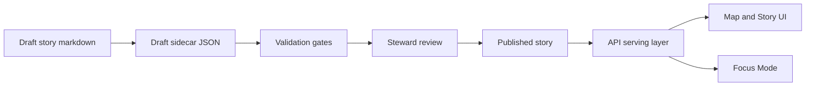

<!--
[KFM_META_BLOCK_V2]
doc_id: kfm://doc/docs-stories-readme
title: Stories (Story Nodes)
type: guide
version: v1
status: draft
owners: KFM Docs & Story Stewards
created: 2026-02-22
updated: 2026-02-22
policy_label: public
tags:
  - kfm
  - stories
  - story-nodes
  - narrative
notes:
  - Canonical authoring + governance guide for Story Nodes stored under docs/stories/.
[/KFM_META_BLOCK_V2]
-->
# Stories
Governed **Story Nodes (v3)**: narrative + map state + citations, designed to render in the Map/Story UI and power Focus Mode.

**Status:** draft · **Spec:** Story Node v3 · **Policy:** governed (policy_label enforced) · **Owners:** KFM Docs & Story Stewards

- Jump to: [What lives here](#what-lives-here) · [Story Node anatomy](#story-node-anatomy) · [Directory layout](#directory-layout) · [How to add a story](#how-to-add-a-story) · [Templates](#templates) · [Evidence and citations](#evidence-and-citations) · [Governance and review gates](#governance-and-review-gates) · [Story index](#story-index) · [Definition of done](#definition-of-done)

---

## What lives here

This folder holds **governed narrative content** (“Story Nodes”) that bind:

- **Text** (Markdown) written for humans, and
- **Map state + metadata** (sidecar JSON) written for machines (UI, APIs, Focus Mode)

A Story Node is treated as a **first-class, versioned artifact**: it is reviewed, policy-labeled, and must be evidence-linked.

> [!IMPORTANT]
> If a story makes a claim, it must be backed by a resolvable evidence reference. If it can’t be supported, it does not ship.

---

## Story Node anatomy

A Story Node consists of two files:

1. **Markdown story**
   - Human-readable narrative
   - Structured sections (Summary, Claims, Narrative, Evidence)
   - Inline citation tokens

2. **Sidecar JSON**
   - Machine-readable metadata:
     - status + review state
     - policy label
     - *map_state* (bbox, zoom, layers, time window, filters)
     - citations list



---

## Directory layout

Because stories are “content + assets”, the most maintainable pattern is **one folder per story** (so images and attachments stay with their story).

Recommended structure:

```text
docs/stories/
  README.md                      # you are here
  templates/                     # copy-paste templates
    TEMPLATE__STORY_NODE_V3.md
    TEMPLATE__STORY_NODE_V3.sidecar.json
  draft/                         # work-in-progress stories (not published)
    <story_slug>/
      story.md
      story.sidecar.json
      assets/
  published/                     # approved stories (public or restricted)
    <story_slug>/
      story.md
      story.sidecar.json
      assets/
```

> [!NOTE]
> If your repo uses a different canonical home (e.g., `docs/reports/story_nodes/`), keep the same **draft vs published** separation and folder-per-story rule.

---

## How to add a story

### 1) Create a draft story folder

- Pick a **slug** (kebab-case): `dust-bowl-black-sunday`, `kansas-river-floods-1951`, etc.
- Create: `docs/stories/draft/<story_slug>/`

### 2) Copy templates

Create two files in the story folder:

- `story.md` (Markdown)
- `story.sidecar.json` (sidecar JSON)

Use the templates in [Templates](#templates) below.

### 3) Fill the MetaBlock and narrative sections

In `story.md`:

- Set `doc_id` to a stable `kfm://story/<uuid>@v1` identifier (do not change it on edits)
- Set `policy_label` appropriately (public vs restricted, etc.)
- Add **scope** in Summary (time window + geography)
- Write **Claims** as a numbered list, each with a citation token
- Write **Narrative** with inline citations
- List the Evidence refs again in the Evidence section

### 4) Define map state

In `story.sidecar.json`:

- Set `map_state.time_window` to match the story scope
- Set `bbox` and `zoom` for the initial view
- Reference **promoted dataset versions only** in layers
- Keep filters policy-safe and minimal

### 5) Add citations and ensure they resolve

- Every citation in Markdown should correspond to a resolvable evidence reference.
- The sidecar `citations[]` list is the machine-checkable set of evidence roots.

### 6) Open a PR and get review

- Drafts can be merged as drafts, but **publishing** requires steward review + policy sign-off.
- Publishing is the act of moving a story from `draft/` to `published/` (or flipping status + review state, depending on your workflow).

---

## Templates

### Story Node v3 Markdown skeleton

Create `story.md`:

```md
<!--
[KFM_META_BLOCK_V2]
doc_id: kfm://story/<uuid-or-slug>
title: <Story title>
type: story_node
version: v3
status: draft
owners: <team or person>
created: YYYY-MM-DD
updated: YYYY-MM-DD
policy_label: public
tags:
  - story-node
  - <topic>
[/KFM_META_BLOCK_V2]
-->

# <Story title>
<One-line purpose.>

## Scope and location
- Area: <place name(s)>
- Geometry: <bbox/centroid/generalized polygon>
- Map notes: <optional>

## Time
- Event time: <YYYY-MM-DD or range>
- Valid time: <optional>
- Transaction time: <optional>

## Claims
- C1: <claim>
- C2: <claim>

## Evidence
- For C1:
  - DatasetRef: <...>
  - Source: <...>
- For C2:
  - Source: <...>
- AuditRef: <kfm://audit/...> (pending ok)

## Uncertainty
- <what we don’t know>
- <competing interpretations>

## Policy and redaction
- policy_label: <public/restricted/...>
- Redactions: <what is generalized/withheld>

## Links
- Related Story Nodes: <...>
- Related datasets/layers: <...>
```

### Story Node v3 sidecar skeleton

Create `story.sidecar.json`:

```json
{
  "kfm_story_node_version": "v3",
  "story_id": "kfm://story/<uuid>",
  "version_id": "v1",

  "status": "draft",
  "policy_label": "public",
  "review_state": "needs_review",

  "map_state": {
    "bbox": [-102.0, 36.9, -94.6, 40.0],
    "zoom": 6,
    "layers": [
      { "layer_id": "example_layer_id", "dataset_version_id": "YYYY-MM.hash" }
    ],
    "time_window": { "start": "YYYY-MM-DD", "end": "YYYY-MM-DD" }
  },

  "citations": [
    { "ref": "dcat://dataset_slug@dataset_version_id", "kind": "dcat" },
    { "ref": "prov://run/<run_id>", "kind": "prov" }
  ]
}
```

### Map state schema (minimum shape)

Map state must stay compact and policy-safe. A typical shape:

```json
{
  "kfm_map_state_version": "v1",
  "bbox": [-102.0, 36.9, -94.6, 40.0],
  "zoom": 6,
  "bearing": 0,
  "pitch": 0,
  "time_window": { "start": "1950-01-01", "end": "2024-12-31" },
  "layers": [
    {
      "layer_id": "noaa_storm_events",
      "dataset_version_id": "2026-02.abcd1234",
      "opacity": 0.8,
      "filters": [
        { "field": "event_type", "op": "in", "value": ["Tornado", "Hail"] }
      ]
    }
  ]
}
```

---

## Evidence and citations

### What “citation” means in KFM

In Story Nodes, citations are **not decorative**; they are part of the system’s trust membrane:

- They must resolve through the evidence resolver endpoint (**publishing gate**).
- They must not leak restricted metadata when policy denies access.
- They must be stable across time (prefer dataset version URIs over raw URLs).

### Citation token conventions

In Markdown, citations appear as inline tokens:

- `[CITATION: dcat://...]` for dataset/distribution discovery refs
- `[CITATION: stac://...]` for asset/item refs
- `[CITATION: prov://...]` for lineage/run refs
- `[CITATION: doc://...]` for governed internal docs (if allowed by policy)

In sidecar JSON, citations are normalized into an array:

- `ref`: the URI
- `kind`: the scheme/category (dcat, stac, prov, doc)

> [!IMPORTANT]
> Publishing gate: **all citations must resolve** via `/api/v1/evidence/resolve` before a story can be published.

---

## Governance and review gates

### Roles (baseline)

Story publishing is a governed act:

- **Contributor**: drafts stories; cannot publish
- **Reviewer / Steward**: approves story publishing; owns policy labels + redaction rules
- **Governance council / community stewards**: controls culturally sensitive material rules (especially Indigenous/cultural constraints)
- **Operator**: runs pipelines + deployments; cannot override policy gates

### Safety defaults

Unless policy explicitly allows:

- Do **not** embed precise coordinates for sensitive locations
- Default-deny restricted collections
- If public representation is allowed, prefer a **public generalized** representation instead of raw precision
- Treat redaction/generalization as a first-class transform recorded in provenance

> [!WARNING]
> “Online availability does not equal permission to reuse.” If you include media (images, scans, audio), ensure rights/license metadata exists and is honored.

---

## Story index

This README can act as a curated, human-scannable index of Story Nodes.

### Published stories

| Story | Status | Time window | Geography | Policy | Notes |
|---|---|---:|---|---|---|
| _(add published stories here)_ | published |  |  |  |  |

### Draft stories

| Story | Status | Time window | Geography | Policy | Needs review |
|---|---|---:|---|---|---|
| _(add drafts here)_ | draft |  |  |  |  |

> [!TIP]
> Keep the index “curated”: small, high-signal, and ordered for discovery (not a raw dump).

---

## Definition of done

A Story Node is publish-ready when:

- [ ] **MetaBlock v2** present and complete (stable `doc_id`, correct `policy_label`, updated date changed)
- [ ] **Scope stated** in Summary (time window + geography)
- [ ] **Claims section** present and each claim includes at least one citation token
- [ ] **All citations resolve** through the evidence resolver
- [ ] **Sidecar JSON** validates against the Story Node schema and map state schema
- [ ] `map_state.layers[].dataset_version_id` references **promoted versions only**
- [ ] No sensitive-location leakage (coordinates generalized or omitted unless explicitly allowed)
- [ ] Media/asset rights verified and recorded (no “unknown license” assets in published stories)
- [ ] Steward review completed; review_state indicates approval (per workflow)

---

### Appendix: Common pitfalls

- **Unversioned evidence**: citing “latest” URLs instead of versioned dataset refs
- **Map/story mismatch**: narrative describes one time window, map_state uses another
- **Policy drift**: story is “public” but cites restricted evidence; or vice versa
- **Hidden precision**: sensitive locations accidentally included in screenshots, captions, or “example” coordinates

---

[↑ Back to top](#stories)
