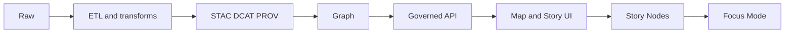

<!-- [KFM_META_BLOCK_V2]
doc_id: kfm://doc/d32015ca-3079-4341-9cee-697c744ac4fd
title: Story Nodes Directory Guide
type: standard
version: v1
status: draft
owners: TBD
created: 2026-02-24
updated: 2026-02-24
policy_label: public
related:
  - docs/stories/
tags: [kfm, stories, story-nodes, narrative]
notes:
  - Directory-level contract for Story Node v3 content and workflow.
[/KFM_META_BLOCK_V2] -->

 <!-- TODO: wire to releases/gates -->


# Story Nodes

Governed narrative units that bind **human-readable markdown** to **map state** and **resolvable evidence**.

> [!NOTE]
> This folder is the canonical home for Story Nodes in this repo *if* you are using `docs/stories/`.
> Some legacy documentation may refer to other locations (for example `docs/reports/story_nodes/`). If your repo differs, update this README to match the actual canonical path.

## Navigation
- [Purpose](#purpose)
- [How this fits in KFM](#how-this-fits-in-kfm)
- [Directory layout](#directory-layout)
- [Story Node v3 format](#story-node-v3-format)
- [Citations and evidence](#citations-and-evidence)
- [Governance and safety](#governance-and-safety)
- [Workflow](#workflow)
- [Definition of done](#definition-of-done)
- [Story registry](#story-registry)
- [Appendix](#appendix)

---

## Purpose

This directory exists to store **Story Nodes** as governed publications:

- **Narrative**: written in Markdown for humans
- **Map choreography**: encoded in a sidecar JSON file for machines
- **Evidence**: every claim is traceable and must be resolvable via the evidence resolver

Back to top: [Navigation](#navigation)

---

## How this fits in KFM

Story Nodes sit downstream of the trust membrane. A Story Node must not “skip the line” ahead of provenance, catalogs, and policy.



Back to top: [Navigation](#navigation)

---

## Directory layout

This README documents **what belongs here** and **what must not**. The exact subfolders are a repo choice; below is a recommended structure that keeps drafts and published stories separate.

```text
docs/stories/                                    # Story Nodes (narratives + map state + citations; governed publish flow)
├─ README.md                                      # How stories are authored, reviewed, and published (gates + rules)
│
├─ draft/                                         # Proposed stories (not authoritative; subject to change)
│  └─ <story_slug>/                               # Story slug (kebab-case; stable once published)
│     ├─ story.md                                 # Story Node markdown (claims must be cited)
│     ├─ story.json                               # Sidecar: map state + citations + policy labels/obligations
│     ├─ media/                                   # Optional media assets used by the story (bounded; licensed)
│     │  └─ …                                     # Images/figures/exports (no sensitive detail)
│     └─ media_attribution.md                     # Recommended: license + attribution notes for story media
│
├─ published/                                     # Published stories (reviewed + gate-passing; authoritative)
│  └─ <story_slug>/
│     ├─ story.md                                 # Final story markdown (frozen; changes require republish/versioning)
│     ├─ story.json                               # Final sidecar (frozen; must match story.md references)
│     ├─ media/
│     │  └─ …                                     # Published media (frozen; no sensitive detail)
│     └─ media_attribution.md                     # Required when media licenses/attribution apply
│
└─ _templates/                                    # Optional helpers (copy/paste starters; keep aligned to v3)
   └─ story_node_v3/
      ├─ story.md                                 # Starter markdown template (sections + citation pattern)
      └─ story.json                               # Starter sidecar template (map state + refs placeholders)
```

### Acceptable inputs

- Story Node v3 artifacts:
  - `story.md` (markdown narrative)
  - `story.json` (sidecar metadata: map state + citations + policy + review)
- Supporting media **only when** rights are clear and attribution is captured
- Directory-level documentation and templates that support Story Node authoring

### Exclusions

Do **not** put these in `docs/stories/`:

- Raw or processed datasets (those belong in the data lifecycle zones)
- Pipeline code, ETL scripts, or schema contracts (those belong in code/contracts areas)
- Media with unclear rights or missing attribution
- Uncited narrative claims
- Sensitive location specifics that violate policy or sovereignty requirements

Back to top: [Navigation](#navigation)

---

## Story Node v3 format

A Story Node is a **pair** of files:

| Artifact | Required | Purpose |
|---|---:|---|
| `story.md` | ✅ | Human-readable narrative with explicit claims and inline citations |
| `story.json` | ✅ | Machine-readable story metadata: map state, citations list, policy label, review state |

### story.md expectations

- Must include a **MetaBlock v2** (as an HTML comment) so it can be treated as a governed document.
- Must include:
  - `Summary` section: scope + time window
  - `Claims` section: numbered claims with citations
  - `Narrative` section: prose with inline citations
  - `Evidence` section: a list of evidence references used

Minimal example:

```markdown
<!-- [KFM_META_BLOCK_V2]
doc_id: kfm://story/<uuid>@v1
title: <Story title>
type: story
version: v3
status: draft
owners: <names or teams>
created: YYYY-MM-DD
updated: YYYY-MM-DD
policy_label: public
related:
  - kfm://dataset/<slug>@<dataset_version_id>
tags: [kfm, story]
notes:
  - Short note about scope or constraints
[/KFM_META_BLOCK_V2] -->

# <Story title>

## Summary
<What this story covers and the relevant time window.>

## Claims
1. <Claim text.> [CITATION: dcat://...]
2. <Claim text.> [CITATION: prov://...]

## Narrative
<Prose with inline citations.>

## Evidence
- [CITATION: dcat://...]
- [CITATION: stac://...]
- [CITATION: prov://...]
```

### story.json expectations

The sidecar JSON must declare Story Node v3 and include, at minimum:

- `kfm_story_node_version: "v3"`
- stable story identity (`story_id`) and story version (`version_id`)
- `status`, `policy_label`, and `review_state`
- `map_state` (bbox/zoom/layers/time window or equivalent)
- `citations[]` (scheme refs that can be resolved)

Minimal example:

```json
{
  "kfm_story_node_version": "v3",
  "story_id": "kfm://story/<uuid>",
  "version_id": "v1",
  "status": "draft",
  "policy_label": "public",
  "review_state": "needs_review",
  "map_state": {
    "bbox": [-102.0, 36.9, -94.6, 40.0],
    "zoom": 6,
    "layers": [],
    "time_window": { "start": "YYYY-MM-DD", "end": "YYYY-MM-DD" }
  },
  "citations": [
    { "ref": "dcat://<dataset>@<version>", "kind": "dcat" }
  ]
}
```

Back to top: [Navigation](#navigation)

---

## Citations and evidence

### Non-negotiable rules

- **Every claim must cite evidence.**
- Citations must use resolvable evidence references (examples):
  - `dcat://...` for dataset identity + licensing + distribution metadata
  - `stac://...` for spatial/temporal assets
  - `prov://...` for run receipts / lineage
  - `doc://...` for governed documents and extracts

> [!IMPORTANT]
> Publishing is blocked unless **all citations resolve through the evidence resolver**.
> Do not publish Story Nodes that rely on “dead links”, private URLs, or evidence that can’t be resolved.

### Practical authoring guidance

- Prefer **primary sources** and **cataloged** evidence.
- Inline citations close to the sentence they support.
- If a claim is uncertain or contested, state uncertainty and cite sources for the competing viewpoints.

Back to top: [Navigation](#navigation)

---

## Governance and safety

Story Nodes are not “just content”; they are governed outputs.

### Rights and licensing for media

> [!WARNING]
> Publishing must be blocked if rights are unclear for included media.

When adding images or other media:

- Ensure the license/rights are recorded
- Ensure attribution is included (recommended: `media_attribution.md`)
- Ensure policy labels match the sensitivity of the content

### Sensitive locations and sovereignty

If a story touches sensitive locations or culturally restricted knowledge:

- Default to generalization/redaction
- Use a restrictive policy label when required
- Do not embed precise coordinates unless policy explicitly allows it

Back to top: [Navigation](#navigation)

---

## Workflow

### Create a new Story Node

1. Create a folder under `draft/<story_slug>/`.
2. Add `story.md` and `story.json` as a pair.
3. Add any media under `media/` and include attribution notes.
4. Ensure:
   - MetaBlock v2 is present and complete
   - `doc_id` is stable (do not regenerate on edits)
   - `policy_label` is correct for the content
   - every claim has at least one resolvable citation

### Update an existing Story Node

- Bump `updated` date in MetaBlock on meaningful edits.
- Preserve `doc_id` stability.
- If policy label changes, treat it as a governance event and ensure review gates are applied.

Back to top: [Navigation](#navigation)

---

## Definition of done

A Story Node is ready to move from `draft/` to `published/` when:

- [ ] `story.md` contains MetaBlock v2 and required sections
- [ ] `story.json` declares `kfm_story_node_version: "v3"` and includes required keys
- [ ] Every claim has at least one citation
- [ ] All citations resolve through the evidence resolver
- [ ] Policy label is correct and consistent with evidence sensitivity
- [ ] Media rights are clear and attribution is recorded
- [ ] Sensitive content is handled according to governance playbooks
- [ ] Review state indicates approval for publishing

Back to top: [Navigation](#navigation)

---

## Story registry

> [!TIP]
> Keep this table updated so reviewers and UI builders can discover story nodes quickly.

| Story | Status | Policy | Time window | Notes |
|---|---|---|---|---|
| _(add stories here)_ | draft | public | YYYY–YYYY | |

Back to top: [Navigation](#navigation)

---

## Appendix

<details>
<summary>Recommended conventions and open questions</summary>

### Proposed conventions

- Keep drafts and published stories separate (`draft/` vs `published/`) to make “what ships” explicit.
- Store story media adjacent to the story and require explicit attribution notes.
- Consider adding a machine-readable registry file if the UI needs quick discovery.

### Unknown until repo verification

- Exact story discovery mechanism for the UI (directory scan vs registry file)
- Exact schema validation tooling and CI checks for Story Nodes
- Canonical location if the repo uses a different path than `docs/stories/`

</details>
