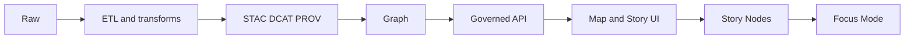
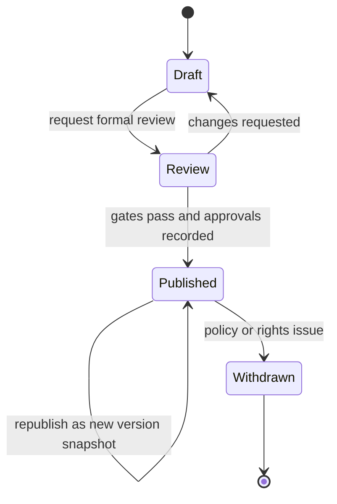

<!-- [KFM_META_BLOCK_V2]
doc_id: kfm://doc/d32015ca-3079-4341-9cee-697c744ac4fd
title: Story Nodes Directory Guide
type: standard
version: v1
status: draft
owners: TBD
created: 2026-02-24
updated: 2026-03-01
policy_label: public
related:
  - docs/stories/
tags: [kfm, stories, story-nodes, narrative]
notes:
  - Directory-level contract for Story Node v3 content and workflow.
[/KFM_META_BLOCK_V2] -->

 <!-- TODO: wire to releases/gates -->


# Story Nodes

Governed narrative units that bind **human-readable markdown** to **replayable map state** and **resolvable evidence**.

> [!NOTE]
> This folder is the canonical home for Story Nodes in this repo **if** you are using `docs/stories/`.
> Some repo layouts place story nodes under `docs/reports/story_nodes/` (or similar). If both exist, choose **exactly one** canonical location and make the other a stub/redirect README that links here.

## Navigation
- [Purpose](#purpose)
- [How this fits in KFM](#how-this-fits-in-kfm)
- [Directory layout](#directory-layout)
- [Directory invariants](#directory-invariants)
- [Story Node v3 format](#story-node-v3-format)
- [Citations and evidence](#citations-and-evidence)
- [Governance and safety](#governance-and-safety)
- [Workflow](#workflow)
- [Definition of done](#definition-of-done)
- [Story registry](#story-registry)
- [Appendix](#appendix)

---

## Purpose

This directory exists to store **Story Nodes** as governed publications:

- **Narrative**: written in Markdown for humans
- **Map choreography**: encoded in a sidecar JSON file for machines
- **Evidence**: every claim is traceable and must be resolvable via the evidence resolver

Back to top: [Navigation](#navigation)

---

## How this fits in KFM

Story Nodes sit downstream of the trust membrane. A Story Node must not “skip the line” ahead of provenance, catalogs, and policy.



Back to top: [Navigation](#navigation)

---

## Directory layout

This README documents **what belongs here** and **what must not**.

The structure below is intentionally verbose so that:
- reviewers can tell **what is authoritative** vs **what is WIP**
- CI can validate Story Packs deterministically
- published stories can be treated as immutable, reproducible artifacts

> [!IMPORTANT]
> The names below are **recommended defaults**. If your repo uses different names, keep the contracts but update paths here.

### Expanded tree

```text
docs/stories/                                               # Story Nodes: narratives + map state + citations
├─ README.md                                                # This directory contract (gates + invariants)
├─ CODEOWNERS                                               # Optional: route story reviews to approvers
│
├─ _schemas/                                                # Local schemas for story packs (CI validates)
│  ├─ story_node_v3.schema.json                             # Story Node v3 (story.json) contract
│  ├─ story_markdown_v3.schema.json                         # Optional: structural lint for story.md sections
│  ├─ story_steps_v1.schema.json                            # Optional: step-by-step scrollytelling choreography
│  ├─ story_lock_v1.schema.json                             # Optional: frozen hashes/pins for reproducibility
│  ├─ story_manifest_v1.schema.json                         # Published manifest contract (hashes + inventory)
│  ├─ story_receipt_v1.schema.json                          # Publish receipt contract (who/what/when/inputs)
│  ├─ evidence_ref_v1.schema.json                           # EvidenceRef syntax (dcat/stac/prov/doc/graph)
│  ├─ claim_map_v1.schema.json                              # claim_id -> evidence_ref_id(s)
│  ├─ media_attribution_v1.schema.json                      # Structured media rights/attribution (optional)
│  └─ story_index_v1.schema.json                            # Aggregated story index schema for UI discovery
│
├─ _registry/                                               # Lightweight catalog/index of stories for UI + discovery
│  ├─ stories.index.json                                    # slug -> title/status/policy/tags/time_window
│  ├─ tags.vocab.json                                       # Optional controlled tags for filtering/search UX
│  ├─ policy_labels.vocab.json                              # Allowed labels + obligations vocab (optional)
│  ├─ statuses.vocab.json                                   # draft/review/published/withdrawn definitions (optional)
│  └─ reviewers.vocab.json                                  # Optional: reviewer roles/teams (optional)
│
├─ _governance/                                             # Local governance helpers (optional; link to canonical)
│  ├─ README.md                                             # How story governance works in this repo
│  ├─ review_policy.md                                      # Who can approve what; what requires steward review
│  ├─ media_rights_policy.md                                # Media licensing rules + “metadata-only” fallback
│  ├─ sensitive_locations_playbook.md                       # Redaction/generalization rules for sensitive sites
│  ├─ redaction_guidelines.md                               # How to write safely without leaking sensitive detail
│  └─ decision_templates/                                   # Small, reversible governance artifacts
│     ├─ ADR_story_policy_change.md                         # Template: story policy change rationale + impacts
│     └─ waiver_template.md                                 # Template: explicit override + audit requirements
│
├─ _lint/                                                   # Repo-local lint config for story QA
│  ├─ markdownlint.json                                     # Style rules (optional)
│  ├─ linkcheck.allowlist.txt                               # Allowlist for stable external domains (optional)
│  ├─ linkcheck.denylist.txt                                # Explicitly disallowed domains (optional)
│  ├─ story_rules.yaml                                      # Required sections; prohibited patterns; etc.
│  └─ citation_rules.yaml                                   # Enforce EvidenceRef syntax + resolver checks
│
├─ _shared/                                                 # Shared, non-story-specific assets (optional)
│  ├─ media/                                                # Icons/logos/diagrams used across stories
│  ├─ snippets/                                             # Reusable markdown fragments (disclaimers, boilerplates)
│  └─ diagrams/                                             # Reusable mermaid diagrams (optional)
│
├─ _templates/                                              # Copy/paste starters (keep aligned to Story Node v3)
│  └─ story_node_v3/
│     ├─ story.md                                           # Template narrative (sections + citation pattern)
│     ├─ story.json                                         # Template sidecar (map state + refs placeholders)
│     ├─ story.steps.json                                   # Optional: template step choreography
│     ├─ story.lock.json                                    # Optional: template lockfile structure
│     ├─ story.manifest.json                                # Template manifest
│     ├─ story.receipt.json                                 # Template publish receipt
│     ├─ media_attribution.md                               # Template attribution notes (license + credits)
│     ├─ review_checklist.md                                # Reviewer checklist template
│     ├─ decision_log.md                                    # Template decision log
│     └─ tombstone.md                                       # Template for withdrawn story notice
│
├─ draft/                                                   # Proposed stories (NOT authoritative)
│  └─ <story_slug>/                                         # kebab-case slug; stable once published
│     ├─ story.md                                           # Narrative w/ claim anchors (claims must be cited)
│     ├─ story.json                                         # Sidecar: map_state + citations + policy + review_state
│     ├─ story.steps.json                                   # Optional: scrollytelling steps (if used)
│     ├─ story.lock.json                                    # Optional: pins/hashes for evidence/media (recommended)
│     │
│     ├─ evidence/                                          # Optional: structured citation plumbing
│     │  ├─ evidence_refs.json                              # EvidenceRef list (ids, sources, scope, policy)
│     │  ├─ claim_map.json                                  # claim_id -> evidence_ref_id(s)
│     │  ├─ unresolved.md                                   # Unknowns to verify; blocked claims list
│     │  └─ notes.md                                        # Analyst notes; assumptions; data limitations
│     │
│     ├─ map/                                               # Optional split to reduce JSON diff noise
│     │  ├─ map_state.json                                  # viewport, layers, filters, time window defaults
│     │  ├─ layer_overrides.json                            # per-story style/symbolization overrides
│     │  └─ bookmarks.json                                  # named extents/steps used by scrollytelling
│     │
│     ├─ media/                                             # Bounded story assets (licensed; no sensitive detail)
│     │  ├─ src/                                            # Originals (as received)
│     │  ├─ derived/                                        # resized/cropped/annotated derivatives
│     │  └─ thumbnails/                                     # preview images for listing cards
│     ├─ media_attribution.md                               # Recommended in draft; required when media used
│     │
│     ├─ review/                                            # WIP review artifacts (draft stage)
│     │  ├─ checklist.md                                    # reviewer checklist instance
│     │  ├─ signoff.yaml                                    # approvals + timestamps (optional)
│     │  └─ discussion.md                                   # review notes + decisions
│     │
│     ├─ receipts/                                          # Optional: saved local/CI outputs for the draft
│     │  ├─ schema_validation.json
│     │  ├─ citation_resolve.json
│     │  ├─ policy_check.json
│     │  ├─ rights_check.json
│     │  ├─ linkcheck_report.json
│     │  └─ lint_report.json
│     │
│     └─ exports/                                           # Optional (usually generated; may be gitignored)
│        ├─ preview.html                                    # rendered HTML preview
│        └─ figures/                                        # exported charts/maps for PR review
│
├─ review/                                                  # Stories in formal review (pre-publish freeze)
│  └─ <story_slug>/
│     ├─ story.md                                           # Release candidate narrative (RC)
│     ├─ story.json                                         # Release candidate sidecar (RC)
│     ├─ story.steps.json                                   # Optional: if used, must match story.json references
│     ├─ story.lock.json                                    # REQUIRED if enforcing reproducibility gates
│     │
│     ├─ review/                                            # REQUIRED: signoffs + checklist + decision record
│     │  ├─ checklist.md
│     │  ├─ signoff.yaml
│     │  └─ decision_log.md                                 # what changed + why
│     │
│     ├─ receipts/                                          # REQUIRED: CI outputs proving gates passed
│     │  ├─ lint_report.json
│     │  ├─ linkcheck_report.json
│     │  ├─ schema_validation.json
│     │  ├─ citation_resolve.json
│     │  ├─ policy_check.json
│     │  └─ rights_check.json
│     │
│     └─ exports/                                           # Optional: review preview artifacts
│        └─ preview.html
│
├─ published/                                               # Published stories (authoritative)
│  └─ <story_slug>/
│     ├─ story.md                                           # latest published version (frozen)
│     ├─ story.json                                         # latest sidecar (frozen; must match story.md refs)
│     ├─ story.steps.json                                   # Optional: published steps (if used)
│     ├─ story.manifest.json                                # REQUIRED: hashes of story files + media inventory
│     ├─ story.receipt.json                                 # REQUIRED: publish receipt (who/what/when/inputs)
│     ├─ media/
│     │  └─ …                                               # frozen published media (no sensitive detail)
│     ├─ media_attribution.md                               # REQUIRED when media licenses/attribution apply
│     │
│     ├─ versions/                                          # REQUIRED if any post-publish edits are allowed
│     │  ├─ v1/                                             # immutable snapshot
│     │  │  ├─ story.md
│     │  │  ├─ story.json
│     │  │  ├─ story.steps.json
│     │  │  ├─ story.manifest.json
│     │  │  ├─ story.receipt.json
│     │  │  └─ media/…
│     │  └─ v2/                                             # immutable snapshot (republish)
│     │     └─ …
│     │
│     ├─ CHANGELOG.md                                       # optional: human-readable republish diffs
│     └─ redirects.json                                     # optional: slug redirects / replaced-by pointers
│
├─ withdrawn/                                               # Removed from publication (policy/quality/rights reasons)
│  └─ <story_slug>/
│     ├─ tombstone.md                                       # why withdrawn + safe alternatives
│     ├─ withdrawal_receipt.json                            # who/when/why/policy decision record
│     └─ references/                                        # optional: pointers to replacement story/redacted version
│
└─ _archive/                                                # Deprecated structures or retired templates (keep minimal)
   └─ …
```

### Folder contracts (quick reference)

| Folder | What it is | Authority | Mutability | Typical gate expectation |
|---|---|---:|---:|---|
| `draft/` | authoring workspace | ❌ | mutable | lint + schema + citation resolution recommended |
| `review/` | frozen release candidate | 🚧 | mostly immutable | **must** pass publish gates + signoff artifacts |
| `published/` | shipped story packs | ✅ | immutable (append-only versions) | manifest + receipt required |
| `withdrawn/` | tombstoned stories | ✅ | immutable | withdrawal receipt required |
| `_templates/`, `_schemas/`, `_lint/` | enabling infrastructure | ✅ | controlled | changes reviewed like code |

Back to top: [Navigation](#navigation)

---

## Directory invariants

These are hard rules that should be enforced in CI where possible.

- **Pair rule**: `story.md` and `story.json` must exist as a pair for every story.
- **Stable slug**: `<story_slug>` is kebab-case and **stable once published** (use `redirects.json` if you must rename).
- **No raw data**: `docs/stories/` must never contain raw/processed datasets or pipeline outputs.
- **No uncited claims**: factual claims in `story.md` require at least one resolvable citation.
- **Policy alignment**: story `policy_label` must be compatible with its citations and media rights.
- **Published is immutable**: edits after publish must create a new version snapshot (e.g., `versions/v2/`).
- **Receipts are evidence**: review/publish decisions must leave artifacts (`signoff.yaml`, `decision_log.md`, `story.receipt.json`).

Back to top: [Navigation](#navigation)

---

## Story Node v3 format

A Story Node is a **pack**: a markdown narrative plus machine-readable state and evidence references.

| Artifact | Required | Purpose |
|---|---:|---|
| `story.md` | ✅ | Human-readable narrative with explicit claims and inline citations |
| `story.json` | ✅ | Machine-readable metadata: map state, citations list, policy label, review state |
| `story.steps.json` | ⬜ | Optional step choreography for scrollytelling (if used) |
| `story.lock.json` | ⬜ | Optional pins/hashes to stabilize reproducibility and review |
| `story.manifest.json` | ✅ (published) | Inventory + hashes for story artifacts and media |
| `story.receipt.json` | ✅ (published) | Publish receipt: who/what/when/inputs/outputs/policy decision refs |

### story.md expectations

- Must include a **MetaBlock v2** (as an HTML comment) so it can be treated as a governed document.
- Must include:
  - `Summary` section: scope + time window
  - `Claims` section: numbered claims with citations
  - `Narrative` section: prose with inline citations
  - `Evidence` section: a list of evidence references used
- Must clearly distinguish **fact** vs **interpretation** when relevant.

Minimal example:

```markdown
<!-- [KFM_META_BLOCK_V2]
doc_id: kfm://story/<uuid>@v1
title: <Story title>
type: story
version: v3
status: draft
owners: <names or teams>
created: YYYY-MM-DD
updated: YYYY-MM-DD
policy_label: public
related:
  - kfm://dataset/<slug>@<dataset_version_id>
tags: [kfm, story]
notes:
  - Short note about scope or constraints
[/KFM_META_BLOCK_V2] -->

# <Story title>

## Summary
<What this story covers and the relevant time window.>

## Claims
1. <Claim text.> [CITATION: dcat://...]
2. <Claim text.> [CITATION: prov://...]

## Narrative
<Prose with inline citations.>

## Evidence
- [CITATION: dcat://...]
- [CITATION: stac://...]
- [CITATION: prov://...]
```

### story.json expectations

The sidecar JSON must declare Story Node v3 and include, at minimum:

- `kfm_story_node_version: "v3"`
- stable story identity (`story_id`) and story version (`version_id`)
- `status`, `policy_label`, and `review_state`
- `map_state` (bbox/zoom/layers/style parameters/time window/filters or equivalent)
- `citations[]` (EvidenceRefs that can be resolved)
- optional: `entities[]` (graph IDs or stable identifiers for key entities mentioned)

Minimal example:

```json
{
  "kfm_story_node_version": "v3",
  "story_id": "kfm://story/<uuid>",
  "version_id": "v1",
  "status": "draft",
  "policy_label": "public",
  "review_state": "needs_review",
  "map_state": {
    "bbox": [-102.0, 36.9, -94.6, 40.0],
    "zoom": 6,
    "layers": [],
    "time_window": { "start": "YYYY-MM-DD", "end": "YYYY-MM-DD" },
    "filters": {}
  },
  "citations": [
    { "ref": "dcat://<dataset>@<version>", "kind": "dcat" }
  ]
}
```

Back to top: [Navigation](#navigation)

---

## Citations and evidence

### Non-negotiable rules

- **Every claim must cite evidence.**
- Citations must use **EvidenceRefs** that resolve via the evidence resolver.
- Publishing is blocked unless **all citations resolve and are policy-allowed**.

> [!IMPORTANT]
> Do not publish Story Nodes that rely on “dead links”, private URLs, or evidence that can’t be resolved.

### Practical authoring guidance

- Prefer **primary sources** and **cataloged** evidence.
- Put inline citations close to the sentence they support.
- If a claim is uncertain or contested, state uncertainty and cite competing viewpoints.
- When referencing documents, cite stable page anchors/spans if your resolver supports it.

Back to top: [Navigation](#navigation)

---

## Governance and safety

Story Nodes are not “just content”; they are governed outputs.

### Rights and licensing for media

> [!WARNING]
> Publishing must be blocked if rights are unclear for included media.

When adding images or other media:

- Ensure the license/rights are recorded
- Ensure attribution is included (recommended: `media_attribution.md`)
- Ensure policy labels match the sensitivity of the content

### Sensitive locations and sovereignty

If a story touches sensitive locations or culturally restricted knowledge:

- Default to generalization/redaction
- Use a restrictive policy label when required
- Do not embed precise coordinates unless policy explicitly allows it

Back to top: [Navigation](#navigation)

---

## Workflow

### Lifecycle



### Create a new Story Node

1. Create a folder under `draft/<story_slug>/`.
2. Add `story.md` and `story.json` as a pair.
3. Add any media under `media/` and include attribution notes.
4. Ensure:
   - MetaBlock v2 is present and complete
   - `doc_id` is stable (do not regenerate on edits)
   - `policy_label` is correct for the content
   - every claim has at least one resolvable citation

### Move a Story Node into review

1. Copy or move `draft/<story_slug>/` -> `review/<story_slug>/`.
2. Freeze scope: avoid adding new claims late unless necessary.
3. Generate/attach receipts under `review/<story_slug>/receipts/` proving gates passed.
4. Complete review artifacts under `review/<story_slug>/review/`.

### Publish a Story Node

1. Move `review/<story_slug>/` -> `published/<story_slug>/`.
2. Create:
   - `story.manifest.json` (hashes + inventory)
   - `story.receipt.json` (publish receipt)
3. If republishing, create a new immutable snapshot under `published/<story_slug>/versions/vN/`.

### Withdraw a Story Node

1. Move or mirror a tombstone into `withdrawn/<story_slug>/`.
2. Add `withdrawal_receipt.json`.
3. If replacing, add references to a safe alternative.

Back to top: [Navigation](#navigation)

---

## Definition of done

A Story Node is ready to move from `draft/` to `published/` when:

- [ ] `story.md` contains MetaBlock v2 and required sections
- [ ] `story.json` declares `kfm_story_node_version: "v3"` and includes required keys
- [ ] Every claim has at least one citation
- [ ] All citations resolve through the evidence resolver
- [ ] Policy label is correct and consistent with evidence sensitivity
- [ ] Media rights are clear and attribution is recorded
- [ ] Sensitive content is handled according to governance playbooks
- [ ] Review state indicates approval for publishing
- [ ] `review/<story_slug>/receipts/` contains gate outputs (schema, citation, policy, rights, linkcheck)
- [ ] `published/<story_slug>/` contains `story.manifest.json` + `story.receipt.json`

Back to top: [Navigation](#navigation)

---

## Story registry

> [!TIP]
> Keep the story registry updated so reviewers and UI builders can discover story nodes quickly.

Primary options:
- **File registry**: `_registry/stories.index.json`
- **Directory scan**: UI enumerates `published/*/` and reads story metadata

| Story | Status | Policy | Time window | Notes |
|---|---|---|---|---|
| _(add stories here)_ | draft | public | YYYY–YYYY | |

Back to top: [Navigation](#navigation)

---

## Appendix

<details>
<summary>Recommended conventions and open questions</summary>

### Proposed conventions

- Keep drafts and published stories separate (`draft/` vs `published/`) to make “what ships” explicit.
- Treat published story packs as immutable; republish via version snapshots.
- Store story media adjacent to the story and require explicit attribution notes.
- Keep `_schemas/` and `_templates/` aligned to the runtime Story Node v3 contract.

### Unknown until repo verification

- Exact story discovery mechanism for the UI (directory scan vs registry file)
- Exact schema validation tooling and CI checks for Story Nodes
- Canonical location in *this* repo if it differs from `docs/stories/` (e.g., `docs/reports/story_nodes/`)
- Whether `contracts/schemas/story_node_v3.schema.json` exists and is the canonical schema source

</details>