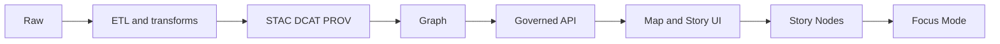
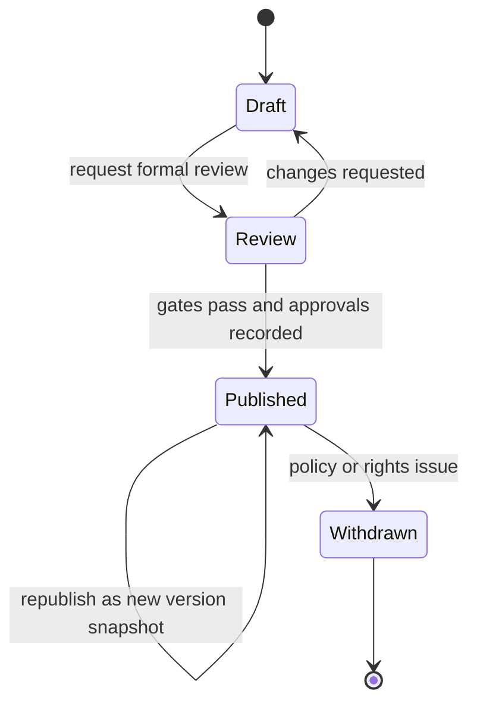

<!-- [KFM_META_BLOCK_V2]
doc_id: kfm://doc/d32015ca-3079-4341-9cee-697c744ac4fd
title: Story Nodes Directory Guide
type: standard
version: v1
status: draft
owners: TBD
created: 2026-02-24
updated: 2026-03-05
policy_label: public
related:
  - docs/stories/
tags: [kfm, stories, story-nodes, narrative]
notes:
  - Directory-level contract for Story Node v3 content and workflow.
  - This README defines requirements and recommended structure; optional items may not exist yet.
[/KFM_META_BLOCK_V2] -->

<a id="top"></a>

 <!-- TODO: wire to releases/gates -->


# Story Nodes
Governed narrative packs that bind **human-readable Markdown** to **replayable map state** and **resolvable evidence**.

> **IMPACT**
>
> - **Status:** draft (not a publishing guarantee)  
> - **Owners:** TBD  
> - **Canonical path (assumed by this README):** `docs/stories/`  
> - **Non-negotiables:** cite-or-abstain, resolver-backed EvidenceRefs, policy-safe media, post-publish immutability  
> - **Quick links:** [Purpose](#purpose) · [Where it fits](#where-it-fits-in-kfm) · [Inputs](#acceptable-inputs) · [Exclusions](#exclusions) · [Layout](#directory-layout) · [Story Node v3](#story-node-v3-pack-format) · [Workflow](#workflow) · [Definition of done](#definition-of-done)

> [!IMPORTANT]
> This README is a **directory contract** (what the repo expects).  
> It **does not** claim that every optional folder/file listed below already exists in this repo. Optional items are explicitly labeled as such.

---

## Navigation
- [Purpose](#purpose)
- [Where it fits in KFM](#where-it-fits-in-kfm)
- [Acceptable inputs](#acceptable-inputs)
- [Exclusions](#exclusions)
- [Directory layout](#directory-layout)
- [Directory invariants](#directory-invariants)
- [Story Node v3 pack format](#story-node-v3-pack-format)
- [Citations and evidence](#citations-and-evidence)
- [Governance and safety](#governance-and-safety)
- [Workflow](#workflow)
- [Quickstart](#quickstart)
- [Definition of done](#definition-of-done)
- [Story registry](#story-registry)
- [Version history](#version-history)
- [Appendix](#appendix)

---

## Purpose

This directory exists to store **Story Nodes** as governed publications:

- **Narrative**: written in Markdown for humans.
- **Map choreography**: captured in a sidecar JSON file for machines.
- **Evidence**: every factual claim is traceable via **resolvable** EvidenceRefs.

Back to top: [↑](#top)

---

## Where it fits in KFM

Story Nodes sit downstream of the trust membrane. Story content must not “skip the line” ahead of provenance, catalogs, and policy enforcement.


```mermaid
flowchart LR
  Raw[Raw] --> ETL[ETL and transforms]
  ETL --> Catalogs[STAC DCAT PROV]
  Catalogs --> Graph[Graph]
  Graph --> API[Governed API]
  API --> UI[Map and Story UI]
  UI --> Stories[Story Nodes]
  Stories --> Focus[Focus Mode]
```

Back to top: [↑](#top)

---

## Acceptable inputs

This directory is for **governed story packs** and their supporting *story-local* assets.

Typical allowed contents:

- `story.md` narrative (required per story)
- `story.json` sidecar (required per story)
- optional scrollytelling step files (if your UI supports them)
- story-local media that is **licensed**, **attributed**, and **policy-safe**

Back to top: [↑](#top)

---

## Exclusions

This directory must **not** contain:

- Raw/work/processed datasets or pipeline outputs (put those in the governed data zones).
- Secrets, tokens, API keys, private URLs, or credentials.
- Sensitive or restricted coordinates/media that should not be publicly disclosed.
- “Evidence” that cannot be resolved through the evidence resolver (e.g., dead links, ad hoc private Drive URLs).

Back to top: [↑](#top)

---

## Directory layout

> [!NOTE]
> This README assumes `docs/stories/` is the canonical location for Story Nodes in this repo.
> If your repo uses a different canonical location (e.g., `docs/reports/story_nodes/`), update this README and leave a stub README in the non-canonical location that redirects here.

### Minimum required structure (contract)

```text
docs/stories/
├─ README.md
├─ draft/
├─ review/
├─ published/
└─ withdrawn/
```

### Reference layout (recommended, optional helpers)

<details>
<summary>Expand recommended layout (optional items may not exist yet)</summary>

```text
docs/stories/
├─ README.md
├─ CODEOWNERS                                   # optional: route story reviews
│
├─ _schemas/                                    # optional: local JSON Schemas for CI validation
├─ _registry/                                   # optional: story discovery index for UI
├─ _governance/                                 # optional: local playbooks (or links to canonical)
├─ _lint/                                       # optional: repo-local lint/linkcheck rules
├─ _shared/                                     # optional: shared story assets/snippets
├─ _templates/                                  # optional: story pack starter templates
│
├─ draft/                                       # authoring workspace (NOT authoritative)
│  └─ <story_slug>/
│     ├─ story.md
│     ├─ story.json
│     ├─ media/                                 # optional story-local assets
│     └─ review/                                # optional draft-stage review notes
│
├─ review/                                      # release candidate (pre-publish freeze)
│  └─ <story_slug>/
│     ├─ story.md
│     ├─ story.json
│     ├─ review/                                # required for formal review (checklist/signoff)
│     └─ receipts/                              # required for publish gates (lint/schema/citations/policy/rights)
│
├─ published/                                   # authoritative (frozen)
│  └─ <story_slug>/
│     ├─ story.md
│     ├─ story.json
│     ├─ story.manifest.json                    # required (published): inventory + hashes
│     ├─ story.receipt.json                     # required (published): publish receipt
│     ├─ media/                                 # frozen published media
│     └─ versions/                              # optional: immutable republish snapshots (v2, v3…)
│
└─ withdrawn/                                   # tombstones for removed stories
   └─ <story_slug>/
      ├─ tombstone.md
      └─ withdrawal_receipt.json
```

</details>

### Folder contracts (quick reference)

| Folder | What it is | Authority | Mutability | Typical gate expectation |
|---|---|---:|---:|---|
| `draft/` | authoring workspace | ❌ | mutable | lint + schema + citation resolution recommended |
| `review/` | frozen release candidate | 🚧 | mostly immutable | must pass publish gates + signoff artifacts |
| `published/` | shipped story packs | ✅ | immutable (append-only via versions) | manifest + receipt required |
| `withdrawn/` | tombstoned stories | ✅ | immutable | withdrawal receipt required |
| `_templates/`, `_schemas/`, `_lint/`, `_registry/` | enabling infrastructure | ✅ | controlled | changes reviewed like code |

Back to top: [↑](#top)

---

## Directory invariants

These are hard rules. Encode them as CI checks where possible.

- **Pair rule:** `story.md` and `story.json` must exist as a pair for every story.
- **Stable slug:** `<story_slug>` is kebab-case and **stable once published** (use redirects/replaced-by pointers if you must rename).
- **No data leakage:** do not place raw/processed datasets here.
- **No uncited claims:** factual claims in `story.md` require at least one resolvable citation.
- **Policy alignment:** story `policy_label` must be compatible with its citations and media rights.
- **Published is immutable:** post-publish edits must be a new version snapshot (append-only).
- **Receipts are evidence:** review/publish decisions leave artifacts (signoffs, decision log, receipt/manifest).
- **Fail closed:** if citations/rights/policy checks fail, the Story Node must not publish; use an explicit abstain/blocked state if your workflow supports it.

Back to top: [↑](#top)

---

## Story Node v3 pack format

A Story Node is a **pack**: narrative Markdown plus machine-readable state and evidence references.

| Artifact | Required | When | Purpose |
|---|---:|---|---|
| `story.md` | ✅ | always | Human narrative with explicit claims and citations |
| `story.json` | ✅ | always | Machine sidecar: identity, map_state, citations, policy, review_state |
| `story.steps.json` | ⬜ | optional | Scrollytelling steps (if used by UI) |
| `story.lock.json` | ⬜ | optional | Pins/hashes for reproducibility (recommended when strict) |
| `story.manifest.json` | ✅ | published | Inventory + hashes for story files + media |
| `story.receipt.json` | ✅ | published | Publish receipt: who/what/when/inputs/outputs/policy decisions |

### story.md expectations (contract)

- Must include a **KFM MetaBlock v2** (HTML comment) so it can be treated as a governed document.
- Must clearly distinguish **fact** vs **interpretation** when relevant.
- Must have a predictable structure so reviewers and tooling can find claims.

Recommended minimum sections:

- `Summary` (scope + time window)
- `Claims` (numbered claims with citations)
- `Narrative` (prose with inline citations)
- `Evidence` (the evidence refs used)

Minimal example:

```markdown
<!-- [KFM_META_BLOCK_V2]
doc_id: kfm://story/<uuid>@v1
title: <Story title>
type: story
version: v3
status: draft
owners: <names or teams>
created: YYYY-MM-DD
updated: YYYY-MM-DD
policy_label: public
related:
  - kfm://dataset/<slug>@<dataset_version_id>
tags: [kfm, story]
notes:
  - Short note about scope or constraints
[/KFM_META_BLOCK_V2] -->

# <Story title>

## Summary
<What this story covers and the relevant time window.>

## Claims
1. <Claim text.> [CITATION: dcat://...]
2. <Claim text.> [CITATION: prov://...]

## Narrative
<Prose with inline citations.>

## Evidence
- [CITATION: dcat://...]
- [CITATION: stac://...]
- [CITATION: prov://...]
```

### story.json expectations (contract)

The sidecar JSON must declare Story Node v3 and include, at minimum:

- `kfm_story_node_version: "v3"`
- stable story identity (`story_id`) and story version (`version_id`)
- `status`, `policy_label`, and `review_state`
- `map_state` (bbox/zoom/layers/time window and any filters needed to reproduce the map view)
- `citations[]` (EvidenceRefs that can be resolved and policy-checked)

> [!NOTE]
> Some workflows also maintain machine-readable `claims[]`, `datasets[]`, and/or `audit_ref` fields to support automated gate checks. If you use them, keep them consistent with `story.md` and the evidence resolver.

Minimal example (required core + optional extensions):

```json
{
  "kfm_story_node_version": "v3",
  "story_id": "kfm://story/<uuid>",
  "version_id": "v1",

  "status": "draft",
  "policy_label": "public",
  "review_state": "needs_review",

  "map_state": {
    "bbox": [-102.0, 36.9, -94.6, 40.0],
    "zoom": 6,
    "layers": [
      { "layer_id": "example_layer", "dataset_version_id": "YYYY-MM.abcd1234" }
    ],
    "time_window": { "start": "YYYY-MM-DD", "end": "YYYY-MM-DD" },
    "filters": {}
  },

  "citations": [
    { "ref": "dcat://example_dataset@YYYY-MM.abcd1234", "kind": "dcat" },
    { "ref": "prov://run/YYYY-MM-DDThh:mmZ.example", "kind": "prov" }
  ],

  "claims": [
    {
      "id": "claim.001",
      "text": "Example factual claim text.",
      "evidence_ref": "oci:ghcr.io/kfm/evidence/example@sha256:..."
    }
  ],
  "datasets": [
    {
      "ref": "catalog:stac/items/example/item.json",
      "spec_hash": "sha256-...",
      "dataset_version": "dv:example@sha256:..."
    }
  ],
  "audit_ref": "kfm://audit/entry/<id>"
}
```

Back to top: [↑](#top)

---

## Citations and evidence

### Non-negotiable rules

- **Every factual claim must cite evidence.**
- Citations must use **EvidenceRefs** that resolve via the evidence resolver.
- Publishing is blocked unless **all citations resolve and are policy-allowed**.

> [!IMPORTANT]
> Do not publish Story Nodes that rely on “dead links”, private URLs, or evidence that can’t be resolved.

### Practical authoring guidance

- Prefer **primary sources** and **cataloged** evidence.
- Put inline citations close to the sentence they support.
- If a claim is uncertain or contested, state uncertainty and cite competing viewpoints.
- When referencing documents, cite stable anchors/spans if your resolver supports them.

Back to top: [↑](#top)

---

## Governance and safety

Story Nodes are governed outputs.

### Rights and licensing for media

> [!WARNING]
> Publishing must be blocked if rights are unclear for included media.

When adding images or other media:

- Record license/rights and attribution
- Ensure policy labels match sensitivity
- Prefer “metadata-only” references if the media asset cannot be redistributed

### Sensitive locations and sovereignty

If a story touches sensitive locations or culturally restricted knowledge:

- Default to generalization/redaction
- Use a restrictive policy label when required
- Do not embed precise coordinates unless policy explicitly allows it

Back to top: [↑](#top)

---

## Workflow

### Lifecycle


```mermaid
stateDiagram-v2
  [*] --> Draft
  Draft --> Review : request formal review
  Review --> Draft : changes requested
  Review --> Published : gates pass and approvals recorded
  Published --> Published : republish as new version snapshot
  Published --> Withdrawn : policy or rights issue
  Withdrawn --> [*]
```

### Create a new Story Node

1. Create a folder under `draft/<story_slug>/`.
2. Add `story.md` and `story.json` as a pair.
3. Add media under `media/` (if needed) and record attribution/rights.
4. Ensure:
   - MetaBlock v2 is present and complete
   - `doc_id` is stable (do not regenerate on edits)
   - `policy_label` is correct for the content
   - every factual claim has at least one resolvable citation

### Move a Story Node into review

1. Copy or move `draft/<story_slug>/` → `review/<story_slug>/`.
2. Freeze scope: avoid adding new claims late unless necessary.
3. Attach receipts under `review/<story_slug>/receipts/` proving gates passed.
4. Complete review artifacts under `review/<story_slug>/review/`.

### Publish a Story Node

1. Move `review/<story_slug>/` → `published/<story_slug>/`.
2. Create:
   - `story.manifest.json` (hashes + inventory)
   - `story.receipt.json` (publish receipt)
3. If republishing, create a new immutable snapshot under `published/<story_slug>/versions/vN/`.

### Withdraw a Story Node

1. Move or mirror a tombstone into `withdrawn/<story_slug>/`.
2. Add `withdrawal_receipt.json`.
3. If replacing, add references to a safe alternative.

Back to top: [↑](#top)

---

## Quickstart

> [!TIP]
> Commands are repo-specific. Keep this section **runnable** once your repo tooling is confirmed.

```bash
# PSEUDOCODE (replace with repo tooling)

# 1) Create a new draft story pack
mkdir -p docs/stories/draft/<story_slug>/{media,review}
cp -R docs/stories/_templates/story_node_v3/* docs/stories/draft/<story_slug>/  # optional

# 2) Validate structure + schemas (example intent)
# - story.md exists
# - story.json validates against Story Node v3 schema
# - links are not broken
# - citations resolve via evidence resolver (fail closed)

# 3) Render a local preview (optional)
# - export HTML for PR review
```

Back to top: [↑](#top)

---

## Definition of done

A Story Node is ready to move from `draft/` to `published/` when:

- [ ] `story.md` contains MetaBlock v2 and required sections
- [ ] `story.json` declares `kfm_story_node_version: "v3"` and includes required keys
- [ ] Every factual claim has at least one citation
- [ ] All citations resolve through the evidence resolver
- [ ] Policy label is correct and consistent with evidence sensitivity
- [ ] Media rights are clear and attribution is recorded (if media is included)
- [ ] Sensitive content is handled according to governance playbooks
- [ ] Review state indicates approval for publishing
- [ ] `review/<story_slug>/receipts/` contains gate outputs (schema, citation, policy, rights, linkcheck)
- [ ] `published/<story_slug>/` contains `story.manifest.json` + `story.receipt.json`

Back to top: [↑](#top)

---

## Story registry

Keep the story registry updated so reviewers and UI builders can discover story nodes quickly.

Primary options (choose one and document it clearly):
- **File registry**: `_registry/stories.index.json`
- **Directory scan**: UI enumerates `published/*/` and reads story metadata

| Story | Status | Policy | Time window | Notes |
|---|---|---|---|---|
| _(add stories here)_ | draft | public | YYYY–YYYY | |

Back to top: [↑](#top)

---

## Version history

| Version | Date | Notes |
|---|---|---|
| v1 | 2026-02-24 | Initial draft directory contract |
| v1 | 2026-03-05 | Hallucination-safe rewrite: clarified “contract vs repo state,” added minimal required tree, aligned Story Node v3 sidecar example, added Quickstart pseudocode |

Back to top: [↑](#top)

---

## Appendix

<details>
<summary>Recommended conventions and open questions</summary>

### Proposed conventions

- Keep drafts and published stories separate (`draft/` vs `published/`) to make “what ships” explicit.
- Treat published story packs as immutable; republish via version snapshots.
- Store story media adjacent to the story and require explicit attribution notes.
- Keep schemas/templates aligned to the runtime Story Node v3 contract.

### Unknown until repo verification

- Exact story discovery mechanism for the UI (directory scan vs registry file)
- Exact schema validation tooling and CI checks for Story Nodes
- Canonical location in this repo if it differs from `docs/stories/`
- Whether schemas/templates already exist, and where the canonical copies live

</details>
