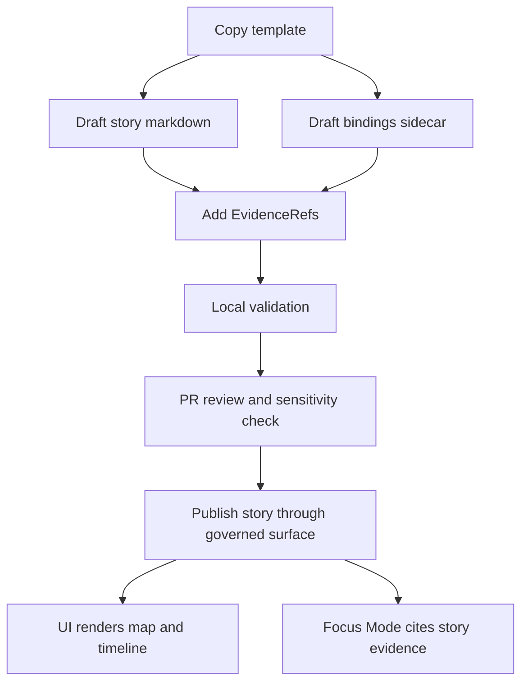

<!-- [KFM_META_BLOCK_V2]
doc_id: kfm://doc/1a027f37-cad6-4829-ae53-323c8af90519
title: Story templates
type: standard
version: v1
status: draft
owners: TBD
created: 2026-03-04
updated: 2026-03-04
policy_label: public
related: [../README.md, ../CONTRIBUTING.md, ../../templates/TEMPLATE__STORY_NODE_V3.md]
tags: [kfm, stories, templates]
notes: [Scaffolded README for story templates directory. Verify file names and update Template Registry.]
[/KFM_META_BLOCK_V2] -->

# Story templates
One-line purpose (PROPOSED): Reusable, governed templates for authoring KFM Stories (narrative Markdown + Story Node bindings) with provenance-first, cite-or-abstain behavior.

> **Status:** experimental (PROPOSED)  
> **Owners:** TBD (PROPOSED)  
> **Badges:**  
>      
> **Quick links:** [Scope](#scope) · [Where it fits](#where-it-fits) · [Inputs](#acceptable-inputs) · [Exclusions](#exclusions) · [Directory tree](#directory-tree) · [Quickstart](#quickstart) · [Usage](#usage) · [Diagram](#diagram) · [Template registry](#template-registry) · [Gate checklist](#gate-checklist) · [FAQ](#faq)

---

## Evidence discipline
**PROPOSED:** This README follows KFM “cite-or-abstain” authoring norms by tagging statements:

- **CONFIRMED:** design invariant described in KFM docs; safe to treat as “must not regress.”
- **PROPOSED:** recommended practice for this directory; adopt if it matches your repo layout.
- **UNKNOWN:** requires verification in the repo; a minimal verification step is listed.

---

## Scope
- **PROPOSED:** Provide copy/paste templates to create new Story content in a consistent, reviewable format.
- **PROPOSED:** Make it hard to publish a story that lacks citations, provenance references, or sensitivity handling.
- **PROPOSED:** Keep Story authoring additive and reversible (templates, checklists, and examples—not bespoke one-off formats).

---

## Where it fits
- **CONFIRMED:** KFM is designed as a pipeline–catalog–database–API–UI system, with governance and provenance as first-class requirements.
- **CONFIRMED:** UI and external clients should not access databases directly; access is via a governed API + policy boundary (“trust membrane”).
- **CONFIRMED:** Stories/Story Nodes and Focus Mode follow “cite-or-abstain” rules: every claim should resolve to evidence or the system narrows scope/abstains.

**PROPOSED:** In repo terms, this directory sits at:

`docs/stories/_templates/` → *author copies a template* → `docs/stories/<story_slug>/...` (draft/published story content) → *validators + review* → *Story appears in the UI and can be cited by Focus Mode.*

**UNKNOWN (verify):** whether your repo uses `docs/stories/**` or a v13-style `docs/reports/story_nodes/**` layout.  
- **Verification:** run `tree -L 3 docs/stories docs/reports/story_nodes 2>/dev/null`.

---

## Acceptable inputs
- **PROPOSED:** Markdown templates (`*.md`) for Story narratives and checklists.
- **PROPOSED:** JSON/YAML templates (`*.json`, `*.yaml`) for Story Node bindings (map state, timeline state, citations).
- **PROPOSED:** Small, repo-friendly helper assets that are template-scoped (e.g., tiny SVG icons, example JSON fragments).
- **CONFIRMED:** Evidence references should be expressible as resolvable IDs (e.g., `dcat://...`, `stac://...`, `prov://...`, `doc://...`) rather than raw “naked URLs.”

---

## Exclusions
- **PROPOSED:** No published story content here (templates only). Put real stories under the Story content directory (e.g., `docs/stories/<story_slug>/`).
- **PROPOSED:** No large binaries (videos, big rasters, PMTiles, etc.). Store those as governed artifacts in data zones and reference them via catalogs/EvidenceRefs.
- **PROPOSED:** No secrets (tokens, API keys). Ever.
- **CONFIRMED:** Avoid including sensitive coordinates or restricted location details in public Story templates; sensitivity must be handled via policy labels and redaction/generalization obligations.

---

## Directory tree
**UNKNOWN:** the actual filenames in this directory (update after verifying). The structure below is a *recommended minimum*.

```text
docs/stories/_templates/
├── README.md
├── TEMPLATE__STORY.md                    # PROPOSED: narrative markdown skeleton
├── TEMPLATE__STORY_NODE_BINDINGS.json    # PROPOSED: map/timeline/citation sidecar
├── TEMPLATE__STORY_ASSETS.md             # PROPOSED: asset credits + license notes
└── TEMPLATE__STORY_REVIEW_CHECKLIST.md   # PROPOSED: PR checklist (citations, sensitivity, QA)
```

**UNKNOWN (verify):**
- Do these files exist already?
- Is there an existing canonical Story Node template elsewhere (e.g., `docs/templates/TEMPLATE__STORY_NODE_V3.md`)?

**Verification (pseudocode):**
```bash
# pseudocode: adjust paths to your repo
ls -la docs/stories/_templates
rg -n "STORY_NODE" docs/templates docs/stories -S
```

---

## Quickstart
**PROPOSED:** Create a new story by copying templates into a new story slug directory.

```bash
# pseudocode: update template filenames to match this directory
mkdir -p docs/stories/<story_slug>/
cp docs/stories/_templates/TEMPLATE__STORY.md docs/stories/<story_slug>/story.md
cp docs/stories/_templates/TEMPLATE__STORY_NODE_BINDINGS.json docs/stories/<story_slug>/story.bindings.json
cp docs/stories/_templates/TEMPLATE__STORY_ASSETS.md docs/stories/<story_slug>/assets.md
```

**PROPOSED:** Fill in placeholders:
- `story.md`: narrative sections + citations
- `story.bindings.json`: map state per section + EvidenceRefs
- `assets.md`: credits + licensing notes for images/figures

**UNKNOWN (verify):** local validation commands.
- **Verification:** search `tools/validators/` and `Makefile` for “story” / “storynode” targets.

---

## Usage

### Template anatomy
- **PROPOSED:** `story.md` includes:
  - front matter (title, slug, summary, policy label, time range, spatial scope)
  - narrative sections
  - citation list (EvidenceRefs)
  - changelog (optional but recommended)

- **PROPOSED:** `story.bindings.json` includes:
  - section anchors (e.g., `#black-sunday-1935`) mapped to map view state
  - dataset version pins (preferred)
  - EvidenceRefs used by that section (so UI can open the Evidence Drawer)

### Evidence references
- **CONFIRMED:** Prefer EvidenceRefs that resolve through the evidence resolver instead of raw URLs.  
  Examples (illustrative only):
  - `dcat://dataset/<dataset_id>@<dataset_version_id>`
  - `stac://collection/<collection_id>/item/<item_id>#asset=<asset_key>`
  - `prov://run/<run_id>`
  - `doc://docs/stories/<story_slug>/story.md#<section>`

### Review posture
- **CONFIRMED:** Story contributions are intended to be reviewed for writing quality, citations, and sensitive content handling prior to publication/merge.
- **CONFIRMED:** CARE considerations apply: if a story touches indigenous knowledge or sensitive locations, permissions and sensitivity handling must be respected.

---

## Diagram
**PROPOSED:** Authoring + governance flow for stories.



---

## Template registry
**UNKNOWN:** Update this table to match the actual files in `docs/stories/_templates/`.

| Template file | Purpose | Output location | Required fields | Claim label | Verification |
|---|---|---|---|---|---|
| `TEMPLATE__STORY.md` | Narrative story skeleton | `docs/stories/<slug>/story.md` | title, summary, EvidenceRefs | PROPOSED | `test -f docs/stories/_templates/TEMPLATE__STORY.md` |
| `TEMPLATE__STORY_NODE_BINDINGS.json` | Map/timeline state + per-section citations | `docs/stories/<slug>/story.bindings.json` | section ids, view_state, EvidenceRefs | PROPOSED | `jq type ...` + schema validation |
| `TEMPLATE__STORY_ASSETS.md` | Asset credits + license notes | `docs/stories/<slug>/assets.md` | attribution, license, source | PROPOSED | reviewer checklist |
| `TEMPLATE__STORY_REVIEW_CHECKLIST.md` | PR checklist | PR description | citations resolve, sensitivity OK | PROPOSED | required in PR template |

---

## Gate checklist
**CONFIRMED:** KFM’s non-negotiables that apply to Story publishing:
- Trust membrane: UI uses governed APIs (no direct DB/storage access).
- Fail-closed policy on every request (data, Story Nodes, AI).
- Promotion gates and catalogs exist for data that stories reference.
- Cite-or-abstain with audit references.

**PROPOSED:** Story Definition of Done (DoD) for contributions using these templates:

### Evidence + provenance
- [ ] **CONFIRMED:** Every factual claim in the story is backed by a resolvable EvidenceRef, or the story explicitly labels the claim as uncertain.
- [ ] **CONFIRMED:** EvidenceRefs resolve to an EvidenceBundle (policy applied) via the evidence resolver.
- [ ] **PROPOSED:** Each story pins dataset versions when referencing datasets (avoid “floating latest”).
- [ ] **PROPOSED:** Story bindings include dataset_version_id (or equivalent) so UI can show version badges.

### Governance + sensitivity
- [ ] **CONFIRMED:** Sensitive locations are not exposed beyond policy allowances; public stories use generalized geometry or omit it.
- [ ] **CONFIRMED:** If indigenous knowledge or sensitive cultural material is involved, permissions and CARE review triggers are documented.
- [ ] **PROPOSED:** Story front matter declares a `policy_label` and intended audience.

### Repo hygiene
- [ ] **PROPOSED:** Story changes are small, reviewable, and additive (avoid sweeping rewrites).
- [ ] **PROPOSED:** Links are relative where possible; no broken links.
- [ ] **PROPOSED:** Any new structured files validate against schemas (JSON Schema / SHACL if applicable).

---

## FAQ

### Where do story images go?
- **CONFIRMED (design intent):** Store story images under something like `docs/stories/media/` or a per-story `assets/` folder, and capture attribution/licensing.

### How should the UI consume stories?
- **CONFIRMED (design intent):** Prefer serving story content through the backend API so policy and access control can be enforced (rather than the UI fetching raw files directly).

### What if evidence is restricted for my role?
- **CONFIRMED:** The system should abstain or offer policy-safe alternatives without leaking restricted existence; provide an audit reference for steward follow-up.

---

## Appendix
<details>
<summary>Template skeletons (copy/paste)</summary>

### `story.md` (PROPOSED)
```markdown
---
title: "TODO"
slug: "todo"
summary: "TODO"
policy_label: "public" # PROPOSED: public | restricted | sensitive-location
time_range: { start: "YYYY-MM-DD", end: "YYYY-MM-DD" } # PROPOSED
spatial_scope: "Kansas" # PROPOSED
evidence:
  - "dcat://dataset/TODO@TODO"
  - "doc://docs/stories/todo/story.md#intro"
---

# TODO Title

## Introduction

Write the narrative. Add inline citations like: (see EvidenceRef: dcat://dataset/TODO@TODO)

## Section 1

...

## Sources

- dcat://dataset/TODO@TODO
- stac://collection/TODO/item/TODO#asset=TODO
- prov://run/TODO
```

### `story.bindings.json` (PROPOSED)
```json
{
  "story_id": "todo",
  "version": "v1",
  "sections": [
    {
      "id": "introduction",
      "anchor": "#introduction",
      "view_state": {
        "bbox": [-102.05, 36.99, -94.59, 40.0],
        "time_window": ["1935-01-01", "1935-12-31"],
        "layers": ["todo_layer@dataset_version_id"]
      },
      "evidence": [
        "dcat://dataset/TODO@TODO",
        "stac://collection/TODO/item/TODO#asset=TODO"
      ]
    }
  ]
}
```

</details>

---

### Back to top
[Back to top](#story-templates)
