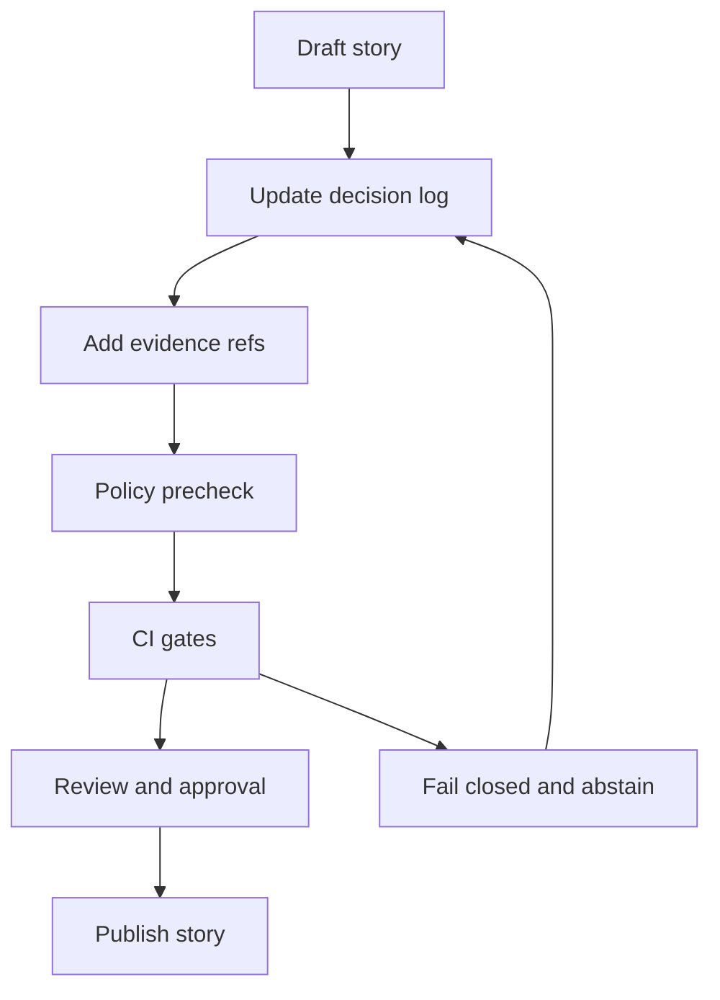

<!-- [KFM_META_BLOCK_V2]
doc_id: kfm://doc/<uuid>
title: Story Node v3 Decision Log — <Story title>
type: standard
version: v1
status: draft
owners: <team or names>
created: YYYY-MM-DD
updated: YYYY-MM-DD
policy_label: public|restricted|...
related:
  - kfm://story/<story_uuid>@<version_id>
  - doc://<path-to-story-markdown>
  - doc://<path-to-story-sidecar-json>
tags:
  - kfm
  - story-node
  - decision-log
notes:
  - Copy this template into each Story Node folder and keep it updated as decisions change.
[/KFM_META_BLOCK_V2] -->

# Story Node v3 Decision Log
Record the editorial, data, map, and governance decisions behind a Story Node v3 — with traceable evidence links and fail-closed publication gates.

> **Status:** template · **Owners:** `kfm:team:stories` (edit) · **Last updated:** YYYY-MM-DD  
> **Applies to:** Story Node v3 · **Policy label:** inherits Story Node · **Review:** per publish  
> **Badges (TODO):**     
> **Jump to:** [How to use](#how-to-use-this-template) · [Decision register](#decision-register) · [Decision entry template](#decision-entry-template) · [Publish gate checklist](#publish-gate-checklist) · [Appendix](#appendix)

---

## Scope
This log captures *why* we made choices while producing a Story Node (what we included, what we excluded, how we generalized, what policies applied, and what evidence supports those choices).

## Where it fits
Place this file alongside the Story Node v3 files:

- `story.md` (human narrative)
- `story.node.json` (sidecar metadata: map state, citations, policy, review)
- `decision_log.md` (this file — review/audit trail)

## Exclusions
- Do **not** paste secrets, API keys, credentials, or private URLs.
- Do **not** embed or imply precise directions to sensitive cultural locations (or any sensitive location). Keep language generalized and policy-aligned.
- Do **not** duplicate large evidence artifacts here. Link to evidence bundles, catalogs, and receipts.

---

## How to use this template

1. **Copy** this template into your Story Node folder as `decision_log.md`.
2. **Fill in MetaBlock** values at top (doc_id, owners, dates, policy_label, related).
3. **Create a decision register row** each time you make a material decision (data inclusion, redaction choice, narrative claim boundary, map layer configuration, etc.).
4. **Write a decision entry** with:
   - status label (**CONFIRMED / PROPOSED / UNKNOWN**),
   - evidence refs,
   - policy implications,
   - rollback plan.
5. **Before publishing**, complete the [Publish gate checklist](#publish-gate-checklist). If anything fails, **fail closed** (see [Abstain protocol](#abstain-protocol)).

---

## Decision register

Keep this table current. It is the “index” reviewers will scan first.

> Tip: keep IDs deterministic and sortable: `DEC-YYYYMMDD-01`, `DEC-YYYYMMDD-02`, …

| Decision ID | Date (UTC) | Category | Summary | Status (C/P/U) | Evidence refs (resolver-friendly) | Policy decision | Owner | Review |
|---|---:|---|---|---|---|---|---|---|
| DEC-YYYYMMDD-01 | YYYY-MM-DD | Data | Included dataset X, excluded Y | C | dcat://… · stac://… · prov://… | kfm://policy_decision/<id> | @name | needs_review |
| DEC-YYYYMMDD-02 | YYYY-MM-DD | Narrative | Reworded claim 2 to avoid overreach | P | doc://… | kfm://policy_decision/<id> | @name | pending |
| DEC-YYYYMMDD-03 | YYYY-MM-DD | Policy | Applied redaction profile R-2 | C | prov://… · evidence://… | kfm://policy_decision/<id> | @name | approved |

Legend: **C/P/U** = CONFIRMED / PROPOSED / UNKNOWN.

---

## Decision entry template

Copy/paste for each decision.

### DEC-YYYYMMDD-XX: <Short decision title>

**Status:** `CONFIRMED` | `PROPOSED` | `UNKNOWN`  
**Date:** YYYY-MM-DD  
**Owner:** <name/team>  
**Category:** Narrative | Data | Map | Policy | Governance | UX  
**Change type:** additive | breaking | reversible | irreversible  
**Related story:** `kfm://story/<story_uuid>@<version_id>`

#### What changed
- <One sentence about the change.>

#### Context
- <What problem are we solving, and why now?>

#### Options considered
1. **Option A:** <description>
2. **Option B:** <description>
3. **Option C:** <description>

#### Decision
- **We choose:** <Option X>
- **Decision summary (1–2 sentences):** <…>

#### Rationale
- <Why this choice vs alternatives?>
- <Trade-offs we accept>
- <Risks introduced and mitigations>

#### Evidence
List resolver-friendly references that support this decision or the constraints that shaped it.

- `dcat://…` (dataset catalog record)
- `stac://…` (STAC item/collection)
- `prov://…` (run receipt / PROV bundle)
- `doc://…` (governance doc, method spec, memo)
- `oci:…@sha256:…` (EvidenceBundle image digest)  
- `evidence/<bundle>/bundle.json` (filesystem EvidenceBundle)

> If **Status = UNKNOWN**, list the *minimum steps* to make it CONFIRMED (see below).

#### Policy and sensitivity impact
- **policy_label (intended):** public | restricted | …
- **sensitive_location_risk:** low | medium | high
- **pii_risk:** low | medium | high
- **redaction_profile:** public_default | <other>
- **obligations:** (if any)
  - <obligation 1>
  - <obligation 2>
- **Notes:** <what was generalized, thinned, coarsened, masked, or excluded?>

#### Consequences
**Positive**
- <…>

**Negative / limitations**
- <…>

#### Rollback plan
- <How do we undo or revise this decision safely?>
- <Which files/artifacts must change?>

#### Verification steps (required when status is UNKNOWN)
List *smallest possible* verification steps that turn UNKNOWN → CONFIRMED.

- [ ] <Step 1: e.g., generate EvidenceBundle for claim.002>
- [ ] <Step 2: e.g., add missing spec_hash to dataset catalog entry>
- [ ] <Step 3: e.g., rerun pipeline and attach run_receipt>

#### Sign-off
- **Requested reviewers:** <names/teams>
- **Approved by:** <name> (YYYY-MM-DD)  
- **Notes:** <optional>

---

## Publish gate checklist

Complete this checklist before setting the Story Node `review_state` to an “approved/publishable” value.

### Core gates
- [ ] Story Node sidecar includes **review_state** (not empty).
- [ ] All **citations** resolve via the Evidence Resolver (no broken `dcat://`, `stac://`, `prov://`, `doc://` refs).
- [ ] Every claim has an evidence reference (no “trust me” claims).
- [ ] All datasets referenced have valid **spec_hash** and **dataset_version_id**.
- [ ] Sensitivity and redaction profile are consistent with policy label (default-deny mindset).
- [ ] No content embeds or implies directions to sensitive locations (keep generalized).

### CI / local checks (example)
- [ ] `conftest test stories/**/story-node.json -p policy/rego` passes.
- [ ] Citation linkcheck (if available) passes.
- [ ] Any required redaction receipts are present and linked (if applicable).

---

## Abstain protocol

If any publish gate fails, fail closed.

1. Set Story Node status to `abstain` (or keep `draft`)  
2. Record the reasons and missing receipts  
3. Provide next actions

Example (adapt as needed):

```json
{
  "status": "abstain",
  "abstain_reason": [
    "claim.002 missing EvidenceBundle",
    "dataset catalog entry missing spec_hash"
  ],
  "missing_receipts": [
    "evidence/flood-risk-q1-2026/bundle.json",
    "data/catalog/stac/items/flood/risk/q1-2026.json"
  ],
  "next_actions": [
    "Ingest KDHE flood sample batch B",
    "Re-run transform with fixed schema; produce spec_hash"
  ]
}
```

---

## Decision flow diagram



---

## Appendix

<details>
<summary><strong>Citation formats and resolver-friendly refs</strong></summary>

Use references that the Evidence Resolver can resolve end-to-end (so reviewers and UI can open the evidence drawer):

- `doc://…` — internal docs (governed)
- `dcat://…` — dataset catalog record
- `stac://…` — STAC item/collection
- `prov://…` — provenance / run receipts
- `oci:…@sha256:…` — content-addressed EvidenceBundle reference

Keep raw URLs out of Story Node claims unless they are explicitly governed and stable.

</details>

<details>
<summary><strong>Status labels: CONFIRMED / PROPOSED / UNKNOWN</strong></summary>

- **CONFIRMED**: Evidence refs exist and resolve; policy implications documented; rollback understood.
- **PROPOSED**: Intended direction; evidence gathering or review still pending.
- **UNKNOWN**: We do not know yet. Must include minimal verification steps to become CONFIRMED.

</details>

---

## Changelog

- YYYY-MM-DD — Template copied into story folder
- YYYY-MM-DD — <Brief note about meaningful updates>

---

[Back to top](#story-node-v3-decision-log)
