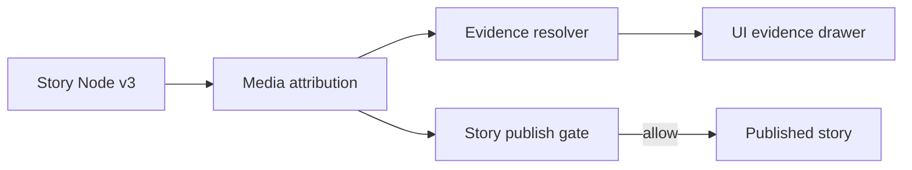

<!-- [KFM_META_BLOCK_V2]
doc_id: kfm://doc/907c8b38-7608-44b1-a927-e7035068a18b
title: Story Node v3 Media Attribution Template
type: standard
version: v1
status: draft
owners: KFM
created: 2026-03-04
updated: 2026-03-04
policy_label: public
related: [docs/stories/_templates/story_node_v3/]
tags: [kfm, stories, story_node_v3, media, attribution, licensing, provenance]
notes: [Copy this template into a story node folder and fill one block per media asset.]
[/KFM_META_BLOCK_V2] -->

# Media attribution template for Story Node v3
Capture **rights/licensing, provenance, and credit** for every media asset used in a Story Node v3 so publishing can fail-closed on missing rights or missing evidence.

> **Use this file:** Copy into your Story Node v3 folder (or paste blocks into your story node narrative) and fill **one “Media Asset Attribution” block per asset**.

---

## Impact
- **Status:** experimental (template)
- **Owners:** `@kfm-stewards` (TBD)
- **Applies to:** Story Node v3 media (`image`, `video`, `audio`, `document scans`, `map renders`, `charts`)
- **Primary risk controlled:** licensing violations + non-resolvable evidence
- **Publish posture:** fail-closed (missing required fields ⇒ do not publish)

**Quick links**
- [Template block](#template-media-asset-attribution-block)
- [Validation checklist](#validation-checklist-publish-gate)
- [License edge-cases](#license-edge-cases)

---

## Where it fits


---

## Evidence discipline
This template mixes **hard requirements** and **recommended practices**.

- **CONFIRMED:** Story Node v3 publishing requires `review_state` and **resolvable citations** (citations open the evidence drawer).  
  _Implication:_ media assets must also be attributable and traceable, or the same class of failure occurs at publish time.

- **CONFIRMED:** Licensing violation (unlicensed media mirrored) is a tracked system risk; mitigation includes a gate that requires **rights metadata** and steward review when needed.  

- **PROPOSED:** Treat *all story media* as governed artifacts: store a digest, license/attribution fields, and a link to source/evidence.

- **UNKNOWN (verify):** Exact Story Node v3 schema field names for media blocks.  
  _Smallest verification step:_ open `contracts/schemas/story_node_v3.schema.json` and align the `kfm_media` block keys below to the schema.

---

## Acceptable inputs
- Source page URL (or archive/catalog permalink) for the media item.
- Creator / publisher / provider (person or org).
- Capture/publication date (or an explicit `UNKNOWN`).
- License identifier + license URL or terms reference.
- Local or remote asset link (`href`) plus an integrity digest (recommended: `sha256`).
- If derived (e.g., map render, cropped photo, chart), a description of transforms and the upstream evidence/dataset reference.

## Exclusions
- **Do not** include media with unknown/uncleared rights in public stories (mark `policy_label: restricted` and escalate for governance review).
- **Do not** embed sensitive precise locations (e.g., endangered species nests, archaeological sites) unless policy permits; use generalized derivatives and record a redaction receipt.
- **Do not** rely on “it’s on the internet” as a license.

---

# Template: Media Asset Attribution block

> Copy/paste **one block per asset**. Keep the YAML block machine-readable.

## Media asset
- **media_id:** `media.<slug>` (stable within the story)
- **role:** `cover | inline | figure | table | map_render | audio | video | document_scan | other`
- **href:** `./media/<filename>` (preferred) **or** canonical remote URL
- **media_type:** e.g. `image/png`, `image/jpeg`, `video/mp4`, `audio/mpeg`, `application/pdf`

### YAML record (kfm_media_attribution_v1)
```yaml
kfm_media_attribution_version: v1

media_id: "media.<slug>"
role: "inline"

# Where the bytes are
href: "./media/<filename.ext>"  # repo-relative preferred
media_type: "image/png"
digest:
  alg: "sha256"
  value: "sha256:<hex>"          # REQUIRED if bytes are stored in-repo
  computed_at: "YYYY-MM-DD"      # when digest was computed

# Human-facing display
title: "<title or short label>"
caption: "<caption shown in story>"               # REQUIRED if displayed
alt_text: "<alt text for accessibility>"          # REQUIRED for images

# Source + provenance (who/where/when)
source:
  source_name: "<archive/site/org name>"          # e.g., 'Kansas Memory'
  source_url: "<canonical permalink>"             # REQUIRED (or 'UNKNOWN')
  retrieved_at: "YYYY-MM-DD"                      # REQUIRED for web sources
  creator: "<person or org>"                      # REQUIRED (or 'UNKNOWN')
  publisher: "<org>"                              # optional
  created_at: "YYYY-MM-DD"                        # original capture/pub date, or 'UNKNOWN'
  description: "<optional notes about the item>"

# Rights + license
rights:
  # Use SPDX identifiers when possible (e.g., CC-BY-4.0, CC0-1.0, ODbL-1.0, US-PD)
  license_spdx: "<SPDX or 'PROVIDER-SPECIFIC' or 'UNKNOWN'>"
  license_url: "<license/terms URL>"              # REQUIRED unless US-PD (still recommended)
  attribution_required: true                      # REQUIRED
  attribution_text: "<exact credit line to display>"  # REQUIRED if attribution_required
  copyright_status: "copyrighted | public-domain | unknown"
  usage_constraints: "<short plain-English constraints>"  # REQUIRED if non-standard terms
  permissions_ref: "<ticket/email ref if permission obtained>"  # optional

# Derivation (what did we do to it?)
derivation:
  is_derivative: false
  derived_from:
    - "<evidence_ref or source artifact id>"      # REQUIRED if is_derivative=true
  transforms:
    - "<e.g., crop, resize, color-correct, georeference, annotate>"  # REQUIRED if is_derivative=true
  tools:
    - "<tool@version>"                           # recommended if automated
  run_ref: "<kfm://run/...>"                      # recommended if automated

# Evidence + catalog cross-links (make citations resolvable)
evidence:
  # One of these SHOULD be present if the asset is based on governed data:
  evidence_refs:
    - "<kfm://evidence/...#artifact=...>"         # preferred when available
  catalog_refs:
    - "<stac://...>"
    - "<dcat://...>"
    - "<prov://...>"

# Governance + sensitivity
policy:
  policy_label: "public | restricted | sensitive-location | pii | unknown"
  sensitivity_notes: "<what could be sensitive here and why>"
  redaction_profile: "<id or 'none'>"
  redaction_receipt_ref: "<kfm://audit/... or path to receipt.json>" # REQUIRED if redacted
  review_required: false
  reviewer: "<principal id>"                      # optional
  reviewed_at: "YYYY-MM-DD"                       # optional
```

---

## Validation checklist (publish gate)
Mark each box **CONFIRMED** / **UNKNOWN** as you fill. If any required item is UNKNOWN and the story is intended for public publishing, treat as **fail-closed**.

### Required for every in-repo asset
- [ ] **CONFIRMED:** `media_id`, `role`, `href`, `media_type`
- [ ] **CONFIRMED:** `digest.sha256` present and matches the bytes
- [ ] **CONFIRMED:** `title`, `caption` (if shown), `alt_text` (for images)
- [ ] **CONFIRMED:** `source.source_url` (or explicit `UNKNOWN` + follow-up task)
- [ ] **CONFIRMED:** `rights.license_spdx` (or `PROVIDER-SPECIFIC`) and `license_url`/terms reference
- [ ] **CONFIRMED:** `rights.attribution_required` + `rights.attribution_text` when required
- [ ] **CONFIRMED:** `policy.policy_label` set (default-deny if unknown)
- [ ] **CONFIRMED:** If redacted, `redaction_receipt_ref` exists and is linked

### Required when derivative
- [ ] **CONFIRMED:** `derivation.is_derivative=true` and `derived_from[]` populated
- [ ] **CONFIRMED:** `transforms[]` lists material edits (crop, annotate, etc.)
- [ ] **PROPOSED:** `tools[]` and `run_ref` recorded for automated renders (reproducibility)

---

## License edge-cases
### Screenshots / renders from proprietary map platforms
- **CONFIRMED:** Some platforms (example: Google Earth) impose usage restrictions; screenshots and videos may require specific attribution and can restrict commercial use. Treat as `license_spdx: PROVIDER-SPECIFIC` unless you have an explicit compatible license grant.

### OpenStreetMap
- **CONFIRMED:** OSM data is ODbL; attribution is required and license obligations propagate to derived databases. Use `license_spdx: ODbL-1.0` and an attribution string like “© OpenStreetMap contributors” (plus any additional required notices).

### U.S. Government public domain
- **PROPOSED:** Use `license_spdx: US-PD` when clearly public-domain, but still record `source_name` and `source_url` for provenance.

### Provider-specific terms
- **PROPOSED:** Store the provider’s exact “Terms of Use” text (or a normalized summary) in a dedicated file and reference it from `rights.license_url` or `rights.usage_constraints`.

---

## Appendix: Example credit lines
<details>
<summary>Examples (copy/paste)</summary>

**CC-BY 4.0 photo**  
- `license_spdx: CC-BY-4.0`  
- `attribution_text: "Photo by <Creator> (<Source>), licensed CC BY 4.0"`

**ODbL basemap (OSM)**  
- `license_spdx: ODbL-1.0`  
- `attribution_text: "© OpenStreetMap contributors"`

**Provider-specific screenshot**  
- `license_spdx: PROVIDER-SPECIFIC`  
- `attribution_text: "<Provider-required text as shown in export overlay>"`  
- `usage_constraints: "Use restricted by provider terms; do not redistribute raw imagery."`

</details>

---

## Back to top
[Back to top](#media-attribution-template-for-story-node-v3)
