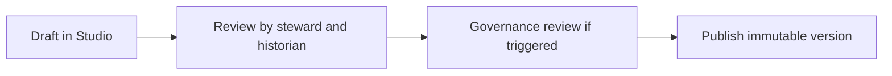

<!-- [KFM_META_BLOCK_V2]
doc_id: kfm://doc/656429a9-6598-487a-82c3-0685bdeb020f
title: Story Node v3 Review Checklist
type: standard
version: v1
status: draft
owners:
  - KFM Story Ops (TBD)
  - FAIR+CARE Council (TBD)
created: 2026-03-04
updated: 2026-03-04
policy_label: public
related:
  - docs/stories/_templates/story_node_v3/
tags:
  - kfm
  - stories
  - story_node_v3
  - review
  - checklist
notes:
  - Template checklist for the Story Node v3 author/reviewer workflow.
[/KFM_META_BLOCK_V2] -->

# Story Node v3 Review Checklist
One-page checklist to move a Story Node from **draft → reviewed → published**, without breaking **cite-or-abstain** and policy gates.

## Where it fits
- Used during the **Story Node v3** workflow: **Draft → Review → Governance Review (when triggered) → Publish**.
- Applies to the pair of artifacts:
  - **Story markdown** (human-readable narrative + inline citations)
  - **Sidecar JSON** (machine metadata: map state, citations, policy label, review state)

## Legend
- **[CONFIRMED]** documented KFM requirement (treat as *fail-closed* if unmet).
- **[PROPOSED]** documented direction / recommended practice (adopt unless governance overrides).
- **[UNKNOWN]** repo-specific: verify in the current implementation (see “Verify UNKNOWNs”).

## Workflow

## Stop-ship gates
If any of these are true, **do not publish** (fail closed):
- [ ] **[CONFIRMED]** Any citation does not resolve via the Evidence Resolver.
- [ ] **[CONFIRMED]** Rights/licensing are unclear for any included or embedded media.
- [ ] **[CONFIRMED]** Sensitive locations are included without explicit policy approval.

---

## Checklist

### 1) Files and IDs
- [ ] **[CONFIRMED]** Story has two artifacts:
  - `*.md` narrative markdown with MetaBlock (**no YAML frontmatter**)
  - `*.json` sidecar containing `map_state`, `citations`, `policy_label`, and `review_state`
- [ ] **[CONFIRMED]** MetaBlock is present and includes (at minimum):
  - stable `doc_id` (do not regenerate on edits)
  - `type: story`
  - `version: v3`
  - `status` set appropriately (`draft`, `review`, or `published`)
  - `policy_label` assigned
- [ ] **[CONFIRMED]** Sidecar includes (at minimum):
  - `"kfm_story_node_version": "v3"`
  - `"story_id": "kfm://story/<uuid>"`
  - `"version_id": "v<id>"`
  - `"status"`, `"policy_label"`, `"review_state"`
- [ ] **[UNKNOWN]** Story markdown + sidecar validate against the repo’s schema/contract (if present).
  - Expected schema (per plan): `contracts/schemas/story_node_v3.schema.json`

### 2) Map state and replayability
- [ ] **[CONFIRMED]** Sidecar `map_state` includes at minimum:
  - camera view (`bbox`, `zoom`)
  - active layers (each with `layer_id` and `dataset_version_id`)
  - time window (`start`, `end`)
  - filter state (if any)
- [ ] **[PROPOSED]** Any non-default *style parameters* are captured (so the story is replayable exactly).
- [ ] **[PROPOSED]** Map view does not reveal restricted geometry (generalize or omit as required by policy).

### 3) Claims and narrative quality
- [ ] **[PROPOSED]** Story declares scope: time window + geography.
- [ ] **[PROPOSED]** Observation claims are clearly separated from interpretive claims.
- [ ] **[PROPOSED]** Uncertainty is explicit where sources conflict or evidence is incomplete.
- [ ] **[CONFIRMED]** Narrative drift protections are applied:
  - unverified claims are not allowed to become “canon”
  - citations actually support the claims they are attached to
  - interpretive framing is not presented as fact
  - contested topics trigger heightened review

### 4) Citations and evidence resolution
- [ ] **[CONFIRMED]** Every citation is an **EvidenceRef** (not a pasted URL).
- [ ] **[CONFIRMED]** EvidenceRef schemes follow documented patterns (examples):
  - `dcat://<dataset_slug>@<dataset_version_id>`
  - `stac://<collection_id>/items/<item_id>`
  - `prov://<run_id>`
  - `doc://sha256:<doc_digest>#page=<n>&span=<start>:<end>`
- [ ] **[CONFIRMED]** EvidenceRefs are:
  - parseable without network calls
  - stable (include `dataset_version_id` where applicable)
- [ ] **[CONFIRMED]** Doc citations include page number and a stable text span (no `page=unknown` placeholders).
- [ ] **[CONFIRMED]** No “uncited features”:
  - if a map feature is referenced, it must carry evidence (directly or via dataset/run provenance)
- [ ] **[CONFIRMED]** CI / publish gate behavior:
  - merge/publish is blocked if citations fail to resolve.

### 5) Evidence bundle inspection
For at least one representative citation per dataset used (and for any “key claim” citations):
- [ ] **[CONFIRMED]** EvidenceBundle shows (or contains) at minimum:
  - `bundle_id` digest
  - `dataset_version_id`
  - license + attribution / rights holder
  - freshness + validation status (when available)
  - provenance chain / run_id(s)
  - policy decision (allow/deny) + obligations
  - redactions applied (if any)
- [ ] **[CONFIRMED]** Evidence drawer is reachable from story citations (click + keyboard) and is keyboard navigable.
- [ ] **[CONFIRMED]** Artifact links in EvidenceBundle are only present when policy allows.

### 6) Rights, licensing, and attribution
- [ ] **[CONFIRMED]** Story publishing gate blocks if rights are unclear for included media.
- [ ] **[PROPOSED]** Every embedded media element (images, figures, quoted tables) has:
  - an identified license (SPDX where possible)
  - attribution text captured
- [ ] **[CONFIRMED]** If the UI supports exporting/sharing, it must include attribution + license text automatically.

### 7) Sensitivity, sovereignty, and governance triggers
- [ ] **[CONFIRMED]** Sensitive locations are not published precisely unless policy explicitly allows.
- [ ] **[CONFIRMED]** If permissions are unclear, fail closed and route to governance review.
- [ ] **[PROPOSED]** Governance review is triggered when the story touches:
  - Indigenous histories
  - restricted sites
  - sensitive locations
- [ ] **[CONFIRMED]** Cultural sensitivity and Indigenous data sovereignty practices:
  - do not publish precise locations for culturally sensitive sites
  - allow community-controlled policy labels and release criteria
  - prefer `public_generalized` derivatives for public narratives
  - provide narrative context that respects community perspectives and avoids appropriation

### 8) Security, rendering safety, and accessibility
- [ ] **[CONFIRMED]** Markdown rendering is safe (no raw HTML/script injection).
- [ ] **[CONFIRMED]** Evidence drawer + policy badges:
  - have text labels / ARIA labels (as applicable)
  - are keyboard navigable
- [ ] **[PROPOSED]** All images include meaningful alt text.

### 9) Publication and versioning
- [ ] **[PROPOSED]** “Publish” produces an immutable story version; edits create a new `version_id`.
- [ ] **[UNKNOWN]** Repo release process captures:
  - changelog / “what changed”
  - approvals / signoffs
  - audit reference for the publish event

---

## Reviewer sign-off
| Role | Reviewer | Date | Outcome | Notes |
|---|---|---|---|---|
| Contributor |  |  |  |  |
| Steward |  |  |  |  |
| Historian / Editor |  |  |  |  |
| Governance (if triggered) |  |  |  |  |

## Verify UNKNOWNs
Minimal verification steps to turn **UNKNOWN** into **CONFIRMED** in this repo:
1. Locate the Story Node v3 schema/contract (expected path: `contracts/schemas/story_node_v3.schema.json`) and record:
   - allowed `review_state` values
   - required sidecar keys
2. Identify CI jobs that run for Story Nodes and record the exact commands for:
   - markdown protocol / lint
   - citation linting + evidence resolution checks
   - schema validation
3. Confirm the file naming convention for sidecars (`*.sidecar.json`, `*.json`, etc.) and update this checklist accordingly.

## References
- KFM Definitive Design & Governance Guide (vNext): Story Node standards, review workflow, EvidenceRef & evidence drawer requirements, Appendix E (Story Node v3 template).
- Tooling the KFM pipeline: evidence resolution contract + “publishing requires review state + resolvable citations”.
