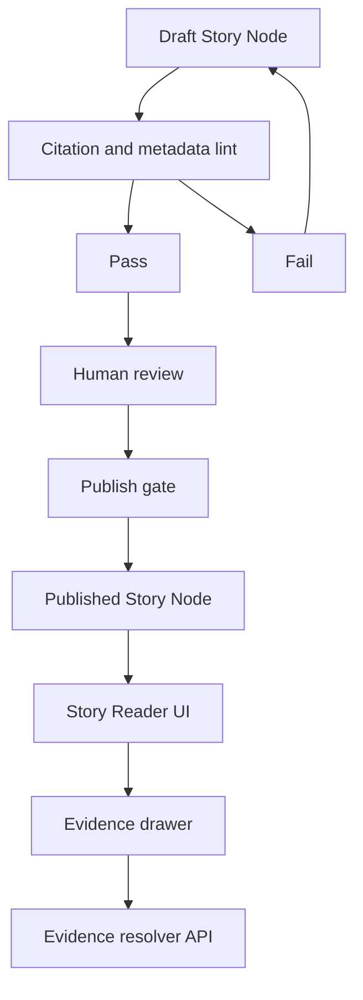

<!-- [KFM_META_BLOCK_V2]
doc_id: kfm://doc/5b902b4c-1b3c-4d31-bf64-5e0f7f4c0c3d
title: Story Drafts README
type: standard
version: v1
status: draft
owners: TBD
created: 2026-03-04
updated: 2026-03-04
policy_label: restricted
related:
  - docs/templates/
  - docs/governance/
  - docs/stories/published/
tags: [kfm, stories, story-nodes, draft, governance]
notes:
  - Draft workspace for Story Nodes; promotion requires review + resolvable EvidenceRefs.
[/KFM_META_BLOCK_V2] -->

# KFM Story Drafts
Work-in-progress **Story Node** drafts (narrative + map/timeline intent + EvidenceRefs) that are **not yet publishable**.

> **Status:** draft (work-in-progress)  
> **Owners:** TBD  
> **Policy:** default to `restricted` until reviewed  
> **Badges (TODO):**     
>
> **Quick links:**  
> [Scope](#scope) · [Where it fits](#where-it-fits) · [Inputs](#acceptable-inputs) · [Exclusions](#exclusions) · [Directory tree](#directory-tree) · [Quickstart](#quickstart) · [Story draft rules](#story-draft-rules) · [Gates](#definition-of-done-and-gates) · [FAQ](#faq)

---

## Scope

- **[CONFIRMED]** This directory is a **draft workspace** for Story Nodes that may eventually be promoted to a publishable story surface (e.g., Story Reader UI).  
- **[CONFIRMED]** Draft stories must follow **cite-or-abstain**: when evidence is missing, mark the claim as `UNKNOWN` and provide verification steps instead of inventing details.  
- **[PROPOSED]** Drafts here are treated as **internal/restricted** by default, because review and redaction obligations may not yet be complete.

([Back to top](#kfm-story-drafts))

---

## Where it fits

- **[CONFIRMED]** KFM is designed with a **trust membrane**: user-facing UI/clients do not access storage directly; access is mediated by governed APIs + policy checks. Draft story work should not bypass that boundary.  
- **[CONFIRMED]** KFM uses **fail-closed** gates for Story Nodes and AI outputs: if citations can’t be verified, the system must narrow scope or abstain.  
- **[PROPOSED]** Typical flow:
  - Upstream: **governed datasets** (Raw → Work → Processed) and evidence resolver infrastructure.
  - This folder: **human- and/or AI-assisted** narrative drafting + review prep.
  - Downstream: story publishing gate, Story Reader rendering, evidence drawer linking.

> **[UNKNOWN]** Canonical path naming: some KFM docs reference `docs/reports/story_nodes/` as the story content home.  
> **Smallest verification step:** search the repo for `story_node_v3` schema + existing story directories and align this folder with the canonical structure.

([Back to top](#kfm-story-drafts))

---

## Acceptable inputs

- **[CONFIRMED]** Markdown drafts that are intended to become **Story Nodes**, with:
  - explicit claim labeling (`CONFIRMED / PROPOSED / UNKNOWN`)
  - EvidenceRefs (not raw URLs) for every factual claim intended to be treated as confirmed  
- **[CONFIRMED]** Small supporting assets that are strictly **story-level** (images, diagrams, small excerpts), **only when rights metadata is known**.
- **[PROPOSED]** Sidecar map/timeline state snapshots (JSON) that can later be used by the Story Reader to restore view state.

([Back to top](#kfm-story-drafts))

---

## Exclusions

- **[CONFIRMED]** No raw datasets, processed datasets, or pipeline outputs belong here (those live in governed data zones + catalogs).  
- **[CONFIRMED]** No “free-floating” story facts: if evidence does not exist, do not present the content as confirmed.  
- **[CONFIRMED]** No sensitive-location leakage (e.g., protected archaeological sites/species): if uncertain, treat as restricted and escalate to governance review.  
- **[CONFIRMED]** No secrets (API keys, tokens) — ever.  
- **[CONFIRMED]** No unlicensed media; if rights are unclear, use metadata-only placeholders and mark as `UNKNOWN`.

([Back to top](#kfm-story-drafts))

---

## Directory tree

> **[PROPOSED]** Recommended layout (adjust to match actual repo conventions):

```text
docs/stories/
├── draft/
│   ├── README.md
│   ├── <story_slug>/
│   │   ├── story.md
│   │   ├── story.sidecar.json          # map/timeline intent, citations index (optional)
│   │   └── assets/
│   │       ├── images/
│   │       └── excerpts/
│   └── _shared/                        # optional shared draft-only fragments
└── published/
    └── <story_slug>/
        ├── story.md
        └── assets/
```

([Back to top](#kfm-story-drafts))

---

## Quickstart

### 1) Create a new draft folder (runnable)

```bash
slug="my-story-slug"
mkdir -p "docs/stories/draft/${slug}/assets/images"
mkdir -p "docs/stories/draft/${slug}/assets/excerpts"
```

### 2) Create `story.md` (minimal skeleton)

> **Tip:** keep drafts readable to humans **and** machine-checkable later.

```bash
cat > "docs/stories/draft/${slug}/story.md" <<'MD'
<!-- [KFM_META_BLOCK_V2]
doc_id: kfm://doc/TBD
title: TBD Story Title
type: standard
version: v0
status: draft
owners: TBD
created: 2026-03-04
updated: 2026-03-04
policy_label: restricted
related: []
tags: [kfm, story-node, draft]
notes: []
[/KFM_META_BLOCK_V2] -->

# TBD Story Title

## Claims

- [UNKNOWN] Replace with your first claim.
  - Why unknown: no evidence captured yet.
  - Smallest verification step: add an EvidenceRef that resolves to an evidence bundle.

## EvidenceRefs

- TBD: doc://... or dcat://... or stac://... or prov://...
MD
```

### 3) Optional: copy a Story Node template (PSEUDOCODE)

```bash
# PSEUDOCODE (only if your repo includes this template):
# cp docs/templates/TEMPLATE__STORY_NODE_V3.md "docs/stories/draft/${slug}/story.md"
```

([Back to top](#kfm-story-drafts))

---

## Story draft rules

### Evidence discipline: claim labels

Use these prefixes for **every meaningful claim**:

| Label | Meaning in drafts | What to do next |
|---|---|---|
| `CONFIRMED` | Supported by resolvable EvidenceRefs (or an explicitly cited governed artifact) | Keep the citation stable and inspectable |
| `PROPOSED` | A design idea, hypothesis, interpretation, or draft narrative choice | State assumptions; list what would confirm it |
| `UNKNOWN` | Not supported yet | Write the smallest verification steps to make it confirmed |

### EvidenceRefs, not URLs

- **[CONFIRMED]** A “citation” in KFM is designed to be an **EvidenceRef** that resolves to an **EvidenceBundle** with provenance, rights, and policy obligations — not a pasted URL.  
- **[CONFIRMED]** EvidenceRefs should be stable and parseable (examples include `dcat://`, `stac://`, `prov://`, `doc://`).

> **[PROPOSED]** Minimum “good draft” requirement: every `CONFIRMED` claim has at least one resolvable EvidenceRef.

([Back to top](#kfm-story-drafts))

---

## Lifecycle



([Back to top](#kfm-story-drafts))

---

## Definition of done and gates

### Draft-ready checklist (local)

- [ ] Story has a unique `doc_id` and basic metadata (MetaBlock).
- [ ] Every factual claim is labeled `CONFIRMED / PROPOSED / UNKNOWN`.
- [ ] Every `CONFIRMED` claim has EvidenceRefs (not bare URLs).
- [ ] Any sensitive locations are generalized/redacted or marked for governance review.
- [ ] Rights status is captured for every included media asset (or media removed).

### Publish-ready checklist (governed)

- **[CONFIRMED]** Publishing requires review state + resolvable citations; if citations fail to resolve, publishing/merge must be blocked (fail-closed).  
- **[CONFIRMED]** CI should validate EvidenceRef syntax + resolver success + policy allowance + rights metadata completeness.

([Back to top](#kfm-story-drafts))

---

## AI assistance rules

- **[PROPOSED] Allowed:** summarize, structure extraction, translation, keyword indexing.
- **[CONFIRMED] Prohibited:** generating new policy, inferring or targeting sensitive locations, or “filling gaps” without evidence.
- **[CONFIRMED]** If an AI system drafts story content, it must remain source-bound and be reviewed by humans before publication.

([Back to top](#kfm-story-drafts))

---

## FAQ

### Why do I have to label claims?
Because KFM’s governing principle is **cite-or-abstain**. Draft stories are a place to explore, but anything presented as confirmed must be traceable to evidence.

### What if I only have partial evidence?
Mark the supported portion as `CONFIRMED` and the rest as `UNKNOWN` with concrete verification steps. Partial answers are acceptable; invented detail is not.

### I found a conflict between docs on where story nodes live
Treat it as `UNKNOWN` and reconcile by inspecting the repo’s canonical paths (schemas/templates + existing story directories). Update this README to match the canonical choice.

([Back to top](#kfm-story-drafts))

---

<details>
<summary>Appendix: EvidenceRef examples (reference only)</summary>

> These are illustrative. Use the project’s canonical resolver + schemas.

- `doc://sha256:<digest>#page=<n>&span=<start>:<end>`
- `dcat://<dataset_id>@<dataset_version_id>`
- `stac://<collection_id>#asset=<asset_id>`
- `prov://<activity_id>`

</details>
