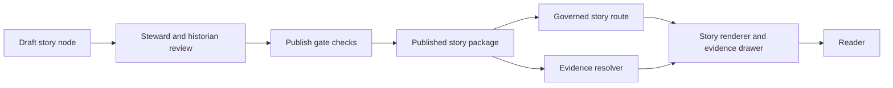

<!-- [KFM_META_BLOCK_V2]
doc_id: kfm://doc/9a33b6b0-7b4f-4d1b-9a95-77f0c1e6a4a7
title: Published Stories
type: standard
version: v1
status: published
owners: [TODO: KFM Story Stewards]
created: 2026-03-04
updated: 2026-03-04
policy_label: public
related: [
  ../../governance/ROOT_GOVERNANCE.md,
  ../../governance/ETHICS.md,
  ../../governance/SOVEREIGNTY.md,
  ../../../schemas/storynodes/,
  ../../../schemas/ui/
]
tags: [kfm, stories, story-nodes, published]
notes: [
  "Directory README for published Story Nodes.",
  "Anything committed here is assumed user-facing and must pass publish gates."
]
[/KFM_META_BLOCK_V2] -->

<a id="top"></a>

# Published Stories
Review-approved **Story Nodes** (narrative + map state + citations) that are eligible to ship in the KFM Story UI.

> **Status:** active  
> **Owners:** TODO (Steward + Historian/Editor)  
> **Change control:** PR + publish gate (citations must resolve; policy must allow)  
> **Default posture:** public-safe content only (no sensitive-location leakage; no rights ambiguity)

[](#published-stories)
[](#story-package-contract)
[](#safety-and-sensitivity)
[](#citations-and-evidence)

**Quick nav:** [Scope](#scope) · [Where it fits](#where-it-fits-in-kfm) · [Acceptable inputs](#acceptable-inputs) · [Exclusions](#exclusions) · [Directory tree](#directory-tree) · [Quickstart](#quickstart) · [Usage](#usage) · [Diagram](#diagram) · [Tables](#tables) · [Publish gate checklist](#publish-gate-checklist) · [FAQ](#faq) · [Appendix](#appendix)

---

## Scope
This folder contains **published** Story Nodes only.

“Published” means:
- The Story Node has a **completed narrative** (`.md`) and a **sidecar JSON** capturing map state + citations.
- Review state is recorded, and publication gates have been satisfied (see [Publish gate checklist](#publish-gate-checklist)).

## Where it fits in KFM
Stories are a **governed output surface**. They sit *after* the evidence and policy layers in the KFM pipeline:

- Upstream: ETL → catalogs (STAC/DCAT/PROV) → graph → governed APIs
- Downstream: UI story renderer + evidence drawer + (optionally) Focus Mode Q&A

> IMPORTANT: Story Nodes must never “invent” evidence. Every factual claim must be traceable to resolvable evidence.

### Repository layout note
Some KFM layouts (e.g., “v13”) place Story Nodes under:

- `docs/reports/story_nodes/published/`

If your repo follows that structure, treat `docs/stories/published/` as a compatibility location only and **pick one canonical home** (avoid drift).

## Acceptable inputs
What belongs here:

- ✅ A Story Node package that has passed review and publish gates:
  - Narrative markdown (human readable)
  - Sidecar JSON (map state, citations, policy label, review state)
- ✅ Assets used by the story (images/figures) **with explicit license/attribution** recorded in the story (and/or an asset sidecar, if your governance requires it)
- ✅ Small helper files that improve rendering (e.g., thumbnails), **if** they are clearly referenced by the story and have rights metadata

## Exclusions
What must **not** go here (and where instead):

- ❌ Draft or “needs_review” stories → put in a draft area (repo-dependent; commonly `docs/stories/draft/` or `docs/reports/story_nodes/draft/`)
- ❌ Raw datasets, extracts, or pipeline artifacts → put under `data/` and catalog them (STAC/DCAT/PROV)
- ❌ Unlicensed or rights-ambiguous media (even if “found online”) → don’t publish; obtain permission or use metadata-only references
- ❌ Precise sensitive locations, culturally restricted knowledge, PII, secrets → requires governance review and a restricted handling path (do not publish here)

---

## Directory tree
Expected structure (recommended):

```text
docs/
└── stories/
    └── published/
        ├── README.md
        └── <story_slug>/
            ├── story.md
            ├── story.node.json
            └── assets/
                ├── <image-or-figure>.<png|jpg|svg>
                └── (optional) <asset>.meta.json
```

Notes:
- Prefer one folder per story slug to keep assets and narrative tightly coupled.
- Use stable filenames once linked in markdown.

---

## Quickstart
Minimal, repo-agnostic commands to sanity-check a story package.

### 1) Validate sidecar JSON parses
```bash
# Replace <story_slug> with an actual folder name
python -m json.tool "docs/stories/published/<story_slug>/story.node.json" > /dev/null
```

### 2) Bulk-check all JSON under published
```bash
python - <<'PY'
import json
from pathlib import Path

root = Path("docs/stories/published")
bad = []
for p in root.rglob("*.json"):
    try:
        json.loads(p.read_text(encoding="utf-8"))
    except Exception as e:
        bad.append((str(p), str(e)))

if bad:
    print("Invalid JSON files:")
    for path, err in bad:
        print(f"- {path}: {err}")
    raise SystemExit(1)

print("OK: all JSON files parse.")
PY
```

### 3) Run your repo’s Story Node validators (if present)
```bash
# PSEUDOCODE: replace with actual repo scripts/targets
# Examples might include schema validation, linkcheck, and evidence-resolve checks.
make validate-stories
# or
npm run validate:stories
# or
python -m tools.story.validate docs/stories/published/<story_slug>
```

---

## Usage

### Add a new published story
1. Create (or migrate) the Story Node package under `docs/stories/published/<story_slug>/`.
2. Ensure the markdown includes a KFM MetaBlock and that the sidecar JSON contains required keys (see [Tables](#tables)).
3. Ensure every citation is an **EvidenceRef** that can resolve through the evidence resolver.
4. Open a PR; reviewers check:
   - historical accuracy + writing quality
   - citations resolve
   - sensitivity/risk
   - media rights
5. Merge only after gates pass.

### Edit an existing published story
Rules of thumb:
- Keep `story_id` stable.
- Bump `version_id` when claims change materially.
- Update the MetaBlock `updated:` date and the sidecar `status/review_state` if your workflow requires re-review.

### Citations and evidence
In KFM, a “citation” is not a pasted URL. A citation should be an **EvidenceRef** that resolves (under policy) into an evidence bundle with the metadata and provenance needed to inspect the claim.

---

## Diagram


---

## Tables

### Story package contract

| Component | Required | Purpose | Minimum governance requirements |
|---|---:|---|---|
| `story.md` | ✅ | Narrative content, scannable sections, inline citations | MetaBlock present; factual claims cite evidence; media attribution included |
| `story.node.json` | ✅ | Machine-readable state: map state + citations + policy/review | Required keys present; citations resolvable; policy_label correct |
| `assets/` | ⚠️ as needed | Images/figures used by the story | Rights/license + attribution recorded; no sensitive leakage in imagery |
| `<asset>.meta.json` | Optional | Per-asset provenance/rights notes (if required) | Include source, license, retrieval date, transformations |

### Story Node sidecar required keys (v3)

| Key | Required | Type | Notes |
|---|---:|---|---|
| `kfm_story_node_version` | ✅ | string | Example: `"v3"` |
| `story_id` | ✅ | string | Example: `"kfm://story/<uuid>"` |
| `version_id` | ✅ | string | Example: `"v1"` |
| `status` | ✅ | string | Example: `"draft"` or `"published"` (align with workflow) |
| `policy_label` | ✅ | string | Example: `"public"` |
| `review_state` | ✅ | string | Example: `"needs_review"` / `"approved"` (repo-defined enum) |
| `map_state` | ✅ | object | Must reference promoted dataset versions; keep small |
| `citations` | ✅ | array | Each ref must resolve via evidence resolver |

### Map state constraints (high level)
- Map state must reference **promoted dataset versions** only.
- Filters must be policy-safe (do not rely on hidden restricted fields).
- Map state should be small enough to embed in the Story Node sidecar.

---

## Publish gate checklist
A PR that adds/edits content in `docs/stories/published/` should satisfy:

- [ ] `story.md` includes a **KFM MetaBlock v2** (no YAML frontmatter).
- [ ] Sidecar JSON parses and includes all required keys.
- [ ] Sidecar `status` is appropriate for “published” (per your workflow).
- [ ] Sidecar `policy_label` is correct for this folder (usually `public`).
- [ ] Sidecar `review_state` indicates approval (or the repo-defined published state).
- [ ] **All citations resolve** through the evidence resolver route.
- [ ] Map state references promoted dataset versions and is policy-safe.
- [ ] No sensitive locations, restricted cultural knowledge, PII, or secrets.
- [ ] All embedded media has explicit license/attribution recorded.
- [ ] Links render correctly (no broken relative links).
- [ ] (If applicable) UI preview shows citations opening the evidence drawer.

---

## FAQ

### Why can’t I just paste a URL as a citation?
Because a KFM citation is intended to be **resolvable evidence** (an EvidenceRef) that returns a policy-filtered evidence bundle with provenance and digests. URLs can rot and usually don’t carry enough governed metadata.

### What if a citation can’t be resolved?
Do not publish. Fix the EvidenceRef, add the missing catalog entry, or reduce scope and mark the claim as UNKNOWN with a concrete verification step.

### Can we publish stories about sensitive places?
Only if governance explicitly allows it and redaction/generalization obligations are satisfied. Default is “do not publish precise sensitive locations.”

---

## Appendix

<details>
<summary>Story.md skeleton (MetaBlock + sections)</summary>

```markdown
<!-- [KFM_META_BLOCK_V2]
doc_id: kfm://story/<uuid>@v1
title: <Story title>
type: story
version: v3
status: draft
owners: <names/teams>
created: YYYY-MM-DD
updated: YYYY-MM-DD
policy_label: public
related: [
  kfm://dataset/<slug>@<dataset_version_id>
]
[/KFM_META_BLOCK_V2] -->

# <Story title>

## Summary
<Short summary including scope and time window.>

## Claims
1. (CONFIRMED) <Claim text.> [CITATION: dcat://...]
2. (PROPOSED) <Interpretation/hypothesis.> [CITATION: prov://...]

## Narrative
<Full narrative with inline citations and uncertainty notes.>

## Evidence
- [CITATION: dcat://...]
- [CITATION: prov://...]
```

</details>

<details>
<summary>Sidecar JSON skeleton (v3)</summary>

```json
{
  "kfm_story_node_version": "v3",
  "story_id": "kfm://story/<uuid>",
  "version_id": "v1",
  "status": "draft",
  "policy_label": "public",
  "review_state": "needs_review",
  "map_state": {
    "bbox": [-102.0, 36.9, -94.6, 40.0],
    "zoom": 6,
    "layers": [
      { "layer_id": "example_layer", "dataset_version_id": "YYYY-MM.abcd1234" }
    ],
    "time_window": { "start": "1950-01-01", "end": "2024-12-31" }
  },
  "citations": [
    { "ref": "dcat://dataset_slug@YYYY-MM.abcd1234", "kind": "dcat" },
    { "ref": "prov://run/<run_id>", "kind": "prov" }
  ]
}
```

</details>

<details>
<summary>Map state excerpt (example)</summary>

```json
{
  "kfm_map_state_version": "v1",
  "bbox": [-102.0, 36.9, -94.6, 40.0],
  "zoom": 6,
  "bearing": 0,
  "pitch": 0,
  "time_window": { "start": "1950-01-01", "end": "2024-12-31" },
  "layers": [
    {
      "layer_id": "example_layer",
      "dataset_version_id": "YYYY-MM.abcd1234",
      "opacity": 0.8,
      "filters": [
        { "field": "some_field", "op": "in", "value": ["A", "B"] }
      ]
    }
  ]
}
```

</details>

---

[:arrow_up: Back to top](#top)
