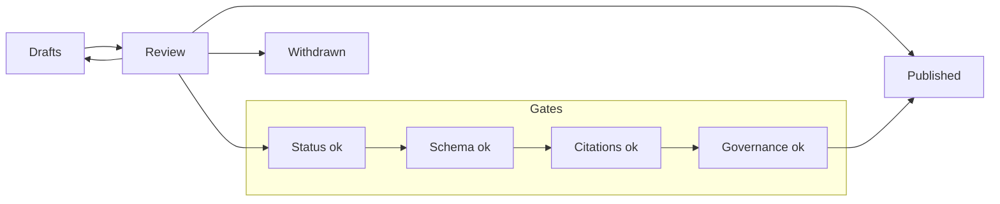

<!-- [KFM_META_BLOCK_V2]
doc_id: kfm://doc/0dd3a9cc-8a3c-4e7c-b64f-2a147b6e7f4f
title: Review Stories
type: standard
version: v1
status: draft
owners: TBD
created: 2026-03-04
updated: 2026-03-04
policy_label: public
related: [docs/stories/README.md, docs/stories/drafts, docs/stories/published, docs/stories/withdrawn, docs/stories/_lint, docs/stories/_schemas, docs/stories/_registry, docs/stories/_governance]
tags: [kfm, stories, review]
notes: [Review queue contract for story packs; fail-closed gates before publish.]
[/KFM_META_BLOCK_V2] -->

# `docs/stories/review/` — Review stories
Release-candidate stories under formal review.


> Status: draft  
> Owners: TBD  
> Policy label: public (directory docs)  
> Primary posture: evidence-first, fail-closed, default-deny  
> Quick links: [Stories overview](../README.md) · [Lint rules](../_lint/) · [Schemas](../_schemas/) · [Registry](../_registry/) · [Governance](../_governance/) · [Published](../published/) · [Drafts](../drafts/)

Scope · Where it fits · Inputs · Exclusions · Directory tree · Quickstart · Review workflow · Review gates · Diagram · Task list · FAQ · Appendix

---

## Status tags used in this README

<details>
<summary>Click to expand</summary>

- **CONFIRMED**: Backed by files currently present in this repo (paths and/or values are verifiable).
- **PROPOSED**: Recommended contract / target behavior. May not be implemented or enforced yet.
- **UNKNOWN**: Not verified in your current checkout/CI wiring. Includes the smallest steps to verify.

</details>

---

## Scope

- **CONFIRMED:** This directory represents the **“review”** stage in the story lifecycle, and is intended to hold release-candidate story packs while they are being formally reviewed.
- **PROPOSED:** Treat anything in `review/` as **not yet publishable** until all review gates (below) pass and required decisions are recorded.
- **PROPOSED:** Keep `review/` small and time-bounded: a story should either (a) move forward to `published/`, (b) move back to `drafts/` for changes, or (c) move to `withdrawn/`.

[Back to top](#docsstoriesreview--review-stories)

---

## Where it fits in the repo

- **CONFIRMED:** `docs/stories/_registry/statuses.vocab.json` defines the canonical set of story statuses as `draft`, `review`, `published`, `withdrawn`.
- **CONFIRMED:** This directory corresponds to the `review` status in that vocabulary.
- **PROPOSED:** The directory layout is a human- and PR-friendly mirror of that lifecycle:
  - `docs/stories/drafts/` → early work
  - `docs/stories/review/` → formal review gate
  - `docs/stories/published/` → approved and published
  - `docs/stories/withdrawn/` → rejected or retired (kept for provenance)

[Back to top](#docsstoriesreview--review-stories)

---

## Inputs

### Acceptable inputs (what belongs here)

- **CONFIRMED:** Story packs whose status is **review** (per `../_registry/statuses.vocab.json`).
- **PROPOSED:** A story pack that is:
  - self-contained (reviewers don’t need external context to assess it),
  - evidence-linked (claims are tied to resolvable references),
  - safe to publish (no sensitive targeting; no secrets; no private data).

### Expected outputs (what review should produce)

- **PROPOSED:** A clear decision trail:
  - “approve to publish” OR “request changes” OR “withdraw”
  - a short record of policy decisions / redactions / rights checks that were required.

[Back to top](#docsstoriesreview--review-stories)

---

## Exclusions

- **CONFIRMED:** Do **not** add new lifecycle statuses here (statuses are centrally defined in `../_registry/statuses.vocab.json`).
- **PROPOSED:** Do **not** put the following in `review/`:
  - draft-only brainstorming (belongs in `../drafts/`)
  - final, approved content (belongs in `../published/`)
  - raw datasets, exports, or large binaries (belongs in governed data surfaces, not docs)
  - secrets (tokens, keys) or sensitive internal identifiers
  - instructions or content that meaningfully enables targeting of vulnerable people/places (redact/generalize; see `../_governance/`)

[Back to top](#docsstoriesreview--review-stories)

---

## Directory tree

### Current tree

- **CONFIRMED:** This directory contains `README.md` and will contain story pack subfolders as review work begins.

### Target layout (recommended)

- **PROPOSED:** One folder per story pack, named with a stable, URL-safe slug.

```text
docs/stories/review/
├── README.md
└── <story-slug>/
    ├── story.md                      # human narrative
    ├── story_node.json               # machine-readable node (schema-backed)
    ├── story_manifest.json           # optional: pack manifest (schema-backed)
    ├── review/                       # review artifacts (decision trail)
    │   ├── decision.md
    │   └── notes.md
    └── media/                        # optional: images/figures with rights notes
        └── (files...)
```

- **UNKNOWN:** The canonical template filenames for story packs in your current checkout.
  - Smallest verification steps:
    1. `ls -la docs/stories/_templates`
    2. Open the template(s) and align the “Target layout” above to the template names.

[Back to top](#docsstoriesreview--review-stories)

---

## Quickstart

### 1) See what is currently in review

```bash
ls -1 docs/stories/review
```

### 2) Move a story pack into review (author workflow)

> WARNING: destructive (moves files). Use only if you intend to change the lifecycle stage.

```bash
# pseudocode: adjust <story-slug> and source folder to match your repo
git mv docs/stories/drafts/<story-slug> docs/stories/review/<story-slug>
git status
```

### 3) Sanity-check JSON files are parseable (minimum bar)

```bash
python -m json.tool docs/stories/review/<story-slug>/story_node.json >/dev/null
```

```bash
python -m json.tool docs/stories/review/<story-slug>/story_manifest.json >/dev/null
```

> NOTE: JSON parseability is not schema conformance. Schema validation is a **review gate** (below).

[Back to top](#docsstoriesreview--review-stories)

---

## Review workflow

### Reviewer checklist flow (human process)

- **PROPOSED:** Review proceeds in this order:
  1. **Structure:** does the pack match the expected layout and parse cleanly?
  2. **Schema:** does the node/manifest validate against `../_schemas/`?
  3. **Evidence:** are claims supported, and are citations resolvable?
  4. **Governance:** does the story avoid sensitive targeting and respect redaction/rights needs?
  5. **Editorial:** is it clear, accurate, and consistent with story style guidance?
  6. **Decision:** approve → publish, request changes → draft, or withdraw.

### How to request changes

- **PROPOSED:** Prefer a **single “changes requested” review** that lists:
  - required fixes (blocking),
  - recommended improvements (non-blocking),
  - any governance obligations (redaction, sensitivity classification, rights notes).

### How to record a decision

- **PROPOSED:** Add a short decision artifact under `review/` inside the story pack (see “Target layout”).
- **PROPOSED:** If the story is approved, the PR that publishes it should also update any relevant registries in `../_registry/` (if/when used by downstream tooling/UI).

[Back to top](#docsstoriesreview--review-stories)

---

## Review gates

### Gate 0 — Status is valid

- **CONFIRMED:** Status must be one of: `draft`, `review`, `published`, `withdrawn` (see `../_registry/statuses.vocab.json`).
- **PROPOSED:** Any story in this folder should have status set to `review` inside its story node metadata.

### Gate 1 — Schema conformance

- **CONFIRMED:** Schemas live in `../_schemas/` (including story node schema versions).
- **PROPOSED:** `story_node.json` MUST validate against the current story node schema version used by the repo (e.g., `story_node_v3.schema.json`).
- **PROPOSED:** If `story_manifest.json` is present, it MUST validate against `story_manifest.schema.json`.

### Gate 2 — Citation / evidence resolution

- **CONFIRMED:** Citation rules require a resolver and restrict allowed reference prefixes. See `../_lint/citation_rules.yaml`.
- **CONFIRMED:** Allowed prefixes are: `dcat`, `stac`, `prov`, `doc`, `graph`.
- **PROPOSED:** Every non-trivial claim in `story.md` should have at least one resolvable evidence reference, using the allowed prefixes.

### Gate 3 — Content safety, redaction, and rights

- **CONFIRMED:** Governance stubs live in `../_governance/` (redaction, media rights, sensitive locations).
- **PROPOSED:** If a story includes sensitive locations or vulnerable populations:
  - redact or generalize to remove targeting utility,
  - label sensitivity appropriately (once policy labels vocabulary is populated),
  - record the decision and reasoning in `review/decision.md`.

### Gate 4 — Determinism and reproducibility

- **PROPOSED:** The story pack should be reviewable offline: no “go click 12 links to understand this.”
- **PROPOSED:** If a claim depends on a time-sensitive fact, it should include a concrete date and a resolvable reference.

#### Gate summary table

| Gate | What to check | Where it’s defined | Pass/Fail rule |
|---|---|---|---|
| Status | Status value exists in controlled vocabulary | `../_registry/statuses.vocab.json` | Fail if not in vocab |
| Schema | Node/manifest validate | `../_schemas/` | Fail if schema invalid |
| Citations | Resolver required; prefixes restricted | `../_lint/citation_rules.yaml` | Fail if citations not resolvable / disallowed |
| Governance | No sensitive targeting; redactions/rights handled | `../_governance/` | Fail closed if safety unclear |
| Repro | Reviewable offline; time-sensitive facts dated | (local contract) | Fail if unverifiable |

[Back to top](#docsstoriesreview--review-stories)

---

## Diagram



[Back to top](#docsstoriesreview--review-stories)

---

## Task list

- [ ] **Status:** story status is `review` (and status vocab unchanged)
- [ ] **Structure:** story pack matches expected layout (or template)
- [ ] **Schema:** `story_node.json` validates against current schema in `../_schemas/`
- [ ] **Evidence:** claims are supported; references are resolvable
- [ ] **Citations:** citation resolver is used; prefixes are allowed (`dcat`, `stac`, `prov`, `doc`, `graph`)
- [ ] **Governance:** sensitive targeting risk assessed; redactions/rights decisions recorded if needed
- [ ] **Decision:** approve / changes requested / withdraw is recorded
- [ ] **Promotion:** if approved, story is moved to `../published/` and any registries are updated (if used)

[Back to top](#docsstoriesreview--review-stories)

---

## FAQ

### Do stories in `review/` count as published?
- **CONFIRMED:** No. This is explicitly the review stage.
- **PROPOSED:** Treat `review/` as “release candidate,” not “shipped.”

### What if we can’t verify a claim during review?
- **PROPOSED:** Fail closed:
  - mark the claim as **UNKNOWN** in the story,
  - add the smallest verification steps needed,
  - or remove/soften the claim until it can be evidenced.

### Where do policy labels / reviewers / tags come from?
- **CONFIRMED:** Controlled vocabularies exist in `../_registry/` (policy labels, reviewers, tags).
- **CONFIRMED:** Some vocab files may currently be empty scaffolding; populate them before relying on them as gates.

[Back to top](#docsstoriesreview--review-stories)

---

## Appendix

<details>
<summary>Suggested conventions (PROPOSED)</summary>

### Story slug naming
- Use lowercase and hyphens: `kansas-water-availability-2026q1`
- Avoid spaces and punctuation; keep it stable over time.

### Review decision notes
Keep review notes short and structured:
- Decision: approve / changes requested / withdraw
- Required changes (if any)
- Governance notes (redaction, rights, sensitivity)
- Evidence gaps (if any), with smallest verification steps

</details>
