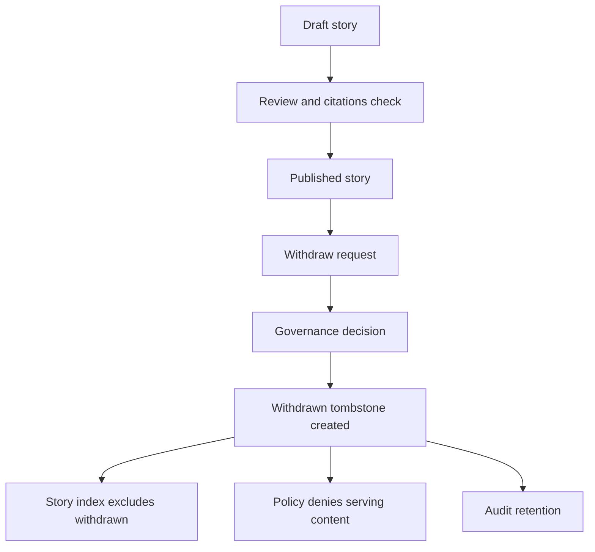

<!-- [KFM_META_BLOCK_V2]
doc_id: kfm://doc/7b1f0e59-0d0f-4d4a-9d0c-07c2d3a6a72a
title: Withdrawn Stories
type: standard
version: v1
status: draft
owners: kfm:team:stories
created: 2026-03-04
updated: 2026-03-04
policy_label: public
related:
  - kfm://doc/kfm-stories-root-readme
  - kfm://doc/kfm-governance-root
tags: [kfm, stories, governance, withdrawn]
notes:
  - "Directory README defining how to retain auditable tombstones and minimal receipts for withdrawn stories."
[/KFM_META_BLOCK_V2] -->

# Withdrawn Stories
Audit-preserving *tombstones* and minimal receipts for stories removed from the public story surface.

> **Status:** PROPOSED (until wired into story indexing + tooling)  
> **Owners:** PROPOSED `kfm:team:stories` (or your Story Steward team)  
> **Policy posture:** CONFIRMED default-deny for withdrawn artifacts; do not surface in public UI  
>
>  <!-- TODO: replace with repo-standard -->
>  <!-- TODO -->
>  <!-- TODO -->
>  <!-- TODO -->

**Quick nav:** [Scope](#scope) · [Where it fits](#where-it-fits) · [Inputs](#acceptable-inputs) · [Exclusions](#exclusions) · [Directory layout](#directory-layout) · [Quickstart](#quickstart-withdraw-a-story) · [Usage](#usage-details) · [Diagram](#diagram) · [Schemas](#schemas-and-metadata) · [Gates](#withdrawal-gates-definition-of-done) · [FAQ](#faq) · [Appendix](#appendix-templates)

---

## Scope

### What “withdrawn” means here
- **CONFIRMED:** “Withdrawn” is a *governance/policy state* where an asset is marked `status: "withdrawn"` and policy denies use; it may also be hidden from UI lists.  
- **PROPOSED:** Apply the same operational meaning to **Story Nodes / stories**: when withdrawn, they do **not** appear in the public story index and are not served by governed APIs unless an explicit policy exception exists.
- **PROPOSED:** This folder stores *audit-friendly* artifacts (tombstones + minimal receipts), not a full “shadow copy” of everything.

### Claim labels used in this README
- **CONFIRMED:** Supported by KFM design / governance documents.
- **PROPOSED:** Recommended pattern; may require repo wiring, policy, or tooling.
- **UNKNOWN:** Requires repo verification (see [Verification checklist](#verification-checklist)).

[Back to top](#withdrawn-stories)

---

## Where it fits

- **Path:** `docs/stories/withdrawn/`
- **Upstream:** Story contribution + review workflow (PR-based review for citations + sensitive content).  
- **Downstream:** Story indexing, governed story API, Focus Mode citations, and audit retention.

### Repository/architecture assumptions
- **CONFIRMED:** KFM Story Nodes bind narrative to map state and citations; they commonly include:
  - a **Markdown** story (human readable)
  - a **sidecar JSON** (machine metadata: map state, citations, policy, review)  
- **CONFIRMED:** Publishing is a governed event: story publishing gates require review state and **resolvable citations** through the evidence resolver.  
- **UNKNOWN:** Whether your repo stores live Story Nodes under `docs/stories/` or `stories/` (both patterns appear in KFM materials). This README is written to be compatible with either. See [Verification checklist](#verification-checklist).

[Back to top](#withdrawn-stories)

---

## Acceptable inputs

### Minimum required per withdrawn story
- **PROPOSED:** A per-story folder containing:
  - `WITHDRAWAL.md` (human-readable tombstone + rationale)
  - `withdrawal.json` (machine-readable withdrawal record; used by indexers/validators)
  - Optional **redacted** `story.md` (only if safe and policy-allowed)
  - Optional `story-node.json` sidecar (only if safe and policy-allowed)

### What good withdrawn artifacts look like
- **PROPOSED:** They answer:
  - *What was withdrawn?* (stable story ID + previous path)
  - *When + by whom?* (date, reviewer/steward, decision reference)
  - *Why?* (reason code + short narrative)
  - *What replaced it?* (replacement story ID(s) or “none”)
  - *How can we audit it without leaking?* (evidence refs, redaction receipts if applicable)

[Back to top](#withdrawn-stories)

---

## Exclusions

Do **not** put the following here:

- **CONFIRMED:** Restricted/raw sensitive values (e.g., precise sensitive coordinates, PII). Use governed storage + policy controls; keep only a minimal public-safe receipt here if needed.
- **PROPOSED:** Full copies of withdrawn source datasets or large evidence bundles (store those in the governed evidence store; reference them via EvidenceRef).
- **PROPOSED:** Secrets, tokens, private keys.

[Back to top](#withdrawn-stories)

---

## Directory layout

**PROPOSED** layout (date-bucketed, stable IDs, predictable scanning):

```text
docs/stories/withdrawn/
  README.md
  index.json                 # optional: machine index of withdrawn stories (for tooling)
  2026/
    story.kansas.example-001/
      WITHDRAWAL.md
      withdrawal.json
      story.redacted.md      # optional
      story-node.redacted.json  # optional
  _templates/
    WITHDRAWAL.template.md
    withdrawal.template.json
```

### Naming rules
- **PROPOSED:** Folder name = stable story ID (`story.<slug>`). Avoid spaces.
- **PROPOSED:** Prefer redacted filenames (`*.redacted.*`) over ambiguous “final” naming.
- **PROPOSED:** If your live stories are under `docs/stories/<id>/...`, the withdrawal record should point to the last-known path.

[Back to top](#withdrawn-stories)

---

## Quickstart: withdraw a story

> **PSEUDOCODE:** Commands below use placeholders. Replace `<…>` with real values.

```bash
# PSEUDOCODE
# 1) Create a withdrawal folder
mkdir -p docs/stories/withdrawn/$(date +%Y)/story.<slug>

# 2) Add a tombstone + machine record
cp docs/stories/withdrawn/_templates/WITHDRAWAL.template.md \
   docs/stories/withdrawn/$(date +%Y)/story.<slug>/WITHDRAWAL.md

cp docs/stories/withdrawn/_templates/withdrawal.template.json \
   docs/stories/withdrawn/$(date +%Y)/story.<slug>/withdrawal.json

# 3) Remove from the public story index (implementation varies)
# - If you have docs/stories/index.json or docs/stories/README.md as an index, update it.
# - If your UI auto-scans docs/stories, ensure it excludes docs/stories/withdrawn/.

# 4) Move or delete the live story artifacts (depends on policy)
# - If safe: git mv docs/stories/story.<slug> docs/stories/withdrawn/2026/story.<slug>/...
# - If not safe: remove content, keep only tombstone + references.
git mv docs/stories/story.<slug> docs/stories/withdrawn/$(date +%Y)/story.<slug>/live_copy.redacted

# 5) Run validation + policy gates (example)
# If your repo uses conftest policy checks for story nodes, run them here.
conftest test "docs/stories/**/story-node.json" -p policy/rego
```

[Back to top](#withdrawn-stories)

---

## Usage details

### Withdrawal triggers (non-exhaustive)
- **PROPOSED:** Rights/permissions clarified as disallowed.
- **PROPOSED:** Sensitive location exposure discovered (needs redaction/generalization first).
- **PROPOSED:** Substantive factual error with no quick correction path.
- **PROPOSED:** Takedown request (CARE Authority to Control).

### What happens to users
- **PROPOSED:** Public UI shows a neutral message:
  - “This story has been withdrawn.”
  - If applicable, provides a link to replacement story.
- **PROPOSED:** Old links resolve to the tombstone (not a 404) to preserve trust + auditability.

### What happens to Focus Mode
- **CONFIRMED:** Focus Mode must “cite or abstain” and relies on resolvable EvidenceRefs; withdrawn stories should not be used as evidence unless policy explicitly allows.  
- **PROPOSED:** If a withdrawn story is in retrieval scope, the system should:
  1) exclude it by policy, or
  2) surface only the tombstone + replacement pointer.

[Back to top](#withdrawn-stories)

---

## Diagram



[Back to top](#withdrawn-stories)

---

## Schemas and metadata

### Story Node baseline (for context)
- **CONFIRMED:** Story Nodes are typically:
  - `story.md` (narrative + claims + citations)
  - `story-node.json` (status, policy label, review state, map state, citations)  
- **CONFIRMED:** Publishing gate: citations must resolve through `/api/v1/evidence/resolve`.

### Withdrawal record schema (PROPOSED minimum)
Include a `withdrawal.json` shaped like:

| Field | Required | Notes |
|---|---:|---|
| `withdrawal_version` | ✅ | e.g., `"v1"` |
| `story_id` | ✅ | stable ID: `kfm://story/<uuid>` or `story.<slug>` |
| `version_id` | ✅ | last published version (if known) |
| `status` | ✅ | must be `"withdrawn"` |
| `effective_date` | ✅ | `YYYY-MM-DD` |
| `reason_code` | ✅ | controlled vocab (see below) |
| `reason_summary` | ✅ | short human-readable explanation |
| `decision_ref` | ✅ | e.g., `kfm://policy_decision/...` or governance ticket |
| `replaced_by` | ⛔️ | list of replacement story IDs, if any |
| `evidence_refs` | ✅ | EvidenceRef list (doc, dcat, stac, prov, oci, etc.) |
| `redaction_profile` | ⛔️ | if withdrawal is due to sensitivity; reference profile name |
| `notes` | ⛔️ | optional |

### Reason codes (PROPOSED controlled vocabulary)
| Code | Meaning |
|---|---|
| `rights_denied` | Rights/license/permissions do not allow publication |
| `sensitive_location` | Contains restricted/sensitive location detail |
| `privacy` | Contains PII or privacy-risk detail |
| `factual_error` | Significant error; withdrawn pending correction |
| `takedown_request` | Authority to Control request |
| `superseded` | Replaced by a new story (keep tombstone + pointer) |

[Back to top](#withdrawn-stories)

---

## Withdrawal gates definition of done

- [ ] **PROPOSED:** Tombstone exists (`WITHDRAWAL.md`) and is policy-safe.
- [ ] **PROPOSED:** `withdrawal.json` exists and validates (schema + lint).
- [ ] **PROPOSED:** Public story index no longer lists the story.
- [ ] **PROPOSED:** Any API/list endpoint excludes withdrawn stories by default.
- [ ] **PROPOSED:** Replacement pointer added when applicable (`replaced_by`).
- [ ] **CONFIRMED:** If story-node sidecars are retained, they pass default-deny policy checks and do not contain unresolvable citations.
- [ ] **PROPOSED:** If sensitivity drove withdrawal, a redaction/generalization plan is recorded (and a redaction receipt exists if anything remains published).

[Back to top](#withdrawn-stories)

---

## Verification checklist

If you’re wiring this into a real repo, verify these items to convert UNKNOWN → CONFIRMED:

1. **UNKNOWN:** Where live stories actually live:
   - Look for `docs/stories/` and/or `stories/` in the repo root.
2. **UNKNOWN:** How story listing is built:
   - A curated `index.json` / README list
   - Or UI directory scan
3. **UNKNOWN:** What CI gates exist for Story Nodes:
   - Search `.github/workflows` for story lint/audit jobs
   - Look for conftest policy checks (OPA/Rego) on story sidecars
4. **UNKNOWN:** Whether a story API exists:
   - Search for `GET /api/v1/story` / story routes and auth rules
5. **UNKNOWN:** Policy labels + redaction profiles in use:
   - Find the canonical sensitivity rubric + redaction profile registry

[Back to top](#withdrawn-stories)

---

## FAQ

**Why not delete withdrawn stories entirely?**  
- **PROPOSED:** Deleting loses auditability and breaks citations; a tombstone preserves trust while preventing misuse.

**Can a withdrawn story be restored?**  
- **PROPOSED:** Yes, but only via a governed process: new review, updated citations, and a clear replacement chain (`replaces` / `isReplacedBy` semantics).

**Where do restricted story materials go?**  
- **CONFIRMED/PROPOSED:** Store restricted artifacts in governed storage with policy enforcement; keep only minimal safe metadata/receipts in this repo.

**What should users see when they navigate to a withdrawn story?**  
- **PROPOSED:** A neutral tombstone message plus replacement links, not a generic 404.

[Back to top](#withdrawn-stories)

---

## Appendix: templates

<details>
<summary><strong>Template: WITHDRAWAL.md</strong></summary>

```markdown
<!-- [KFM_META_BLOCK_V2]
doc_id: kfm://story/<uuid>@withdrawn_v1
title: "WITHDRAWN: <Story title>"
type: story
version: v3
status: withdrawn
owners: <names/teams>
created: YYYY-MM-DD
updated: YYYY-MM-DD
policy_label: public
related:
  - kfm://story/<uuid>@vN   # last published version (if known)
[/KFM_META_BLOCK_V2] -->

# WITHDRAWN: <Story title>

## Summary
**Status:** withdrawn  
**Effective date:** YYYY-MM-DD  
**Reason code:** <rights_denied | sensitive_location | privacy | factual_error | takedown_request | superseded>  
**Decision ref:** <kfm://policy_decision/... or issue link>

## What happened
<Short explanation suitable for public consumption. Do not include restricted details.>

## Replacement
- Replaced by: <kfm://story/...> (if any)

## Evidence refs
- <EvidenceRef 1>
- <EvidenceRef 2>

## Notes for maintainers (optional)
<Any internal-only notes should be omitted from public repos; store elsewhere if needed.>
```

</details>

<details>
<summary><strong>Template: withdrawal.json</strong></summary>

```json
{
  "withdrawal_version": "v1",
  "story_id": "kfm://story/<uuid>",
  "version_id": "vN",
  "status": "withdrawn",
  "effective_date": "YYYY-MM-DD",
  "reason_code": "takedown_request",
  "reason_summary": "Withdrawn per steward decision; see decision_ref.",
  "decision_ref": "kfm://policy_decision/<id>",
  "replaced_by": [],
  "evidence_refs": [
    "prov://run/<run_id>",
    "doc://<doc_id>"
  ],
  "redaction_profile": null,
  "notes": ""
}
```

</details>

[Back to top](#withdrawn-stories)
