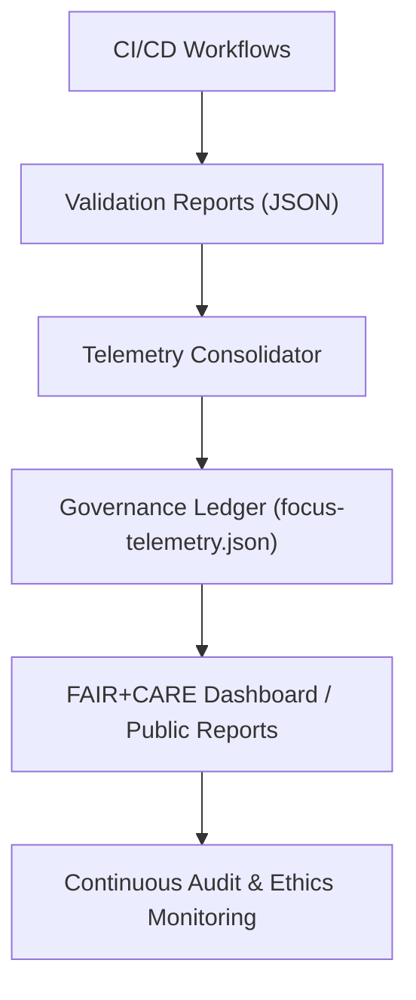
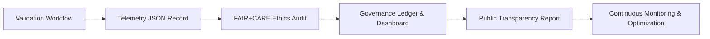

<div align="center">

# 📡 **Kansas Frontier Matrix — Telemetry & Provenance Logging Framework**
`docs/telemetry/README.md`

**Purpose:**  
Define the **data telemetry and provenance monitoring system** that governs real-time validation, ethics tracking, and performance metrics across the **Kansas Frontier Matrix (KFM)** ecosystem.  
Telemetry ensures all datasets, models, and workflows remain transparent, traceable, and compliant with **FAIR+CARE** and **Master Coder Protocol (MCP-DL v6.3)** standards.

[](../README.md)
[](../standards/faircare.md)
[](../../LICENSE)
[](../../releases/v10.0.0/manifest.zip)

</div>

---

## 📘 Overview

Telemetry is the **operational nervous system** of the Kansas Frontier Matrix, recording every validation event, governance action, and ethical outcome into structured JSON artifacts.  
It bridges **governance**, **AI ethics**, and **data validation** systems — enabling real-time FAIR+CARE oversight and reproducibility.

Telemetry performs three critical functions:
1. **Audit & Validation Logging** — records success/failure states of all governance workflows.  
2. **Ethical Accountability** — tracks cultural consent and FAIR+CARE compliance metrics.  
3. **Sustainability Monitoring** — measures energy efficiency and environmental performance.

All telemetry conforms to:
- **FAIR+CARE ethical metadata schema**  
- **ISO 9001 (Quality Management)**  
- **ISO 50001 (Energy Efficiency)**  
- **Master Coder Protocol (MCP-DL v6.3)**  

---

## 🗂️ Directory Layout

```
docs/telemetry/
├── README.md                       # This file
├── governance-metrics.json          # Aggregated governance-level metrics
├── ai-performance.json              # AI pipeline performance and explainability metrics
├── accessibility-metrics.json       # Accessibility and inclusion telemetry
├── sustainability.json              # Energy and carbon metrics
└── provenance-ledger.json           # Provenance and validation traceability records
```

---

## ⚙️ Telemetry System Architecture



Telemetry pipelines unify governance, ethics, accessibility, and performance data into a single transparent ledger available per release.

---

## 🧩 Core Telemetry Streams

| Stream | Description | Source | Output |
|---|---|---|---|
| **Data Validation** | Tracks schema and FAIR+CARE audit results for all datasets. | `data-contract-validate.yml` | `reports/data/schema-validation.json` |
| **AI Ethics** | Logs explainability, bias, and model provenance. | `ai-ethics-scan.yml` | `reports/ai/focus-ethics-validation.json` |
| **Accessibility** | Captures WCAG 2.1 AA compliance metrics. | `accessibility_scan.yml` | `reports/self-validation/web/a11y_summary.json` |
| **Governance Decisions** | Records council votes, minutes, and consent flags. | `faircare-audit.yml` | `docs/data/governance/review-council-minutes.md` |
| **Energy Performance** | Monitors system resource use and ISO 50001 metrics. | `performance-energy.yml` | `reports/ui/performance-metrics.json` |

All telemetry records are merged nightly into `releases/v10.0.0/focus-telemetry.json`.

---

## 🧮 Telemetry Schema (v1.0)

| Field | Type | Description | Example |
|---|---|---|---|
| `telemetry_id` | string | Unique UUID for telemetry record. | `"TEL-2025-00045"` |
| `timestamp` | string (ISO 8601) | Date and time of validation event. | `"2025-11-09T23:42:00Z"` |
| `category` | string | Type of record (data, ai, ethics, accessibility). | `"ethics"` |
| `council` | array | Responsible governance councils. | `["FAIR+CARE", "IDGB"]` |
| `status` | string | `"passed"`, `"warning"`, `"failed"`. | `"passed"` |
| `score` | number | FAIR+CARE or validation score (0–100). | `97.8` |
| `artifact` | string | File or path reference. | `"reports/data/faircare-validation.json"` |
| `energy_use_wh` | number | Energy consumed during process (in watt-hours). | `0.18` |
| `notes` | string | Audit notes or corrective action. | `"Contrast ratio improved to 4.8:1"` |

---

## ♿ Accessibility Telemetry Metrics

| Metric | Target | Verified By |
|---|---|---|
| **WCAG 2.1 AA Compliance** | ≥ 95% | `accessibility_scan.yml` |
| **Keyboard Operability** | 100% | Manual & Automated Tests |
| **Focus Visibility** | ≥ 3:1 contrast | Design Token Validation |
| **Screen Reader Accuracy** | 100% region labeling | Accessibility Council |
| **Inclusive Language Review** | 100% | FAIR+CARE Linguistic Audit |

---

## 🧠 FAIR+CARE Ethical Telemetry

Each telemetry entry includes **ethical metadata** recording how each dataset, component, or AI model performed against FAIR+CARE principles.

| Principle | Field | Description | Example |
|---|---|---|---|
| **Collective Benefit** | `ethics.collective_benefit` | Measured public and research value. | `"educational impact: high"` |
| **Authority to Control** | `ethics.authority_to_control` | Confirms consent and governance authority. | `"controlled_by": "IDGB"` |
| **Responsibility** | `ethics.responsibility` | Notes audit compliance and accountability. | `"reviewed_by": "FAIR+CARE Council"` |
| **Ethics** | `ethics.ethics_score` | Weighted cultural and AI ethics score (0–100). | `96.2` |

---

## 🔍 Example Telemetry Record

```json
{
  "telemetry_id": "TEL-2025-0041",
  "timestamp": "2025-11-09T22:16:00Z",
  "category": "data_validation",
  "council": ["FAIR+CARE", "Data Standards Committee"],
  "status": "passed",
  "score": 97.3,
  "artifact": "reports/data/faircare-validation.json",
  "ethics": {
    "collective_benefit": "Supports open environmental research.",
    "authority_to_control": "Public Domain Dataset",
    "responsibility": "Audited by FAIR+CARE Council",
    "ethics_score": 97.1
  },
  "energy_use_wh": 0.16,
  "notes": "Validated dataset conforms to data-contract-v3.json and CARE consent guidelines."
}
```

---

## 📊 Governance Telemetry Integration

Telemetry reports are automatically linked with **FAIR+CARE audits**, **transparency reports**, and **manifest archives** for release governance.

| Integration | Description | Target Output |
|---|---|---|
| **Governance Ledger** | Tracks council decisions, votes, and audits. | `docs/data/governance/review-council-minutes.md` |
| **Transparency Dashboard** | Aggregates telemetry metrics for public reporting. | `docs/governance/transparency-reports.md` |
| **Release Manifest** | Embeds validated telemetry per version. | `releases/v10.0.0/manifest.zip` |

---

## ⚙️ Validation Workflows Generating Telemetry

| Workflow | Purpose | Output |
|---|---|---|
| `faircare-audit.yml` | Measures ethical compliance. | `reports/data/faircare-validation.json` |
| `accessibility_scan.yml` | Tracks A11y performance metrics. | `reports/self-validation/web/a11y_summary.json` |
| `data-provenance.yml` | Logs consent and attribution lineage. | `reports/data/provenance-summary.json` |
| `ai-ethics-scan.yml` | AI model ethics and bias scoring. | `reports/ai/focus-ethics-validation.json` |
| `performance-energy.yml` | Captures sustainability data. | `reports/ui/performance-metrics.json` |

---

## 🧩 Sustainability Metrics (ISO 50001 Alignment)

| Metric | Target | Verification |
|---|---|---|
| **Energy per Validation Cycle** | ≤ 0.2 Wh | `performance-energy.yml` |
| **Carbon Emission Offset** | ≥ 100% renewable coverage | Sustainability Audit |
| **Telemetry Storage Efficiency** | ≤ 0.5 MB per dataset record | CI Storage Audit |
| **Build Energy Budget** | ≤ 3 Wh per CI cycle | Telemetry Logs |

Telemetry integrates with **Green MCP Energy Ledger**, ensuring KFM maintains carbon-neutral operations.

---

## 🧮 Telemetry Lifecycle



---

## 🕰️ Version History

| Version | Date | Author | Summary |
|---|---|---|---|
| v10.0.0 | 2025-11-10 | FAIR+CARE Governance Secretariat | Established full telemetry and provenance framework integrating ethics scoring, accessibility metrics, energy performance, and governance audit linkage. |

---

<div align="center">

**© 2025 Kansas Frontier Matrix — CC-BY 4.0**  
Governed under **Master Coder Protocol v6.3** · Certified by **FAIR+CARE Council** · Diamond⁹ Ω / Crown∞Ω Ultimate Certified  
[⬅ Back to Documentation Index](../README.md) · [Governance →](../governance/README.md)

</div>
