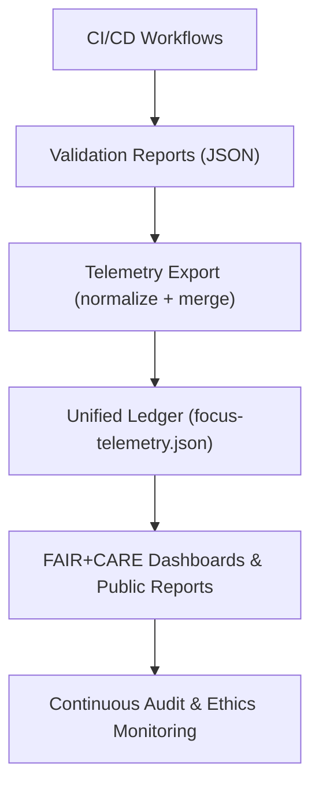
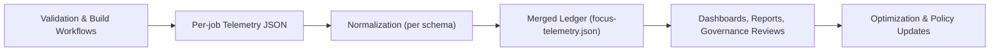

<div align="center">

# 📡 **Kansas Frontier Matrix — Telemetry & Provenance Logging Framework**  
`docs/telemetry/README.md`

**Purpose:**  
Define the **data telemetry and provenance monitoring system** that governs real-time validation, ethics tracking, and performance metrics across the **Kansas Frontier Matrix (KFM)** ecosystem.  
Telemetry ensures all datasets, models, and workflows remain transparent, traceable, and compliant with **FAIR+CARE** and **Master Coder Protocol (MCP-DL v6.3)** standards.

[](../README.md)
[](../standards/faircare.md)
[](../../LICENSE)
[](../../releases/v10.2.0/manifest.zip)

</div>

---

## 📘 Overview

Telemetry is the **operational nervous system** of the Kansas Frontier Matrix, recording every validation event, governance action, and ethical outcome into structured JSON artifacts.  
It bridges **governance**, **AI ethics**, **data validation**, **accessibility**, and **sustainability** systems — enabling real-time FAIR+CARE oversight and reproducibility.

Telemetry performs three critical functions:

1. **Audit & Validation Logging** — records success/failure states of CI and governance workflows.  
2. **Ethical Accountability** — tracks cultural consent and FAIR+CARE compliance metrics.  
3. **Sustainability Monitoring** — measures energy efficiency and environmental performance.

All telemetry conforms to:

- **FAIR+CARE** ethical metadata schema  
- **ISO 9001** (Quality Management)  
- **ISO 50001** (Energy Efficiency) & **ISO 14064** (GHG accounting)  
- **MCP-DL v6.3** and KFM’s **system-telemetry-v1** schema  

---

## 🗂️ Directory Layout

```plaintext
docs/telemetry/
├── README.md                       # This file
├── governance-metrics.json         # Aggregated governance-level metrics
├── ai-performance.json             # AI pipeline performance and explainability metrics
├── accessibility-metrics.json      # Accessibility and inclusion telemetry
├── sustainability.json             # Energy and carbon metrics
└── provenance-ledger.json          # Provenance and validation traceability records
```

These files describe **how** telemetry is structured and interpreted; the canonical ledger per release is:

```
releases/v10.2.0/focus-telemetry.json
```

---

## ⚙️ Telemetry System Architecture



Telemetry pipelines unify governance, ethics, accessibility, and performance data into a single transparent ledger available for each release.

---

## 🧩 Core Telemetry Streams

| Stream | Description | Source Workflow(s) | Primary Output |
|---|---|---|---|
| **Docs Validation** | Markdown front-matter, links, structure. | `docs-lint.yml` | `reports/self-validation/docs/lint_summary.json` |
| **FAIR+CARE Audit** | Dataset & doc ethics compliance, PII checks. | `faircare-validate.yml` | `reports/fair/faircare_summary.json` |
| **Catalog Integrity** | STAC/DCAT validation & asset checks. | `stac-validate.yml` | `reports/self-validation/stac_validation.json` |
| **AI Training & Ethics** | Metrics, drift, explainability, energy. | `ai-train.yml` | `reports/ai/<model>/metrics.json` |
| **Build & Performance** | Web builds, test runs, cache hits, runtime. | build/test workflows | `reports/telemetry/build_metrics.json` |

All stream summaries are normalized and merged via `telemetry-export.yml` into:  
`releases/v10.2.0/focus-telemetry.json`.

---

## 🧮 Telemetry Schema (system-telemetry-v1)

Each **event** in `focus-telemetry.json` conforms to `system-telemetry-v1`:

| Field | Type | Description |
|---|---|---|
| `event_id` | string (UUIDv4) | Unique ID per telemetry event. |
| `timestamp` | string (ISO 8601 UTC) | Event time. |
| `category` | string | `docs` · `faircare` · `stac` · `ai` · `build` · `governance`. |
| `status` | string | `success` · `warning` · `failure`. |
| `branch` | string | Git ref / tag (`main`, `release/v10.2.0`). |
| `run_id` | string | CI run identifier (GitHub Actions run ID). |
| `duration_sec` | number | Workflow runtime in seconds. |
| `energy_wh` | number | Estimated or measured energy usage (Wh). |
| `carbon_gco2e` | number | Carbon equivalent emissions. |
| `payload` | object | Workflow-specific fields (metrics, counts, etc.). |

A typical document-level summary in `docs-lint.yml` might populate `payload.docs_lint`.

---

## ♿ Accessibility Telemetry Metrics

Captured primarily via `accessibility_scan.yml` and web build workflows.

| Metric | Target | Source |
|---|---|---|
| **WCAG 2.1 AA Score** | ≥ 95% | Lighthouse/axe scan |
| **Keyboard Operability** | 100% elements reachable | Integration tests |
| **Focus Visibility** | ≥ 3:1 contrast | Design token checks |
| **Alt-text Coverage** | 100% UI images | Build-time a11y audit |

---

## 🧠 FAIR+CARE Ethical Telemetry

Ethics metadata is embedded in each relevant event under `payload.ethics`.

| Principle | Field | Description |
|---|---|---|
| **Collective Benefit** | `payload.ethics.collective_benefit` | Captures societal/educational benefit of change. |
| **Authority to Control** | `payload.ethics.authority_to_control` | Indicates responsible council/owner. |
| **Responsibility** | `payload.ethics.responsibility` | Who audited and under which standard pack. |
| **Ethics Score** | `payload.ethics.ethics_score` | Scaled 0–100 ethics assessment metric. |

Example values are produced by `faircare-validate.yml` and AI governance flows.

---

## 🔍 Example Telemetry Event

```json
{
  "event_id": "TEL-2025-0041",
  "timestamp": "2025-11-12T22:16:00Z",
  "category": "data_validation",
  "status": "success",
  "branch": "release/v10.2.0",
  "run_id": "github-actions-123456789",
  "duration_sec": 742,
  "energy_wh": 0.96,
  "carbon_gco2e": 0.48,
  "payload": {
    "workflow": "faircare-validate.yml",
    "datasets_scanned": 152,
    "violations_found": 0,
    "policy_version": "faircare@2025.4",
    "ethics": {
      "collective_benefit": "Supports open environmental research and education.",
      "authority_to_control": "FAIR+CARE Council",
      "responsibility": "Reviewed by FAIR+CARE Governance Secretariat",
      "ethics_score": 98.7
    }
  }
}
```

---

## 📊 Governance Telemetry Integration

Telemetry outputs underpin KFM’s governance stack:

| Integration | Description | Target |
|---|---|---|
| **Governance Ledger** | Maintains append-only event history for audits. | `data/reports/audit/data_provenance_ledger.json` |
| **Transparency Dashboards** | Visualize energy, error rates, FAIR+CARE scores. | `docs/governance/transparency-reports.md` |
| **Release Manifests** | Reference telemetry snapshots for each release. | `releases/v10.2.0/manifest.zip` |

---

## ⚙️ Workflows Producing Telemetry

| Workflow | Category | Example Payload Key |
|---|---|---|
| `docs-lint.yml` | docs | `payload.docs_lint` |
| `faircare-validate.yml` | faircare | `payload.faircare` |
| `stac-validate.yml` | stac | `payload.stac_validate` |
| `ai-train.yml` | ai | `payload.ai_train` |
| `build-web.yml` | build | `payload.web_build` |
| `telemetry-export.yml` | system | Full ledger merge operations |

All flows are funneled through `telemetry-export.yml`, which enforces schema compliance.

---

## 🌱 Sustainability & Performance (ISO 50001/14064)

KFM tracks sustainability at both **workflow** and **release** granularity.

| Metric | Target | Aggregation |
|---|---|---|
| Energy per CI Cycle | ≤ 3 Wh | Telemetry rollups per week/month |
| CO₂e per Release | 100% offset via RE100 providers | Release-level ledger |
| Hotspot Workflows | Identified & flagged | Telemetry alerts |
| Telemetry Size | ≤ 5 MB per release | Storage & SLO checks |

---

## 🧮 Telemetry Lifecycle



---

## 🕰️ Version History

| Version | Date | Author | Summary |
|---|---|---|---|
| v10.2.2 | 2025-11-12 | FAIR+CARE Governance Secretariat | Aligned to v10.2.0 releases; documented system-telemetry-v1 schema; integrated sustainability + ethics fields; clarified workflow sources. |
| v10.0.0 | 2025-11-10 | FAIR+CARE Governance Secretariat | Established full telemetry & provenance framework; integrated ethics scoring, accessibility metrics, energy performance, and governance audit linkage. |

---

<div align="center">

**© 2025 Kansas Frontier Matrix — CC-BY 4.0**  
Governed under **Master Coder Protocol v6.3** · Certified by **FAIR+CARE Council** · Diamond⁹ Ω / Crown∞Ω Ultimate Certified  
[⬅ Back to Documentation Index](../README.md) · [Governance →](../standards/governance/ROOT-GOVERNANCE.md)

</div>