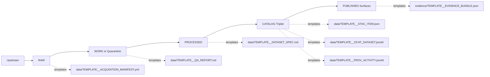

<!-- [KFM_META_BLOCK_V2]
doc_id: kfm://doc/da0ec916-85a3-49ed-a87c-ef1d499a2293
title: docs/templates
type: standard
version: v1
status: draft
owners: KFM Docs Maintainers
created: 2026-02-28
updated: 2026-03-01
policy_label: public
related:
  - docs/MASTER_GUIDE_v13.md
  - docs/glossary.md
tags: [kfm, docs, templates]
notes:
  - Directory README for governed document templates (Universal Doc, Story Node v3, API contract extension).
  - Expanded taxonomy + target layout aligned to v13 Master Guide and the vNext Promotion Contract / truth path.
[/KFM_META_BLOCK_V2] -->

# docs/templates

> Governed document templates for Kansas Frontier Matrix (KFM): **contract-first**, **deterministic**, **evidence-first**, **policy-aware**, and **review-ready**.


---

## Navigation

- [Template status legend](#template-status-legend)
- [Purpose](#purpose)
- [Where this fits](#where-this-fits)
- [What lives here](#what-lives-here)
- [Template taxonomy](#template-taxonomy)
- [Templates in this directory](#templates-in-this-directory)
- [Directory tree](#directory-tree)
- [How to use a template](#how-to-use-a-template)
- [MetaBlock v2](#metablock-v2)
- [Template selection matrix](#template-selection-matrix)
- [Truth path alignment](#truth-path-alignment)
- [Contribution rules](#contribution-rules)
- [FAQ](#faq)

---

## Template status legend

**This README contains both *confirmed* and *target* (recommended) entries.**

- ✅ **CONFIRMED** — referenced directly by the Master Guide v13 (safe to claim as present)
- 🧩 **TARGET / RECOMMENDED** — good KFM default, but **verify in-repo before claiming it exists**
- 🚧 **OPTIONAL** — only add if you have repeated use

> NOTE: If your local tree differs, keep ✅ items stable and update the 🧩/🚧 sections as you add/remove templates.

---

## Purpose

This folder contains **KFM-governed templates** (Markdown + JSON/YAML skeletons) to standardize:

- **Metadata** via *MetaBlock v2* (HTML comment, machine-parseable)
- **Traceability** (explicit slots for EvidenceRefs, artifacts, checksums, citations)
- **Policy clarity** (policy labels, obligations, redaction notes)
- **Review readiness** (checklists aligned to fail-closed governance gates)

> WARNING: Templates are governance-critical. Changing them changes how evidence + policy are captured across the repo.

---

## Where this fits

Within the repository documentation ecosystem:

- `docs/` is the home of canonical governed documentation
- `docs/templates/` is the home of **template sources**
- Output docs belong in their owning homes:
  - architecture docs → `docs/architecture/`
  - governance docs → `docs/governance/`
  - domain modules → `docs/data/<domain>/...`
  - story content → `docs/reports/story_nodes/...`
  - contracts → `contracts/` (OpenAPI, schemas, vocab)

---

## What lives here

✅ **Acceptable inputs**

- Templates prefixed `TEMPLATE__...`
- Partials/snippets prefixed `PARTIAL__...` (reused blocks)
- Examples prefixed `EXAMPLE__...` (filled-in reference artifacts)
- Directory `README.md` files (including this one)

🚫 **Exclusions (do not put these here)**

- Finished “live” docs (put them in their owning `docs/...` path)
- Run outputs / generated artifacts (store in data zones or build outputs)
- API contracts or schemas that are *actually enforced at runtime* (those belong in `contracts/`)

---

## Template taxonomy

KFM templates cluster around “trust surfaces”:

- **Docs structure** (Universal Doc, Story Node v3, API contract extension)
- **Truth path artifacts** (RAW/WORK/PROCESSED/CATALOG/TRIPLET/PUBLISHED)
- **Evidence & provenance** (EvidenceRef → EvidenceBundle, citation blocks, redaction logs)
- **Policy & obligations** (labels, default-deny, OPA/Rego skeletons, decision records)
- **API governance** (OpenAPI module stubs, auth/error models, review checklists)
- **UX trust surfaces** (dataset pages, layer panels, evidence drawer, Focus Mode cards)
- **Steward workflows** (promotion requests/receipts, release manifests, playbooks)

---

## Templates in this directory

### Core templates (✅ confirmed)

| Template | Use for | Output target | Notes |
|---|---|---|---|
| `TEMPLATE__KFM_UNIVERSAL_DOC.md` | Guides, standards, runbooks, design notes | `docs/...` | General-purpose governed doc skeleton |
| `TEMPLATE__STORY_NODE_V3.md` | Story Nodes (narrative + map state + citations) | `docs/reports/story_nodes/...` | Typically markdown + sidecar JSON |
| `TEMPLATE__API_CONTRACT_EXTENSION.md` | API change notes that complement OpenAPI | `docs/...` (often near `contracts/`) | Captures rationale, compatibility, policy impact |

### Extended template bundles (🧩 target)

These are recommended homes to keep templates “discoverable by intent”:

- `_partials/` — reusable blocks (MetaBlock, badge rows, callouts, mermaid diagrams)
- `standard/` — recurring non-domain docs (ADRs, runbooks, release notes)
- `data/` — dataset onboarding, QA, promotion, and catalog triplet skeletons
- `evidence/` — EvidenceRef authoring + EvidenceBundle skeletons
- `api/` — API governance + review templates (supports contract-first posture)
- `policy/` — policy-as-code + obligation handling templates
- `governance/` — steward playbooks and review checklists
- `ux/` — copy + trust surface patterns
- `story/` — Story Node sidecar/map-state skeletons (optional)
- `pipeline/` — run receipts / audit / promotion manifests (optional)
- `examples/` — filled examples used for onboarding and tests

---

## Directory tree

> Legend in tree comments: `✅ confirmed` · `🧩 target` · `🚧 optional`

```text
docs/templates/
├── README.md                                         # This directory guide
├── TEMPLATE__KFM_UNIVERSAL_DOC.md                    # ✅ confirmed (Master Guide v13)
├── TEMPLATE__STORY_NODE_V3.md                        # ✅ confirmed (Master Guide v13)
├── TEMPLATE__API_CONTRACT_EXTENSION.md               # ✅ confirmed (Master Guide v13)
│
├── _partials/                                        # 🧩 target: reusable blocks to keep templates consistent
│   ├── README.md                                     # 🧩 optional: how partials are used + conventions
│   ├── PARTIAL__KFM_META_BLOCK_V2.md                 # 🧩 MetaBlock v2 comment snippet
│   ├── PARTIAL__BADGES_ROW.md                        # 🧩 shields/status/policy/owners row
│   ├── PARTIAL__QUICK_NAV.md                         # 🧩 “Jump to…” anchor block
│   ├── PARTIAL__NORMATIVE_LANGUAGE.md                # 🧩 MUST/SHOULD/MAY legend + tagging pattern
│   ├── PARTIAL__GOVERNANCE_CALLOUTS.md               # 🧩 NOTE/TIP/WARNING governance callouts
│   ├── PARTIAL__EVIDENCE_REF_BLOCK.md                # 🧩 EvidenceRef placeholder block
│   ├── PARTIAL__CITATION_BLOCK.md                    # 🧩 cite-or-abstain citation mini-block
│   ├── PARTIAL__MERMAID__TRUTH_PATH.mmd              # 🧩 Raw→Work→Processed→Triplet→Published diagram
│   ├── PARTIAL__MERMAID__TRUST_MEMBRANE.mmd          # 🧩 Clients→API/PEP→Policy→Stores diagram
│   └── PARTIAL__MERMAID__PROMOTION_CONTRACT.mmd      # 🧩 Promotion gates diagram (A→G)
│
├── standard/                                         # 🧩 target: recurring “house docs”
│   ├── README.md                                     # 🧩 directory guide for standard templates
│   ├── TEMPLATE__DIRECTORY_README.md                 # 🧩 directory documentation standard
│   ├── TEMPLATE__RUNBOOK.md                          # 🧩 ops runbook (SLOs, alerts, rollback, contacts)
│   ├── TEMPLATE__ADR.md                              # 🧩 Architecture Decision Record
│   ├── TEMPLATE__CHANGELOG_ENTRY.md                  # 🧩 traceable changelog fragment
│   ├── TEMPLATE__RELEASE_NOTES.md                    # 🧩 release notes (what changed + evidence + gates)
│   ├── TEMPLATE__CHECKLIST.md                        # 🧩 generic checklist (DoD / gates / signoffs)
│   ├── TEMPLATE__THREAT_MODEL_CHECKLIST.md           # 🚧 optional: threat model checklist for new surfaces
│   └── TEMPLATE__SECURITY_REVIEW.md                  # 🚧 optional: security review template for changes
│
├── data/                                             # 🧩 target: dataset onboarding + truth-path artifacts
│   ├── README.md                                     # 🧩 directory guide for data templates
│   ├── TEMPLATE__DATASET_REGISTRY_ENTRY.yml          # 🧩 registry skeleton: id, license, cadence, sensitivity
│   ├── TEMPLATE__DATASET_ONBOARDING_SPEC.md          # 🧩 onboarding spec template (spec_hash input)
│   ├── TEMPLATE__DATASET_SPEC.md                     # 🧩 schema, extents, QA rules, lifecycle zone
│   ├── TEMPLATE__SOURCE_SNAPSHOT.md                  # 🧩 upstream snapshot record (fetch, checksum, timestamp)
│   ├── TEMPLATE__ACQUISITION_MANIFEST.yml            # 🚧 optional: explicit RAW acquisition manifest
│   ├── TEMPLATE__QA_REPORT.md                        # 🧩 validation results + thresholds + exceptions
│   ├── TEMPLATE__PROMOTION_REQUEST.md                # 🧩 request: WORK→PROCESSED/PUBLISHED + EvidenceRefs
│   ├── TEMPLATE__PROMOTION_RECEIPT.md                # 🧩 receipt: who/what/when/why + hashes + policy label
│   ├── TEMPLATE__PROMOTION_MANIFEST.yml              # 🧩 promotion manifest (release-bound; references digests)
│   ├── TEMPLATE__RELEASE_MANIFEST.yml                # 🚧 optional: release manifest (dataset versions + digests)
│   ├── TEMPLATE__STAC_COLLECTION.json                # 🧩 minimal STAC Collection skeleton
│   ├── TEMPLATE__STAC_ITEM.json                      # 🧩 minimal STAC Item skeleton
│   ├── TEMPLATE__DCAT_DATASET.jsonld                 # 🧩 DCAT Dataset stub (JSON-LD)
│   ├── TEMPLATE__DCAT_DATASET.ttl                    # 🚧 optional: DCAT Dataset stub (Turtle)
│   ├── TEMPLATE__PROV_ACTIVITY.jsonld                # 🧩 PROV Activity skeleton (inputs/outputs/agents/tools)
│   ├── TEMPLATE__PROV_BUNDLE.jsonld                  # 🚧 optional: multi-activity PROV bundle skeleton
│   ├── TEMPLATE__LINK_MAP.yml                        # 🚧 optional: cross-link map for triplet validation
│   └── TEMPLATE__CHECKSUMS_MANIFEST.txt              # 🚧 optional: checksums manifest (human-friendly)
│
├── evidence/                                         # 🧩 target: EvidenceRef/EvidenceBundle authoring
│   ├── README.md                                     # 🧩 directory guide for evidence templates
│   ├── TEMPLATE__EVIDENCE_REF.md                     # 🧩 EvidenceRef authoring guide + canonical fields
│   ├── TEMPLATE__EVIDENCE_BUNDLE.json                # 🧩 EvidenceBundle skeleton (resolved + redacted + provenance)
│   ├── TEMPLATE__EVIDENCE_RESOLVE_REQUEST.json       # 🚧 optional: resolver request example
│   ├── TEMPLATE__EVIDENCE_RESOLVE_RESPONSE.json      # 🚧 optional: resolver response example
│   ├── TEMPLATE__CITATION_BLOCK.md                   # 🧩 cite-or-abstain block for docs/UI answers
│   └── TEMPLATE__REDACTION_LOG.md                    # 🧩 what was redacted, why, by which rule, when
│
├── api/                                              # 🧩 target: contract-first API supporting docs
│   ├── README.md                                     # 🧩 directory guide for API templates
│   ├── TEMPLATE__OPENAPI_MODULE.yml                  # 🧩 OpenAPI stub per service/module (tags, servers, security)
│   ├── TEMPLATE__API_ERROR_MODEL.md                  # 🧩 error taxonomy + examples + HTTP mappings
│   ├── TEMPLATE__AUTH_MATRIX.md                      # 🧩 roles×endpoints×obligations matrix
│   ├── TEMPLATE__DEPRECATION_POLICY.md               # 🧩 versioning + deprecation windows + migration guidance
│   ├── TEMPLATE__ENDPOINT_REVIEW.md                  # 🧩 endpoint review checklist (policy hooks, evidence, caching)
│   └── TEMPLATE__POLICY_SAFE_ERROR_GUIDE.md          # 🚧 optional: policy-safe error patterns & examples
│
├── policy/                                           # 🧩 target: policy-as-code and decisions
│   ├── README.md                                     # 🧩 directory guide for policy templates
│   ├── TEMPLATE__POLICY_LABELS.yml                   # 🧩 policy label catalog + meanings
│   ├── TEMPLATE__DATA_CLASSIFICATION.md              # 🚧 optional: classification decision worksheet
│   ├── TEMPLATE__REDACTION_PLAN.md                   # 🧩 obligations + redaction/generalization plan
│   ├── TEMPLATE__OPA_POLICY.rego                     # 🧩 Rego policy skeleton (inputs, decisions, obligations)
│   ├── TEMPLATE__OPA_TEST.rego                       # 🧩 Rego test skeleton (deny-by-default checks)
│   ├── TEMPLATE__POLICY_DECISION_RECORD.md           # 🧩 PDR: why a rule exists + threat model + scope
│   └── TEMPLATE__OBLIGATION_HANDLING.md              # 🧩 how to implement obligations in APIs/UI
│
├── governance/                                       # 🧩 target: steward workflows + playbooks (templates)
│   ├── README.md                                     # 🧩 directory guide for governance templates
│   ├── TEMPLATE__GOV_REVIEW_CHECKLIST.md             # 🧩 governance review checklist (triggers + signoffs)
│   ├── TEMPLATE__STEWARD_SIGNOFF.md                  # 🧩 steward signoff record (who/what/when/why)
│   ├── TEMPLATE__SENSITIVE_LOCATION_RELEASE.md       # 🧩 playbook template (no precise coords; obligations)
│   ├── TEMPLATE__STORY_CONTENT_GOVERNANCE.md         # 🧩 playbook template (story publishing gate)
│   └── TEMPLATE__APPEALS_AND_CORRECTIONS.md          # 🧩 intake + adjudication template
│
├── ux/                                               # 🧩 target: UI copy + trust-surface patterns
│   ├── README.md                                     # 🧩 directory guide for UX templates
│   ├── TEMPLATE__DATASET_PAGE_COPY.md                # 🧩 dataset landing page structure (what/where/limits/evidence)
│   ├── TEMPLATE__LAYER_METADATA_PANEL.md             # 🧩 map layer panel (source, time, scale, confidence)
│   ├── TEMPLATE__EVIDENCE_DRAWER.md                  # 🚧 optional: evidence drawer content skeleton
│   ├── TEMPLATE__FOCUS_MODE_ANSWER_CARD.md           # 🧩 claim → evidence → caveats → links card
│   └── TEMPLATE__A11Y_CHECKLIST.md                   # 🧩 accessibility checklist
│
├── story/                                            # 🚧 optional: Story Node sidecars / map-state skeletons
│   ├── README.md                                     # 🚧 what belongs here (templates only)
│   ├── TEMPLATE__STORY_NODE_SIDECAR.json             # 🚧 Story Node sidecar skeleton (map state, layers, time)
│   └── TEMPLATE__MAP_STATE.json                      # 🚧 shared map-state skeleton (Map/Story interchange)
│
├── pipeline/                                         # 🚧 optional: run receipts + audit + promotion manifests
│   ├── README.md                                     # 🚧 what belongs here (templates only)
│   ├── TEMPLATE__RUN_RECEIPT.json                    # 🚧 run receipt skeleton (inputs/outputs/tools/hashes/policy)
│   ├── TEMPLATE__AUDIT_LEDGER_ENTRY.json             # 🚧 audit log entry skeleton (append-only)
│   └── TEMPLATE__BACKFILL_PLAN.md                    # 🚧 backfill plan template (scope, risks, rollback)
│
└── examples/                                         # 🧩 target: filled-in examples for fast adoption/testing
    ├── README.md                                     # 🧩 how examples are used (docs + tests)
    ├── EXAMPLE__UNIVERSAL_DOC__PUBLISHED.md
    ├── EXAMPLE__STORY_NODE_V3__PUBLISHED.md
    ├── EXAMPLE__DATASET_REGISTRY_ENTRY.yml
    ├── EXAMPLE__DATASET_ONBOARDING_SPEC.md
    ├── EXAMPLE__STAC_COLLECTION.json
    ├── EXAMPLE__STAC_ITEM.json
    ├── EXAMPLE__PROV_ACTIVITY.jsonld
    ├── EXAMPLE__EVIDENCE_BUNDLE.json
    ├── EXAMPLE__PROMOTION_REQUEST.md
    ├── EXAMPLE__PROMOTION_RECEIPT.md
    ├── EXAMPLE__PROMOTION_MANIFEST.yml
    └── EXAMPLE__POLICY_DECISION_RECORD.md
```

---

## How to use a template

1. Pick the right template (see [Template selection matrix](#template-selection-matrix)).
2. **Copy it** into the destination folder (**don’t** edit the template for one-off docs).
3. Fill in **MetaBlock v2** (doc_id is stable; `updated` changes on meaningful edits).
4. Replace placeholders with real content.
5. Bind claims to evidence: artifacts, EvidenceRefs, and citations.
6. Run local checks (link checks, schema validations, policy tests where applicable).
7. Open PR → pass governance gates → merge.

Example:

```bash
# Start a new architecture note from the Universal Doc template
cp docs/templates/TEMPLATE__KFM_UNIVERSAL_DOC.md docs/architecture/my_topic.md
```

---

## MetaBlock v2

MetaBlock v2 is structured metadata **without YAML frontmatter**. In Markdown, keep it as an **HTML comment** so it doesn’t render, but remains machine-readable.

```text
<!-- [KFM_META_BLOCK_V2]
doc_id: kfm://doc/<uuid>
title: <Title>
type: <guide|standard|story|dataset_spec|adr|run_receipt|...>
version: v1
status: draft|review|published
owners: <team or names>
created: YYYY-MM-DD
updated: YYYY-MM-DD
policy_label: public|restricted|...
related:
  - kfm://dataset/<slug>@<version>
  - kfm://story/<id>@<version>
tags:
  - kfm
notes:
  - <short notes>
[/KFM_META_BLOCK_V2] -->
```

**Practical rules**

- `doc_id` must be **stable** (don’t regenerate it on edits).
- `updated` changes on meaningful edits.
- `policy_label` must reflect intended visibility (default-deny when uncertain).

---

## Template selection matrix

| If you are writing… | Start here | Output target |
|---|---|---|
| A general guide, standard, runbook, design note | `TEMPLATE__KFM_UNIVERSAL_DOC.md` | `docs/...` |
| A narrative binding claims to map state + citations | `TEMPLATE__STORY_NODE_V3.md` (+ optional `story/` sidecar template) | `docs/reports/story_nodes/...` |
| A non-trivial API change and its implications | `TEMPLATE__API_CONTRACT_EXTENSION.md` | `docs/...` near `contracts/` |
| Dataset onboarding/spec/QA/promotion artifacts | `data/` templates | `docs/data/...` + `data/...` zones/catalogs |
| Evidence resolver inputs/outputs and citations | `evidence/` templates | `docs/...` + `packages/evidence` docs (where applicable) |
| Policy labels, obligations, OPA skeletons | `policy/` templates | `docs/governance/...` + `policy/` (policy-as-code) |
| UI trust surfaces (dataset pages, evidence drawer, Focus Mode cards) | `ux/` templates | `apps/ui/...` + `docs/...` |

---

## Truth path alignment

KFM templates exist to make the truth path **auditable** and **fail-closed**.



---

## Contribution rules

> WARNING: Templates are governance-critical. A change here impacts how evidence/policy/review gates apply repo-wide.

**When changing templates, you MUST:**

- [ ] Keep templates generic (no one-off project-specific content)
- [ ] Preserve MetaBlock v2 structure and placeholders
- [ ] Update this `README.md` if you add/remove/rename templates
- [ ] Provide an example (`examples/`) if you add a new required field/section
- [ ] Ensure placeholders are explicit about what goes where (no guessing)
- [ ] Prefer additive changes (new templates/partials) over invasive rewrites

**Recommended DoD for template changes**

- [ ] Purpose is clear and scannable
- [ ] Sections map to governance gates (evidence, policy, review)
- [ ] Includes at least one EvidenceRef/citation pattern
- [ ] Links are relative and repo-stable (avoid ephemeral links)

---

## FAQ

**Can I store a finished doc in `docs/templates/`?**  
No. Store finished docs where they belong (e.g., `docs/architecture/`, `docs/governance/`, `docs/reports/story_nodes/...`). This folder is templates only.

**Do we use YAML frontmatter?**  
No. Use MetaBlock v2 (HTML comment) for machine-readable metadata.

**What if I don’t see a template for my doc type?**  
Start with `TEMPLATE__KFM_UNIVERSAL_DOC.md`. Propose a new template only if the pattern will be reused across multiple docs.

---

[Back to top](#docstemplates)