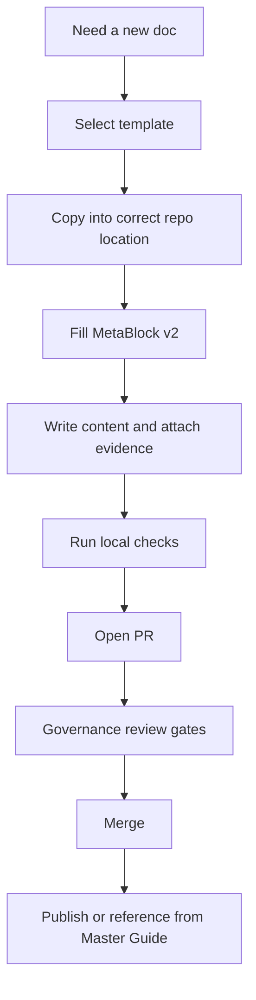

<!-- [KFM_META_BLOCK_V2]
doc_id: kfm://doc/da0ec916-85a3-49ed-a87c-ef1d499a2293
title: docs/templates
type: standard
version: v1
status: draft
owners: KFM Docs Maintainers
created: 2026-02-28
updated: 2026-02-28
policy_label: public
related:
  - docs/MASTER_GUIDE_v13.md
  - docs/glossary.md
tags: [kfm, docs, templates]
notes:
  - Directory README for governed document templates (Universal Doc, Story Node v3, API contract extension).
[/KFM_META_BLOCK_V2] -->

# docs/templates

> Governed document templates for Kansas Frontier Matrix (KFM): use these to create **consistent, evidence-first, policy-aware** docs.


---

## Navigation

- [Purpose](#purpose)
- [Where this fits](#where-this-fits)
- [What lives here](#what-lives-here)
- [Templates in this directory](#templates-in-this-directory)
- [Directory tree](#directory-tree)
- [How to use a template](#how-to-use-a-template)
- [MetaBlock v2](#metablock-v2)
- [Template selection matrix](#template-selection-matrix)
- [Contribution rules](#contribution-rules)
- [FAQ](#faq)

---

## Purpose

This folder contains **KFM-governed Markdown templates**. The templates standardize:

- **Metadata** (via *MetaBlock v2* embedded as an HTML comment)
- **Traceability** (clear places to put EvidenceRefs / citations / artifacts)
- **Review readiness** (sections and checklists that map to governance gates)

> NOTE: Templates are **starter kits**, not final documents. Copy them into the correct docs location and fill in real content.

---

## Where this fits

Within the repository documentation tree:

- `docs/` is the home for canonical governed documentation (guides, designs, runbooks, etc.)
- `docs/templates/` is the home for the **template sources** (universal docs, story nodes, and API contract extensions)

---

## What lives here

✅ **Acceptable inputs**

- Markdown templates prefixed `TEMPLATE__...`
- Snippets that are reused across templates (optional), **if** they are clearly marked as snippets
- This `README.md`

🚫 **Exclusions (do not put these here)**

- Live architecture docs (put in `docs/architecture/`)
- ADRs (put in `docs/architecture/adr/`)
- Story Node content (put under `docs/reports/story_nodes/...`)
- Dataset specs or run receipts (store with their owning subsystem / pipeline outputs)

---

## Templates in this directory

> The filenames below are the **expected** core templates in this folder.

| Template | Use for | Output target | Notes |
|---|---|---|---|
| `TEMPLATE__KFM_UNIVERSAL_DOC.md` | Guides, standards, runbooks, design notes | `docs/...` | General-purpose “universal doc” skeleton |
| `TEMPLATE__STORY_NODE_V3.md` | Story Nodes (narrative + map state) | `docs/reports/story_nodes/...` | Story Nodes typically have **markdown + sidecar JSON** |
| `TEMPLATE__API_CONTRACT_EXTENSION.md` | API change notes that complement OpenAPI | `docs/...` (often near `contracts/`) | Captures rationale, compatibility, policy impact |

---

## Directory tree

```text
docs/templates/
├── README.md                          # This directory guide (how to use templates, naming rules)
├── TEMPLATE__KFM_UNIVERSAL_DOC.md      # Universal governed doc template (existing)
├── TEMPLATE__STORY_NODE_V3.md          # Story Node v3 markdown skeleton (existing)
├── TEMPLATE__API_CONTRACT_EXTENSION.md # API contract extension notes (existing)
│
├── _partials/                          # Reusable snippets to keep templates consistent
│   ├── PARTIAL__KFM_META_BLOCK_V2.md    # Copy/paste HTML comment MetaBlock v2
│   ├── PARTIAL__BADGES_ROW.md           # Shields/badges row (status, policy, owners, etc.)
│   ├── PARTIAL__QUICK_NAV.md            # “Jump to…” anchors block
│   ├── PARTIAL__NORMATIVE_LANGUAGE.md   # MUST/SHOULD/MAY legend + tagging pattern
│   ├── PARTIAL__GOVERNANCE_CALLOUTS.md  # NOTE/TIP/WARNING callouts for policy/evidence
│   ├── PARTIAL__MERMAID_TRUTH_PATH.mmd  # Raw→Work→Processed→Catalog→Published diagram
│   └── PARTIAL__MERMAID_TRUST_MEMBRANE.mmd # Clients→Governed API→Policy→Stores diagram
│
├── standard/                           # General “house” docs that recur everywhere
│   ├── TEMPLATE__DIRECTORY_README.md    # Directory documentation standard (purpose/inputs/exclusions)
│   ├── TEMPLATE__RUNBOOK.md             # Operational runbook (SLOs, alerts, rollback, contacts)
│   ├── TEMPLATE__ADR.md                 # Architecture Decision Record (decision, context, consequences)
│   ├── TEMPLATE__CHANGELOG_ENTRY.md     # Changelog fragment format (traceable + reversible)
│   ├── TEMPLATE__RELEASE_NOTES.md       # Release notes (what changed + evidence + gates)
│   └── TEMPLATE__CHECKLIST.md           # Generic checklist skeleton (DoD / gates / signoffs)
│
├── data/                               # Dataset-facing templates (registry/specs/QA/catalog/prov)
│   ├── TEMPLATE__DATASET_REGISTRY_ENTRY.yml # YAML skeleton: id, license, cadence, sensitivity, links
│   ├── TEMPLATE__DATASET_SPEC.md        # Dataset spec: schema, extents, QA rules, lifecycle zone
│   ├── TEMPLATE__SOURCE_SNAPSHOT.md     # Upstream snapshot record: fetch method, checksum, timestamp
│   ├── TEMPLATE__QA_REPORT.md           # Validation results + thresholds + exceptions
│   ├── TEMPLATE__PROMOTION_REQUEST.md   # “Promote WORK→PROCESSED/PUBLISHED” request + evidence refs
│   ├── TEMPLATE__PROMOTION_RECEIPT.md   # Promotion receipt: who/what/when/why + hashes + policy label
│   ├── TEMPLATE__STAC_COLLECTION.json   # Minimal STAC Collection skeleton (placeholders)
│   ├── TEMPLATE__STAC_ITEM.json         # Minimal STAC Item skeleton (placeholders)
│   ├── TEMPLATE__DCAT_DATASET.ttl       # DCAT Dataset stub (if you store RDF/Turtle)
│   └── TEMPLATE__PROV_ACTIVITY.jsonld   # PROV Activity skeleton (inputs/outputs/agents/tools)
│
├── evidence/                            # Evidence binding + resolution artifacts
│   ├── TEMPLATE__EVIDENCE_REF.md         # EvidenceRef authoring guide + canonical fields
│   ├── TEMPLATE__EVIDENCE_BUNDLE.json    # EvidenceBundle skeleton (resolved + redacted + provenance)
│   ├── TEMPLATE__CITATION_BLOCK.md       # “Cite-or-abstain” block for docs/UI answers
│   └── TEMPLATE__REDACTION_LOG.md        # What was redacted, why, by which rule, when
│
├── api/                                 # API governance + contract supporting docs
│   ├── TEMPLATE__OPENAPI_MODULE.yml      # OpenAPI stub per service/module (tags, servers, security)
│   ├── TEMPLATE__API_ERROR_MODEL.md      # Error taxonomy + examples + mapping to HTTP codes
│   ├── TEMPLATE__AUTH_MATRIX.md          # AuthN/AuthZ matrix (roles×endpoints×obligations)
│   ├── TEMPLATE__DEPRECATION_POLICY.md   # Versioning + deprecation windows + migration guidance
│   └── TEMPLATE__ENDPOINT_REVIEW.md      # Endpoint review checklist (policy hooks, evidence, caching)
│
├── policy/                               # Policy-as-code and decision records
│   ├── TEMPLATE__POLICY_LABELS.yml        # Policy label catalog (public/restricted/etc.) + meanings
│   ├── TEMPLATE__OPA_POLICY.rego          # Rego policy skeleton (inputs, decisions, obligations)
│   ├── TEMPLATE__OPA_TEST.rego            # Rego test skeleton (deny-by-default checks)
│   ├── TEMPLATE__POLICY_DECISION_RECORD.md # PDR: why a rule exists + threat model + scope
│   └── TEMPLATE__OBLIGATION_HANDLING.md   # How to implement obligations in APIs/UI (redact, degrade)
│
├── ux/                                   # UI/Story/Map copy + accessibility patterns
│   ├── TEMPLATE__DATASET_PAGE_COPY.md     # Dataset landing page structure (what/where/limits/evidence)
│   ├── TEMPLATE__LAYER_METADATA_PANEL.md  # Map layer panel (source, time, scale, confidence)
│   ├── TEMPLATE__FOCUS_MODE_ANSWER_CARD.md# Answer structure (claim → evidence → caveats → links)
│   └── TEMPLATE__A11Y_CHECKLIST.md        # Accessibility checklist (keyboard, contrast, ARIA, etc.)
│
└── examples/                             # Filled-in examples for fast adoption + testing
    ├── EXAMPLE__UNIVERSAL_DOC__PUBLISHED.md
    ├── EXAMPLE__STORY_NODE_V3__PUBLISHED.md
    ├── EXAMPLE__DATASET_REGISTRY_ENTRY.yml
    ├── EXAMPLE__STAC_COLLECTION.json
    ├── EXAMPLE__RUN_RECEIPT.json
    └── EXAMPLE__POLICY_DECISION_RECORD.md
```

If your local tree differs, treat the table above as the **minimum expected set** and update this README when adding/removing templates.

---

## How to use a template

1. **Pick the right template** (see the [selection matrix](#template-selection-matrix)).
2. **Copy it** into the destination folder (do *not* edit the template in place for one-off docs).
3. **Fill in MetaBlock v2** (doc_id is stable; updated changes on meaningful edits).
4. Replace placeholder sections with real content.
5. Add evidence: cite primary sources, link artifacts, and include explicit assumptions.

Example:

```bash
# Example: start a new architecture note from the Universal Doc template
cp docs/templates/TEMPLATE__KFM_UNIVERSAL_DOC.md docs/architecture/my_topic.md
```

---

## MetaBlock v2

MetaBlock v2 is structured metadata **without YAML frontmatter**. In Markdown, keep it as an **HTML comment** so it doesn’t render, but remains machine-readable.

```text
<!-- [KFM_META_BLOCK_V2]
doc_id: kfm://doc/<uuid>
title: <Title>
type: <guide|standard|story|dataset_spec|adr|run_receipt>
version: v1
status: draft|review|published
owners: <team or names>
created: YYYY-MM-DD
updated: YYYY-MM-DD
policy_label: public|restricted|...
related:
  - kfm://dataset/<slug>@<version>
  - kfm://story/<id>@<version>
tags:
  - kfm
notes:
  - <short notes>
[/KFM_META_BLOCK_V2] -->
```

**Practical rules**

- `doc_id` must be **stable** (don’t regenerate it on edits).
- `updated` should change on meaningful edits.
- `policy_label` should reflect the intended visibility *if docs are served through governed APIs*.

---

## Template selection matrix

Use this to choose the right starting point.

| If you are writing… | Start here | Why |
|---|---|---|
| A general guide, standard, runbook, or design note | `TEMPLATE__KFM_UNIVERSAL_DOC.md` | Most flexible and broadly applicable |
| A narrative that binds claims to map state + citations | `TEMPLATE__STORY_NODE_V3.md` | Story Nodes are “machine-ingestible storytelling” |
| A non-trivial API change and its implications | `TEMPLATE__API_CONTRACT_EXTENSION.md` | Captures rationale + compatibility + policy impact |

---

## Lifecycle diagram



---

## Contribution rules

> WARNING: Templates are governance-critical. A change here affects how evidence, policy labels, and review gates get applied across the repo.

**When you change a template, you must:**

- [ ] Keep the template **generic** (no project-specific one-off content)
- [ ] Preserve MetaBlock v2 and keep placeholders obvious
- [ ] Update this `README.md` if you add/remove templates or rename files
- [ ] Add an example snippet if you introduce a new required field/section
- [ ] Ensure any new sections have clear “what to put here” instructions

**Recommended “Definition of Done” for template changes**

- [ ] Template has a clear purpose statement
- [ ] Template has a minimal, scannable structure (toc, sections, checklists)
- [ ] Template includes at least one example of an EvidenceRef/citation pattern
- [ ] Links are relative and repo-stable (no ephemeral URLs)

---

## FAQ

**Can I store a finished doc in `docs/templates/`?**  
No. Store finished docs where they belong (e.g., `docs/architecture/`, `docs/governance/`, `docs/reports/story_nodes/...`). This folder is for *templates only*.

**Do we use YAML frontmatter?**  
No. Use MetaBlock v2 (embedded as an HTML comment) so templates remain consistent and machine-parseable.

**What if I don’t see a template for my doc type?**  
Start from `TEMPLATE__KFM_UNIVERSAL_DOC.md`, then propose a new template only if the pattern is reusable across multiple docs.

---

[Back to top](#docstemplates)
