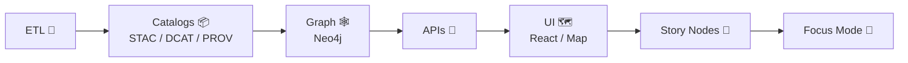

# 🧩 Documentation Templates (`docs/templates/`)

Welcome to the **governed** template hub for Kansas Frontier Matrix (KFM).  
These templates help keep documentation **consistent**, **machine-validated**, and **evidence-backed** 🔍📎

> ⚠️ **Templates are contracts.** If you change a template, assume it can impact validation rules, schemas, Story Node parsing, and review gates.

---

## 🧭 Jump to

- [📘 Overview](#-overview)
- [🗂️ Directory Layout](#️-directory-layout)
- [🧰 Template Catalog](#-template-catalog)
- [🚀 Quickstart](#-quickstart)
- [✅ Definition of Done](#-definition-of-done)
- [🧪 Validation Expectations](#-validation-expectations)
- [🛠️ Adding or Updating Templates](#️-adding-or-updating-templates)
- [🔗 Related Docs](#-related-docs)

---

## 📘 Overview

### 🎯 Purpose
Provide **copy-ready, governed starting points** for:
- canonical docs (guides, designs, runbooks) 📚  
- Story Nodes (narrative + evidence) 📝  
- API contract extensions (contract-first change capture) 🔌  

### 📦 Scope

| In Scope ✅ | Out of Scope 🚫 |
|---|---|
| Template inventory & when to use each | Defining STAC/DCAT/PROV schema details |
| How to copy/fill templates | Implementing ETL / graph / API code |
| Doc governance + “definition of done” | UI rendering rules beyond what templates encode |

### 👥 Audience
- Contributors writing or editing governed docs 👩‍💻👨‍💻  
- Reviewers verifying provenance/governance 🔍  
- Maintainers evolving templates + validation tooling 🧰  

### 🧠 Key idea
KFM is **contract-first + evidence-first**: docs (and stories) should not “float free” of the pipeline—**they must connect back to sources, datasets, schemas, and lineage**.

---

## 🗂️ Directory Layout

### 📁 This folder
```text
```text
📁 docs/
└─ 📁 templates/                               🧩 documentation scaffolds (copy-me starters)
   ├─ 📄 README.md                              📘 how to use templates + naming conventions
   ├─ 📄 TEMPLATE__KFM_UNIVERSAL_DOC.md          📄 universal doc template (KFM-MDP frontmatter + sections)
   ├─ 📄 TEMPLATE__STORY_NODE_V3.md              📚 Story Node template (narrative + citations + map hooks)
   └─ 📄 TEMPLATE__API_CONTRACT_EXTENSION.md     🔌 API contract extension template (types, endpoints, examples)
```

### 🧠 Where templates “land” (typical)
```text
```text
📁 docs/
├─ 📁 architecture/                       🧱 designs, blueprints, ADRs, system diagrams
├─ 📁 governance/                         🛡️ ethics, sovereignty, access/review gates (fail-closed)
├─ 📁 standards/                          📏 repo standards (KFM-MDP, profiles, conventions)
└─ 📁 reports/                            📊 authored outputs (reviewed + versioned)
   └─ 📁 story_nodes/                     📚 Story Node reports (narratives + citations)
      ├─ 📁 draft/                        📝 in-progress Story Nodes (working)
      └─ 📁 published/                    ✅ released Story Nodes (versioned)
```

---

## 🧰 Template Catalog

> Tip 💡: If you’re unsure, start with the **Universal Doc** template and let the content tell you if it needs a stricter shape.

| Template | File | Use When | Typical Destination |
|---|---|---|---|
| 🧱 Universal Doc | `TEMPLATE__KFM_UNIVERSAL_DOC.md` | Most governed docs: guides, designs, runbooks, domain READMEs | `docs/**` |
| 🧠 Story Node (v3) | `TEMPLATE__STORY_NODE_V3.md` | Narrative content intended for Story Node / Focus Mode flows | `docs/reports/story_nodes/draft/<slug>/story.md` |
| 🔌 API Contract Extension | `TEMPLATE__API_CONTRACT_EXTENSION.md` | Proposing/adding/changing API endpoints (contract-first) | `docs/` (proposal) + API contract home (implementation repo path) |

<details>
<summary><strong>🧱 TEMPLATE__KFM_UNIVERSAL_DOC.md</strong> — “Default template” for governed docs</summary>

### Use this when…
- You’re writing a doc that should be **reviewed like code**
- You need **stable headings** and **front-matter metadata**
- You want a built-in **Definition of Done** checklist ✅

### Common pitfalls 🧯
- Removing required headings (breaks validators)
- Leaving “TBD” in key governance fields without a plan
- Making claims without linking to evidence artifacts / datasets / schemas
</details>

<details>
<summary><strong>🧠 TEMPLATE__STORY_NODE_V3.md</strong> — Evidence-backed narrative content</summary>

### Use this when…
- You’re writing a narrative that will be read in the UI as a “Story Node”
- You need structured evidence panels / citations / dataset links

### Common pitfalls 🧯
- Treating Story Nodes like blog posts (they are **governed narrative artifacts**)
- Missing links back to datasets + provenance
- Publishing before upstream artifacts exist (pipeline order matters)
</details>

<details>
<summary><strong>🔌 TEMPLATE__API_CONTRACT_EXTENSION.md</strong> — Contract-first API changes</summary>

### Use this when…
- You’re proposing a new endpoint or modifying an existing one
- You need to capture: breaking changes, versioning, compatibility notes

### Common pitfalls 🧯
- Implementing code first and “documenting later”
- Skipping backward compatibility analysis
- Not linking the change to schemas / tests / fixtures
</details>

---

## 🚀 Quickstart

### 1) Pick the right template ✅
Use the [Template Catalog](#-template-catalog) to choose.

### 2) Copy it into the correct home 📌
Example (Universal Doc):
```bash
cp docs/templates/TEMPLATE__KFM_UNIVERSAL_DOC.md docs/<area>/<your_doc_name>.md
```

Example (Story Node):
```bash
mkdir -p docs/reports/story_nodes/draft/<story_slug>/assets
cp docs/templates/TEMPLATE__STORY_NODE_V3.md docs/reports/story_nodes/draft/<story_slug>/story.md
```

### 3) Fill YAML front-matter 🧾
- Prefer **“TBD”** / **“n/a”** over deleting fields (helps tooling stay stable)
- Ensure `path:` matches the file location
- Tag sensitivity/governance fields clearly (especially for restricted data)

### 4) Write evidence-first ✍️🔍
- Every factual claim should link to **datasets, schemas, or sources**
- Prefer repo-local references over external links when possible

### 5) Run validations 🧪
- Follow the repo’s documentation validation workflow (CI + doc checks)
- If CI fails: fix the doc/template rather than bypassing checks

---

## 🧠 Canonical pipeline reminder (why Story Nodes come last)



> ✅ The punchline: **No stage leapfrogs upstream contracts.**  
> Story Nodes are “downstream” of evidence, catalogs, and lineage.

---

## ✅ Definition of Done

Use this checklist when authoring any governed doc (including Story Nodes):

- [ ] **Front-matter complete + valid** (matches governed template + profiles)
- [ ] **All claims are linked** to datasets, schemas, or source references
- [ ] **Validation steps are listed** and repeatable (if describing a process)
- [ ] **Governance / FAIR+CARE / sovereignty** considerations are explicitly stated
- [ ] No broken internal links 🔗
- [ ] No secrets / PII / sensitive coordinates accidentally included 🛡️

---

## 🧪 Validation Expectations

Documentation is expected to be validated in CI (fail-closed). Common checks include:

- 🧾 YAML front-matter + required sections validation
- 🔗 Link/reference validation (no broken internal links / missing refs)
- 🧩 JSON schema validation for structured artifacts (STAC/DCAT/PROV, Story Node metadata, etc.)
- 🕸️ Graph integrity checks (constraints + ontology assumptions)
- 🔌 API contract tests (OpenAPI / GraphQL lint + endpoint expectations)
- 🛡️ Security & governance scans (secrets, PII, sensitive location leakage, classification downgrades)

> If your change “only touches docs” but fails these checks, that’s not noise—**it’s governance doing its job** ✅

---

## 🛠️ Adding or Updating Templates

### When should you create a new template? 🤔
Create a new template when a doc type:
- repeats often,
- needs consistent headings for machine parsing, and/or
- has governance and review gates that must be explicit.

### Template design rules 📐
- Keep required headings stable (validators often rely on them)
- Prefer explicit placeholders (`TBD`, `n/a`) over missing fields
- Include an embedded **Definition of Done** checklist
- Provide at least one **worked example** (even a small one)

### Template change checklist ✅
- [ ] Bump template version (if versioned in front-matter)
- [ ] Confirm affected docs can still validate (or plan a migration)
- [ ] Update any docs that reference the template (e.g., Master Guide)
- [ ] Update validators/schemas if fields/structure changed
- [ ] Add/adjust CI tests for the new/updated contract

---

## 🔗 Related Docs

- 📘 `docs/MASTER_GUIDE_v13.md` (canonical pipeline + structure)
- 🧾 `docs/standards/KFM_MARKDOWN_WORK_PROTOCOL.md` (authoring + validation conventions)
- 🏛️ `docs/governance/ROOT_GOVERNANCE.md`
- ⚖️ `docs/governance/ETHICS.md`
- 🧭 `docs/governance/SOVEREIGNTY.md`

---

### ✨ Tiny quality-of-life tips

- Use `@mentions`, `#issue` links, and task lists in PRs to keep doc work reviewable ✅  
- Use `<details>` blocks for long examples so pages stay readable 📚  
- Use Mermaid diagrams sparingly, but consistently, when they clarify contracts 🗺️
