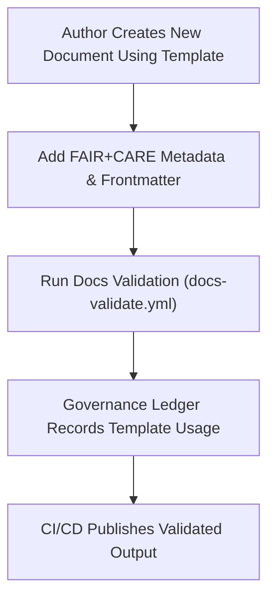

<div align="center">

# 📘 **Kansas Frontier Matrix — Documentation Templates Hub (v2.1.1 · Tier-Ω+∞ Certified)**  
`docs/templates/README.md`

**Mission:** Serve as the official repository for **documentation templates** used across the **Kansas Frontier Matrix (KFM)**,  
ensuring reproducibility, FAIR+CARE compliance, and governance traceability in every document, model, and workflow.

[](../../docs/)
[](../../docs/standards/faircare-validation.md)
[](../../data/reports/audit/data_provenance_ledger.json)
[](../../LICENSE)

</div>

---

## 📚 Overview

The **Templates Hub** provides standard file structures and authoring blueprints for:
- 📄 **SOPs (Standard Operating Procedures)**  
- 🧪 **Experiments & Research Logs**  
- 🧠 **Model Cards (AI Transparency)**  
- ⚙️ **Governance & Review Records**

All templates are built according to **MCP-DL v6.4.3** and validated under **FAIR+CARE governance** to ensure:
- Complete metadata frontmatter  
- Accessibility and reproducibility compliance  
- Version and provenance traceability via the governance ledger  

---

## 🗂️ Directory Layout

```bash
docs/templates/
├── README.md                        # This file — Template index and governance overview
├── sop.md                           # Standard Operating Procedure (SOP) template
├── experiment.md                    # Experimental log & reproducibility template
├── model_card.md                    # AI Model Card template for governance and ethics
└── governance/                      # Future governance template extensions
```

---

## ⚙️ Template Governance Workflow


<!-- END OF MERMAID -->

---

## 🧱 Template Requirements

| Field | Description | Example |
|:--|:--|:--|
| **title** | Human-readable document title. | `"AI Ethics Experiment Summary"` |
| **version** | Semantic version tag for document or model. | `"v2.1.1"` |
| **last_updated** | ISO 8601 date of last modification. | `"2025-11-16"` |
| **owners** | Responsible maintainers or teams. | `["@kfm-docs","@kfm-governance"]` |
| **license** | License type — must be CC-BY 4.0. | `"CC-BY 4.0"` |

> ⚠️ **Note:** All templates must include governance and provenance metadata to ensure audit compliance.

---

## 🧩 FAIR + CARE Compliance in Templates

| Principle | Template Implementation | Validation Workflow |
|:--|:--|:--|
| **Findable** | Indexed through manifest and governance ledger. | `governance-ledger.yml` |
| **Accessible** | Markdown + YAML accessible and WCAG 2.1 AA compliant. | `docs-validate.yml` |
| **Interoperable** | Uses open YAML and JSON schema for reuse. | `policy-check.yml` |
| **Reusable** | Templates versioned and licensed under CC-BY 4.0. | GitHub Repository |
| **Collective Benefit (CARE)** | Promotes inclusive, ethical documentation practices. | `faircare-validate.yml` |

---

## 🧠 Template Categories

| Template | Description | Validation Workflow |
|:--|:--|:--|
| **sop.md** | Defines a structured guide for procedural documentation. | `docs-validate.yml` |
| **experiment.md** | Records scientific or research-oriented findings for reproducibility. | `faircare-validate.yml` |
| **model_card.md** | Captures metadata, performance, and ethical impact of AI models. | `policy-check.yml` |

---

## 🧮 Validation Workflows

| Workflow | Purpose | Output |
|:--|:--|:--|
| `docs-validate.yml` | Validates structure, accessibility, and metadata. | `reports/validation/docs_validation.json` |
| `policy-check.yml` | Ensures frontmatter fields are complete and standardized. | `reports/audit/policy_check.json` |
| `faircare-validate.yml` | Verifies ethical documentation practices. | `reports/fair/data_care_assessment.json` |
| `governance-ledger.yml` | Logs checksum and provenance of published templates. | `data/reports/audit/data_provenance_ledger.json` |

---

## 🧾 Governance Metadata Example

```yaml
---
template_id: "docs_template_sop_v2.1.1"
authors: ["@kfm-docs"]
approved_by: ["@kfm-governance"]
checksum: "sha256:9a8c7eeb3d44bbf5a5f2c89e2e..."
governance_ledger_entry: "data/reports/audit/data_provenance_ledger.json"
faircare_status: "Compliant"
license: "CC-BY 4.0"
---
```

---

## 🧾 Version History

| Version | Date | Author | Summary |
|:--|:--|:--|:--|
| **v2.1.1** | 2025-11-16 | @kfm-docs | Standardized template governance and validation workflow integration. |
| v2.0.0 | 2025-10-25 | @kfm-governance | Introduced FAIR+CARE auditing and accessibility integration. |
| v1.0.0 | 2025-10-04 | @kfm-architecture | Initial release of KFM documentation templates hub. |

---

<div align="center">

**Kansas Frontier Matrix © 2025**  
*“Templates Are Structure — Governance Gives Them Integrity.”*  
📍 `docs/templates/README.md` — Central repository for documentation templates and governance alignment under the Kansas Frontier Matrix.

</div>
