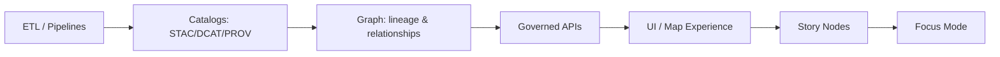

# docs/templates

✅ **Governed** • 🧾 **Evidence-first** • 📑 **Contract-first** • 🧭 **Trust-membrane aligned**

This folder contains **standard, governed templates** used to author KFM documentation in a way that is:
- **machine-checkable** (CI can validate structure),
- **auditable** (clear provenance + reviewable change history),
- **safe** (sensitivity + sovereignty guardrails),
- **consistent** (predictable headings and metadata across the repo).

> **Rule:** Copy a template, fill it in, and **do not reorder/remove required headings** unless you are explicitly versioning the template and following governance review.

---

## 📦 Template Index

| Template (file) | Use when you are… | Output typically lives in… | Notes |
|---|---|---|---|
| [`TEMPLATE__KFM_UNIVERSAL_DOC.md`](./TEMPLATE__KFM_UNIVERSAL_DOC.md) | Writing a governed KFM doc (runbook, standard, design note, domain module README, etc.) | `docs/**` (varies by subsystem) | The baseline structure used across most KFM documentation. |
| [`TEMPLATE__STORY_NODE_V3.md`](./TEMPLATE__STORY_NODE_V3.md) | Writing a **Story Node** (machine-ingestible narrative for map-first storytelling + Focus Mode) | `docs/reports/story_nodes/{draft|published}/…` | **v3 structure is enforced**; treat as a contract. |
| [`TEMPLATE__API_CONTRACT_EXTENSION.md`](./TEMPLATE__API_CONTRACT_EXTENSION.md) | Proposing or changing API behavior (OpenAPI/GraphQL endpoints, request/response semantics, deprecations) | `docs/` (often near `docs/standards/` or API docs) | Must include deprecation notes/timelines for breaking or retired behavior. |

---

## 🧭 How Templates Fit the KFM Pipeline

KFM’s ordering discipline affects how documentation is written (and what can be claimed).



**Implication for writing docs:** A Story Node (or Focus Mode output) must not “jump ahead” of cataloged evidence. If it’s not cataloged/provenanced, it must be labeled *not confirmed* and/or excluded.

---

## ✅ Authoring Workflow

### 1) Pick the right template
Use the table above. When in doubt:
- **Universal Doc** = almost everything.
- **Story Node v3** = narrative content that must remain machine-ingestible.
- **API Contract Extension** = any API change proposal or behavior change.

### 2) Copy the template into its destination
Examples (adjust paths to your repo layout):

```bash
# Universal doc (example)
cp docs/templates/TEMPLATE__KFM_UNIVERSAL_DOC.md \
   docs/architecture/my-new-doc.md

# Story Node v3 (draft)
cp docs/templates/TEMPLATE__STORY_NODE_V3.md \
   docs/reports/story_nodes/draft/my-story/story.md

# API contract extension (proposal)
cp docs/templates/TEMPLATE__API_CONTRACT_EXTENSION.md \
   docs/api/changes/2026-02-my-endpoint-change.md
```

### 3) Fill required sections (don’t delete headings)
Templates are designed so CI and reviewers can quickly find:
- scope, definitions, and assumptions,
- evidence and provenance links,
- validation steps and “Definition of Done” checklists,
- governance and sensitivity notes.

### 4) Validate before you open a PR
Minimum expectations for any governed doc (applies to *all* templates):

- [ ] Front-matter is complete and matches the template’s required fields  
- [ ] Every substantive claim is linked to a dataset, schema, or source reference  
- [ ] Validation steps are listed and repeatable  
- [ ] Governance, FAIR/CARE, and sovereignty considerations are explicitly stated  

> If your repo has automated checks (markdown lint, link checking, schema validation, OPA/Conftest rules), treat failures as **stop-the-line**.

---

## 🔒 Non-Negotiables

### Evidence-first narrative (Story Nodes + Focus Mode)
- No unsourced narrative.
- Every claim must cite evidence.
- AI-generated text must be clearly identified and accompanied by provenance/confidence metadata.

### Contract-first documentation
- API + schema changes must be tracked using contract artifacts.
- Treat template structure as part of the “contract surface.”

### Trust membrane rule
Documentation must never normalize unsafe architecture practices.
- The frontend must not query internal stores directly.
- All access goes through governed API boundaries.

---

## 🧬 Versioning & Compatibility

### Template versions are part of governance
- **Story Node v3** is considered a governed structure: changes to headings/fields require explicit versioning and a migration plan.
- API changes must include deprecation documentation/timelines inside the **API contract extension** template.
- If a transformation/migration script exists for template upgrades, it should be referenced from the relevant template or standards docs.

<details>
<summary><strong>Suggested versioning rules (repo policy)</strong></summary>

- **Patch**: typo fixes, clarifications, added examples (no new required fields)
- **Minor**: new optional sections/fields; CI remains backward-compatible
- **Major**: new required sections/fields; requires migration notes + enforcement change

</details>

---

## 🗂️ Directory Context

This folder is expected to exist alongside the rest of the documentation system:

```text
docs/
├── templates/
│   ├── TEMPLATE__KFM_UNIVERSAL_DOC.md
│   ├── TEMPLATE__STORY_NODE_V3.md
│   └── TEMPLATE__API_CONTRACT_EXTENSION.md
├── governance/
│   ├── ROOT_GOVERNANCE.md
│   ├── ETHICS.md
│   ├── SOVEREIGNTY.md
│   └── REVIEW_GATES.md
└── reports/
    └── story_nodes/
        ├── draft/
        └── published/
```

---

## ➕ Adding a New Template (Change-Controlled)

Adding or modifying templates is a **governed change** because it changes how the system produces knowledge artifacts.

**When proposing a new template:**
- [ ] Name matches convention: `TEMPLATE__<SCOPE>__<NAME>.md`
- [ ] Includes required “governed doc” sections (purpose/scope, key artifacts, DoD, validation, governance notes)
- [ ] Includes a version marker (and migration notes if breaking)
- [ ] Has an owner/steward listed (docs team / subsystem owner)
- [ ] Includes or references CI validation rules (where applicable)
- [ ] Triggers governance review per `docs/governance/…` policies

---

## 🧩 FAQ

**Q: Can I delete a section that doesn’t apply?**  
A: Don’t delete required headings. If something is not applicable, explicitly mark it **N/A** and explain why.

**Q: Where do Story Nodes go?**  
A: Under `docs/reports/story_nodes/` with a draft/published workflow.

**Q: What if I can’t cite a claim yet?**  
A: Label it **(not confirmed)** and either (1) move it to an “Assumptions / Hypotheses” section or (2) remove it until evidence is available.

---
