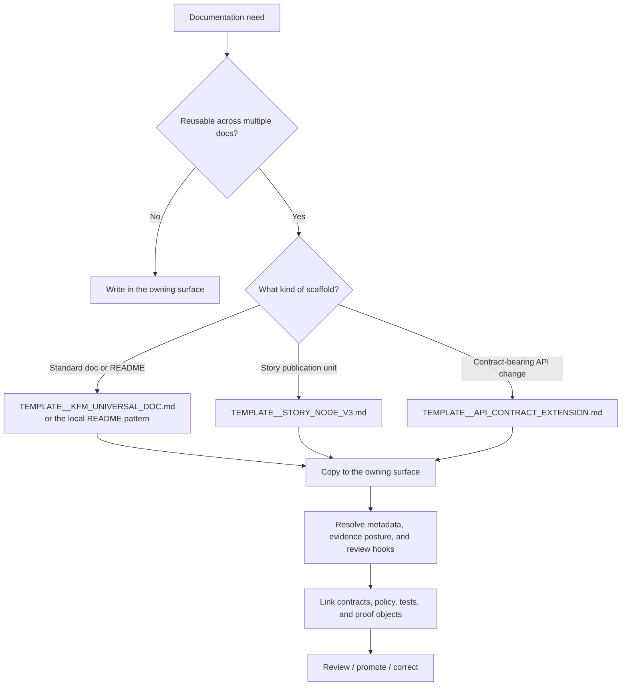

<!-- [KFM_META_BLOCK_V2]
doc_id: kfm://doc/NEEDS_VERIFICATION_UUID
title: templates
type: standard
version: v1
status: draft
owners: @bartytime4life
created: NEEDS_VERIFICATION
updated: 2026-04-05
policy_label: NEEDS_VERIFICATION
related: [../../README.md, ../README.md, ../../.github/CODEOWNERS, ../standards/README.md, ../standards/markdown-rules.md, ../governance/README.md, ../reports/story_nodes/README.md, ./TEMPLATE__KFM_UNIVERSAL_DOC.md, ./TEMPLATE__STORY_NODE_V3.md, ./TEMPLATE__API_CONTRACT_EXTENSION.md]
tags: [kfm, docs, templates, markdown, governance]
notes: [Public-main repo path, local template inventory, and broad /docs/ ownership were re-verified in this revision; repository-assigned doc_id, created date, policy_label, and working-branch parity still need confirmation.]
[/KFM_META_BLOCK_V2] -->

# templates

Governed template hub for reusable KFM documentation scaffolds, promotion-ready doc shells, and review-friendly Markdown patterns.

> **Status:** experimental  
> **Owners:** `@bartytime4life` *(public `/.github/CODEOWNERS` assigns `/docs/` to this owner on public `main`; no narrower `/docs/templates/` rule is visible here)*  
>        
> **Quick jumps:** [Scope](#scope) · [Repo fit](#repo-fit) · [Accepted inputs](#accepted-inputs) · [Exclusions](#exclusions) · [Evidence boundary](#current-evidence-boundary) · [Directory tree](#directory-tree) · [Quickstart](#quickstart) · [Usage](#usage) · [Diagram](#diagram) · [Template registry](#template-registry) · [Task list](#task-list--definition-of-done) · [FAQ](#faq) · [Appendix](#appendix)  
> **Repo fit:** `docs/templates/README.md` · upstream [`../README.md`](../README.md), [`../../README.md`](../../README.md), [`../../.github/CODEOWNERS`](../../.github/CODEOWNERS), [`../standards/README.md`](../standards/README.md), [`../standards/markdown-rules.md`](../standards/markdown-rules.md) · downstream [`./TEMPLATE__KFM_UNIVERSAL_DOC.md`](./TEMPLATE__KFM_UNIVERSAL_DOC.md), [`./TEMPLATE__STORY_NODE_V3.md`](./TEMPLATE__STORY_NODE_V3.md), [`./TEMPLATE__API_CONTRACT_EXTENSION.md`](./TEMPLATE__API_CONTRACT_EXTENSION.md), instantiated docs across `docs/`

> [!IMPORTANT]
> `docs/templates/` standardizes document **shape**, **reviewability**, and **truth posture**. It does not authorize facts, replace contracts or policy, or create a second truth path.

> [!NOTE]
> This revision is public-tree-grounded. The local template inventory, broad `/docs/` ownership signal, and adjacent consumer surfaces are visible on public `main`; repository-assigned metadata, working-branch parity, and any non-public automation or review settings still need direct branch/platform verification.

## Scope

`docs/templates/` is KFM’s reusable scaffold shelf for governed Markdown.

Its job is to make repeatable documentation shapes easy to reuse without letting Markdown drift into unofficial system truth. In practice, that means the files here should help maintainers author directory READMEs, governed standards notes, Story Node publication units, and contract-extension writeups that stay downstream of evidence, policy, review, and correction.

Use this directory when the need is **reusable**, not merely important.

Use it for:

- reusable Markdown templates that apply across more than one doc or directory
- shared metadata, status, evidence-boundary, or review scaffolds
- promotion-aware document shells that make ownership, scope, and verification visible
- lightweight authoring aids that reduce drift across docs without replacing local meaning

Do not use it for:

- filled-in canonical docs that belong in an owning directory
- policy logic, schema truth, or executable contract definitions
- generated evidence objects, manifests, receipts, release artifacts, or runtime outputs
- runtime code, UI code, worker logic, model outputs, data files, or secrets
- one-off drafts that are not actually reusable templates

[Back to top](#templates)

## Repo fit

| Item | Value |
|---|---|
| Path | `docs/templates/README.md` |
| Path status | **CONFIRMED** on public `main`; working-branch parity still **NEEDS VERIFICATION** |
| Role in repo | directory README and template-selection guide for KFM’s reusable documentation scaffold surface |
| Upstream guidance | [`./README.md`](./README.md), [`../README.md`](../README.md), [`../../README.md`](../../README.md), [`../../.github/CODEOWNERS`](../../.github/CODEOWNERS), [`../standards/README.md`](../standards/README.md), [`../standards/markdown-rules.md`](../standards/markdown-rules.md) |
| Adjacent consumer surfaces | [`../standards/README.md`](../standards/README.md), [`../governance/README.md`](../governance/README.md), [`../reports/story_nodes/README.md`](../reports/story_nodes/README.md) |
| Current local inventory | `README.md` plus three checked-in template files under `docs/templates/` |
| Ownership signal | broad public `CODEOWNERS` coverage routes `/docs/` to `@bartytime4life`; no narrower `docs/templates/` rule is visible on public `main` |
| Working rule | instantiate templates in the owning surface; keep `docs/templates/` limited to reusable scaffolds |

### Current public template surface

| Surface | Current public `main` state | Primary job |
|---|---|---|
| [`README.md`](./README.md) | Present | directory contract and selection guide for the template shelf |
| [`TEMPLATE__KFM_UNIVERSAL_DOC.md`](./TEMPLATE__KFM_UNIVERSAL_DOC.md) | Present | general governed-document scaffold with explicit evidence posture, review hooks, and `KFM_META_BLOCK_V2` alignment |
| [`TEMPLATE__STORY_NODE_V3.md`](./TEMPLATE__STORY_NODE_V3.md) | Present | Story Node v3 starter for narrative + sidecar + review/publication state |
| [`TEMPLATE__API_CONTRACT_EXTENSION.md`](./TEMPLATE__API_CONTRACT_EXTENSION.md) | Present | contract-first extension doc scaffold for schema, route, policy, fixture, and rollback-bearing API changes |

### Why this directory matters

This directory matters because KFM treats documentation as a production-facing trust surface. Templates help docs stay reviewable, provenance-conscious, and structurally consistent without turning prose into an unofficial implementation layer.

## Accepted inputs

Content that belongs in `docs/templates/` includes:

| Template class | What belongs here | Notes |
|---|---|---|
| Directory README scaffolds | reusable index patterns for repo directories | keep scope, exclusions, repo fit, and evidence posture explicit |
| Governed document shells | repeatable structures for standards, guidance notes, runbooks, analyses, and other Markdown surfaces that need stable review hooks | use the universal template when no narrower scaffold fits |
| Story publication scaffolds | Story Node starters with claim, evidence, sidecar, review, and publication sections | keep the reusable shell here; instantiate the real node elsewhere |
| Contract-extension templates | documentation scaffolds for API or contract changes that affect schema, routes, policy, fixtures, tests, or rollback posture | keep machine truth in contracts, schemas, policy, fixtures, and tests |
| Authoring aids | metadata comments, checklists, reviewer prompts, and small example fragments | keep them lightweight, repo-native, and obviously reusable |

## Exclusions

The following do **not** belong here as canonical truth:

| Does **not** belong here | Keep it here instead |
|---|---|
| filled-in governance, standards, runbooks, reports, or architecture docs | owning `docs/` subdirectory |
| machine-enforced contracts, schemas, envelopes, DTOs, or controlled vocabularies | [`../../contracts/`](../../contracts/) and [`../../schemas/`](../../schemas/) |
| executable policy bundles, reason/obligation registries, or decision tests | [`../../policy/`](../../policy/) |
| Story Node instances, published narratives, Evidence Drawer payloads, or report deliverables | owning narrative/report surface such as [`../reports/story_nodes/`](../reports/story_nodes/) |
| canonical data artifacts, receipts, manifests, release proofs, or published datasets | [`../../data/`](../../data/) or the owning artifact surface |
| runtime code, workers, UI components, or service logic | owning code surfaces under [`../../apps/`](../../apps/), [`../../packages/`](../../packages/), [`../../pipelines/`](../../pipelines/), or [`../../scripts/`](../../scripts/) |
| secrets, credentials, signed URLs, or sensitive coordinates | never in docs |
| one-off scratch notes that are neither reusable nor review-bearing | a working draft or research surface, not the governed template shelf |

## Evidence labels used here

| Label | Meaning in this README |
|---|---|
| **CONFIRMED** | directly supported by the current public repo tree, checked-in docs, or other visible evidence in this revision |
| **INFERRED** | conservative structural completion supported by repeated project signals, but not directly proven as detailed branch/runtime behavior |
| **PROPOSED** | a repo-native improvement or future template class suggested here on purpose |
| **UNKNOWN** | not established strongly enough to present as current project fact |
| **NEEDS VERIFICATION** | a concrete value or condition that should be checked on the exact working branch before merge |

## Current evidence boundary

This revision grows upward from the existing `docs/templates/README.md`, not from a blank page.

It keeps the current file’s strongest substance, but upgrades the evidence boundary from “source-reported local inventory” to a verified public-main snapshot.

| Observation | Status | Consequence for this README |
|---|---|---|
| `docs/templates/` currently contains `README.md` plus three template files on public `main` | **CONFIRMED** | the local inventory can be described directly instead of being left source-reported and tentative |
| `docs/standards/markdown-rules.md` is present and defines the current Markdown authoring protocol, including `KFM_META_BLOCK_V2` and README rules | **CONFIRMED** | this README should link to it explicitly and stay aligned with it |
| `docs/standards/README.md`, `docs/governance/README.md`, and `docs/reports/story_nodes/README.md` are present on public `main` | **CONFIRMED** | adjacent consumer surfaces can be named directly in repo-fit and usage guidance |
| Public `.github/CODEOWNERS` routes `/docs/` to `@bartytime4life` | **CONFIRMED** | the owner line can name the broad docs owner safely |
| The intended role of each local template file is stated in the template files themselves | **CONFIRMED** | the registry below can describe concrete template roles rather than generic guesses |
| Repository-assigned `doc_id`, original `created` date, final `policy_label`, any narrower subdirectory co-owner rule, and working-branch parity | **NEEDS VERIFICATION** | keep those values visible as placeholders instead of guessing |
| Non-public GitHub rulesets, required checks, environment approvals, and other platform-only settings | **UNKNOWN** | this README should not imply review or automation behavior that the public tree does not prove |

> [!CAUTION]
> The public tree is a strong baseline, but the branch under review still outranks it. Re-check the exact branch before relying on any path, ownership, or local inventory claim during merge.

## Directory tree

Current public `main` shows the following `docs/templates/` layout:

```text
docs/templates/
├── README.md
├── TEMPLATE__API_CONTRACT_EXTENSION.md
├── TEMPLATE__KFM_UNIVERSAL_DOC.md
└── TEMPLATE__STORY_NODE_V3.md
```

Working rule:

```text
docs/templates/                   # reusable scaffold shelf
└── TEMPLATE__*.md               # reusable shells only

docs/<owning-surface>/           # where the real filled-in document belongs
└── <real-document>.md
```

> [!TIP]
> A template succeeds when it reduces drift and review friction without hiding uncertainty or inventing implementation state.

[Back to top](#templates)

## Quickstart

Use an inspection-first sequence before adding, deleting, or revising templates.

> [!WARNING]
> The commands below are the right pre-merge checks in a real checkout. They are examples of what to verify locally on the active branch, not proof that branch-local state still matches public `main`.

### Re-check the current template surface

```bash
sed -n '1,260p' docs/templates/README.md
ls -la docs/templates
find docs/templates -maxdepth 1 -type f | sort
```

### Re-check ownership and governing authoring rules

```bash
sed -n '1,200p' .github/CODEOWNERS
sed -n '1,260p' docs/standards/markdown-rules.md
sed -n '1,220p' docs/standards/README.md
sed -n '1,220p' docs/governance/README.md
sed -n '1,220p' docs/reports/story_nodes/README.md
```

### Open the existing templates before creating a new one

```bash
sed -n '1,260p' docs/templates/TEMPLATE__KFM_UNIVERSAL_DOC.md
sed -n '1,260p' docs/templates/TEMPLATE__STORY_NODE_V3.md
sed -n '1,260p' docs/templates/TEMPLATE__API_CONTRACT_EXTENSION.md
```

### Search for current references

```bash
grep -RIn "TEMPLATE__KFM_UNIVERSAL_DOC\|TEMPLATE__STORY_NODE_V3\|TEMPLATE__API_CONTRACT_EXTENSION" docs .github 2>/dev/null
```

### Start from the smallest fitting scaffold

```bash
# general governed doc or README-like standard doc
cp docs/templates/TEMPLATE__KFM_UNIVERSAL_DOC.md docs/architecture/TARGET.md

# Story Node publication unit
cp docs/templates/TEMPLATE__STORY_NODE_V3.md docs/reports/story_nodes/TARGET.md

# contract-bearing API extension note
cp docs/templates/TEMPLATE__API_CONTRACT_EXTENSION.md docs/standards/TARGET.md
```

## Usage

### Choose the smallest fitting scaffold

| Need | Preferred starting point | Why |
|---|---|---|
| Directory README or general governed Markdown doc | this local README pattern or [`TEMPLATE__KFM_UNIVERSAL_DOC.md`](./TEMPLATE__KFM_UNIVERSAL_DOC.md) | best fit for explicit scope, repo fit, evidence posture, and review hooks |
| Story Node or story-publication doc | [`TEMPLATE__STORY_NODE_V3.md`](./TEMPLATE__STORY_NODE_V3.md) | already carries narrative, sidecar, claim, evidence, review, and publication structure |
| Contract-bearing API change doc | [`TEMPLATE__API_CONTRACT_EXTENSION.md`](./TEMPLATE__API_CONTRACT_EXTENSION.md) | keeps schema, route, policy, fixture, test, and rollback consequences visible |
| Repeated new doc shape not covered by the three existing templates | new template only after a second real need appears | avoids template sprawl and keeps the shelf purposeful |

### Authoring flow

1. Classify the document first: directory README, standard doc, Story Node, or contract-bearing API extension.
2. Read [`../standards/markdown-rules.md`](../standards/markdown-rules.md) before changing template protocol or metadata conventions.
3. Open the nearest existing template and the nearest adjacent README to match local rhythm and terminology.
4. Copy the chosen template into the owning surface and rename it for the real topic.
5. Resolve the top-of-file metadata first: status, owners, quick jumps, repo fit, and any `KFM_META_BLOCK_V2` placeholders.
6. Link behavior-significant claims to the owning contracts, schemas, policy docs, fixtures, tests, workflows, or implementation files where those exist.
7. Keep `CONFIRMED`, `INFERRED`, `PROPOSED`, `UNKNOWN`, and `NEEDS VERIFICATION` visible when certainty is partial.
8. Update this README in the same change if local template inventory, ownership guidance, or template-selection rules change.

### Selection rule

Use the smallest template that preserves truth posture. A template is doing its job when it standardizes **shape**, **reviewability**, and **handoff clarity** without pretending to be the source of runtime truth.

> [!TIP]
> Before creating a fourth template, check whether a directory-local README pattern or the universal template already covers the need.

## Diagram


```mermaid
flowchart TD
    A[Documentation need] --> B{Reusable across multiple docs?}
    B -- No --> C[Write in the owning surface]
    B -- Yes --> D{What kind of scaffold?}
    D -- Standard doc or README --> E[TEMPLATE__KFM_UNIVERSAL_DOC.md<br/>or the local README pattern]
    D -- Story publication unit --> F[TEMPLATE__STORY_NODE_V3.md]
    D -- Contract-bearing API change --> G[TEMPLATE__API_CONTRACT_EXTENSION.md]
    E --> H[Copy to the owning surface]
    F --> H
    G --> H
    H --> I[Resolve metadata, evidence posture, and review hooks]
    I --> J[Link contracts, policy, tests, and proof objects]
    J --> K[Review / promote / correct]
```

Templates are an authoring control surface, not a substitute for evidence, policy, or runtime enforcement.

## Template registry

### Current checked-in inventory

| File | Current public `main` status | Intended use | Where the instantiated artifact belongs |
|---|---|---|---|
| [`README.md`](./README.md) | **CONFIRMED** | directory contract and selection guide for this shelf | stays in `docs/templates/` |
| [`TEMPLATE__KFM_UNIVERSAL_DOC.md`](./TEMPLATE__KFM_UNIVERSAL_DOC.md) | **CONFIRMED** | general governed KFM Markdown docs that need explicit evidence posture, reviewability, and repo-native structure | the owning `docs/` surface or other real destination outside `docs/templates/` |
| [`TEMPLATE__STORY_NODE_V3.md`](./TEMPLATE__STORY_NODE_V3.md) | **CONFIRMED** | Story Node v3 authoring seed for narrative, sidecar, evidence, and publication state | [`../reports/story_nodes/`](../reports/story_nodes/) or another owning narrative/publication surface |
| [`TEMPLATE__API_CONTRACT_EXTENSION.md`](./TEMPLATE__API_CONTRACT_EXTENSION.md) | **CONFIRMED** | contract-first documentation for API or contract changes with schema, route, policy, fixture, and rollback consequences | standards-, contract-, or ADR-adjacent owning surface |
| Additional lightweight template classes | **PROPOSED** | only when a doc shape appears often enough to justify long-term maintenance | owning surface after review and shelf update |

### What a KFM-friendly template should standardize

| Concern | Minimum expectation |
|---|---|
| Purpose | one-line statement of what the instantiated doc is for |
| Status + owners | visible near the top |
| Scope | what belongs and what does not |
| Repo fit | path plus upstream/downstream context |
| Evidence boundary | what is confirmed, inferred, proposed, unknown, or still needs verification |
| Relative links | repo-native paths by default |
| Reviewability | explicit checklist, definition of done, or verification backlog |
| Truth posture | no silent upgrade from partial evidence to confident implementation fact |
| Promotion path | where the filled-in artifact belongs once it stops being a scaffold |

### When to update this README

Update this file when any of the following change:

| Change | Why it belongs here |
|---|---|
| a template file is added, removed, renamed, or retired | this README is the inventory and selection guide |
| the preferred scaffold for a doc class changes | authors need one stable routing surface |
| template-boundary rules change | the shelf should describe what belongs here and what does not |
| `docs/standards/markdown-rules.md` changes template protocol | this README should stay aligned with the governing authoring rules |
| ownership or review-routing signals change materially | the top impact block and task list should stay honest |

[Back to top](#templates)

## Task list / definition of done

- [ ] The working branch still contains the template inventory described here, or this README is updated in the same change.
- [ ] `.github/CODEOWNERS` still routes `/docs/` ownership as described here, or the owners line is revised.
- [ ] `docs/standards/markdown-rules.md` still matches the authoring assumptions this README points to.
- [ ] New templates are genuinely reusable across more than one doc or directory.
- [ ] No instantiated doc truth, policy body, schema, release artifact, or runtime output was moved here for convenience.
- [ ] Relative links render correctly from `docs/templates/README.md`.
- [ ] Mermaid diagrams render cleanly in GitHub.
- [ ] Remaining unresolved metadata in the KFM meta block is still intentionally review-visible rather than guessed.

## FAQ

### What is actually confirmed right now?

On public `main`, `docs/templates/` contains this README plus three template files. Broad ownership of `/docs/` is visible in public `CODEOWNERS`. What still needs branch-level verification is whether the active branch matches that snapshot and whether any narrower local owner rule has been added since.

### Should a finished Story Node or API contract live here?

No. Only the reusable scaffold belongs here. The instantiated artifact belongs in its owning surface.

### When is a new template justified?

When the same governed doc shape will be reused across multiple files or directories, and a reusable scaffold will reduce drift, review ambiguity, or missing-section risk.

### Is `docs/standards/markdown-rules.md` optional reading?

No. It is the upstream authoring protocol for Markdown structure, metadata, and review-visible truth posture. Template edits should stay aligned with it.

### Is this directory allowed to set policy?

No. It can scaffold policy-facing docs, but canonical policy logic still belongs in governed policy and contract surfaces.

## Appendix

<details>
<summary>Starter checklist for future template files</summary>

Use this as a lightweight screen before adding a new reusable template:

- include a clear title and one-line purpose
- make status, owners, and intended audience visible
- state accepted inputs and exclusions
- include repo fit and destination guidance
- add evidence-boundary guidance or truth-posture reminders
- keep relative links repo-native
- include a review checklist or definition of done
- point promoted artifacts to their owning surface
- avoid embedding repo-specific implementation claims the template itself cannot prove
- prefer review-visible placeholders such as `NEEDS VERIFICATION` over invented specificity
- update this README in the same change if the local template inventory changes

</details>

[Back to top](#templates)
