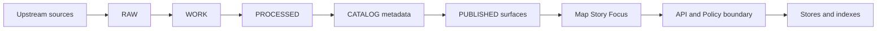

<!-- [KFM_META_BLOCK_V2]
doc_id: kfm://doc/da0ec916-85a3-49ed-a87c-ef1d499a2293
title: docs/templates
type: standard
version: v1
status: draft
owners: KFM Docs Maintainers
created: 2026-02-28
updated: 2026-03-05
policy_label: public
related:
  - docs/MASTER_GUIDE_v13.md
  - docs/glossary.md
tags: [kfm, docs, templates]
notes:
  - Directory README for governed document templates (Universal Doc, Story Node v3, API contract extension).
  - This file distinguishes CONFIRMED vs PROPOSED template inventory to prevent “phantom files.”
[/KFM_META_BLOCK_V2] -->

<a id="top"></a>

# docs/templates
Governed document templates for Kansas Frontier Matrix (KFM): **contract-first**, **deterministic**, **evidence-first**, **policy-aware**, and **review-ready**.

---

## Impact

**Status:** `draft`  
**Owners:** `KFM Docs Maintainers`  
**Policy label:** `public` (visibility) · **Enforcement stance:** `default-deny / fail-closed` (when uncertain)


**Quick links:** [Purpose](#purpose) · [What exists here](#what-exists-here-confirmed) · [Quickstart](#quickstart) · [MetaBlock v2](#metablock-v2) · [Contribution rules](#contribution-rules) · [FAQ](#faq)

---

## Navigation

- [Purpose](#purpose)
- [Where this fits](#where-this-fits)
- [Acceptable inputs](#acceptable-inputs)
- [Exclusions](#exclusions)
- [What exists here](#what-exists-here-confirmed)
- [Directory tree](#directory-tree-confirmed)
- [Quickstart](#quickstart)
- [How to use templates](#how-to-use-templates)
- [MetaBlock v2](#metablock-v2)
- [Template selection matrix](#template-selection-matrix)
- [Truth path alignment](#truth-path-alignment)
- [Contribution rules](#contribution-rules)
- [Proposed expansion](#proposed-expansion-optional)
- [FAQ](#faq)

---

## Purpose

This directory holds **governed templates** used to standardize how KFM captures:

- **Structured metadata** (MetaBlock v2)
- **Traceability** (explicit slots for EvidenceRefs, artifacts, checksums, citations)
- **Policy clarity** (policy label + obligations/redaction notes)
- **Review readiness** (checklists aligned to fail-closed governance gates)

> WARNING: Templates are governance-critical. A template change can change how evidence and policy are captured across the repo.

---

## Where this fits

KFM uses **canonical homes** (one source of truth per subsystem). This directory is the canonical home for **document templates**.

Common related homes:

- Canonical documentation: `docs/`
- Templates: `docs/templates/` (this directory)
- Story Node content (draft/published): `docs/reports/story_nodes/`
- Schemas (STAC/DCAT/PROV, story nodes, UI, telemetry): `schemas/`
- API implementation + contract definitions: `src/server/` (often `src/server/contracts/` or similar)

---

## Acceptable inputs

✅ **Allowed**

- Templates prefixed `TEMPLATE__...` (governed doc skeletons)
- Examples prefixed `EXAMPLE__...` (filled reference artifacts used for onboarding/tests)
- This directory’s `README.md`

🟡 **Allowed only if clearly labeled as PROPOSED (not yet present)**

- Future template inventories (new subfolders, new template names) **as proposals**, not as claims

---

## Exclusions

🚫 **Do not put these here**

- Finished “live” docs (put them in their owning `docs/...` path)
- Pipeline run outputs or generated artifacts (store in data zones / build outputs)
- Runtime-enforced contracts/schemas (prefer `schemas/` and/or `src/server/contracts/` as canonical homes)

---

## What exists here (CONFIRMED)

This section lists **only** the items that are explicitly referenced as present in the v13 layout.

| Template | Primary use | Typical output target | Notes |
|---|---|---|---|
| `TEMPLATE__KFM_UNIVERSAL_DOC.md` | Guides, standards, runbooks, design notes | `docs/...` | Default governed doc skeleton |
| `TEMPLATE__STORY_NODE_V3.md` | Story Nodes (narrative + citations; often with sidecar) | `docs/reports/story_nodes/...` | Story Nodes bind narrative to map state + citations |
| `TEMPLATE__API_CONTRACT_EXTENSION.md` | API change notes that complement the API contract | `docs/...` near the owning subsystem | Captures rationale, compatibility, policy impact |

> NOTE: “Typical output targets” are **conventions**. The canonical home rule (one source of truth per subsystem) is the enforcement boundary.

---

## Directory tree (CONFIRMED)

```text
docs/templates/
├── README.md
├── TEMPLATE__KFM_UNIVERSAL_DOC.md
├── TEMPLATE__STORY_NODE_V3.md
└── TEMPLATE__API_CONTRACT_EXTENSION.md
```

---

## Quickstart

### 1) Start a governed doc (Universal Doc)

```bash
cp docs/templates/TEMPLATE__KFM_UNIVERSAL_DOC.md docs/architecture/my_topic.md
```

### 2) Start a Story Node draft

```bash
mkdir -p docs/reports/story_nodes/draft/my_story_slug
cp docs/templates/TEMPLATE__STORY_NODE_V3.md docs/reports/story_nodes/draft/my_story_slug/story.md
```

### 3) Start an API contract extension note

```bash
cp docs/templates/TEMPLATE__API_CONTRACT_EXTENSION.md docs/architecture/api/my_service__contract_extension.md
```

> IMPORTANT: Copy templates into their owning home. Avoid editing templates for one-off docs.

---

## How to use templates

1. Pick the right template (see [Template selection matrix](#template-selection-matrix)).
2. Copy the template into the destination folder (**don’t** edit the template for a one-off).
3. Fill in **MetaBlock v2**:
   - `doc_id` stays stable over time
   - `updated` changes on meaningful edits
   - `policy_label` reflects intended visibility (default-deny when uncertain)
4. Replace placeholders with real content.
5. Bind claims to evidence (EvidenceRefs, artifacts, checksums, citations).
6. Run local checks (lint/link checks/schema validations/policy tests) **as applicable**.
7. Open PR → pass governance gates → merge.

---

## MetaBlock v2

MetaBlock v2 provides structured metadata **without YAML frontmatter**. In Markdown, wrap it as an **HTML comment** so it does not render but remains machine-readable.

```text
<!-- [KFM_META_BLOCK_V2]
doc_id: kfm://doc/<uuid>
title: <Title>
type: <guide|standard|story|dataset_spec|adr|run_receipt|...>
version: v1
status: draft|review|published
owners: <team or names>
created: YYYY-MM-DD
updated: YYYY-MM-DD
policy_label: public|restricted|...
related:
  - kfm://dataset/<slug>@<version>
  - kfm://story/<id>@<version>
tags:
  - kfm
notes:
  - <short notes>
[/KFM_META_BLOCK_V2] -->
```

**Rules**

- `doc_id` MUST be stable (don’t regenerate on edits).
- `updated` MUST change when meaningfully edited.
- `policy_label` MUST be set; if uncertain, default-deny until reviewed.

---

## Template selection matrix

| If you are writing… | Start here | Output target (typical) |
|---|---|---|
| A general guide, standard, runbook, design note | `TEMPLATE__KFM_UNIVERSAL_DOC.md` | `docs/...` |
| Narrative intended for Story/Focus surfaces (claims + citations) | `TEMPLATE__STORY_NODE_V3.md` | `docs/reports/story_nodes/...` |
| A non-trivial API change and its implications | `TEMPLATE__API_CONTRACT_EXTENSION.md` | `docs/...` near subsystem canonical home |

---

## Truth path alignment

Templates exist to keep KFM’s truth path **auditable** and **fail-closed**.


```mermaid
flowchart LR
  U[Upstream sources] --> R[RAW]
  R --> W[WORK]
  W --> P[PROCESSED]
  P --> C[CATALOG metadata]
  C --> S[PUBLISHED surfaces]

  S --> UI[Map Story Focus]
  UI --> PEP[API and Policy boundary]
  PEP --> Stores[Stores and indexes]
```

**Design invariants supported by templates**

- UI clients MUST NOT access stores directly; access crosses the governed API + policy boundary.
- Narrative surfaces MUST be cite-or-abstain: every claim must trace to resolvable evidence.

---

## Contribution rules

> WARNING: Template changes impact governance. Treat this directory like a contract surface.

**When changing templates, you MUST:**

- [ ] Keep templates generic (no one-off project-specific content)
- [ ] Preserve MetaBlock v2 structure and placeholders
- [ ] Update this `README.md` if you add/remove/rename templates
- [ ] Add or update an example (if you add a new required field/section)
- [ ] Ensure placeholders are explicit (no guessing)
- [ ] Prefer additive changes (new sections, new templates) over invasive rewrites

**Recommended Definition of Done (DoD)**

- [ ] Template sections map cleanly to governance gates (evidence, policy, reviewability)
- [ ] Includes at least one explicit evidence/citation pattern
- [ ] Links are relative and repo-stable
- [ ] No claims of “file exists” unless verified in-repo (or explicitly marked PROPOSED)

---

## Proposed expansion (OPTIONAL)

This section is **intentionally non-claiming**: it is a suggested direction that must be verified/created in-repo before being treated as real.

<details>
<summary>Show proposed template bundles (PROPOSED, not confirmed)</summary>

### Proposed taxonomy (by intent)

- `_partials/` — reusable blocks (MetaBlock, badge rows, quick nav, callouts, Mermaid snippets)
- `data/` — dataset onboarding/spec/QA/promotion artifacts
- `policy/` — policy-as-code templates and decision records
- `governance/` — steward workflows + checklists
- `ux/` — UI trust surface patterns (dataset page copy, evidence drawer, Focus cards)
- `examples/` — filled examples used for onboarding/tests

### Proposed tree (illustrative)

```text
docs/templates/
├── _partials/
├── data/
├── policy/
├── governance/
├── ux/
└── examples/
```

> NOTE: If adopted, each proposed folder should include its own README describing: purpose, inputs, exclusions, and promotion/testing expectations.

</details>

---

## FAQ

**Can I store a finished doc in `docs/templates/`?**  
No. Store finished docs in their owning home (e.g., `docs/architecture/`, `docs/governance/`, `docs/reports/story_nodes/...`). This directory is templates only.

**Do we use YAML frontmatter?**  
No. Use MetaBlock v2.

**What if I don’t see a template for my doc type?**  
Start with `TEMPLATE__KFM_UNIVERSAL_DOC.md`. Add a new template only if the pattern will be reused across multiple docs and has clear governance value.

---

[Back to top](#top)
