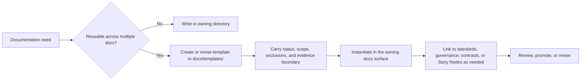

<!-- [KFM_META_BLOCK_V2]
doc_id: kfm://doc/NEEDS_VERIFICATION_UUID
title: templates
type: standard
version: v1
status: draft
owners: @bartytime4life (broad default CODEOWNERS ownership; docs/templates-specific mapping should be rechecked)
created: NEEDS_VERIFICATION
updated: 2026-03-23
policy_label: NEEDS_VERIFICATION
related: [../../README.md, ../standards/, ../governance/, ../reports/story_nodes/]
tags: [kfm, docs, templates, governance]
notes: [Source-bounded revision. Exact live docs/templates inventory and directory-specific CODEOWNERS mapping should be rechecked in the mounted repo before merge.]
[/KFM_META_BLOCK_V2] -->

# templates

Governed template hub for reusable KFM documentation scaffolds, promotion-ready doc shells, and review-friendly Markdown patterns.

> **Status:** experimental  
> **Owners:** `@bartytime4life` *(broad default ownership in current repo audit; recheck `../../.github/CODEOWNERS` for directory-specific mapping before commit)*  
>       
> **Quick jumps:** [Scope](#scope) · [Repo fit](#repo-fit) · [Accepted inputs](#accepted-inputs) · [Exclusions](#exclusions) · [Evidence boundary](#current-evidence-boundary) · [Directory tree](#current-and-source-reported-footprint) · [Quickstart](#quickstart) · [Usage](#usage) · [Diagram](#diagram) · [Template registry](#template-registry) · [Task list](#task-list--definition-of-done) · [FAQ](#faq) · [Appendix](#appendix)

> [!IMPORTANT]
> `docs/templates/` is for reusable **documentation scaffolds**. It is not a second truth path.
>
> Templates can standardize review sections, metadata patterns, promotion reminders, and Markdown structure, but instantiated contracts, policy bodies, Story Nodes, receipts, datasets, and runtime artifacts still belong in their owning surfaces.

## Scope

`docs/templates/` is the reusable scaffold shelf for KFM’s documentation layer.

Its job is to make repeatable documentation shapes easy to reuse without letting prose drift into unofficial system truth. In practice, that means template files here should help maintainers author README-like docs, governed standards notes, runbook shells, Story Node starting points, and API-change writeups that preserve KFM’s evidence-first posture.

Use this directory for:

- reusable Markdown templates that apply across more than one doc or directory
- shared metadata, status, evidence-boundary, or review scaffolds
- promotion-aware document shells that clarify required sections and link strategy
- lightweight authoring aids that reduce drift across docs without replacing local meaning

Do not use this directory for:

- filled-in canonical docs that belong in an owning directory
- policy logic, schema truth, or executable contract definitions
- generated evidence objects, receipts, manifests, or release artifacts
- runtime code, UI code, model outputs, data files, or secrets
- one-off drafts that are not truly reusable templates

[Back to top](#templates)

## Repo fit

**Path:** `docs/templates/README.md`

**Role in repo:** directory README for the governed documentation template surface.

### Upstream and downstream anchors

| Direction | Surface | Why it matters | Status |
|---|---|---|---|
| Upstream | [`../../README.md`](../../README.md) | repo-root operating posture and trust framing | **CONFIRMED** repo surface |
| Upstream | [`../`](../) | parent docs plane that houses governed documentation surfaces | **CONFIRMED** docs plane / exact local index file needs recheck |
| Adjacent | [`../standards/`](../standards/) | standards/profile docs that templates should point at rather than duplicate | **INFERRED** / source-reported |
| Adjacent | [`../governance/`](../governance/) | ethics, sovereignty, and review-gate docs frequently linked by templates | **INFERRED** / source-reported |
| Adjacent | [`../reports/story_nodes/`](../reports/story_nodes/) | home for Story Node instances that should consume templates, not live here | **INFERRED** / source-reported |
| Downstream | `docs/templates/TEMPLATE__*.md` | reusable authoring entrypoints for other documentation surfaces | **INFERRED** / source-reported |

This directory matters because KFM treats documentation, standards, and promotion rules as first-class system components. Templates are part of that control surface: they help docs stay reviewable, provenance-conscious, and structurally consistent without turning Markdown into an unofficial implementation layer.

## Accepted inputs

Content that belongs in `docs/templates/` includes:

| Template class | What belongs here | Notes |
|---|---|---|
| Directory README scaffolds | reusable index patterns for repo directories | keep scope, exclusions, and evidence posture explicit |
| Governed document shells | repeatable structures for standards, guidance notes, or operational docs | favor reusable sections over decorative snippets |
| Promotion-oriented templates | Story Node, API extension, and other doc classes with predictable review sections | only the template lives here; filled-in artifacts belong elsewhere |
| Authoring aids | placeholder comments, review checklists, metadata scaffolds | keep these lightweight and Markdown-native |
| Example fragments | small, clearly labeled examples that teach shape or section rhythm | examples should clarify structure, not become hidden truth |

## Exclusions

The following do **not** belong here as canonical truth:

| Does **not** belong here | Keep it here instead |
|---|---|
| filled-in governance, standards, runbooks, reports, or architecture docs | owning `docs/` subdirectory |
| OpenAPI, JSON Schema, vocabularies, or machine-enforced envelopes | `../../contracts/` and `../../schemas/` |
| policy bundles, deny-by-default logic, executable review rules | `../../policy/` |
| Story Node instances, published narratives, evidence drawers, or report deliverables | owning narrative/report surface |
| raw, work, processed, or cataloged datasets and receipts | governed data lifecycle surfaces |
| runtime code, workers, UI components, or service logic | owning code surface |
| secrets, credentials, signed URLs, or sensitive coordinates | never in docs |

## Evidence labels used here

| Label | Meaning in this README |
|---|---|
| **CONFIRMED** | directly supported by current repo-grounded documents used in this session |
| **INFERRED** | repeatedly source-reported in adjacent KFM materials, but not directly re-enumerated from a mounted live tree here |
| **PROPOSED** | a repo-native improvement or authoring rule added on purpose |
| **UNKNOWN** | not established strongly enough to present as current implementation fact |
| **NEEDS VERIFICATION** | placeholder value or detail that should be rechecked in the live repo before merge |

## Current evidence boundary

> [!NOTE]
> The freshest repo-grounded audit used for this revision is dated **2026-03-22**. Where this session had audit summaries rather than a directly mounted `docs/templates/` tree, the README keeps `INFERRED` and `NEEDS VERIFICATION` visible instead of polishing uncertainty away.

| Observation | Status | Why it changes this README |
|---|---|---|
| KFM’s repo audit describes `docs/` as a governed documentation system containing templates, standards, governance rules, runbooks, and Story Nodes | **CONFIRMED** | this README should define `docs/templates/` as an operational governance surface, not a throwaway folder |
| Current repo audits describe the repository as documentation- and governance-heavy, with several expected enforcement artifacts still scaffolded rather than fully wired | **CONFIRMED** | this README must not imply richer live inventory or enforcement than the evidence supports |
| KFM source docs repeatedly name three template files under `docs/templates/` | **INFERRED** / source-reported | those filenames belong in the registry and tree, but should stay clearly marked until rechecked in the live checkout |
| Adjacent README drafts route contributors back to `docs/templates/` when work is promoted from research/drafts into governed docs | **INFERRED** / corroborated | this README should emphasize promotion paths and keep canonical truth in owning surfaces |
| The current CODEOWNERS audit reports broad default ownership for the repo under `@bartytime4life` | **CONFIRMED** broad default / **NEEDS VERIFICATION** for directory-specific mapping | owners can be shown more concretely, but the actual file should still be re-opened before commit |
| This session did not directly enumerate the mounted `docs/templates/` directory or line-by-line `.github/CODEOWNERS` contents | **NEEDS VERIFICATION** | keep inventory and owner qualifiers visible |

## Current and source-reported footprint

### Repo-audited surface

```text
docs/
└── templates/                                    # CONFIRMED governed docs surface
```

### Source-reported template inventory

```text
docs/templates/
├── README.md                                     # target directory README / this file
├── TEMPLATE__KFM_UNIVERSAL_DOC.md                # INFERRED / source-reported
├── TEMPLATE__STORY_NODE_V3.md                    # INFERRED / source-reported
└── TEMPLATE__API_CONTRACT_EXTENSION.md           # INFERRED / source-reported
```

That split is intentional. KFM documentation should stay honest about the difference between a **confirmed surface** and a **source-reported file inventory**.

[Back to top](#templates)

## Quickstart

Use a verify-first sequence before adding or revising templates.

> [!WARNING]
> The commands below are safe repo-local inspection examples. They are the right next checks in a live checkout, but they are not retroactive proof of what was mounted in every earlier source-bounded session.

```bash
# Inspect this directory and its current file list
ls -la docs/templates
find docs/templates -maxdepth 1 -type f | sort
sed -n '1,240p' docs/templates/README.md

# Re-check owners and adjacent governed docs surfaces
sed -n '1,200p' .github/CODEOWNERS 2>/dev/null
find docs/standards docs/governance docs/reports -maxdepth 2 -type f 2>/dev/null | sort

# Search for template references across the repo
grep -RIn "TEMPLATE__KFM_UNIVERSAL_DOC\|TEMPLATE__STORY_NODE_V3\|TEMPLATE__API_CONTRACT_EXTENSION" docs .github 2>/dev/null

# Re-check the broader repo framing before changing template contracts
sed -n '1,220p' README.md 2>/dev/null
sed -n '1,220p' .github/workflows/README.md 2>/dev/null
```

## Usage

### When to use this directory

Reach for `docs/templates/` when the documentation need is **reusable**, not merely real. If more than one doc class needs the same governed skeleton, review hints, evidence-boundary language, or promotion reminders, a template belongs here.

### When **not** to use this directory

Do **not** add a template just because a document is important. Importance alone is not enough. If the artifact is the actual policy, actual contract, actual Story Node, or actual operational runbook, it belongs in its owning surface.

### Suggested authoring flow

1. Start in the owning doc surface and confirm the artifact type: directory README, governed standard, runbook, Story Node, or API extension note.
2. Check whether a reusable template already exists here.
3. If one exists, instantiate it in the owning surface and keep directory-local meaning there.
4. If none exists, add a new template here only when the shape is clearly reusable across multiple docs.
5. Keep behavior-significant doc changes in the same change stream as the contracts, policy, code, or runbooks they explain.

### Selection rule

Use the smallest template that preserves trust posture. A template is successful when it reduces drift and review friction without hiding uncertainty or inventing implementation state.

> [!TIP]
> A KFM template should standardize **shape**, **reviewability**, and **truth posture**. It should not silently smuggle in system claims the template itself cannot prove.

## Diagram


```mermaid
flowchart LR
    A[Documentation need] --> B{Reusable across multiple docs?}
    B -- No --> C[Write in owning directory]
    B -- Yes --> D[Create or revise template in docs/templates/]
    D --> E[Carry status, scope, exclusions, and evidence boundary]
    E --> F[Instantiate in the owning docs surface]
    F --> G[Link to standards, governance, contracts, or Story Nodes as needed]
    G --> H[Review, promote, or revise]
```

Templates are an authoring control surface, not a substitute for evidence, policy, or runtime enforcement.

## Template registry

| Template / pattern | Current status | Intended use | Where the instantiated doc belongs |
|---|---|---|---|
| Directory README pattern | **PROPOSED** / used by this file | directory indexes with scope, repo fit, accepted inputs, exclusions, tree, quickstart, diagram, and review checks | owning directory |
| `TEMPLATE__KFM_UNIVERSAL_DOC.md` | **INFERRED** / source-reported | general governed KFM docs that need a repeatable structure | owning `docs/` surface |
| `TEMPLATE__STORY_NODE_V3.md` | **INFERRED** / source-reported | provenance-linked Story Node or narrative promotion docs | `docs/reports/story_nodes/` or equivalent owning narrative surface |
| `TEMPLATE__API_CONTRACT_EXTENSION.md` | **INFERRED** / source-reported | doc-side extension notes for API or contract changes | contract- or standards-adjacent doc surface |
| Additional lightweight template classes | **PROPOSED** | only when a doc shape appears often enough to justify maintenance | owning surface after review |

### What a KFM-friendly template should standardize

| Concern | Minimum expectation |
|---|---|
| Purpose | one-line statement of what the instantiated doc is for |
| Status + owners | visible near the top |
| Scope | what belongs and what does not |
| Evidence boundary | what is confirmed, inferred, proposed, or still unknown |
| Relative links | repo-native paths by default |
| Reviewability | explicit task list, definition of done, or verification backlog |
| Trust posture | never imply live implementation that has not been verified |
| Promotion path | where the filled-in artifact belongs once it stops being a scaffold |

## Task list / definition of done

- [ ] The live `docs/templates/` tree was rechecked before merge.
- [ ] `.github/CODEOWNERS` was reopened and the owners line still matches this README.
- [ ] Any template filenames named in this README either exist now or remain clearly marked `INFERRED`.
- [ ] New templates added here are genuinely reusable across more than one doc surface.
- [ ] No instantiated doc truth, policy body, schema, or release artifact was moved here for convenience.
- [ ] Relative links render correctly from `docs/templates/README.md`.
- [ ] Mermaid diagrams render cleanly in GitHub.
- [ ] Unknowns remain visible instead of being rewritten as certainty.

[Back to top](#templates)

## FAQ

### Does this README claim those named template files already exist in the live checkout?

No. It treats `docs/templates/` as a confirmed governed surface, but keeps the three named template files as **source-reported** until the mounted tree is rechecked.

### Should a finished Story Node or API contract live here?

No. Only the reusable scaffold belongs here. The instantiated artifact belongs in its owning surface.

### When is a new template justified?

When the same governed doc shape will be reused across multiple files or directories, and the template reduces drift, review ambiguity, or missing-section risk.

### Is this directory allowed to set policy?

No. It can scaffold policy-facing docs, but canonical policy logic still lives in governed policy and contract surfaces.

## Appendix

<details>
<summary>PROPOSED starter checklist for future template files</summary>

Use this as a lightweight check when adding a new reusable template:

- include a clear title and one-line purpose
- make status, owners, and intended audience visible
- state accepted inputs and exclusions
- add evidence-boundary guidance or truth-posture reminders
- keep relative links repo-native
- include a review checklist or definition of done
- point promoted artifacts to their owning surface
- avoid embedding repo-specific implementation claims the template cannot prove
- prefer calm placeholders such as `NEEDS VERIFICATION` over invented specificity

</details>
