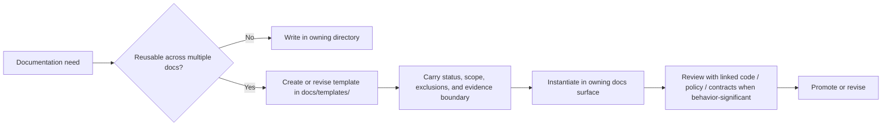

# templates

Governed template hub for reusable KFM documentation scaffolds, promotion-ready doc shells, and review-friendly Markdown patterns.

> **Status:** experimental  
> **Owners:** NEEDS VERIFICATION — review `../../.github/CODEOWNERS` before commit  
>       
> **Quick jumps:** [Scope](#scope) · [Repo fit](#repo-fit) · [Accepted inputs](#accepted-inputs) · [Exclusions](#exclusions) · [Evidence boundary](#current-evidence-boundary) · [Directory tree](#current-and-source-reported-footprint) · [Quickstart](#quickstart) · [Usage](#usage) · [Diagram](#diagram) · [Template registry](#template-registry) · [Task list](#task-list--definition-of-done) · [FAQ](#faq) · [Appendix](#appendix)

> [!IMPORTANT]
> `docs/templates/` should hold reusable **documentation scaffolds**, not living truth objects.
>
> Templates help KFM docs stay governed, reviewable, and consistent with the trust model, but instantiated contracts, policy bundles, Story Nodes, datasets, receipts, and runtime artifacts still belong in their owning surfaces.

## Scope

`docs/templates/` is the reusable scaffold shelf for KFM’s documentation layer.

Its job is to make repeatable documentation shapes easy to reuse without letting prose become a second truth path. In practice, this means template files here should help maintainers produce README-like docs, governed standards notes, runbook shells, Story/Focus promotion docs, and similar reviewable artifacts that preserve KFM’s evidence-first posture.

Use this directory for:
- reusable Markdown templates that apply across multiple docs or directories
- shared front-matter, status, or evidence-boundary scaffolds
- promotion-oriented document shells that clarify required sections, review expectations, and link strategy
- template notes or examples that make authoring safer and less drift-prone

Do not use this directory for:
- filled-in canonical docs that belong in an owning directory
- machine-enforced schema, API, or policy truth
- generated evidence objects, receipts, manifests, or release artifacts
- runtime code, UI code, data files, or secrets
- one-off drafts that are not actually reusable as templates

[Back to top](#templates)

## Repo fit

**Path:** `docs/templates/README.md`

**Role in repo:** directory README for reusable KFM documentation scaffolds.

### Upstream and downstream anchors

| Direction | Surface | Why it matters | Status here |
|---|---|---|---|
| Upstream | [`../README.md`](../README.md) | parent docs index and documentation-wide operating rules | CONFIRMED |
| Upstream | [`../../README.md`](../../README.md) | repo-root style benchmark and top-level operating posture | CONFIRMED |
| Adjacent | [`../governance/`](../governance/) | likely consumers of governance-oriented doc scaffolds | CONFIRMED directory / content varies |
| Adjacent | [`../standards/`](../standards/) | likely consumers of standards/profile templates | CONFIRMED directory / content varies |
| Adjacent | [`../runbooks/`](../runbooks/) | likely consumers of operator/runbook templates | CONFIRMED directory / content varies |
| Adjacent | [`../reports/`](../reports/) | likely consumers of report/story scaffolds | CONFIRMED directory / content varies |
| Downstream | template files in this directory | reusable authoring entrypoints for other doc surfaces | `README.md` only is CONFIRMED; richer template inventory remains INFERRED / NEEDS VERIFICATION |

This directory matters because KFM treats documentation as part of governed delivery, not as decorative back matter. A good template should reduce drift across docs while keeping ownership, evidence posture, review state, and exclusions visible.

## Accepted inputs

Content that belongs in `docs/templates/` includes:

| Template class | What belongs here | Notes |
|---|---|---|
| Directory README scaffolds | reusable index patterns for repo directories | keep relative links and verification boundaries explicit |
| Governed document shells | repeatable structures for standards, notes, doctrine, or runbooks | favor reusable sections over style-only snippets |
| Promotion-oriented templates | Story Node, API extension, or similar doc classes that need consistent review sections | only the template lives here; instantiated docs belong elsewhere |
| Authoring aids | template comments, placeholder guidance, and section checklists | keep these lightweight and Markdown-native |
| Example fragments | small, clearly labeled examples that clarify required sections or diagram shape | examples should teach structure, not become hidden source of truth |

## Exclusions

The following do **not** belong here as canonical truth:

| Does **not** belong here | Keep it here instead |
|---|---|
| filled-in governance, standards, runbooks, reports, or architecture docs | owning `docs/` subdirectory |
| OpenAPI, JSON Schema, vocabularies, or machine-enforced envelopes | `../../contracts/` and `../../schemas/` |
| policy bundles, tests, deny-by-default logic | `../../policy/` |
| Story Node instances, dossier content, released narratives, or evidence drawers | their owning content / publication surfaces |
| canonical datasets, receipts, manifests, and release evidence | truth-path or release/evidence surfaces |
| runtime code, workers, UI components, and service logic | `../../apps/`, `../../packages/`, `../../infra/`, or other owning code surfaces |
| secrets, signed URLs, or sensitive coordinates | never in docs |

## Evidence labels used here

| Label | Meaning in this README |
|---|---|
| **CONFIRMED** | directly visible in the live repo or strongly grounded in current KFM doctrine |
| **INFERRED** | source-reported elsewhere in repo docs or doctrine, but not directly present in the current inspected directory tree |
| **PROPOSED** | repo-native improvement or reusable structure added here on purpose |
| **UNKNOWN** | not established strongly enough to present as current implementation fact |
| **NEEDS VERIFICATION** | placeholder value, owner, filename, or implementation detail that should be checked before merge |

## Current evidence boundary

This README is intentionally explicit about what was directly checked.

| Observation | Status | Why it changes this README |
|---|---|---|
| The live GitHub `docs/templates/` directory currently shows only `README.md` | CONFIRMED | the current tree must stay conservative and must not pretend richer template inventory is already present |
| `docs/README.md` treats `templates/` as one of the core downstream hubs of the docs layer | CONFIRMED | this README should define templates as a real operating surface, not a throwaway folder |
| The `docs/` index explicitly lists reusable documentation templates as accepted inputs | CONFIRMED | template scope should stay documentation-native and reusable |
| The `docs/` index source-reports three template filenames | INFERRED | they can be documented as expected or anticipated surfaces, but not as current live files |
| Promotion-oriented KFM design notes expect approved templates for promotion-ready docs | CONFIRMED doctrine / PROPOSED repo realization | template governance should be explicit even when the repo inventory is still thin |
| Owners and future template inventory were not verified from `../../.github/CODEOWNERS` or a mounted local checkout in this session | NEEDS VERIFICATION | keep placeholders visible instead of polishing them away |

> [!NOTE]
> Treat template names in this README as one of three things:
> - **CONFIRMED** — directly visible now in the live repo or strongly grounded in current KFM doctrine
> - **INFERRED** — source-reported elsewhere in repo docs, but not present in the current inspected directory tree
> - **PROPOSED** — a reusable shape that would improve the repo if added

## Current and source-reported footprint

### Current observed tree

```text
docs/templates/
└── README.md
```

### Source-reported / anticipated template families

```text
docs/templates/
├── TEMPLATE__KFM_UNIVERSAL_DOC.md            # INFERRED / not present in the current inspected tree
├── TEMPLATE__STORY_NODE_V3.md                # INFERRED / not present in the current inspected tree
└── TEMPLATE__API_CONTRACT_EXTENSION.md       # INFERRED / not present in the current inspected tree
```

That split is intentional. KFM documentation should stay honest about the difference between what the repo visibly contains now and what the wider documentation contract expects or points toward.

[Back to top](#templates)

## Quickstart

Use a verify-first sequence before adding or revising templates.

> [!WARNING]
> The commands below are safe repo-local inspection examples. They are the right next checks in a live checkout, but they are not retroactive proof of what was mounted in every earlier evidence-bounded session.

```bash
# Inspect the current template directory
ls -la docs/templates
sed -n '1,200p' docs/templates/README.md

# Re-check the parent docs index and sibling doc hubs
sed -n '1,220p' docs/README.md
find docs/governance docs/standards docs/runbooks docs/reports -maxdepth 2 -type f 2>/dev/null | sort

# See whether source-reported template files actually exist
find docs/templates -maxdepth 1 -type f | sort
grep -RIn "TEMPLATE__" docs 2>/dev/null

# Re-check adjacent repo-wide style and ownership surfaces
sed -n '1,220p' README.md 2>/dev/null
sed -n '1,220p' .github/README.md 2>/dev/null
sed -n '1,200p' .github/CODEOWNERS 2>/dev/null
```

## Usage

### When to use this directory

Reach for `docs/templates/` when the documentation need is **reusable**, not merely real. If two or more doc classes need the same governed skeleton, review hints, truth-posture markers, or quickstart structure, a template belongs here.

### Suggested authoring flow

1. Start in the owning doc surface and confirm what kind of artifact you are writing: directory README, governed standard, runbook, story/promotion doc, or API extension note.
2. Check whether a reusable template already exists here.
3. If one exists, instantiate it in the owning surface and keep directory-local meaning there.
4. If none exists, add a new template here only when the shape is clearly reusable across multiple docs.
5. Keep behavior-significant doc changes in the same change stream as the contracts, policy, code, or runbooks they explain.

### Selection rule

Use the smallest template that preserves truth posture. A template is successful when it reduces drift and review friction without hiding uncertainty or inventing implementation state.

## Diagram


```mermaid
flowchart LR
    A[Documentation need] --> B{Reusable across multiple docs?}
    B -- No --> C[Write in owning directory]
    B -- Yes --> D[Create or revise template in docs/templates/]
    D --> E[Carry status, scope, exclusions, and evidence boundary]
    E --> F[Instantiate in owning docs surface]
    F --> G[Review with linked code / policy / contracts when behavior-significant]
    G --> H[Promote or revise]
```

Templates are an authoring control surface, not a substitute for evidence, policy, or runtime enforcement.

## Template registry

| Template / pattern | Current status | Intended use | Where the instantiated doc belongs |
|---|---|---|---|
| Directory README pattern | CONFIRMED by current repo README surfaces | directory indexes with scope, repo fit, accepted inputs, exclusions, tree, quickstart, usage, diagram, and definition of done | owning directory |
| `TEMPLATE__KFM_UNIVERSAL_DOC.md` | INFERRED / NEEDS VERIFICATION | general governed KFM docs that need a repeatable structure | owning `docs/` surface |
| `TEMPLATE__STORY_NODE_V3.md` | INFERRED / NEEDS VERIFICATION | provenance-linked story or narrative promotion docs | story/report or other owning narrative surface |
| `TEMPLATE__API_CONTRACT_EXTENSION.md` | INFERRED / NEEDS VERIFICATION | doc-side extension notes for API/contract changes | standards/contracts-adjacent doc surface |
| Additional specialized templates | PROPOSED | only when a reusable doc class appears often enough to justify a maintained scaffold | owning surface after review |

### What a KFM-friendly template should standardize

| Concern | Minimum expectation |
|---|---|
| Purpose | one-line statement of what the instantiated doc is for |
| Status + owners | visible near the top |
| Scope | what belongs and what does not |
| Evidence boundary | what was inspected, inferred, proposed, or still unknown |
| Relative links | repo-native paths by default |
| Visual navigation | quick jumps, tables, and at least one meaningful diagram where helpful |
| Reviewability | explicit task list, done criteria, or verification backlog |
| Trust posture | never imply live implementation that has not been verified |

## Task list / definition of done

- [ ] The live `docs/templates/` tree was rechecked before merge.
- [ ] Any template filenames named in this README either exist now or remain clearly marked `INFERRED` / `NEEDS VERIFICATION`.
- [ ] Owners were replaced from `../../.github/CODEOWNERS`, or the placeholder was deliberately left visible.
- [ ] New templates added here are genuinely reusable across more than one doc surface.
- [ ] No instantiated doc truth, policy body, schema, or release artifact was moved here just for convenience.
- [ ] Behavior-significant template changes travel with matching doc, contract, policy, or runbook updates when applicable.
- [ ] Relative links render cleanly from `docs/templates/README.md`.
- [ ] Unknowns remain visible instead of being rewritten as certainty.

[Back to top](#templates)

## FAQ

### Does this README claim those named template files already exist?

No. The current live directory inspection shows only `README.md`. Named template files are kept as **INFERRED / NEEDS VERIFICATION** until they are present in the live tree.

### Should a finished Story Node or API contract live here?

No. Only the reusable scaffold belongs here. The instantiated artifact belongs in its owning surface.

### When is a new template justified?

When the same governed doc shape will be reused across multiple files or directories, and the template reduces drift, review ambiguity, or missing-section risk.

### Is this directory allowed to set policy?

No. It can document or scaffold policy-facing docs, but canonical policy logic still lives in `../../policy/` and related machine-enforced surfaces.

## Appendix

<details>
<summary>PROPOSED starter checklist for future template files</summary>

Use this as a lightweight authoring check when adding a new reusable template:

- include a clear title and one-line purpose
- make status, owners, and path visible
- state accepted inputs and exclusions
- add an evidence-boundary section or inline truth-posture guidance
- keep relative links repo-native
- include at least one diagram when the doc class benefits from workflow or structure visualization
- include a review checklist or definition of done
- avoid embedding repo-specific implementation claims that the template cannot prove
- prefer calm placeholders such as `NEEDS VERIFICATION` over invented specificity

</details># templates

Scaffolded from repository README guidance to establish the documented directory contract.
