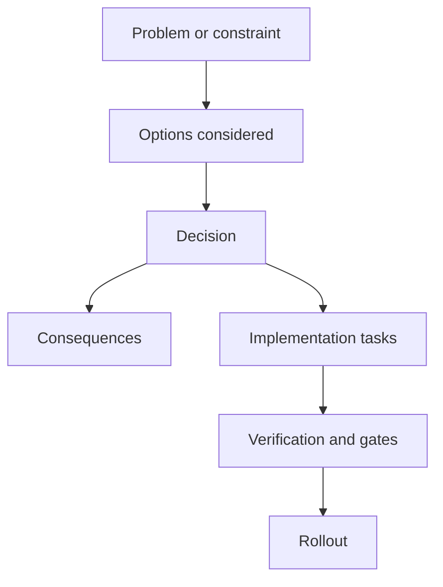

<!-- [KFM_META_BLOCK_V2]
doc_id: kfm://doc/<uuid>
title: ADR-0000: <Decision title>
type: adr
version: v1
status: draft
owners: <team or names>
created: YYYY-MM-DD
updated: YYYY-MM-DD
policy_label: public|restricted|...
related:
  - kfm://doc/<related-doc-id>
  - kfm://dataset/<slug>@<version>
tags:
  - kfm
  - adr
notes:
  - <1–2 sentence summary of the decision and why it exists.>
[/KFM_META_BLOCK_V2] -->

# ADR-0000: <Decision title>

> **Decision state:** Draft | Proposed | Accepted | Superseded | Deprecated  
> **Doc status (MetaBlock):** draft | review | published  
> **Owners:** <team or names>  
> **Created:** YYYY-MM-DD  
> **Last updated:** YYYY-MM-DD  
> **Supersedes:** (optional) ADR-####  
> **Superseded by:** (optional) ADR-####  
> **Policy label:** public | restricted | …  
> **Scope:** repo | pipeline | API | UI | governance | other

**Quick nav:** [Context](#context) · [Decision](#decision) · [Options](#options-considered) · [Consequences](#consequences) · [Evidence](#evidence-claims-and-unknowns) · [Implementation](#implementation-plan) · [Verification](#verification--gates) · [Appendix](#appendix)

> [!IMPORTANT]
> **Template instructions (delete this block when publishing):**
> 1) Copy this file to your ADR location and rename to `ADR-####-<slug>.md` (or your repo’s convention).  
> 2) Replace all `<placeholders>` and remove sections that do not apply.  
> 3) Keep **one decision per ADR**. If you need multiple decisions, split into multiple ADRs.

---

## Context

### Problem statement

- **What decision are we making?**
  - <One sentence.>
- **Why now?**
  - <Triggering event: incident, scale constraint, stakeholder need, new dataset, new API contract, etc.>
- **Who is affected?**
  - <Teams/components/users.>

### Constraints

- **Technical constraints:** <e.g., storage type, latency SLOs, offline processing, existing contracts>
- **Policy constraints:** <e.g., data sensitivity, licensing, access controls, governance>
- **Operational constraints:** <e.g., CI runtime, deploy cadence, on-call constraints>
- **Time/budget constraints:** <if relevant>

### Decision drivers

- <Driver 1: e.g., “fail-closed, auditable policy boundary”>
- <Driver 2: e.g., “determinism + reproducibility”>
- <Driver 3: e.g., “minimal blast radius, reversible changes”>

---

## Decision

### Decision summary (one paragraph)

<Write the decision in plain language. Include what we will do and what we will not do.>

### Decision details

- **We will:**
  - <bullet list>
- **We will not:**
  - <bullet list>
- **In scope:**
  - <bullet list>
- **Out of scope / non-goals:**
  - <bullet list>

### Interfaces and contracts impacted

- **APIs:** <endpoints, DTOs, authZ, error model>
- **Schemas:** <DCAT/STAC/PROV, dataset specs, run receipts, etc.>
- **Pipelines:** <RAW/WORK/PROCESSED steps; promotion gates; validators>
- **UI/Clients:** <evidence surfaces, caching, privacy-safe UX, etc.>

---

## Options considered

> [!TIP]
> Keep this section short but explicit. Include enough information so a future maintainer can understand why the chosen option won.

### Option A — <name> (selected? yes/no)

- **Description:** <1–3 sentences>
- **Pros:**
  - <…>
- **Cons / risks:**
  - <…>
- **Cost/complexity:** <low/med/high>
- **Notes:** <…>

### Option B — <name>

- **Description:** <…>
- **Pros:** <…>
- **Cons / risks:** <…>
- **Cost/complexity:** <…>

### Option C — <name>

- **Description:** <…>
- **Pros:** <…>
- **Cons / risks:** <…>
- **Cost/complexity:** <…>

### Decision rationale

- <Why Option A was chosen over B/C>
- <Key trade-offs accepted>

---

## Consequences

### Positive

- <What improves?>

### Negative

- <What gets worse / harder?>

### Neutral / follow-on effects

- <New maintenance obligations, onboarding needs, etc.>

### Follow-up work (tracked)

- [ ] <Task 1>
- [ ] <Task 2>
- [ ] <Task 3>

---

## Evidence, claims, and unknowns

> [!IMPORTANT]
> **KFM evidence discipline:** every meaningful claim should be labeled **CONFIRMED / PROPOSED / UNKNOWN**.
> If **UNKNOWN**, write the smallest verification step to make it CONFIRMED.

| Claim / requirement | Status (CONFIRMED / PROPOSED / UNKNOWN) | Evidence / links (citations, docs, PRs, benchmarks) | Smallest verification step (if UNKNOWN) |
|---|---|---|---|
| <Claim 1> | <…> | <…> | <…> |
| <Claim 2> | <…> | <…> | <…> |
| <Claim 3> | <…> | <…> | <…> |

---

## Governance and policy impact

### Sensitivity / classification

- **Policy label intent:** public | restricted | …
- **Risk areas:** PII | sensitive locations | licensing | community harm | other
- **Redaction/generalization required?** yes/no
- **Steward review required?** yes/no (if permissions/sensitivity unclear → “needs governance review”)

### KFM non-negotiables checklist

- [ ] Trust membrane preserved: clients/UI do not access DB/storage directly; access goes through governed APIs + policy boundary.
- [ ] Fail-closed posture retained: deny-by-default, including for “unknown/missing metadata”.
- [ ] Promotion gates unchanged or updated: RAW → WORK/QUARANTINE → PROCESSED (+ required catalogs/provenance/checksums before promotion).
- [ ] Evidence-first surfaces: new user-facing claims remain traceable to evidence; citations are resolvable or the system abstains.

### Threat model and abuse cases (if externally exposed)

- **Abuse cases:** <prompt injection, data exfiltration, enumeration, scraping, linkage attacks, etc.>
- **Mitigations:** <tool allowlist, rate limiting, differential error behavior, redaction, audit logs, etc.>
- **Residual risk:** <low/med/high>

---

## Implementation plan

### Approach

- <Describe the implementation in small reversible steps. Prefer additive changes, feature flags, compatibility layers.>

### Milestones

1. <Milestone 1>
2. <Milestone 2>
3. <Milestone 3>

### Rollout plan

- **Release strategy:** <feature flag, canary, shadow run, phased adoption>
- **Backwards compatibility:** <what remains stable, what changes>
- **Migration plan:** <data migrations, catalog migrations, replay/reindex rules>

### Rollback plan

- <Exact rollback steps. Include safe defaults and how to restore prior behavior.>

---

## Verification & gates

### Required CI / merge gates

- [ ] Formatting / lint / typecheck
- [ ] Unit tests
- [ ] Contract / schema validation tests
- [ ] Integration tests (API + schema)
- [ ] Determinism / reproducibility checks (where applicable)
- [ ] Policy checks (deny-by-default; fail-closed)
- [ ] Docs updated (if behavior changed)

### Acceptance criteria (Definition of Done)

- [ ] <User-visible behavior is correct and policy-safe>
- [ ] <All gates green>
- [ ] <Audit/provenance artifacts emitted where required>
- [ ] <Runbook/ops notes updated if this affects operations>

---

## Open questions

- <Question 1> (owner: <name>, due: <date>)
- <Question 2> (owner: <name>, due: <date>)

---

## Decision log / changelog

- YYYY-MM-DD — Draft created by <name>
- YYYY-MM-DD — Updated: <what changed>
- YYYY-MM-DD — Accepted by <group/maintainers> (if applicable)

---

## Appendix

Mermaid: decision workflow sketch (optional)

Notes on ADR numbering and naming (optional)

- Prefer sequential numbering (ADR-0001, ADR-0002, …).
- Keep old ADRs; do not delete. When superseded, update the old ADR with “Superseded by ADR-####”.
- Keep ADRs short: aim for 1–2 pages, link out to details.

---

[Back to top](#adr-0000-decision-title)
