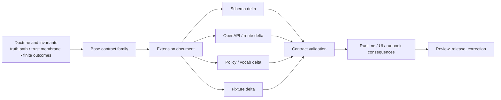

<!-- [KFM_META_BLOCK_V2]
doc_id: kfm://doc/<REVIEW_REQUIRED_UUID>
title: TEMPLATE — API Contract Extension
type: standard
version: v1
status: draft
owners: <REVIEW REQUIRED: owner/team>
created: <REVIEW REQUIRED: YYYY-MM-DD>
updated: <REVIEW REQUIRED: YYYY-MM-DD>
policy_label: <REVIEW REQUIRED: public|restricted|...>
related: [docs/templates/, contracts/, policy/, tests/]
tags: [kfm, template, api-contract]
notes: [Review placeholders retained where live repo metadata was not directly verifiable in this session.]
[/KFM_META_BLOCK_V2] -->

# TEMPLATE — API Contract Extension

Governed template for documenting a KFM API contract extension that changes schema, route, policy, fixture, or runtime surface.

| Field | Value |
| --- | --- |
| **Status** | **Draft template** |
| **Owners** | `<REVIEW REQUIRED: owner/team>` |
| **Path** | `docs/templates/TEMPLATE__API_CONTRACT_EXTENSION.md` *(target path; verify mounted repo before commit)* |
| **Repo fit** | Template for contract-bearing API changes that must stay aligned with KFM doctrine, contract families, and trust-visible runtime behavior |
| **Upstream** | `contracts/`, `policy/`, standards profiles, doctrinal manuals, ADRs |
| **Downstream** | governed API descriptions, validators, fixtures, tests, UI trust states, runbooks, correction paths |


**Quick jump:** [Scope](#scope) · [Repo fit](#repo-fit) · [Accepted inputs](#accepted-inputs) · [Exclusions](#exclusions) · [Quickstart](#quickstart) · [Contract-family alignment](#contract-family-alignment) · [Route-family alignment](#route-family-alignment) · [Diagram](#diagram) · [Copy-ready template body](#copy-ready-template-body) · [Review gates](#review-gates--definition-of-done) · [Appendix](#appendix)

> [!IMPORTANT]
> Use this template when a change **adds, narrows, versions, deprecates, or otherwise changes** a contract-bearing API surface.  
> Do **not** use it for product vision, domain onboarding, free-form endpoint brainstorming, or UI-only exploration detached from schemas, fixtures, and tests.

---

## Scope

This template exists to keep KFM API contract work **contract-first, evidence-first, and fail-closed**. It is designed for extensions that touch one or more of the following:

- JSON Schema or equivalent machine-checkable contract structure
- OpenAPI or other governed route description
- decision grammar or policy vocabulary
- valid / invalid fixtures
- runtime envelopes, evidence bundles, or correction lineage
- user-visible trust states that must remain explainable at point of use

A completed extension document should make it possible to answer five questions quickly:

1. What changed?
2. Why does it belong in KFM?
3. Which base contract family owns the change?
4. What else must change with it?
5. How do we verify it without bluffing?

[Back to top](#template--api-contract-extension)

## Repo fit

| Area | How this template fits |
| --- | --- |
| `docs/templates/` | Home for governed documentation templates, including API-oriented templates |
| `contracts/` | Primary contract surface for schemas, OpenAPI, vocab, and fixtures |
| `policy/` | Policy bundles, vocabularies, and decision-grammar consequences |
| `tests/` | Valid / invalid fixtures, contract tests, policy tests, runtime-negative-path tests |
| `docs/adr/` | Use an ADR when the extension changes architectural law, ownership boundaries, or long-horizon standards posture |
| `docs/runbooks/` | Update when the extension affects publication, correction, rollback, stale-visible behavior, or review workflows |

**Working rule:** this template documents the extension. It does **not** replace the schema, OpenAPI, fixture, or test artifacts themselves.

## Accepted inputs

Use this file when you have all or most of the following in hand:

- the owning **base contract family**
- the extension goal and problem statement
- the affected **route family** or statement that the change is internal-only
- the proposed schema delta
- any OpenAPI or interface-description delta
- policy implications, including reason / obligation / reviewer-role additions if needed
- valid and invalid fixture expectations
- negative-path behavior
- rollback or correction notes
- explicit `CONFIRMED`, `INFERRED`, `PROPOSED`, `UNKNOWN`, or `NEEDS VERIFICATION` labeling where needed

## Exclusions

This file is the wrong home for the following work:

| If the work is mainly about… | Put it here instead |
| --- | --- |
| product vision, shell choreography, or multi-surface UX direction | `docs/architecture/` |
| domain onboarding, source-family coverage, or lane-specific sourcing | domain docs / atlas-aligned docs |
| story-node narrative content | story-node docs under the narrative / reports surface |
| runbook-only operational procedure | `docs/runbooks/` |
| architectural law that changes boundaries or authority seams | `docs/adr/` |
| implementation-only code notes with no contract consequence | code-adjacent docs or implementation comments |

> [!WARNING]
> An API contract extension must not quietly become a substitute for an ADR, a runbook, or a product-spec document. Keep the role crisp.

## Quickstart

1. Duplicate this template into a concrete extension document.
2. Anchor the change to **one primary base contract family** and **one primary route family**.
3. Fill in the schema, OpenAPI, policy, fixture, and test consequences together.
4. Mark anything not directly verified as `INFERRED`, `PROPOSED`, `UNKNOWN`, or `NEEDS VERIFICATION`.
5. Land the extension only with its negative-path behavior, rollback notes, and documentation delta intact.

[Back to top](#template--api-contract-extension)

## Contract-family alignment

Use the owning family to constrain what the extension may add, what it must preserve, and what must evolve in parallel.

| Base family | Use this template when the extension mainly affects… | Must still preserve |
| --- | --- | --- |
| `SourceDescriptor` | source or endpoint declaration, cadence, rights posture, validation plan, publication intent | explicit identity, stewarding, support, time semantics, validation triggers |
| `DatasetVersion` | authoritative candidate / promoted subject description | stable identity, time/support semantics, provenance links |
| `DecisionEnvelope` | machine-readable policy results | finite decision grammar, reason codes, obligation codes, audit linkage |
| `ReleaseManifest` / `ReleaseProofPack` | release assembly, promotion, rollback, correction linkage | release refs, decision refs, docs / accessibility gate, rollback posture |
| `EvidenceBundle` | evidence drill-through, claim support packaging, preview-safe reconstruction | bundle identity, scope echo, release refs, lineage summary, rights / sensitivity state |
| `RuntimeResponseEnvelope` | claim-bearing runtime responses, scoped outcomes, auditability | finite outcomes, citations check, decision ref, surface state, request / evaluation time |
| `CorrectionNotice` | supersession, withdrawal, narrowing, replacement | visible lineage, affected surfaces, rebuild refs, public note |

### Contract-family cautions

- **Do not** silently repurpose an existing field name.
- **Do not** add a new public behavior in prose only.
- **Do not** introduce a free-text reason or obligation where a finite registry is required.
- **Do not** create a fifth runtime outcome beside `ANSWER`, `ABSTAIN`, `DENY`, and `ERROR`.

## Route-family alignment

If the extension touches a route-facing API surface, declare the route family explicitly.

| Route family | Typical boundary profile | Extension must preserve |
| --- | --- | --- |
| Catalog / discovery | `DCAT`, `STAC`, `OGC API Records`, `OpenAPI` | identifier consistency, outward metadata clarity |
| Feature / subject read | `OGC API Features` where fit, KFM-specific `OpenAPI` where needed | stable subject ID, support/time semantics, rights posture, release scope |
| Map / tile / portrayal | `OGC API Maps`, `OGC API Tiles`, internal portrayal contracts | release linkage, policy inheritance, freshness, correction state |
| Evidence resolution | KFM-specific governed API described in `OpenAPI` | EvidenceRef → EvidenceBundle resolution with visible rights / sensitivity state and audit linkage |
| Story / dossier / compare | KFM-specific governed API | spatial anchor, temporal anchor, drill-through to evidence |
| Export and report | KFM-specific governed API plus release-manifest references | exports must not outrun release state, policy posture, or correction linkage |
| Focus / governed assistance | KFM-specific governed API plus `RuntimeResponseEnvelope` | scope, citations, policy, and audit linkage visible in the same pane |
| Review / stewardship | internal governed API only | no hidden approvals; all actions emit review and decision artifacts |
| Ops / status | internal ops surface | must not become a second truth surface |

## Authoring rules

### 1) Anchor before you extend

State the **owning base family** first. If the extension touches multiple families, name the primary family and list the others as affected.

### 2) Declare change shape explicitly

Use one of these labels:

- **Additive** — existing consumers can ignore the new field or rule
- **Constraining** — existing shape stays, but validation or interpretation becomes tighter
- **Breaking** — version bump required
- **Deprecating** — old meaning remains temporarily but is being retired

### 3) Keep finite outcomes finite

If the extension reaches runtime trust surfaces, it must still preserve:

- `ANSWER`
- `ABSTAIN`
- `DENY`
- `ERROR`

No uncited fifth outcome. No “best effort” confidence state.

### 4) Extend vocabularies deliberately

If the extension adds policy meanings, document whether it requires changes to:

- reason-code registry
- obligation-code registry
- reviewer-role registry

### 5) Couple docs to behavior

If behavior changes materially, the extension must call out the exact documentation and runbook delta required.

### 6) Keep repo paths honest

Any path shown as a concrete file path should be treated as one of the following:

- **CONFIRMED** — directly verified
- **PROPOSED starter path** — doctrine-aligned but not mounted as verified
- **NEEDS VERIFICATION** — intentionally unresolved

## Diagram



## Copy-ready template body

Use the scaffold below when writing a concrete extension document.

### Starter meta block for the concrete extension doc

```md
<!-- [KFM_META_BLOCK_V2]
doc_id: kfm://doc/<REVIEW_REQUIRED_UUID>
title: <Concrete Extension Title>
type: standard
version: v1
status: draft
owners: <REVIEW REQUIRED: owner/team>
created: <REVIEW REQUIRED: YYYY-MM-DD>
updated: <REVIEW REQUIRED: YYYY-MM-DD>
policy_label: <REVIEW REQUIRED: public|restricted|...>
related: [<REVIEW REQUIRED: related paths or kfm ids>]
tags: [kfm, api-contract, extension]
notes: [Replace all placeholders before publication.]
[/KFM_META_BLOCK_V2] -->
```

### Concrete extension scaffold

```md
# <Concrete Extension Title>

<One-line purpose directly below the title.>

## 1. Status

| Field | Value |
| --- | --- |
| Status | draft / review / published |
| Truth posture | CONFIRMED / INFERRED / PROPOSED / UNKNOWN / NEEDS VERIFICATION |
| Change shape | additive / constraining / breaking / deprecating |
| Owning base family | <e.g. RuntimeResponseEnvelope> |
| Primary route family | <e.g. Focus / governed assistance> |
| Public or internal | public / internal / mixed |
| Source of authority | <doctrinal anchors and realization overlays> |

## 2. Summary

Describe the change in one short paragraph.
State what the extension enables, what it does not enable, and why it belongs in KFM.

## 3. Problem this extension solves

- Current problem:
- Why the existing base contract is not enough:
- Why this is a contract concern rather than only an implementation concern:

## 4. Non-goals

- This extension does not:
- It must not be read as:
- It does not authorize:

## 5. Base contract anchoring

| Item | Value |
| --- | --- |
| Base family | |
| Existing version / schema | |
| Existing trust obligation | |
| Related families touched | |
| Versioning consequence | |

## 6. Affected artifacts

| Artifact class | Path / identifier | Status | Notes |
| --- | --- | --- | --- |
| Schema | `<PROPOSED or CONFIRMED path>` | | |
| OpenAPI | `<PROPOSED or CONFIRMED path>` | | |
| Vocab registry | `<PROPOSED or CONFIRMED path>` | | |
| Valid fixture | `<PROPOSED or CONFIRMED path>` | | |
| Invalid fixture | `<PROPOSED or CONFIRMED path>` | | |
| Tests | `<PROPOSED or CONFIRMED path>` | | |
| Runbook | `<PROPOSED or CONFIRMED path>` | | |

## 7. Schema delta

### 7.1 Added fields

| Field | Type | Required? | Meaning | Backward-compatibility notes |
| --- | --- | --- | --- | --- |
| | | | | |

### 7.2 Modified fields

| Field | Previous meaning | New meaning | Why | Compatibility risk |
| --- | --- | --- | --- | --- |
| | | | | |

### 7.3 Deprecated fields

| Field | Deprecation status | Removal target | Consumer migration note |
| --- | --- | --- | --- |
| | | | |

## 8. OpenAPI / route delta

Document only if the extension changes a route-facing API surface.

| Surface | Change | Public / internal | Notes |
| --- | --- | --- | --- |
| Request | | | |
| Response | | | |
| Error / negative-path response | | | |
| Auth / policy consequence | | | |

## 9. Policy and decision-grammar delta

State whether the extension requires registry additions.

| Registry | Add / modify / none | Entries | Notes |
| --- | --- | --- | --- |
| reason codes | | | |
| obligation codes | | | |
| reviewer roles | | | |

## 10. Evidence and trust consequences

Answer all of the following:

- Does this extension change EvidenceRef → EvidenceBundle behavior?
- Does it change what counts as a citation check?
- Does it alter rights / sensitivity visibility?
- Does it introduce a new stale-visible, partial, generalized, or withheld state?
- Does it affect correction lineage?

## 11. Runtime outcome behavior

If this extension reaches runtime trust surfaces, document behavior for each relevant outcome.

| Outcome | Behavior | Trigger | Must be visible to user? |
| --- | --- | --- | --- |
| ANSWER | | | |
| ABSTAIN | | | |
| DENY | | | |
| ERROR | | | |

## 12. Fixtures and tests

### 12.1 Minimum fixture set

- one minimal valid fixture
- one meaningful invalid fixture
- any required cross-artifact drill fixture
- any required negative-path runtime fixture

### 12.2 Minimum test set

| Test family | Required? | Notes |
| --- | --- | --- |
| schema validation | yes | |
| valid / invalid fixtures | yes | |
| policy grammar | if applicable | |
| catalog / evidence resolution | if applicable | |
| runtime negative-path | if route-facing | |
| correction / rollback drill | if release-significant | |

## 13. Backward compatibility and migration

- Consumer impact:
- Required version bump:
- Migration path:
- Sunset / deprecation timing:
- What remains readable from older releases:

## 14. Rollback / correction path

Describe how to recover if the extension is wrong, unsafe, or incomplete.

- rollback trigger:
- correction notice implications:
- release-manifest implications:
- whether a UI trust-state change is required:

## 15. Open questions and verification needs

| Open item | Why it matters | Required evidence |
| --- | --- | --- |
| | | |

## 16. Reviewer checklist

- [ ] Base family identified
- [ ] Route family identified or explicitly marked internal-only
- [ ] Schema delta documented
- [ ] OpenAPI delta documented where relevant
- [ ] Policy vocabulary impact documented
- [ ] Valid and invalid fixtures specified
- [ ] Negative-path behavior documented
- [ ] Rollback / correction path documented
- [ ] UNKNOWNs left visible
```

## Review gates & Definition of done

A concrete extension doc is not ready for merge or ratification until all relevant gates below are satisfied.

- [ ] The extension is anchored to a named KFM contract family.
- [ ] Any route-facing change is anchored to a named route family.
- [ ] The change shape is declared as additive, constraining, breaking, or deprecating.
- [ ] Schema impact is documented.
- [ ] OpenAPI impact is documented where relevant.
- [ ] Reason / obligation / reviewer-role registry impact is documented where relevant.
- [ ] At least one valid and one invalid fixture are identified.
- [ ] Negative-path behavior is documented for any claim-bearing runtime surface.
- [ ] Correction / rollback behavior is documented.
- [ ] Docs and runbook deltas are named.
- [ ] Remaining unknowns are explicit.
- [ ] No prose in the document silently implies mounted implementation reality.

> [!NOTE]
> In KFM, a clean-looking extension document without fixtures, tests, and negative-path behavior is still incomplete.

[Back to top](#template--api-contract-extension)

## Appendix

<details>
<summary><strong>Authoring notes and anti-patterns</strong></summary>

### A. Preferred language

Prefer:

- “This extension affects…”
- “Owning base family…”
- “Public or internal route family…”
- “Required evidence to verify…”
- “PROPOSED starter path…”

Avoid:

- “This definitely exists in the repo” unless directly verified
- “The system now does…” unless mounted implementation proves it
- “The extension is self-explanatory”
- “Best effort” language for trust-bearing runtime behavior

### B. Anti-patterns to reject

- endpoint prose with no schema delta
- schema delta with no fixtures
- happy-path examples only
- silent policy vocabulary drift
- hiding rollback/correction notes in implementation tickets
- using this template to justify a new public surface without evidence drill-through
- treating a UI rendering change as sufficient proof of contract correctness

### C. Minimum review posture

When in doubt:

1. keep the change smaller,
2. keep the path label more cautious,
3. keep the negative-path behavior more explicit,
4. keep unverified repo details visible as unresolved.

</details>
