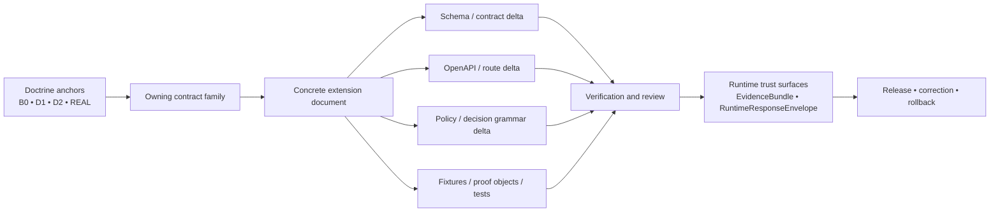

<!-- [KFM_META_BLOCK_V2]
doc_id: kfm://doc/<REVIEW_REQUIRED_UUID>
title: TEMPLATE — API Contract Extension
type: standard
version: v1
status: draft
owners: <REVIEW REQUIRED: owner/team>
created: <REVIEW REQUIRED: YYYY-MM-DD>
updated: <REVIEW REQUIRED: YYYY-MM-DD>
policy_label: <REVIEW REQUIRED: public|restricted|...>
related: [docs/templates/, contracts/, policy/, tests/]
tags: [kfm, template, api-contract]
notes: [Review placeholders retained where live repo metadata, owners, and path inventory were not directly verifiable.]
[/KFM_META_BLOCK_V2] -->

# TEMPLATE — API Contract Extension

Governed template for documenting a KFM API contract extension that changes schema, route, policy, fixture, proof object, or trust-visible runtime behavior.

| Field | Value |
| --- | --- |
| **Status** | **Experimental template · Draft** |
| **Owners** | `<REVIEW REQUIRED: owner/team>` |
| **Path** | `docs/templates/TEMPLATE__API_CONTRACT_EXTENSION.md` **— PROPOSED starter path · NEEDS VERIFICATION** |
| **Repo fit** | Template for contract-bearing API changes that must stay aligned with KFM doctrine, contract families, route families, standards profiles, and trust-visible runtime behavior |
| **Doctrine baseline** | `KFM_Canonical_Master_Reference_Manual_Integrated_Replacement_2026-03-14.pdf` plus baseline `B0` and doctrinal anchors `D1` / `D2` |
| **Upstream** | `contracts/`, `policy/`, doctrinal manuals, ADRs, standards-profile decisions, route-family doctrine |
| **Downstream** | schemas, OpenAPI descriptions, validators, fixtures, tests, EvidenceBundle resolution, RuntimeResponseEnvelope behavior, runbooks, correction paths |


**Quick jump:** [Scope](#scope) · [Repo fit](#repo-fit) · [Accepted inputs](#accepted-inputs) · [Exclusions](#exclusions) · [Directory tree](#directory-tree) · [Quickstart](#quickstart) · [Doctrine anchors & labeling](#doctrine-anchors--labeling) · [Contract-family alignment](#contract-family-alignment) · [Standards-profile alignment](#standards-profile-alignment) · [Route-family alignment](#route-family-alignment) · [Diagram](#diagram) · [Copy-ready template body](#copy-ready-template-body) · [Task list · Review gates](#task-list--review-gates--definition-of-done) · [FAQ](#faq) · [Appendix](#appendix)

> [!IMPORTANT]
> Use this template when a change **adds, narrows, versions, deprecates, or otherwise changes** a contract-bearing API surface.  
> Do **not** use it for product vision, free-form endpoint ideation, UI-only exploration, or implementation notes that have no contract consequence.

> [!NOTE]
> Concrete paths shown in this template are **starter paths unless directly repo-verified**. When a path or artifact is not mounted and confirmed, label it as **PROPOSED starter path** or **NEEDS VERIFICATION** instead of presenting it as current repo reality.

---

## Scope

This template keeps KFM API extension work **contract-first, evidence-linked, and fail-closed**.

Use it for extensions that materially affect one or more of the following:

- machine-checkable schema shape
- OpenAPI or other governed route description
- standards-profile alignment
- policy vocabulary or decision grammar
- valid / invalid fixtures
- proof objects and emitted artifacts
- EvidenceRef → EvidenceBundle behavior
- trust-visible runtime outcomes
- rollback, correction, or stale-visible behavior

A complete extension document should let a reviewer answer five questions quickly:

1. What changed?
2. Why is it a contract concern?
3. Which owning contract family is responsible?
4. Which adjacent artifacts must change with it?
5. How do we verify it without bluffing?

[Back to top](#template--api-contract-extension)

## Repo fit

| Area | How this template fits |
| --- | --- |
| `docs/templates/` | Home for governed documentation templates, including API and contract templates |
| `contracts/` | Primary contract surface for schema families, examples, and machine-checkable structure |
| `policy/` | Policy bundles, decision grammar, reason/obligation registries, and review-bearing constraints |
| `tests/` | Valid / invalid fixtures, schema tests, runtime-negative-path tests, correction drills, docs-gate checks |
| `apis/` | Public and internal API descriptions where route-facing behavior must be made explicit |
| `docs/runbooks/` | Publication, correction, rollback, stale-visible, and operational procedure deltas |
| `docs/adr/` | Architectural-law changes, authority shifts, or long-horizon standards / boundary decisions |

**Working rule:** this template documents the extension; it does **not** replace the schema, OpenAPI, fixture, test, or runbook artifacts themselves.

## Accepted inputs

Use this template when you have all or most of the following:

- the **owning contract family**
- a concise extension goal and problem statement
- the affected **route family**, or an explicit internal-only statement
- a schema delta or contract-shape delta
- an OpenAPI or route-description delta where relevant
- standards-profile impact, if any
- policy consequences, including reason / obligation / reviewer-role changes where needed
- valid and invalid fixture expectations
- expected negative-path behavior
- rollback / correction notes
- explicit `CONFIRMED`, `INFERRED`, `PROPOSED`, `UNKNOWN`, or `NEEDS VERIFICATION` labeling where required

## Exclusions

| If the work is mainly about… | Put it here instead |
| --- | --- |
| architectural law, boundary changes, or authority shifts | `docs/adr/` |
| runbook-only operational procedure | `docs/runbooks/` |
| product vision, shell choreography, or multi-surface UX direction | architecture / product doctrine docs |
| implementation-only code notes with no contract consequence | code-adjacent docs or source comments |
| domain onboarding, source-family coverage, or lane-specific sourcing | domain / atlas-aligned documentation |
| narrative publication content | story / dossier docs under the relevant publication surface |

> [!WARNING]
> An API contract extension must not quietly become a substitute for an ADR, a runbook, or a product specification. Keep the role crisp.

## Directory tree

Illustrative target placement:

```text
docs/
└── templates/
    └── TEMPLATE__API_CONTRACT_EXTENSION.md
```

Common companion surfaces (**starter paths only — verify before commit**):

```text
contracts/
policy/
tests/
apis/public/
apis/internal/
docs/runbooks/
```

## Quickstart

1. Duplicate this template into a concrete extension document.
2. Name **one primary owning contract family** and **one primary route family**.
3. Fill in schema, route, policy, fixture, test, and correction consequences together.
4. Keep anything not directly verified visible as `INFERRED`, `PROPOSED`, `UNKNOWN`, or `NEEDS VERIFICATION`.
5. Do not call the extension ready until negative-path behavior, docs/runbook deltas, and rollback notes are present.

[Back to top](#template--api-contract-extension)

## Doctrine anchors & labeling

### Doctrine anchors

Use this template with the following authority order in mind:

| Level | Role in authoring this template |
| --- | --- |
| **Baseline in hand** | Current editable baseline for this documentation task |
| **Co-primary doctrinal anchors** | KFM truth path, publication law, mission, invariants, metadata spine, product logic |
| **Freshest realization overlay** | Contract families, standards profile, route classes, proof objects, minimal artifact backlog |
| **Supporting overlays** | UI doctrine, verification placement, source atlas, source-integrity correction, sequencing, runtime boundaries |

### Labeling legend

| Label | Meaning here | Use it for |
| --- | --- | --- |
| **CONFIRMED** | Directly supported by doctrinal source material or standards posture already rechecked in doctrine | Contract-family law, route obligations, verified standards posture |
| **INFERRED** | Strong doctrinal implication used conservatively to close a necessary structural seam | Missing-but-obvious registries, proof objects, surface-state expectations |
| **PROPOSED** | Doctrine-aligned recommendation beyond what the source corpus strongly implies | New file proposals, backlog items, starter schemas, route-profile suggestions |
| **NEEDS VERIFICATION** | Intentionally unresolved until repo inspection confirms it | Paths, owners, exact filenames, mounted inventories, implementation coupling |
| **UNKNOWN** | Not verified strongly enough to claim as current project fact | Live repo state, schema inventory, CI coverage, manifests, runtime stack |

## Contract-family alignment

Pick **one primary owning contract family** first. If the extension touches multiple families, list the rest as affected but secondary.

| Contract family | Use this template when the extension mainly affects… | Must still preserve |
| --- | --- | --- |
| `SourceDescriptor` | intake contract for a source or endpoint | identity, steward/contact, access mode, rights posture, support, cadence, validation plan, publication intent |
| `IngestReceipt` | proof that a fetch / landing event occurred | source reference, fetch time, integrity checks, result, output pointers |
| `ValidationReport` | machine-readable validation outcome | check list, severity, reason codes, subject refs |
| `DatasetVersion` | authoritative candidate or promoted subject set | stable ID, version ID, support, time semantics, provenance links |
| `CatalogClosure` | outward metadata closure and lineage linkage | STAC / DCAT / PROV refs, identifiers, release linkage, outward profile refs |
| `DecisionEnvelope` | machine-readable policy result | subject, action, lane, result, reason codes, obligation codes, policy basis, `audit_ref`, effective window |
| `ReviewRecord` | human approval / denial / escalation / note | reviewer role, decision, timestamp, refs, comments |
| `ReleaseManifest` / `ReleaseProofPack` | release assembly and public-safe proof | version refs, catalog refs, decision refs, docs/accessibility gate, rollback/correction posture, bundle plan |
| `ProjectionBuildReceipt` | proof a derived layer was built from known release scope | release ref, projection type, surface class, build time, freshness basis, stale-after policy |
| `EvidenceBundle` | support package for a claim, feature, story, export preview, or answer | bundle identity, source basis, dataset refs, lineage summary, preview policy, transform receipts, rights/sensitivity state, `audit_ref` |
| `RuntimeResponseEnvelope` | trust-bearing runtime response object | schema version, object type, `audit_ref`, `request_id`, `evaluated_at`, surface class/state, result, citations check, decision ref |
| `CorrectionNotice` | visible lineage under correction, supersession, or withdrawal | affected releases, replacement releases, affected surface classes, rebuild refs, cause, public note |

### Contract-family cautions

- **Do not** repurpose an existing field name without documenting the meaning change.
- **Do not** create a public behavior in prose only.
- **Do not** move policy meanings into free text when a finite registry is required.
- **Do not** treat derived layers as authoritative truth merely because they are convenient.

## Standards-profile alignment

Use standards where they are the right carrier. Do not force them to compete with KFM-specific policy, review, and correction artifacts.

| Profile | Typical role in extension docs | Use when | Notes |
| --- | --- | --- | --- |
| **JSON Schema Draft 2020-12** | machine-validatable contract files and valid/invalid fixtures | schema-bearing contract extensions | Preferred contract-profile language for validation-ready artifacts |
| **DCAT 3** | outward dataset / distribution discovery metadata | catalog / discovery consequences | Useful for outward dataset and distribution description |
| **PROV-O** | outward lineage vocabulary | lineage or provenance-facing impacts | Pair with KFM-specific proof and policy artifacts rather than replacing them |
| **STAC 1.1.0** | spatiotemporal asset / item / scene discovery | item or asset description fits STAC semantics | Best where spatiotemporal assets are the natural outward carrier |
| **OGC API Features** | feature or subject read boundary profile | outward feature-read routes | Use where the released object behaves like an authoritative feature surface |
| **OGC API Tiles** | tile / portrayal delivery | tile-bearing outward surfaces | Must inherit release linkage, freshness, and correction state |
| **OGC API Maps** | rendered map delivery | portrayal-bearing outward surfaces | Use only where map delivery is actually part of the extension |
| **OGC API Records** | catalog / discovery search | outward discovery routes | Keep identifier consistency and closure explicit |
| **OpenAPI 3.2.0** | explicit public / internal API contract publication | route-facing changes | Required when request/response/error shapes or policy-visible route behavior change |

## Route-family alignment

If the extension touches a route-facing API surface, declare the route family explicitly.

| Route family | Primary objects | Boundary profile | Trust obligation |
| --- | --- | --- | --- |
| `Catalog and discovery` | release metadata, dataset/distribution discovery, discovery lists | `DCAT 3`, `STAC`, `OGC API Records`, `OpenAPI` | catalog closure and identifier consistency must resolve cleanly |
| `Feature or subject read` | released authoritative features, place dossiers, claims, detail views | `OGC API Features` where fit; KFM-specific `OpenAPI` where needed | stable subject ID, support/time semantics, rights posture, release scope |
| `Map / tile / portrayal` | released maps, tiles, legends, styles, portrayals | `OGC API Maps` / `Tiles` plus internal portrayal contracts | release linkage, policy posture, freshness, correction state |
| `Evidence resolution` | `EvidenceRef -> EvidenceBundle` and related trust objects | KFM-specific governed API in `OpenAPI` | every bundle resolves to admissible published scope with visible rights/sensitivity state and audit linkage |
| `Story / dossier / compare` | anchored narrative and comparison inputs | KFM-specific governed API | spatial anchor, temporal anchor, drill-through to evidence |
| `Export and report` | public-safe exports, previews, packaged reports | KFM-specific governed API plus release-manifest refs | exports never outrun release state, policy posture, or correction linkage |
| `Focus / governed assistance` | bounded natural-language investigation over released scope | KFM-specific governed API plus `RuntimeResponseEnvelope` | scope, citations, policy, and audit linkage stay visible in the same pane |
| `Review / stewardship` | moderation, quarantine, approval, denial, rollback, rights handling | internal governed API only | no hidden approvals; every action emits review and decision artifacts |
| `Ops / status` | health, status, metrics, traces, audit joins | internal ops endpoints | must not expose raw canonical data or become a second truth surface |

## Authoring rules

### 1) Anchor before you extend

State the **owning contract family** first. If the extension touches multiple families, list one as primary and the rest as affected.

### 2) Declare change shape explicitly

Use one of these labels:

- **Additive** — existing consumers may ignore the addition
- **Constraining** — existing shape remains, but validation or interpretation becomes tighter
- **Breaking** — version bump or explicit migration required
- **Deprecating** — old meaning remains temporarily but is being retired

### 3) Keep runtime outcomes finite

If the extension reaches trust-bearing runtime surfaces, preserve the finite result set:

- `ANSWER`
- `ABSTAIN`
- `DENY`
- `ERROR`

No fifth “best-effort” truth state.

### 4) Extend decision grammar deliberately

If the extension changes policy-visible meaning, document whether it requires updates to:

- reason-code registry
- obligation-code registry
- reviewer-role registry

### 5) Couple prose to executable artifacts

A material behavior change is incomplete until it names:

- schema or contract delta
- OpenAPI delta where relevant
- valid / invalid fixtures
- tests and proof objects
- documentation and runbook delta
- rollback / correction behavior

### 6) Keep repo paths honest

Any concrete path should be one of:

- **CONFIRMED path**
- **PROPOSED starter path**
- **NEEDS VERIFICATION**

### 7) Prove negative paths

Happy-path examples are insufficient. Document deny, abstain, stale-visible, partial, generalized, conflict, correction, and rollback behavior where relevant.

## Diagram



[Back to top](#template--api-contract-extension)

## Copy-ready template body

Use the scaffold below when writing a concrete extension document.

### Starter meta block for the concrete extension doc

```md
<!-- [KFM_META_BLOCK_V2]
doc_id: kfm://doc/<REVIEW_REQUIRED_UUID>
title: <Concrete Extension Title>
type: standard
version: v1
status: draft
owners: <REVIEW REQUIRED: owner/team>
created: <REVIEW REQUIRED: YYYY-MM-DD>
updated: <REVIEW REQUIRED: YYYY-MM-DD>
policy_label: <REVIEW REQUIRED: public|restricted|...>
related: [<REVIEW REQUIRED: related paths or kfm ids>]
tags: [kfm, api-contract, extension]
notes: [Replace all placeholders before publication.]
[/KFM_META_BLOCK_V2] -->
```

### Concrete extension scaffold

```md
# <Concrete Extension Title>

<One-line purpose directly below the title.>

## 1. Status & truth posture

| Field | Value |
| --- | --- |
| Status | draft / review / published |
| Truth posture | CONFIRMED / INFERRED / PROPOSED / UNKNOWN / NEEDS VERIFICATION |
| Change shape | additive / constraining / breaking / deprecating |
| Owning contract family | <e.g. RuntimeResponseEnvelope> |
| Primary route family | <e.g. Focus / governed assistance> |
| Standards profile touched | <e.g. JSON Schema 2020-12, OpenAPI 3.2.0, STAC 1.1.0> |
| Public or internal | public / internal / mixed |
| Source of authority | <baseline + doctrinal anchors + realization overlays> |

## 2. Summary

Describe the change in one short paragraph.
State what the extension enables, what it does not enable, and why it belongs in KFM.

## 3. Problem this extension solves

- Current problem:
- Why the existing contract family is not enough:
- Why this is a contract concern rather than only an implementation concern:

## 4. Non-goals

- This extension does not:
- It must not be read as:
- It does not authorize:

## 5. Contract anchoring

| Item | Value |
| --- | --- |
| Primary contract family | |
| Related families touched | |
| Existing version / schema | |
| Existing trust obligation | |
| Versioning consequence | |

## 6. Affected artifacts

| Artifact class | Path / identifier | Status | Notes |
| --- | --- | --- | --- |
| Schema / contract | `<CONFIRMED or PROPOSED starter path>` | | |
| OpenAPI | `<CONFIRMED or PROPOSED starter path>` | | |
| Policy / registry | `<CONFIRMED or PROPOSED starter path>` | | |
| Valid fixture | `<CONFIRMED or PROPOSED starter path>` | | |
| Invalid fixture | `<CONFIRMED or PROPOSED starter path>` | | |
| Tests / proof objects | `<CONFIRMED or PROPOSED starter path>` | | |
| Runbook / docs | `<CONFIRMED or PROPOSED starter path>` | | |

## 7. Contract and schema delta

### 7.1 Added fields

| Field | Type | Required? | Meaning | Backward-compatibility notes |
| --- | --- | --- | --- | --- |
| | | | | |

### 7.2 Modified fields

| Field | Previous meaning | New meaning | Why | Compatibility risk |
| --- | --- | --- | --- | --- |
| | | | | |

### 7.3 Deprecated fields

| Field | Deprecation status | Removal target | Consumer migration note |
| --- | --- | --- | --- |
| | | | |

## 8. OpenAPI / route delta

Document only if the extension changes a route-facing API surface.

| Surface | Change | Public / internal | Notes |
| --- | --- | --- | --- |
| Request | | | |
| Response | | | |
| Error / negative-path response | | | |
| Auth / policy consequence | | | |

## 9. Standards-profile delta

| Profile | Add / modify / none | Why this profile applies | Notes |
| --- | --- | --- | --- |
| JSON Schema 2020-12 | | | |
| OpenAPI 3.2.0 | | | |
| STAC 1.1.0 | | | |
| DCAT 3 | | | |
| PROV-O | | | |
| OGC API family | | | |

## 10. Policy and decision-grammar delta

State whether the extension requires registry additions.

| Registry | Add / modify / none | Entries | Notes |
| --- | --- | --- | --- |
| reason codes | | | |
| obligation codes | | | |
| reviewer roles | | | |

## 11. Evidence and trust consequences

Answer all of the following:

- Does this extension change `EvidenceRef -> EvidenceBundle` behavior?
- Does it change what counts as a citations check?
- Does it alter rights / sensitivity visibility?
- Does it introduce a stale-visible, partial, generalized, withheld, or conflicted state?
- Does it affect correction lineage or rollback visibility?

## 12. Runtime outcome behavior

If this extension reaches trust-bearing runtime surfaces, document behavior for each relevant outcome.

| Outcome | Behavior | Trigger | Must be visible to user? |
| --- | --- | --- | --- |
| ANSWER | | | |
| ABSTAIN | | | |
| DENY | | | |
| ERROR | | | |

## 13. Fixtures, tests, and proof objects

### 13.1 Minimum fixture set

- one minimal valid fixture
- one meaningful invalid fixture
- one cross-artifact proof fixture where applicable
- one negative-path runtime fixture where route-facing behavior is affected

### 13.2 Minimum test and proof set

| Test / proof family | Required? | Notes |
| --- | --- | --- |
| schema and example validation | yes | |
| valid / invalid fixtures | yes | |
| catalog-closure integrity | if outward discovery changes | |
| policy bundle / reason / obligation consistency | if decision grammar changes | |
| deterministic identity / stale-projection checks | if derived or release-facing behavior changes | |
| runtime citation-negative and scope-negative tests | if claim-bearing runtime behavior changes | |
| surface-state tests | if trust-visible UI or runtime state changes | |
| correction drill / rollback drill | if release-significant | |
| documentation gate / runbook sync | if behavior changes materially | |

## 14. Backward compatibility and migration

- Consumer impact:
- Required version bump:
- Migration path:
- Sunset / deprecation timing:
- What remains readable from older releases:

## 15. Rollback / correction path

Describe how to recover if the extension is wrong, unsafe, or incomplete.

- rollback trigger:
- correction notice implications:
- release-manifest implications:
- whether a trust-state or UI surface change is required:

## 16. Documentation and runbook delta

Name the exact documentation and operational follow-through required.

| Surface | Required update | Status |
| --- | --- | --- |
| Template / docs | | |
| Runbook | | |
| Public-facing guidance | | |
| Internal stewardship procedure | | |

## 17. Open questions and verification needs

| Open item | Why it matters | Required evidence |
| --- | --- | --- |
| | | |

## 18. Reviewer checklist

- [ ] Owning contract family identified
- [ ] Route family identified or explicitly marked internal-only
- [ ] Change shape declared
- [ ] Schema / contract delta documented
- [ ] OpenAPI delta documented where relevant
- [ ] Standards-profile impact documented where relevant
- [ ] Policy vocabulary impact documented
- [ ] Valid and invalid fixtures specified
- [ ] Negative-path behavior documented
- [ ] Rollback / correction path documented
- [ ] Docs / runbook delta named
- [ ] UNKNOWNs left visible
```

## Task list · Review gates & definition of done

A concrete extension document is not ready for merge or ratification until every relevant gate below is satisfied.

- [ ] The extension is anchored to a named KFM contract family.
- [ ] Any route-facing change is anchored to a named route family.
- [ ] The change shape is declared as additive, constraining, breaking, or deprecating.
- [ ] Schema / contract impact is documented.
- [ ] OpenAPI impact is documented where relevant.
- [ ] Standards-profile impact is documented where relevant.
- [ ] Reason / obligation / reviewer-role registry impact is documented where relevant.
- [ ] At least one valid and one invalid fixture are identified.
- [ ] Negative-path behavior is documented for any claim-bearing runtime surface.
- [ ] Runtime citation-negative and scope-negative behavior is accounted for where relevant.
- [ ] Correction / rollback behavior is documented.
- [ ] Documentation and runbook deltas are named.
- [ ] Remaining unknowns are explicit.
- [ ] No prose silently implies mounted implementation reality that has not been verified.

> [!CAUTION]
> In KFM, a clean-looking extension document without fixtures, proof objects, negative-path behavior, and correction posture is still incomplete.

[Back to top](#template--api-contract-extension)

## FAQ

### When should this become an ADR instead?

Use an ADR when the change alters architectural law, authority boundaries, or long-horizon standards / platform direction. Use this template when the change is still best understood as a contract-bearing extension with concrete schema, route, policy, fixture, or runtime consequences.

### Can I fill in prose first and add schemas or tests later?

Not for merge-ready work. A contract extension that lacks executable artifacts is still incomplete, even if the prose is polished.

### What if the change is internal-only?

Keep the document. Mark the route family as internal-only where applicable, omit outward OpenAPI details that do not exist, and document the internal proof, policy, and correction consequences explicitly.

## Appendix

<details>
<summary><strong>Authoring notes, starter registries, and anti-patterns</strong></summary>

### A. Preferred language

Prefer:

- “This extension affects…”
- “Owning contract family…”
- “Primary route family…”
- “Required evidence to verify…”
- “PROPOSED starter path…”

Avoid:

- “This definitely exists in the repo” unless directly verified
- “The system now does…” unless mounted implementation proves it
- “This is self-explanatory”
- “Best effort” language for trust-bearing runtime behavior

### B. Starter reason-code examples

| Example reason code | Typical meaning |
| --- | --- |
| `rights.unknown` | rights or redistribution posture is unresolved |
| `sensitivity.exact_location` | exact location is too sensitive for the requested audience |
| `validation.schema_failed` | required schema or semantic validation failed |
| `corroboration.conflicted` | independent admissible sources disagree materially |

### C. Anti-patterns to reject

- endpoint prose with no schema delta
- schema delta with no fixtures
- happy-path examples only
- silent decision-grammar drift
- hiding rollback or correction notes in implementation tickets
- using this template to justify a new public surface without evidence drill-through
- treating a UI rendering change as sufficient proof of contract correctness
- presenting starter paths as verified repo facts

### D. Path-label shorthand

| Label | Use it when |
| --- | --- |
| **CONFIRMED path** | directly verified in the mounted repo or canonical project artifacts |
| **PROPOSED starter path** | doctrine-aligned location offered as a practical starting point |
| **NEEDS VERIFICATION** | the exact path, filename, or adjacent artifact inventory is still unresolved |

### E. Minimum review posture

When in doubt:

1. keep the change smaller,
2. keep the path label more cautious,
3. keep the negative-path behavior more explicit,
4. keep unverified repo details visible as unresolved.

</details>
