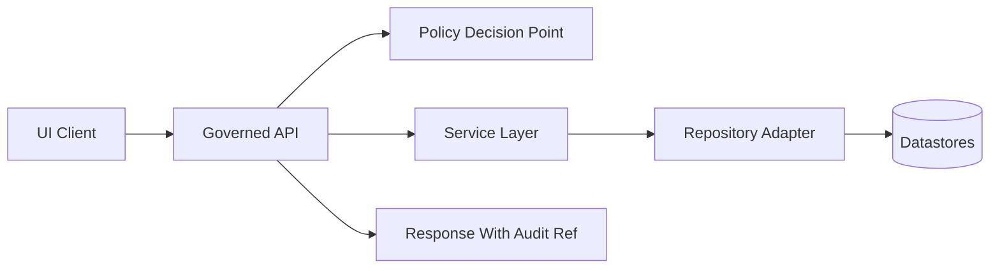

<!-- [KFM_META_BLOCK_V2]
doc_id: kfm://doc/784c2298-7733-4a29-9913-0fd83a7caecd
title: API Contract Extension Template
type: standard
version: v1
status: draft
owners: <team-or-github-handles>
created: 2026-03-04
updated: 2026-03-04
policy_label: public
related: [docs/governance/ROOT_GOVERNANCE.md, docs/specs/api/README.md]
tags: [kfm, api, contract, template]
notes: [
  "Template file. Copy this document and replace all <placeholders>.",
  "All API changes must preserve the trust membrane and fail-closed policy behavior."
]
[/KFM_META_BLOCK_V2] -->

# TEMPLATE — API Contract Extension
One template to propose, review, and implement a **new governed API surface** (REST and/or GraphQL) without breaking KFM invariants.

---

## Impact
**Status:** template (copy & fill) • **Owners:** `<team-or-gh-handles>` • **Last updated:** 2026-03-04

  

**Quick links:** [Scope](#scope) · [Contract summary](#contract-summary) · [Request](#request-contract) · [Response](#response-contract) · [Policy](#policy-and-governance) · [Tests](#validation-and-test-gates) · [Checklist](#definition-of-done)

---

## Scope
**This contract covers:** a single API extension (one new route, query, or mutation) plus the minimum governance + test gates required for promotion to a protected release lane.

### In scope
- One new REST endpoint **and/or** one new GraphQL field (query/mutation/subscription).
- Policy checks (authN/authZ + sensitivity/redaction) and their regression tests.
- Request/response schemas and error envelope.
- Audit + provenance requirements (what gets logged/emitted; how to reproduce).

### Out of scope
- Non-governed “direct DB” access patterns.
- Ad-hoc response formats that bypass the standard error model.
- Breaking changes without an approved deprecation plan.

---

## Where this fits in KFM
**Path:** `docs/templates/TEMPLATE__API_CONTRACT_EXTENSION.md`  
**Lifecycle:** contract → implementation → contract tests → promotion gates → published endpoint.

**Trust membrane invariant:** UI/clients call **only** governed APIs; the API layer calls repositories/adapters; repositories call storage.



---

## Acceptable inputs
- A clearly defined user-facing capability (what users can do after this ships).
- Data sources already cataloged (DCAT/STAC/PROV) **or** a plan to add catalogs before enabling the endpoint.
- A sensitivity classification and redaction strategy for the data returned.

## Exclusions
- No endpoint may:
  - Return unpublished (non-cataloged) datasets from `RAW/` except via explicit, reviewed “operator-only” lanes.
  - Expose raw PII or sensitive locations by default.
  - Skip policy evaluation (“default allow” is forbidden).

---

## Contract summary

### 1) Identification
- **Contract ID:** `kfm://api/contract/<slug>@v<major>.<minor>`
- **Change type:** `<additive | deprecating | breaking>`
- **Tracking issue:** `<issue-or-adr-link>`
- **Target release lane:** `<sandbox | governed-dev | governed-prod>`

### 2) Surface area

| Field | Value |
|---|---|
| REST method + path | `<GET|POST|PUT|PATCH|DELETE> /api/v1/<path>` |
| GraphQL field | `<Query|Mutation>.<fieldName>` (optional) |
| Purpose (one line) | `<what capability is added>` |
| Data zone(s) | `<RAW|WORK|PROCESSED|PUBLISHED>` |
| Sensitivity | `<public|restricted|internal|highly_restricted>` |
| AuthN | `<none|api_key|oauth2|oidc|mTLS>` |
| AuthZ roles | `<roles>` |
| Caching | `<none|etag|cache-control|max-age>` |
| Rate limits | `<requests/minute and burst>` |
| SLO | `<p95 latency, availability, error budget>` |

---

## Claims and evidence
Every meaningful claim in this contract must be labeled.

| Claim | Status (CONFIRMED/PROPOSED/UNKNOWN) | Evidence link | Verification steps (if UNKNOWN) |
|---|---:|---|---|
| `<Example: endpoint returns only PUBLISHED datasets>` | `<…>` | `<catalog link>` | `<steps>` |
| `<Example: policy denies access without role X>` | `<…>` | `<policy test>` | `<steps>` |

---

## Request contract

### REST: request shape
**Method:** `<GET|POST|…>`  
**Path:** `/api/v1/<path>`

#### Path parameters
- `<param>`: `<type>` — `<meaning>` — constraints: `<regex/range>`

#### Query parameters
- `<q>`: `<type>` — `<meaning>` — default: `<…>` — constraints: `<…>`

#### Headers
- `Authorization`: `<scheme>`
- `X-Request-Id`: `<required|optional>` — behavior: `<propagate to logs>`
- `If-None-Match` / `If-Modified-Since`: `<if using caching>`

#### Request body (if any)
- **Content-Type:** `application/json`
- **Schema:** `schemas/api/<name>.schema.json` (reference)
- **Example:**
```json
{
  "example": "replace_me"
}
```

### GraphQL: request shape (optional)
- **Operation name:** `<OperationName>`
- **Field:** `<Query.field>` or `<Mutation.field>`
- **Arguments:** `<argName: Type>` with constraints and defaults.

---

## Response contract

### Standard response envelope
All success responses must include an audit reference and a request identifier.

```json
{
  "data": {},
  "meta": {
    "request_id": "uuid-or-correlation-id",
    "audit_ref": "kfm://audit/<id>",
    "served_at": "2026-03-04T00:00:00Z",
    "policy": {
      "decision": "allow",
      "redactions": []
    }
  }
}
```

### Success responses
- **200 OK** — `<describe>`
- **201 Created** — `<describe>` (include `Location` header when applicable)
- **202 Accepted** — `<describe async job semantics>` (include `job_id`)

#### Example: 200 OK
```json
{
  "data": {
    "items": [],
    "next_cursor": null
  },
  "meta": {
    "request_id": "8a9c5a2e-0000-0000-0000-000000000000",
    "audit_ref": "kfm://audit/2026-03-04/<opaque>",
    "served_at": "2026-03-04T00:00:00Z",
    "policy": { "decision": "allow", "redactions": [] }
  }
}
```

### Error model
All error responses must follow the same envelope.

```json
{
  "error": {
    "code": "KFM_<CATEGORY>_<DETAIL>",
    "message": "human-readable summary",
    "details": { "any": "structured fields" }
  },
  "meta": {
    "request_id": "uuid-or-correlation-id",
    "audit_ref": "kfm://audit/<id>",
    "served_at": "2026-03-04T00:00:00Z",
    "policy": { "decision": "deny", "redactions": [] }
  }
}
```

#### Required status codes

| Status | When | Error code family |
|---:|---|---|
| 400 | Validation failure (client bug) | `KFM_VALIDATION_*` |
| 401 | Unauthenticated | `KFM_AUTHN_*` |
| 403 | Authenticated but not authorized | `KFM_AUTHZ_*` |
| 404 | Not found (do not leak existence for sensitive resources) | `KFM_NOT_FOUND_*` |
| 409 | Conflict (idempotency/concurrency) | `KFM_CONFLICT_*` |
| 429 | Rate limited | `KFM_RATE_LIMIT_*` |
| 500 | Internal error (no sensitive details) | `KFM_INTERNAL_*` |
| 503 | Dependency unavailable | `KFM_DEPENDENCY_*` |

---

## Policy and governance

### Policy decision points
- **Pre-request**: deny by default; allow only with explicit policy rule.
- **Post-retrieval**: redaction/aggregation as a first-class transformation.
- **Response**: include an `audit_ref` for every response (allow or deny).

### Authorization matrix
Fill out the minimum roles required for each operation.

| Operation | Required role(s) | Notes |
|---|---|---|
| `<GET /api/v1/...>` | `<role>` | `<why>` |
| `<POST /api/v1/...>` | `<role>` | `<why>` |

### Sensitivity and redaction
- **Classification:** `<public|restricted|...>`
- **Redaction rule:** `<describe exactly what fields/geometry are suppressed or generalized>`
- **Failure mode:** fail-closed (deny) if classification is unknown or policy data is missing.

### Evidence discipline for “insight” endpoints
If the endpoint returns *derived insights* (not just raw records), specify:
- What citations are returned (e.g., DCAT dataset IDs, STAC item IDs, PROV activity IDs).
- What the service does when evidence is missing (must abstain or downgrade detail).

---

## Data contract and schemas

### OpenAPI
- **OpenAPI file:** `openapi/openapi.yml` (or equivalent)
- **OperationId:** `<stable_operation_id>`
- **Schema refs:** reuse shared schemas; avoid inline drift.

**OpenAPI snippet (paste, then edit):**
```yaml
/<path>:
  get:
    operationId: <stable_operation_id>
    summary: <one line>
    security:
      - <scheme>: []
    responses:
      "200":
        description: OK
```

### JSON Schema
- **Request schema:** `schemas/api/<name>.request.schema.json`
- **Response schema:** `schemas/api/<name>.response.schema.json`
- **Versioning:** `<how schema versions are bumped>`

---

## Versioning and compatibility

### URL / schema versioning
- **API version:** `/api/v1` (or GraphQL schema version tag)
- **Stability:** `<experimental|active|stable|deprecated>`
- **Backwards compatibility:** `<rules>`

### Deprecation plan (required if not additive)
- **Deprecation start:** `<date>`
- **Removal earliest:** `<date>`
- **Migration guidance:** `<link>`

---

## Performance and reliability

### SLO
- **Availability:** `<e.g., 99.9%>`
- **Latency:** `<p50/p95>`
- **Throughput:** `<target rps>`
- **Error budget:** `<% per 30d>`

### Caching strategy
- **Cache headers:** `<Cache-Control, ETag, Vary>`
- **Cache key:** `<what varies>`
- **Staleness rules:** `<max age, revalidation>`

### Pagination
- **Strategy:** `<cursor|offset>`
- **Fields:** `<limit, cursor>`
- **Ordering:** `<stable sort key>`

---

## Observability

### Structured logs (required fields)
- `request_id`
- `audit_ref`
- `principal` (subject/role; redact as needed)
- `policy_decision`
- `dataset_ids` (if applicable)
- `latency_ms`
- `status_code`

### Metrics
- `http_requests_total{route,method,status}`
- `http_request_duration_seconds{route,method}`
- `policy_denies_total{rule}`
- `<domain_metric>`

### Tracing
- Trace propagation: `<W3C traceparent or equivalent>`
- Span naming: `<standard>`

---

## Security

### Threat model summary

| Threat | Mitigation | Test |
|---|---|---|
| Injection (SQL/Cypher) | Parameterize queries; forbid string concat | Unit + integration |
| Overbroad access | OPA deny-by-default; least privilege | Policy regression suite |
| Sensitive leakage | Redaction layer; 404 vs 403 rules | Contract test |
| Abuse (DoS) | Rate limiting; timeouts; circuit breakers | Load test |

### Secrets handling
- No secrets in repo.
- Tokens are least privilege and rotated via platform mechanisms.

---

## Implementation plan

### Repository boundaries (non-negotiable)
- Handlers/controllers **must not** call databases directly.
- Core logic **must not** bypass repository/adapter layers.

### File touch list (expected)
- `apps/api/src/routes/<...>`
- `apps/api/src/services/<...>`
- `apps/api/src/repositories/<...>`
- `policy/<...>.rego`
- `schemas/api/<...>.schema.json`
- `openapi/openapi.yml`
- `tests/contract/<...>`
- `docs/` updates (this contract + changelog)

### Rollback plan
- How to disable safely: `<feature flag, policy deny, routing off>`
- How to revert schema: `<steps>`
- Data compatibility concerns: `<…>`

---

## Validation and test gates

### Required CI gates (fail-closed)
- [ ] Lint / format / typecheck
- [ ] Unit tests
- [ ] **Contract tests** (request/response examples validated against schema)
- [ ] **Policy tests** (OPA/Rego regression; deny-by-default verified)
- [ ] **Integration tests** (adapter boundaries respected; no direct DB from handlers)
- [ ] Determinism checks (if derived outputs; stable ordering; stable pagination)

### Local commands (examples)
```bash
# Schema validation (example)
python -m jsonschema -i examples/request.json schemas/api/<name>.request.schema.json

# Policy tests (example)
conftest test policy/ -p policy/<package> --all-namespaces

# API contract tests (example)
pytest -q tests/contract -k <stable_operation_id>
```

---

## Definition of done
- [ ] Contract is complete, with placeholders removed.
- [ ] All claims have a status (CONFIRMED/PROPOSED/UNKNOWN).
- [ ] OpenAPI + JSON Schema are added/updated and validated.
- [ ] Policy rules exist + tests prove default-deny.
- [ ] Responses include `request_id` and `audit_ref`.
- [ ] Observability fields/metrics are implemented.
- [ ] Rollback plan documented and tested in dev lane.
- [ ] Docs updated (changelog + any affected runbooks).

---

## Appendix (optional)
<details>
<summary>Click to expand optional deep details</summary>

### A. Example error codes registry
```text
KFM_VALIDATION_MISSING_FIELD
KFM_AUTHN_TOKEN_INVALID
KFM_AUTHZ_ROLE_REQUIRED
KFM_DEPENDENCY_TIMEOUT
```

### B. Example policy stub
```rego
package kfm.api.<endpoint_slug>

default allow = false

allow {
  input.method == "GET"
  input.path == ["api","v1","<path>"]
  input.subject.roles[_] == "<required_role>"
}
```

</details>

---

## Back to top
[↑ Back to top](#template--api-contract-extension)
