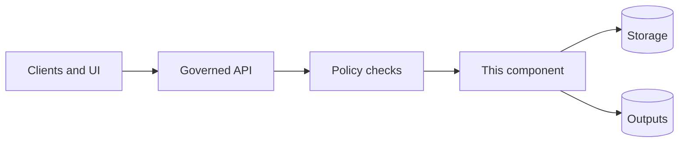

<!-- [KFM_META_BLOCK_V2]
doc_id: kfm://doc/<uuid>
title: TEMPLATE — Component Spec
type: standard
version: v1
status: draft
owners: <team-or-names>
created: <YYYY-MM-DD>
updated: <YYYY-MM-DD>
policy_label: <public|restricted|...>
related: [docs/templates/TEMPLATE__COMPONENT_SPEC.md]
tags: [kfm, template, component-spec]
notes: [
  "Copy this template to a component-specific spec doc and replace all <PLACEHOLDERS>.",
  "Delete sections that do not apply, but keep REQUIRED sections.",
  "Every non-trivial claim should be tagged CONFIRMED / PROPOSED / UNKNOWN."
]
[/KFM_META_BLOCK_V2] -->

# <Component Name> — Component Spec
One-line purpose: <What this component does, for whom, and why.>

> **Status:** <experimental|active|stable|deprecated>  
> **Owners:** <team-or-names>  
> **Path:** `<repo-relative-path>`  
> **Policy label:** <public|restricted|...>  
> **Last reviewed:** <YYYY-MM-DD>  
> **Tracking:** <issue/epic link(s)>  
> **Runbook:** <link or path>  
> **On-call/Support:** <rotation or contact>


**Quick nav:**  
[Scope](#scope) · [Where it fits](#where-it-fits) · [Architecture](#architecture) · [Interfaces](#interfaces) · [Data contracts](#data-contracts) · [Security and governance](#security-and-governance) · [Reliability and operations](#reliability-and-operations) · [Gates](#definition-of-done-and-gates) · [Appendix](#appendix)

---

## Scope
### In-scope
- <REQUIRED> <What responsibilities this component owns end-to-end.>
- <REQUIRED> <What “done” looks like for its outputs.>

### Out of scope
- <REQUIRED> <What it explicitly does not do (and where that belongs instead).>

### Primary users
- <Who calls/uses this component: API, pipeline, UI, stewards, external clients.>

### Glossary
- **<Term>**: <Definition>
- **<EvidenceRef>**: <Resolvable reference used for citations/evidence>
- **<Run receipt>**: <A structured record of inputs/outputs/policy decisions>

---

## Where it fits
### System position
- **Upstream:** <systems/components feeding this component>
- **Downstream:** <systems/components consuming this component>
- **Storage surfaces touched:** <object store, DB, search index, graph, caches>

### Trust membrane and policy boundary
- <REQUIRED> **Invariant:** Clients/UI do not access DB/object storage directly. All access crosses a governed API / policy enforcement boundary.  
- <REQUIRED> **Fail-closed posture:** if policy/evidence/validation is missing or unresolvable, the component denies/abstains rather than guessing.

> Replace this section with your concrete enforcement points:
- Policy enforcement point (PEP): <where policy is evaluated>
- Policy decision point (PDP): <OPA bundle / rules location>
- Evidence resolver: <service/module that turns EvidenceRefs into bundles>

---

## Acceptable inputs
Describe what belongs here (and what “valid” means).

### Inputs
- <REQUIRED> **Input types:** <HTTP request, event message, file drop, cron schedule, CLI args, etc.>
- <REQUIRED> **Required fields:** <list>
- <REQUIRED> **Optional fields:** <list>
- **Expected freshness:** <e.g., “near-real-time”, “daily batch”, “ad hoc”>

### Input validation (fail-closed)
- <REQUIRED> Schema validation: <how + where>
- <REQUIRED> Policy validation: <how + where>
- <REQUIRED> Provenance pre-checks (if applicable): <what must be present before processing>

---

## Exclusions
What must *not* go here (and where it should go instead).

- <REQUIRED> <Exclusion 1> → <Correct destination>
- <REQUIRED> <Exclusion 2> → <Correct destination>

---

## Component overview
### Responsibilities
- <REQUIRED> R1: <responsibility>
- <REQUIRED> R2: <responsibility>

### Non-goals
- <What this component intentionally avoids to stay small and governed.>

### Key behaviors (tag each as CONFIRMED / PROPOSED / UNKNOWN)
- **[CONFIRMED]** <behavior with test/evidence link>
- **[PROPOSED]** <behavior that’s planned>
- **[UNKNOWN]** <behavior not yet verified — add next verification step>

---

## Architecture
### High-level diagram (REQUIRED)


### Data flow
1. <Step 1>
2. <Step 2>
3. <Step 3>

### Data zones and promotion gates (if this component produces datasets/artifacts)
- **Zones:** RAW → WORK (or QUARANTINE) → PROCESSED → PUBLISHED
- **Promotion gate requirements:** checksums + catalogs + provenance must exist and validate before promotion.

> Replace with concrete artifacts/cats for this component:
- DCAT: <path or generator>
- STAC: <path or generator>
- PROV: <path or generator>
- Checksums/digests: <algorithm + where stored>

### Determinism and idempotency (if applicable)
- Determinism strategy: <seed, pinned inputs, canonicalization>
- Idempotency key: <e.g., spec_hash or run_id>
- “Kill switch” / emergency stop: <path/env flag, behavior>

---

## Interfaces
Describe everything this component **provides** and **consumes**.

### Provided interfaces (registry table)
| Interface | Kind | Path / Topic / Command | AuthN/AuthZ | Request/Message schema | Response schema | Stability |
|---|---|---|---|---|---|---|
| <Name> | <HTTP|Event|CLI|Library> | <...> | <...> | <schema ref> | <schema ref> | <experimental|stable> |

### Consumed interfaces (dependency table)
| Dependency | Kind | Contract | Owner | SLA/SLO | Failure mode | Fallback |
|---|---|---|---|---|---|---|
| <Service/Data> | <HTTP|DB|Object|Queue> | <OpenAPI/Schema> | <team> | <...> | <...> | <...> |

### Error model (REQUIRED)
- Stable error envelope: <error_code, message (policy-safe), audit_ref, remediation hints>
- Policy-safe behavior: do not leak restricted existence via different error shapes.

---

## Data contracts
### Contract inventory (REQUIRED TABLE)
| Contract name | Type | Location | Version | Compatibility rule | Validator / Tests |
|---|---|---|---|---|---|
| <RunReceipt> | JSON Schema | <path> | v1 | <backward compat?> | <tests> |
| <...> | OpenAPI | <path> | v1 | <...> | <...> |

### Identifiers
- Component ID: <proposed scheme>
- Run ID: <format>
- Artifact IDs: <format>
- Dataset/version IDs (if relevant): <format>

### Versioning policy
- Additive-only changes on stable APIs unless bumping major version.
- Schema version(s): <KFM-DCAT vN, KFM-STAC vN, KFM-PROV vN, etc.>

---

## Claims, evidence, and verification status (REQUIRED)
Use this to enforce “cite-or-abstain” discipline in engineering docs too.

| Claim | Status (CONFIRMED/PROPOSED/UNKNOWN) | Evidence link(s) | Owner | Next step to confirm |
|---|---|---|---|---|
| <e.g., “UI cannot bypass policy boundary”> | <...> | <tests/ADR/link> | <...> | <...> |
| <...> | <...> | <...> | <...> | <...> |

---

## Security and governance
### Data sensitivity
- Data classification: <public|internal|confidential|restricted|sensitive-location>
- Sensitive fields: <list>
- Redaction/generalization rules: <where defined + tested>

### AuthN / AuthZ
- Principals: <users/services>
- Roles: <role list>
- Authorization checks: <where enforced>

### Threat model (REQUIRED)
| Threat | Risk | Mitigation | Test/Control |
|---|---|---|---|
| Policy bypass (direct storage/DB access) | High | Trust membrane + network policy + tests | <link> |
| Prompt injection / data exfiltration (if AI-facing) | High | Tool allowlist + evidence resolver + redaction | <link> |
| License/attribution violation | High | Rights metadata gate + steward review | <link> |

### Audit and retention
- Audit events emitted: <list>
- audit_ref format: <kfm://audit/...>
- Retention policy: <duration + storage + access controls>

---

## Reliability and operations
### SLOs (REQUIRED)
| User journey | SLI | Target | Window | Notes |
|---|---|---:|---|---|
| <e.g., Evidence resolve> | <p95 latency> | <...> | <...> | <...> |

### Observability (REQUIRED)
| Signal | Type | Name | Description | Cardinality guardrails |
|---|---|---|---|---|
| Logs | structured | <...> | <...> | <...> |
| Metrics | counter/gauge/hist | <...> | <...> | <...> |
| Traces | span | <...> | <...> | <...> |

### Runbooks
- Common failures: <list + links>
- Backfill/replay plan (if ingest): <how>
- Backup/restore (if stateful): <how>
- Rollback plan: <what, how, and “safe to revert” constraints>

---

## Quickstart
> Replace commands with your repo’s actual tooling. Use runnable snippets or mark as pseudocode.

```bash
# (pseudocode) Run unit tests
<cmd>

# (pseudocode) Run contract tests
<cmd>

# (pseudocode) Run integration test against a small fixed slice
<cmd>
```

---

## Definition of Done and gates (REQUIRED)
### CI/PR gates (checklist)
- [ ] Formatting / lint / typecheck pass
- [ ] Unit tests pass
- [ ] Contract tests pass (API + schema)
- [ ] Integration tests pass (end-to-end slice)
- [ ] Determinism / reproducibility check (if producing artifacts)
- [ ] Policy tests pass (fail-closed)
- [ ] SBOM + dependency/vuln scan pass
- [ ] Observability added/updated (logs/metrics/traces)
- [ ] Rollback path documented and feasible
- [ ] Docs updated (this spec + related READMEs/contracts)

### Promotion gates (if producing datasets/artifacts)
- [ ] Identity + schema + extents + license recorded
- [ ] Sensitivity classification recorded + redactions applied
- [ ] Checksums/digests computed for all promoted artifacts
- [ ] DCAT/STAC/PROV catalogs emitted and link-check clean
- [ ] Auditable run receipt recorded (who/what/when/why + policy decisions)

---

## Open questions
- [ ] Q1: <question> — owner: <name> — due: <date>
- [ ] Q2: <question> — owner: <name> — due: <date>

---

## FAQ
**Why does this component fail closed?**  
<Answer in one paragraph, link to policy or ADR.>

**How do I add a new dependency?**  
<Answer + required contract + tests.>

---

## Appendix
<details>
<summary>Appendix A — Example run receipt / manifest shape</summary>

```json
{
  "run_id": "kfm://run/<...>",
  "started_at": "<ISO-8601>",
  "finished_at": "<ISO-8601>",
  "inputs": [
    {"ref": "<EvidenceRef>", "digest": "sha256:<...>"}
  ],
  "outputs": [
    {"artifact": "<uri>", "media_type": "<...>", "digest": "sha256:<...>"}
  ],
  "policy": {
    "decision": "allow|deny",
    "policy_label": "<public|restricted|...>",
    "obligations_applied": []
  },
  "env": {"env_hash": "sha256:<...>"},
  "tooling": {"version": "<...>"},
  "notes": "<optional>"
}
```

</details>

<details>
<summary>Appendix B — Checklists for component types</summary>

### If this is a governed API service
- [ ] OpenAPI exists + contract tests
- [ ] AuthZ tests for each role
- [ ] Error model is policy-safe (no existence leaks)
- [ ] Audit logs emitted for governed operations

### If this is a pipeline / ingest connector
- [ ] Deterministic manifests + checksums
- [ ] Backfill strategy + rate limiting
- [ ] Quarantine path for validation/policy failures
- [ ] Promotion gates CI-enforced

</details>

---

[Back to top](#component-name--component-spec)
