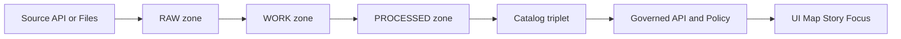

<!-- [KFM_META_BLOCK_V2]
doc_id: kfm://doc/4f3307c5-9be6-4e67-b8ba-960caf87616d
title: TEMPLATE — Dataset Entry
type: standard
version: v1
status: draft
owners: KFM Data Engineering
created: 2026-03-04
updated: 2026-03-04
policy_label: public
related: [docs/templates/TEMPLATE__DATASET_ENTRY.md]
tags: [kfm, template, dataset, catalog, provenance, governance]
notes:
  - "Copy this file into a dataset registry folder and replace all <PLACEHOLDER> fields."
  - "This template is designed to be machine-parseable and CI-gate friendly."
[/KFM_META_BLOCK_V2] -->

# TEMPLATE — Dataset Entry
One canonical, governed description of a dataset and its versions, suitable for catalogs, promotion gates, and evidence-first UI.

> **Status:** template • **Owners:** KFM Data Engineering • **Policy:** public  
> **Badges:** ![status][badge-status] ![policy][badge-policy] ![schema][badge-schema]  
> **Quick links:** [How to use](#how-to-use-this-template) • [Machine header](#machine-readable-header) • [Catalog triplet](#catalog-triplet) • [Promotion gates](#promotion-gates) • [Appendix](#appendix)

---

## Scope
This document is a **dataset entry** for one logical dataset (and its version lineage). It is intended to:

- drive dataset discovery (humans and machines)
- support DCAT, STAC, and PROV catalog generation
- enable **fail-closed** promotion through RAW → WORK → PROCESSED → PUBLISHED
- provide enough evidence/provenance for Map, Story, and Focus Mode surfaces

## Where it fits
- **This template file:** `docs/templates/TEMPLATE__DATASET_ENTRY.md`
- **Intended destination (copy target):** `data/registry/<dataset_id>/DATASET_ENTRY.md` *(PROPOSED; update to match your repo layout)*

## Acceptable inputs
- Dataset identity, scope, license/rights, sensitivity classification, and steward contacts
- Pointers to raw/work/processed artifacts, manifests, digests, and validation outputs
- Pointers to catalog artifacts (DCAT/STAC/PROV) and run receipts

## Exclusions
- **No secrets** (API keys, tokens, passwords)
- **No raw data payloads** (store in the proper data zones; link here instead)
- **No sensitive exact locations** unless this file is restricted and access-controlled
- **No unverifiable claims** — if something is not yet verified, mark it UNKNOWN and record the smallest verification step

---

## Non-negotiables
- **CONFIRMED:** UI and external clients must not directly access DB/storage; access crosses governed APIs and a policy boundary.
- **CONFIRMED:** Promotion is gated; catalogs and validations must be machine-checkable and enforced.
- **CONFIRMED:** The catalog “triplet” is DCAT (dataset metadata) + STAC (geospatial assets) + PROV (lineage).

---

## How to use this template
1. Copy this file into the dataset registry location.
2. Replace every `<PLACEHOLDER>` and remove any sections that do not apply.
3. Keep the **Machine-readable header** in sync with the narrative sections.
4. Attach or reference required artifacts (manifests, checksums, receipts, catalogs).
5. Run your repo’s validators and open a PR.

> TIP: Treat this as a contract. If a required field is missing, CI should fail the promotion.

[Back to top](#template--dataset-entry)

---

## Machine-readable header
<!-- kfm:dataset_entry; schema=v1 -->

```yaml
kfm_dataset_entry:
  # ---------------------------------------------------------------------------
  # Identity and status
  # ---------------------------------------------------------------------------
  dataset_id: "<snake_case_id>"               # stable across time
  dataset_title: "<Human-readable title>"
  dataset_version_id: "<version_id>"          # e.g., v2026-03-04, 2026Q1, semver, etc.
  lifecycle_zone: "<raw|work|processed|published>"   # current zone for this version
  entry_status: "<draft|review|published|deprecated>"

  # Evidence discipline for anything in this file that is not purely descriptive.
  claim_status: "<CONFIRMED|PROPOSED|UNKNOWN>"
  verification_steps:
    - "<Smallest step to move UNKNOWN → CONFIRMED>"

  owners:
    - name: "<Owner name>"
      team: "<Team or org>"
      email: "<email@example.org>"
      role: "<data_owner|steward|engineering_contact>"

  # ---------------------------------------------------------------------------
  # Policy and governance
  # ---------------------------------------------------------------------------
  policy:
    sensitivity_class: "<public|restricted|sensitive_location|aggregate_only>"
    access_rights: "<public|internal|partners|restricted>"
    obligations:
      redaction_profile_id: "<none|profile_id>"
      notes: "<e.g., generalize geometry to 1km grid for public>"
    policy_bundle_hash: "<sha256:...>"        # optional: hash of policy bundle evaluated

  # ---------------------------------------------------------------------------
  # License and rights
  # ---------------------------------------------------------------------------
  license:
    spdx: "<SPDX ID or SPDX expression>"      # e.g., CC-BY-4.0
    attribution: "<Required attribution text>"
    upstream_terms_snapshot: "<path-or-url>"
    redistribution_allowed: "<yes|no|unknown>"

  # ---------------------------------------------------------------------------
  # Scope and extents
  # ---------------------------------------------------------------------------
  scope:
    summary: "<One-paragraph abstract>"
    keywords: ["<keyword1>", "<keyword2>"]
    themes: ["<environment>", "<transportation>", "<history>", "<agriculture>"]
    kfm_domain: "<earth_observation|hydrology|biodiversity|...>"

  extents:
    spatial:
      crs: "EPSG:4326"
      bbox_wgs84: ["<minLon>", "<minLat>", "<maxLon>", "<maxLat>"]
      geometry_type: "<point|line|polygon|grid|tile>"
      resolution: "<e.g., 10m, 30m, county-level>"
    temporal:
      start: "<YYYY-MM-DD>"
      end: "<YYYY-MM-DD or null>"
      accrual_periodicity: "<hourly|daily|monthly|annual|irregular>"
      time_zone: "UTC"

  # ---------------------------------------------------------------------------
  # Source system
  # ---------------------------------------------------------------------------
  source:
    provider: "<Publisher / organization>"
    landing_page: "<url>"
    access:
      type: "<api|files|manual|partner_drop>"
      endpoints:
        - "<url>"
    refresh_strategy: "<poll|webhook|batch>"
    auth: "<none|api_key|oauth|signed_url>"
    upstream_license_observed_at: "<YYYY-MM-DD>"

  # ---------------------------------------------------------------------------
  # Evidence and provenance
  # ---------------------------------------------------------------------------
  evidence:
    run_id: "<uuid or run slug>"
    run_timestamp: "<ISO8601>"
    run_receipt_path: "<path>"
    run_record_path: "<path>"
    run_manifest_path: "<path>"
    checksums_path: "<path>"
    spec_hash: "<jcs:sha256:<hex>>"           # optional but recommended

  # ---------------------------------------------------------------------------
  # Artifacts and catalogs
  # ---------------------------------------------------------------------------
  artifacts:
    raw:
      manifest_path: "<path>"
      checksums_path: "<path>"
      assets: []                               # optional list; prefer run_manifest.json
    work:
      qa_reports: ["<path>"]
      prov_bundle_path: "<path>"
    processed:
      assets:
        - role: "data"
          path: "<path>"
          media_type: "<mime-type>"
          digest: "sha256:<hex>"
        - role: "qa"
          path: "<path>"
          media_type: "application/json"
          digest: "sha256:<hex>"

  catalogs:
    dcat_path: "<path>"
    stac_collection_path: "<path or null>"
    stac_items_path: "<path or null>"
    prov_path: "<path>"
```

[Back to top](#template--dataset-entry)

---

## Dataset overview
| Field | Value |
|---|---|
| Dataset ID | `<snake_case_id>` |
| Title | `<Human-readable title>` |
| Domain | `<kfm_domain>` |
| Sensitivity | `<public|restricted|sensitive_location|aggregate_only>` |
| License (SPDX) | `<SPDX>` |
| Update cadence | `<accrual_periodicity>` |
| Spatial extent | `<bbox or description>` |
| Temporal extent | `<start> → <end or ongoing>` |
| Primary contact | `<name + email>` |

### What is this dataset
**Claim (CONFIRMED/PROPOSED/UNKNOWN):** `<Describe what the dataset is and what it is not.>`  
**Verification steps (if needed):** `<List smallest verification steps.>`

### Why it exists in KFM
- `<What use cases does it enable for Map/Story/Focus Mode?>`
- `<What decisions might depend on it?>`

---

## Source and acquisition
### Upstream source
- **Provider:** `<org>`
- **Landing page:** `<url>`
- **Access type:** `<api|files|manual|partner_drop>`
- **Update cadence:** `<daily|monthly|...>`
- **Change detection:** `<etag|last_modified|checksum|none>`

### Acquisition method
Describe **how KFM acquires** the data:

- `<Polling job schedule or event trigger>`
- `<Authentication method>`
- `<Backfill strategy for historical ranges>`

### Raw zone capture
Record what is stored in RAW:

- `<Upstream payload snapshot>`
- `<Raw manifest + checksums>`
- `<License/terms snapshot>`

> WARNING: RAW must be immutable and append-only.

[Back to top](#template--dataset-entry)

---

## Processing and transformations
### Work zone workflow
List transformations performed in WORK:

1. `<Normalization step 1>`
2. `<Reprojection / schema mapping>`
3. `<Redaction or generalization transforms, if any>`
4. `<QA and validation reports>`

### Processed outputs
Describe what is produced in PROCESSED and why it is query-ready:

- `<Standardized formats: GeoParquet, COG, PMTiles, etc.>`
- `<Indexing strategy: PostGIS, search index, graph edges, etc.>`

---

## Validation and quality
### Required validators
| Validator | What it checks | Output path |
|---|---|---|
| `schema` | `<schema compliance>` | `<path>` |
| `metadata` | `<required catalog fields>` | `<path>` |
| `spatial` | `<CRS + geometry validity>` | `<path>` |
| `provenance` | `<lineage completeness>` | `<path>` |
| `policy` | `<OPA / policy checks>` | `<path>` |

### Quality thresholds
- `<Define thresholds that block promotion, e.g., metadata coverage ≥ 98%>`
- `<Define tolerances for spatial accuracy, completeness, etc.>`

### Known issues and mitigations
- `<Issue>` → `<Mitigation>` → `<Planned verification>`

[Back to top](#template--dataset-entry)

---

## Catalog triplet
### DCAT
- **Path:** `<catalog/dcat/<dataset_id>.jsonld>`
- **Minimum fields present:** title, description, publisher, license, spatial, temporal, accrualPeriodicity, distributions, prov link.

### STAC
- **Path:** `<catalog/stac/<dataset_id>/collection.json>`
- **Minimum fields present:** id, title, description, license, extent.spatial, extent.temporal, keywords/providers.
- **Items:** `<one per time/area unit, as applicable>`

### PROV
- **Path:** `<catalog/prov/<dataset_id>/<dataset_version_id>/bundle.json>`
- **Minimum fields present:** Entities, Activities, Agents, and relations linking inputs → transforms → outputs.

---

## Evidence and provenance
### Run receipt
- **run_id:** `<id>`
- **run_receipt:** `<path>`
- **What it must capture:** inputs, tooling versions, hashes/digests, policy decisions, and timestamps.

### Provenance story
Write a short lineage narrative:

1. `<Upstream source>`  
2. `<Ingest activity>`  
3. `<Transform activities>`  
4. `<Redaction activity, if any>`  
5. `<Published artifacts>`

---

## Promotion gates
> Outcome: if any required artifact is missing or unverifiable, promotion must fail closed.

### Gate checklist
- [ ] Identity: `dataset_id` + `dataset_version_id` present and stable.
- [ ] Raw capture: manifest + checksums present; upstream license snapshot stored.
- [ ] License: SPDX declared and redistribution obligations documented.
- [ ] Sensitivity: classification explicit; redaction plan recorded if needed.
- [ ] QA: schema + data validation reports exist; thresholds met.
- [ ] Catalogs: DCAT/STAC/PROV validate and link-check clean.
- [ ] Provenance: PROV bundle links inputs → transforms → outputs; includes agents and times.
- [ ] Contract tests: representative API queries pass (and are policy-filtered).
- [ ] Audit: run receipt present; promotion recorded as a release manifest entry.
- [ ] Human review: CODEOWNERS or steward approval completed when required.

[Back to top](#template--dataset-entry)

---

## Expected directory layout
> Update to match your repo conventions.

```text
data/
  raw/<dataset_id>/
    <run_id>/
      raw_manifest.json
      checksums.txt
      upstream_license_snapshot.txt
      assets/...
  work/<dataset_id>/
    <run_id>/
      run_receipt.json
      run_record.json
      run_manifest.json
      qa/...
      prov/...
      intermediate/...
  processed/<dataset_id>/
    <dataset_version_id>/
      assets/...
      checksums.txt
      qa/...
      catalogs/
        dcat.jsonld
        stac/
          collection.json
          items/...
        prov/
          bundle.json
  published/
    # served only via governed API surfaces
```

---

## Diagram


---

## Changelog
| Date | Version | Change | Author |
|---|---|---|---|
| `<YYYY-MM-DD>` | `<dataset_version_id>` | `<What changed and why>` | `<name>` |

---

## Appendix
<details>
<summary>Example filled entry skeleton</summary>

```yaml
kfm_dataset_entry:
  dataset_id: "example_dataset"
  dataset_title: "Example Dataset"
  dataset_version_id: "v2026-03-04"
  lifecycle_zone: "work"
  entry_status: "draft"
  claim_status: "UNKNOWN"
  verification_steps:
    - "Confirm upstream license and capture snapshot artifact."
  policy:
    sensitivity_class: "public"
    access_rights: "public"
    obligations:
      redaction_profile_id: "none"
      notes: ""
  license:
    spdx: "CC-BY-4.0"
    attribution: "© Example Provider; used under CC-BY-4.0"
    upstream_terms_snapshot: "data/raw/example_dataset/<run_id>/upstream_license_snapshot.txt"
    redistribution_allowed: "yes"
```

</details>

[badge-status]: https://img.shields.io/badge/status-template-blue
[badge-policy]: https://img.shields.io/badge/policy-public-brightgreen
[badge-schema]: https://img.shields.io/badge/schema-v1-lightgrey
