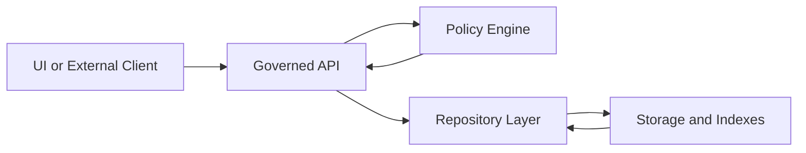
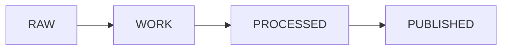

<!-- [KFM_META_BLOCK_V2]
doc_id: kfm://doc/<uuid>
title: <Document Title>
type: standard
version: v1
status: draft
owners: <team or names>
created: YYYY-MM-DD
updated: YYYY-MM-DD
policy_label: public|restricted|...
related: [<repo-relative paths or kfm:// ids>]
tags: [kfm]
notes: [<short notes>]
[/KFM_META_BLOCK_V2] -->

<!--
TEMPLATE INSTRUCTIONS (delete this comment block after you fill in the placeholders):
- Keep: MetaBlock + Impact block + at least one Mermaid diagram.
- Prefer: small, reversible changes; link out to source-of-truth code/contracts instead of duplicating.
- Evidence discipline: Every meaningful claim MUST be labeled CONFIRMED / PROPOSED / UNKNOWN.
- If UNKNOWN: list the smallest verification steps to make it CONFIRMED.
- No secrets. No restricted raw content. Link to governed artifacts/manifests instead.
-->

<a id="top"></a>

# <Document Title>

<One-line purpose statement. What is this doc for and who should read it?>

---

## Impact

 <!-- TODO -->
 <!-- TODO -->
 <!-- TODO -->

**Status:** `<experimental|active|stable|deprecated>`  
**Owners:** `<team or names>`  
**Policy label:** `<public|restricted|...>`  
**Last updated:** `YYYY-MM-DD`  
**Primary audience:** `<who uses this>`  
**Related:** `<link to code, ADRs, runbooks, datasets, contracts>`

**Quick links:** [Scope](#scope) · [Where it fits](#where-it-fits) · [Architecture](#architecture) · [Evidence](#evidence-and-claim-log) · [Governance](#governance-and-sensitivity) · [Checklist](#release-and-publication-checklist)

---

## Scope

### In scope

- <bullet>
- <bullet>

### Out of scope

- <bullet>
- <bullet>

---

## Where it fits

- **Path in repo:** `<path/to/this/doc.md>`
- **Upstream dependencies:** <systems/data/contracts this depends on>
- **Downstream dependents:** <systems/features that rely on this>

---

## Inputs

What belongs here / what this doc may reference:

- <acceptable inputs: datasets, APIs, config files, tickets, ADRs, etc.>

---

## Exclusions

What must *not* go here (and where instead):

- Secrets → `infra/secret-management/` (or your approved secrets manager)
- Restricted raw data → governed storage + `evidence.manifest.json` references only
- Full copies of provider documents → link to canonical source, store only short excerpts under license

---

## KFM invariants

These are **system invariants**. If this document proposes violating any of them, it MUST include an explicit governance review section and an approved exception.

- **Trust membrane:** UI and external clients never access databases or object storage directly; all access crosses the governed API and policy boundary.
- **Fail-closed:** authorization/policy checks fail closed for every request (data, story nodes, AI).
- **Promotion gates:** RAW → WORK → PROCESSED → PUBLISHED requires catalogs (e.g., STAC/DCAT/PROV), validation outputs, and checksums.
- **Cite-or-abstain:** any user-facing answer must cite evidence or explicitly abstain; produce an audit reference.

---

## Architecture

### High-level dataflow



### Responsibilities by layer

- **UI / Clients:** <what they do; what they must not do>
- **Governed API:** <interfaces; authN/authZ; policy integration points>
- **Policy engine:** <OPA rules, sensitivity gates, redaction policy>
- **Repository/Adapters:** <connectors; storage abstraction; no policy bypass>
- **Storage/Indexes:** <databases, object store, search index, graph store>

### Interfaces and contracts

List the contracts this doc relies on (schemas, OpenAPI, data contracts, etc.):

- `<path/to/contract>` — <what it guarantees>
- `<path/to/schema>` — <what it validates>

> IMPORTANT: Core logic MUST NOT bypass repository/adapter layers to reach storage.

---

## Data lifecycle and promotion gates

### Lifecycle states



### Promotion checklist (copy/paste)

A dataset/artifact MUST NOT be promoted unless **all** items below are satisfied:

- [ ] Identity: stable `dataset_id` / `item_id` and deterministic naming
- [ ] Schema: validated against the applicable contract(s)
- [ ] Extents: spatial + temporal bounds present (or policy-safe generalization)
- [ ] License: machine-readable license present (SPDX/CC where applicable)
- [ ] Sensitivity: classification complete; redaction summary included if needed
- [ ] Validation: outputs meet thresholds (record exact thresholds)
- [ ] Provenance: PROV-O (and optional OpenLineage) emitted for the run
- [ ] Integrity: checksums/digests for outputs; manifest is versioned
- [ ] Run record: who/what/when/why + policy decisions captured

---

## Evidence and claim log

### How to write a claim

Use this block for any statement that matters for correctness, security, policy, or decisions:

**CLAIM (CONFIRMED | PROPOSED | UNKNOWN):** <one sentence claim>  
**Why it matters:** <impact if wrong>  
**Evidence:** <links to datasets/manifests/tests/ADRs>  
**Verification steps (required if UNKNOWN):**
1. <smallest step>
2. <smallest step>

### Claim register

| Claim ID | Claim | Status | Evidence link(s) | Owner | Last verified |
|---|---|---|---|---|---|
| C-001 | <claim> | <CONFIRMED|PROPOSED|UNKNOWN> | <link> | <name> | YYYY-MM-DD |
| C-002 | <claim> | <CONFIRMED|PROPOSED|UNKNOWN> | <link> | <name> | YYYY-MM-DD |

---

## Governance and sensitivity

### Policy label

- **This doc’s policy label:** `<public|restricted|...>`
- **Primary constraints:** <CARE/FAIR constraints, sovereignty gates, privacy rules>

### Sensitivity classification

| Data/Artifact | Classification | Allowed in docs? | Handling |
|---|---|---|---|
| Raw provider exports | <restricted?> | ❌ | Store in governed zone; reference via manifest only |
| Derived aggregates | <public?> | ✅/⚠️ | Ensure redaction/generalization if needed |
| Locations | <varies> | ⚠️ | Avoid precise targeting for vulnerable sites |

### Redaction

- **Default posture:** redact/generalize when permissions are unclear.
- **Redaction summary location:** `<path/to/redaction.summary.json or prov bundle>`
- **Policy regression tests:** `<path/to/policy-tests>`

---

## Implementation notes

### Quickstart

```bash
# Example commands (update for your component)
make test
make lint
make run
```

### Operational notes

- Observability: <logs/metrics/traces; where to look>
- SLOs: <if applicable>
- Rollback: <what’s the safe rollback path?>

---

## Testing and CI gates

### Required gates (minimum)

- [ ] Formatting / lint / typecheck
- [ ] Unit tests
- [ ] Contract tests (API + schema)
- [ ] Integration tests (end-to-end happy path)
- [ ] Determinism / reproducibility checks for produced artifacts
- [ ] AuthN/AuthZ tests for governed APIs
- [ ] Policy regression suite (fail-closed)

### Test evidence

| Gate | Evidence artifact | Threshold |
|---|---|---|
| Schema validation | `reports/.../schema-validation.json` | 100% pass |
| Metadata lint | `docs/.../metadata-lint.json` | ≥ <threshold>% |
| Provenance emitted | `data/.../prov.bundle.jsonld` | required |

---

## Decision log

Prefer short ADR-style entries, linked to full ADRs.

| Date | Decision | Status | Link |
|---|---|---|---|
| YYYY-MM-DD | <decision> | <accepted|superseded|rejected> | <adr link> |

---

## Release and publication checklist

- [ ] MetaBlock filled and accurate
- [ ] Impact block updated (status/owners/policy/links)
- [ ] At least one Mermaid diagram present and readable
- [ ] Every meaningful claim labeled (CONFIRMED/PROPOSED/UNKNOWN)
- [ ] UNKNOWN claims include verification steps
- [ ] No secrets; no restricted raw content
- [ ] Links are repo-relative where possible
- [ ] Tables have a blank line before them
- [ ] Code blocks are language-tagged and runnable (or labeled pseudocode)

---

## Appendix

<details>
<summary>Optional templates</summary>

### ADR mini-template

```markdown
# ADR: <title>

- Date: YYYY-MM-DD
- Status: proposed|accepted|superseded
- Context:
- Decision:
- Consequences:
- Alternatives considered:
- Evidence:
```

### Evidence manifest pointer (example)

```json
{
  "evidence_manifest_id": "urn:kfm:evidence:manifest:<id>",
  "items": [
    {"ref": "stac://collection/<id>/item/<id>", "sha256": "<digest>"},
    {"ref": "prov://bundle/<id>.jsonld", "sha256": "<digest>"}
  ]
}
```

</details>

---

[Back to top](#top)
