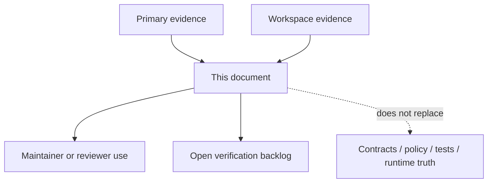
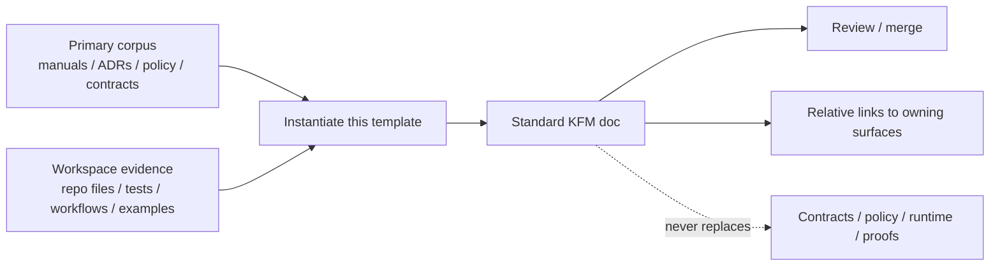

<!-- [KFM_META_BLOCK_V2]
doc_id: kfm://doc/<NEEDS_VERIFICATION__uuid>
title: KFM Universal Document Template
type: standard
version: v1
status: draft
owners: @bartytime4life
created: NEEDS_VERIFICATION__YYYY-MM-DD
updated: NEEDS_VERIFICATION__YYYY-MM-DD
policy_label: NEEDS_VERIFICATION__public|restricted|...
related: [../../README.md, ../README.md, ./README.md, ../standards/README.md, ../standards/markdown-rules.md, ../../.github/CODEOWNERS]
tags: [kfm, template, docs, markdown]
notes: [Reusable scaffold for governed KFM docs; replace placeholders before merge or instantiation; confirm doc_id, dates, policy_label, and any narrower co-owners in the destination document.]
[/KFM_META_BLOCK_V2] -->

# KFM Universal Document Template

Reusable scaffold for governed KFM Markdown docs that need explicit scope, evidence posture, reviewability, and repo-native GitHub structure.

> **Status:** experimental template  
> **Doc status:** draft scaffold  
> **Owners:** `@bartytime4life` *(broad `/docs/` owner; add narrower owners only when confirmed)*  
>       
> **Quick jumps:** [Scope](#scope) · [Repo fit](#repo-fit) · [Quickstart](#quickstart) · [Usage](#usage) · [Diagram](#diagram) · [Field guide](#field-guide) · [Review checklist](#review-checklist--definition-of-done) · [FAQ](#faq) · [Appendix](#appendix)  
> **Repo fit:** `docs/templates/TEMPLATE__KFM_UNIVERSAL_DOC.md` → upstream: [`../../README.md`](../../README.md), [`../README.md`](../README.md), [`./README.md`](./README.md), [`../standards/README.md`](../standards/README.md), [`../../.github/CODEOWNERS`](../../.github/CODEOWNERS) · downstream: instantiated standard docs across `docs/` that do not fit a more specialized template.

> [!IMPORTANT]
> This template standardizes shape, reviewability, and truth posture. It does not authorize facts, replace contracts or policy, or create a second truth path.

## Scope

Use this template when a KFM document needs one stable, review-friendly structure but does not belong in a more specialized scaffold. It is tuned for architecture notes, standards docs, governance references, runbooks, analyses, and other repo-native Markdown surfaces that must stay downstream of evidence, contracts, policy, tests, and release state.

A good use of this file makes uncertainty visible, keeps ownership traceable, and gives maintainers one place to find scope, boundaries, verification burden, and open unknowns.

## Repo fit

| Item | Value |
| --- | --- |
| Path | `docs/templates/TEMPLATE__KFM_UNIVERSAL_DOC.md` |
| Primary role | Reusable standard-doc scaffold for governed KFM Markdown |
| Best used for | Standard docs that need explicit scope, evidence basis, review hooks, and KFM truth labels |
| Use instead of this | [`./TEMPLATE__API_CONTRACT_EXTENSION.md`](./TEMPLATE__API_CONTRACT_EXTENSION.md) for contract-extension docs; [`./TEMPLATE__STORY_NODE_V3.md`](./TEMPLATE__STORY_NODE_V3.md) for Story Node docs |
| Upstream guidance | [`./README.md`](./README.md), [`../README.md`](../README.md), [`../standards/README.md`](../standards/README.md), [`../standards/markdown-rules.md`](../standards/markdown-rules.md), [`../../README.md`](../../README.md) |
| Typical downstream outputs | Architecture references, governance notes, runbooks, standards, analyses, explanatory docs, index docs, and review-ready synthesis docs |
| Instantiation rule | Copy and rename near the owning surface; do not fill canonical content directly inside `docs/templates/` unless this template itself is being maintained |

## Accepted inputs

| Belongs here | Why it fits |
| --- | --- |
| Governing summaries of architecture, policy, delivery, verification, or operational posture | The template keeps scope, evidence basis, and open verification visible |
| Repo-native explanatory docs that summarize contracts, schemas, tests, or workflows without replacing them | The structure makes links to owning artifacts explicit |
| Standard docs that need KFM truth labels and a current evidence boundary | The template includes those sections by default |
| Documents that need a meaningful diagram, compact tables, and a review checklist | The template bakes those in without forcing decorative filler |
| README-like docs with no better local pattern | The appendix includes optional add-ons for directory trees, quickstarts, and FAQ blocks |

## Exclusions

| Do not put this here | Where it belongs instead |
| --- | --- |
| Canonical policy logic or decision bundles | `policy/` or the owning governance surface |
| Schema truth, contract definitions, or machine-validated examples | `contracts/`, `schemas/`, and associated fixture/test surfaces |
| Runtime code, package logic, or implementation behavior | `apps/`, `packages/`, `scripts/`, or the owning runtime surface |
| Evidence objects, release manifests, receipts, proof packs, or correction artifacts | The owning data, release, proof, or governance artifact surface |
| Secrets, credentials, tokens, or environment-specific operations detail that should not live in docs | Secure runtime or config management, not Markdown |
| One-off scratch notes that are neither reviewable nor intended to persist | A working draft surface outside the governed docs path |

## Baseline and evidence posture

The structural baseline for this file is the stronger documentation pattern already visible in the repo. This template is intentionally a conservative completion of that pattern, not a claim that every neighboring doc has already reached the same level of detail.

| Source or signal | How this template uses it |
| --- | --- |
| `docs/README.md` | Broader documentation posture, quick-jump rhythm, and evidence-boundary discipline |
| `docs/templates/README.md` | Template boundary, non-canonical role, and specialized-template ecosystem |
| `docs/standards/README.md` | Adjacent doc rhythm, link conventions, and status styling |
| `.github/CODEOWNERS` | Broad `/docs/` ownership signal |

## Quickstart

1. If you are maintaining the template itself, edit this file in place.
2. If you are instantiating a real document, copy the file to the owning surface and rename it for the real topic.
3. Replace the KFM meta block placeholders first: `doc_id`, dates, policy label, related links, and owners.
4. Replace the title and one-line purpose so the document announces its job immediately.
5. Keep the accountability sections unless there is a strong reason to omit them: Scope, Repo fit, Accepted inputs, Exclusions, the baseline/evidence section, Current evidence boundary, Diagram, and Review checklist.
6. Delete unused optional blocks rather than leaving dead filler in the page.
7. Link claims to the owning contracts, schemas, policy docs, tests, workflows, or implementation files where possible. When direct proof is missing, keep the claim visibly qualified.
8. If the instantiated file is also a directory README, add the optional README-like blocks from the appendix.

```bash
# illustrative example — adjust the target path before use
cp docs/templates/TEMPLATE__KFM_UNIVERSAL_DOC.md docs/architecture/<new-doc>.md
$EDITOR docs/architecture/<new-doc>.md
```

[Back to top](#kfm-universal-document-template)

## Evidence labels

| Label | Use it when | Avoid |
| --- | --- | --- |
| **CONFIRMED** | The claim is directly supported in the current session by attached docs, repo files, tests, configs, workflows, or other visible artifacts | Inflating “should exist” into “does exist” |
| **INFERRED** | Multiple project signals strongly imply a conservative structural completion | Presenting the inferred structure as mounted implementation |
| **PROPOSED** | The document recommends a design move, next artifact, or reversible improvement | Dressing recommendations up as current repo fact |
| **UNKNOWN** | The current session did not verify the point strongly enough | Smoothing the gap away with confident prose |
| **NEEDS VERIFICATION** | A concrete check should still be performed before relying on the point | Leaving the reviewer unsure what to inspect next |

## Usage

Copy the skeleton below into the destination file, then edit it in place. Remove sections that truly do not apply, but keep the truth posture visible and keep the remaining structure coherent.

~~~md
<!-- [KFM_META_BLOCK_V2]
doc_id: kfm://doc/<NEEDS_VERIFICATION__uuid>
title: <Document Title>
type: standard
version: v1
status: draft|review|published
owners: <team or names>
created: YYYY-MM-DD
updated: YYYY-MM-DD
policy_label: public|restricted|...
related: [<relative paths or kfm:// ids>]
tags: [kfm]
notes: [Replace placeholders; keep unsupported claims marked CONFIRMED / INFERRED / PROPOSED / UNKNOWN / NEEDS VERIFICATION.]
[/KFM_META_BLOCK_V2] -->

# <Document Title>

<One-line purpose. State what this document does for KFM and why it exists.>

> **Status:** <experimental|active|stable|deprecated>
> **Doc status:** <draft|review|published>
> **Owners:** <team or names>
>    
> **Quick jumps:** [Scope](#scope) · [Repo fit](#repo-fit) · [Evidence basis](#baseline-and-evidence-basis) · [Diagram](#diagram) · [Review checklist](#review-checklist--definition-of-done) · [Appendix](#appendix)
> **Repo fit:** `<path/to/this/file.md>` → upstream: [`<relative-upstream-doc>`](<relative-upstream-doc>) · downstream: [`<relative-downstream-doc>`](<relative-downstream-doc>)

> [!IMPORTANT]
> This document is downstream of evidence, policy, contracts, tests, and release state.
> It should explain them honestly, not replace them.

## Scope

<State the exact surface, problem, or boundary this document covers.>

## Repo fit

| Item | Value |
| --- | --- |
| Path | `<path/to/this/file.md>` |
| Primary audience | `<engineering|governance|review|ops|public|mixed>` |
| Upstream sources | `<relative links to baseline docs, ADRs, contracts, schemas, policy docs>` |
| Downstream readers or consumers | `<who uses this and for what>` |
| Adjacent owning surfaces | `<contracts / policy / tests / apps / packages / docs>` |

## Accepted inputs

- <What belongs here>
- <What belongs here>
- <What belongs here>

## Exclusions

- <What does not belong here and where it goes instead>
- <What does not belong here and where it goes instead>
- <What does not belong here and where it goes instead>

## Baseline and evidence basis

### Baseline document

- **CONFIRMED / INFERRED / PROPOSED / UNKNOWN:** <name the controlling baseline or explain that authority is collective>

### Evidence used in this revision

- **Primary corpus:** <attached manuals / ADRs / standards / policies / contracts / schemas>
- **Workspace evidence:** <repo files / tests / configs / workflows / examples>
- **External validation:** <only if needed; state why>

## Current evidence boundary

- **CONFIRMED:** <what was directly inspected>
- **NEEDS VERIFICATION:** <what still needs direct repo or runtime evidence>
- **UNKNOWN:** <what cannot be claimed as current fact yet>

## Truth labels used in this document

| Label | Use it when |
| --- | --- |
| CONFIRMED | Directly supported in the current session |
| INFERRED | Conservative structural completion supported by multiple project signals |
| PROPOSED | Recommended design or next step not yet verified as implemented |
| UNKNOWN | Not proven strongly enough to present as project fact |
| NEEDS VERIFICATION | Specific check that should be completed before relying on the claim |

## <Main section title>

<Open with the governing point, not generic background.>

### <Subsection>

<Keep paragraphs short. Link to owning artifacts where possible.>

### <Subsection>

<Add tables, examples, or snippets only when they materially improve reviewability.>

## Diagram



## Reference table

| Topic | Current posture | Owning source or artifact | Notes |
| --- | --- | --- | --- |
| <topic> | <CONFIRMED / INFERRED / PROPOSED / UNKNOWN> | `<relative link>` | <short note> |
| <topic> | <CONFIRMED / INFERRED / PROPOSED / UNKNOWN> | `<relative link>` | <short note> |

## Review checklist / definition of done

- [ ] Exact KFM meta block wrapper is preserved.
- [ ] Meta block fields are resolved or intentionally left review-visible.
- [ ] Title, purpose line, repo fit, accepted inputs, and exclusions are present.
- [ ] Claims about behavior link to owning evidence or stay visibly qualified.
- [ ] Relative links resolve from this file's path.
- [ ] Mermaid renders and is meaningful.
- [ ] Open verification items remain visible instead of being smoothed away.
- [ ] Behavior-significant changes link to updated docs, tests, contracts, or runbooks.

## Open questions / verification backlog

| Item | Why it matters | Direct verification needed |
| --- | --- | --- |
| <unknown> | <risk or consequence> | <file, test, workflow, manifest, or runtime proof needed> |

## Appendix

<details>
<summary>Optional long-form reference, examples, or appendix material</summary>

### Optional example snippet

```text
<illustrative example; label it clearly if not directly sourced>
```

</details>

<!-- If this instantiated file is also a directory README, add:
- Directory tree
- Quickstart
- Usage
- FAQ
- Back-to-top links for long sections
-->
~~~

> [!TIP]
> Use the smallest template that preserves KFM truth posture. If a specialized scaffold already exists, prefer it over this universal one.

## Diagram



[Back to top](#kfm-universal-document-template)

## Field guide

| Field or placeholder | Fill it from | Keep placeholder when | Watchpoint |
| --- | --- | --- | --- |
| `title` and purpose line | The document's real job and owning surface | The document topic is not yet stable | Avoid generic titles that could fit any repo |
| `doc_id` | Assigned registry ID or approved UUID | No durable ID has been assigned yet | Do not invent stable identifiers casually |
| `owners` | Confirmed stewards or CODEOWNERS coverage | Ownership is unsettled or multi-surface | Broad ownership is better than fabricated precision |
| `created` and `updated` | Commit-ready dates or confirmed doc history | The date is not yet verified for the destination doc | Do not backfill dates from guesswork |
| `policy_label` | The owning governance or publication posture | The correct label is still under review | Keep this visible if release posture matters |
| `related` | Stable relative links to upstream and downstream docs | The owning relationships are not stable yet | Prefer relative links over raw URLs |
| `status` | Actual lifecycle stage of the instantiated doc | The doc is still in review | Keep top-block status and meta-block status conceptually aligned |
| Evidence labels | Verified claim posture | The claim has not been checked yet | Do not flatten `PROPOSED` or `UNKNOWN` into `CONFIRMED` |
| Repo fit paths | Actual destination path and nearby owning surfaces | The file has not been moved into its final location | Update these links immediately after placement |

## Review checklist / definition of done

- [ ] The instantiated or revised doc has a real job and is not duplicating stronger nearby documentation.
- [ ] The exact KFM meta block wrapper is present.
- [ ] The title and one-line purpose are specific, not generic.
- [ ] Scope, Repo fit, Accepted inputs, and Exclusions are complete.
- [ ] Claims that sound like implementation facts are either directly linked to evidence or visibly qualified.
- [ ] The doc does not quietly replace contracts, policy, tests, manifests, or release artifacts.
- [ ] The diagram explains a real relationship rather than decorating the page.
- [ ] Tables clarify something compactly instead of restating prose.
- [ ] Optional sections that do not help have been removed.
- [ ] Long appendix material is wrapped in `<details>`.
- [ ] Relative links were checked from the destination path.
- [ ] If the doc is README-like, directory tree, quickstart, usage, and FAQ blocks were added.
- [ ] If the doc changes behavior-significant guidance, adjacent docs, runbooks, or standards were updated too.

## FAQ

<details>
<summary><strong>When should I use this instead of a specialized template?</strong></summary>

Use this template when the document needs governed KFM structure but does not fit a narrower scaffold. If the work is primarily a Story Node or a contract-extension doc, use the specialized template instead.

</details>

<details>
<summary><strong>Can I delete sections from the skeleton?</strong></summary>

Yes, but remove them intentionally. Keep the accountability core unless it truly does not apply: scope, repo fit, evidence basis, evidence boundary, diagram, and review checklist.

</details>

<details>
<summary><strong>Can this template prove that implementation exists?</strong></summary>

No. The template can only make the verification boundary harder to hide. Mounted repo files, tests, workflows, manifests, logs, and runtime evidence still decide what can be called CONFIRMED.

</details>

[Back to top](#kfm-universal-document-template)

## Appendix

<details>
<summary><strong>Optional README-like add-ons</strong></summary>

Use these blocks when the instantiated document is also acting as a directory README or index surface.

### Optional directory tree

~~~md
## Directory tree

```text
<path>/
├── README.md
├── <file-or-subdir>
└── <file-or-subdir>
```
~~~

### Optional quickstart

~~~md
## Quickstart

```bash
# non-destructive example — replace with real commands
<command>
```
~~~

### Optional usage or task flow

~~~md
## Usage

1. <step>
2. <step>
3. <step>
~~~

### Optional FAQ starter

~~~md
## FAQ

### <Question>
<Answer>
~~~

</details>

<details>
<summary><strong>Optional section starters</strong></summary>

Use these openers when you want the document to read like KFM rather than a generic template.

- **Scope opener:** “This document covers the governed boundary between ...”
- **Evidence opener:** “The controlling baseline for this document is ...”
- **Verification opener:** “The strongest current-session proof for this section is ...”
- **Unknown opener:** “The current session did not directly verify ...”
- **Proposal opener:** “The smallest reversible next move is ...”

</details>

<details>
<summary><strong>Back-to-top pattern</strong></summary>

```md
[Back to top](#kfm-universal-document-template)
```

</details>

[Back to top](#kfm-universal-document-template)
