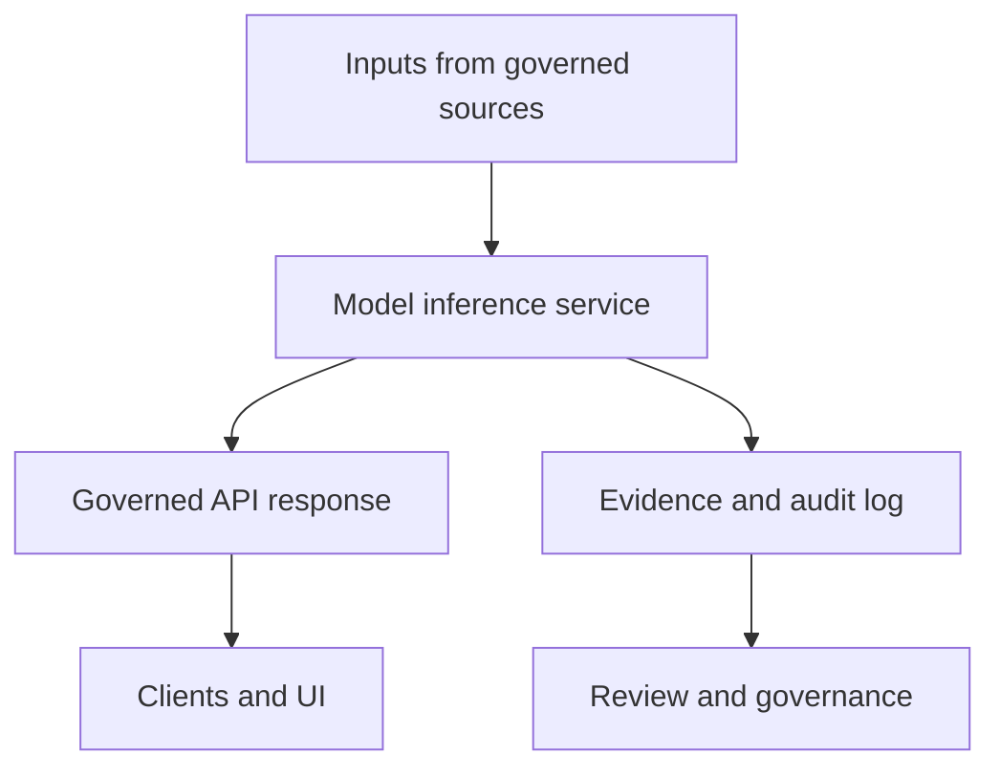

<!-- [KFM_META_BLOCK_V2]
doc_id: kfm://doc/<uuid>
title: TEMPLATE — Model Card
type: standard
version: v1
status: draft
owners: <team-or-handle>
created: 2026-03-04
updated: 2026-03-04
policy_label: public
related: [docs/templates/README.md]
tags: [kfm, template, model-card]
notes: [No YAML front matter; use this MetaBlock + in-doc metadata tables.]
[/KFM_META_BLOCK_V2] -->

# TEMPLATE — Model Card

Evidence-first model card template for models used in Kansas Frontier Matrix (KFM).

> **No YAML front matter:** This template uses a KFM MetaBlock (above) + structured tables below instead.

---

## Impact

- **Status:** template
- **Owners:** `<team-or-handle>`
- **Last reviewed:** `<YYYY-MM-DD>`
- **Applies to:** `kfm://model/<model_name>@<version>` (placeholder)

  
  


**Quick nav:**  
[Model metadata](#model-metadata) ·
[Summary](#summary) ·
[Intended use](#intended-use) ·
[Training data](#training-data) ·
[Training procedure](#training-procedure) ·
[Evaluation](#evaluation) ·
[Safety](#safety-and-responsible-use) ·
[Governance](#governance-and-policy) ·
[Operations](#operations-and-reliability) ·
[Changelog](#changelog)

---

## Scope

This document is the authoritative “model card” for a single deployed or candidate model in KFM.  
It is written for:

- auditors and reviewers (evidence + policy decisions),
- engineers integrating the model (contracts + operational constraints),
- downstream consumers (known limits + safe usage guidance).

---

## Where it fits in the repo

- **Template location:** `docs/templates/TEMPLATE__MODEL_CARD.md` (this file)
- **PROPOSED derived location pattern:** `docs/models/<model_name>/MODEL_CARD.md`
- **Upstream connections (typical):**
  - training pipeline docs (runs, configs, code refs)
  - dataset catalogs (STAC/DCAT/PROV, licenses, sensitivity)
  - CI supply-chain artifacts (SBOM, signatures, attestations)
- **Downstream connections (typical):**
  - governed API surfaces (model inference endpoints)
  - UI/clients (via governed APIs only; never direct storage access)
  - Story/Focus AI reasoning layer (must cite-or-abstain)

---

## Acceptable inputs

Use this template for:

- foundation models, fine-tunes, adapters/LoRA, classifiers, rankers, embedding models
- models shipped as containers or non-container artifacts (e.g., weights in OCI, files in object storage)
- “model + prompt” bundles, if prompts are treated as versioned assets

---

## Exclusions

Do **not** use this template for:

- datasets → use dataset card templates
- pipelines/workflows → use pipeline runbooks/spec templates
- API contracts → use API spec templates
- governance policy docs → use governance templates

---

## Model metadata

Fill this section first. Prefer stable IDs and immutable artifact references.

### Identity

| Field | Value |
|---|---|
| **Model ID** | `kfm://model/<name>@<semver>` |
| **Display name** | `<Human-friendly name>` |
| **Model type** | `<LLM / embedding / classifier / ranker / vision / other>` |
| **Lifecycle stage** | `<sandbox / governed / production / deprecated>` |
| **Release date** | `<YYYY-MM-DD>` |
| **Owners** | `<team-or-handle>` |
| **Primary contact** | `<email or issue link>` |

### Provenance and artifacts

| Field | Value |
|---|---|
| **Source repo** | `<repo URL or path>` |
| **Source commit SHA** | `<sha>` |
| **Build/run ID** | `<CI run id / pipeline run id>` |
| **Artifact location (immutable)** | `<oci://...@sha256:... OR s3://...#sha256=...>` |
| **Artifact location (tagged)** | `<oci://...:<tag>>` |
| **SBOM reference** | `<spdx/cyclonedx artifact ref>` |
| **Provenance attestation ref** | `<in-toto/DSSE/cosign bundle ref>` |
| **Signature verification** | `<pass/fail + verifier + date>` |

### License and usage constraints

| Field | Value |
|---|---|
| **Model license** | `<SPDX id or text>` |
| **Weights redistribution** | `<allowed / prohibited / restricted>` |
| **Commercial use** | `<allowed / prohibited / restricted>` |
| **Attribution required** | `<yes/no + details>` |
| **Third-party components** | `<list or “see SBOM”>` |

### Governance labels

| Field | Value |
|---|---|
| **Policy label** | `<public / restricted / internal / confidential>` |
| **Sensitivity class** | `<none / low / moderate / high / needs review>` |
| **Allowed deployment surfaces** | `<governed API only>` |
| **Approved use domains** | `<e.g., summarization of public docs>` |
| **Disallowed uses** | `<e.g., targeting vulnerable locations>` |

---

## Summary

### What this model does

- **CONFIRMED / PROPOSED / UNKNOWN:** `<choose one>`
- Description: `<what it does in 1–3 sentences>`
- Inputs: `<text / image / geojson / embeddings / structured>`
- Outputs: `<text / labels / scores / embeddings>`
- Primary value: `<why KFM uses it>`

### System context



---

## Intended use

### Intended use cases

List the *allowed* use cases.

- `<Use case 1>`
- `<Use case 2>`
- `<Use case 3>`

### Not intended use cases

List the *disallowed* or unsafe use cases.

- `<Not intended use 1>`
- `<Not intended use 2>`

### Users and stakeholders

- Primary users: `<who>`
- Secondary users: `<who>`
- Affected parties: `<who might be impacted>`

---

## Training data

> **Rule:** Every dataset named here must have a traceable reference (dataset ID + catalog/provenance + license + sensitivity classification).

### Data sources inventory

| Dataset ID | Name | License | Sensitivity | Time range | Geography | Notes |
|---|---|---|---|---|---|---|
| `kfm://dataset/<id>` | `<name>` | `<license>` | `<class>` | `<YYYY–YYYY>` | `<extent>` | `<notes>` |

### Data selection rationale

- **CONFIRMED / PROPOSED / UNKNOWN:** `<choose one>`
- Rationale: `<why these data sources>`

### Data exclusions and redactions

- Excluded categories: `<PII / protected / restricted>`
- Redaction transforms applied: `<what transforms, where documented>`
- Leakage checks: `<methods + evidence refs>`

### Data quality and validation evidence

- Validation suite: `<link/path>`
- Thresholds used: `<what thresholds>`
- Results reference: `<artifact ref>`  
  - **CONFIRMED / PROPOSED / UNKNOWN:** `<choose one>`

---

## Training procedure

### Base model and adaptation

| Field | Value |
|---|---|
| Base model | `<name/version>` |
| Adaptation method | `<full fine-tune / LoRA / prompt-only / other>` |
| Training objective | `<next-token / classification / contrastive / other>` |
| Alignment method | `<none / SFT / RLHF / DPO / other>` |

### Training configuration

| Field | Value |
|---|---|
| Framework | `<PyTorch / JAX / etc>` |
| Config file(s) | `<path(s)>` |
| Random seeds | `<seeds or “not deterministic”>` |
| Determinism controls | `<notes>` |
| Compute | `<GPU/CPU type + count>` |
| Duration | `<hours>` |
| Cost and energy telemetry | `<kWh, CO2e, method>` |

### Reproducibility checklist

- [ ] Training code is version-pinned (commit SHA recorded)
- [ ] Environment is reproducible (lockfiles / container digest)
- [ ] Input dataset versions are pinned (digests or immutable refs)
- [ ] Outputs (weights) have checksums/digests recorded
- [ ] Provenance attestation exists and verifies
- [ ] Evaluation is replayable from recorded artifacts

---

## Evaluation

### Evaluation overview

- What was evaluated: `<capabilities>`
- Who evaluated: `<team>`
- When evaluated: `<YYYY-MM-DD>`
- Evaluation artifacts: `<paths/refs>`

### Benchmarks and results

> Replace placeholders with measured results. Do not omit baselines.

| Benchmark / Test | Dataset | Metric(s) | Result | Baseline | Notes | Evidence ref |
|---|---|---:|---:|---:|---|---|
| `<name>` | `<id>` | `<metric>` | `<value>` | `<value>` | `<notes>` | `<ref>` |

### Robustness, calibration, and drift

- Robustness tests: `<what + results ref>`
- Calibration: `<method + evidence ref>`
- Drift monitoring plan: `<signals + thresholds + runbook link>`

### Human evaluation

- Protocol: `<rubric + sampling>`
- Raters: `<who>`
- Inter-rater reliability: `<if used>`
- Evidence: `<ref>`

---

## Safety and responsible use

### Known limitations

- `<limitation 1>`
- `<limitation 2>`
- `<limitation 3>`

### Known failure modes

- `<failure mode 1>`
- `<failure mode 2>`

### Bias, fairness, and representativeness

- Risks identified: `<what>`
- Mitigations: `<what>`
- Evidence references: `<ref>`

### Privacy considerations

- Inputs may include: `<PII? yes/no>`
- Logging policy: `<what is logged + retention>`
- Data minimization: `<controls>`
- Incident response: `<link/runbook>`

### Safety controls in deployment

- [ ] System prompt/policy guardrails (documented)
- [ ] Output filtering (documented)
- [ ] Rate limits / abuse prevention
- [ ] “Cite-or-abstain” enforcement where required
- [ ] Fail-closed behavior on missing evidence/policy decisions

---

## Security and supply chain

### Artifact integrity

Provide immutable, verifiable references.

- Model artifact digest: `<sha256:...>`
- Signature: `<cosign/sigstore ref>`
- Attestation: `<in-toto/DSSE ref>`

### Verification commands (example)

```bash
# Pseudocode: replace with your actual artifact references and policy tooling.
cosign verify --keyless "<MODEL_ARTIFACT_REF>"
cosign verify-attestation --keyless "<MODEL_ARTIFACT_REF>"
```

### SBOM and dependency posture

- SBOM format: `<SPDX/CycloneDX>`
- Vulnerability scanning: `<tool + cadence>`
- High/critical CVEs: `<list + mitigation status>`

---

## Governance and policy

### Policy decisions

This section records the *decision logic* that permits or denies use.

| Decision ID | Decision | Scope | Rationale | Evidence refs | Approver | Date |
|---|---|---|---|---|---|---|
| `kfm://policy-decision/<id>` | `<allow/deny>` | `<endpoint/use case>` | `<why>` | `<refs>` | `<name/team>` | `<YYYY-MM-DD>` |

### Promotion gates

> Promotion is **fail-closed**: missing evidence or policy approvals means “do not promote.”

- **Sandbox → Governed**
  - [ ] Model card complete (this doc)
  - [ ] License verified (and compatible)
  - [ ] Training data inventory complete (IDs + licenses + sensitivity)
  - [ ] Evaluation results recorded + baselines included
  - [ ] SBOM present
  - [ ] Signatures + attestations verify
  - [ ] Governance approval recorded (Decision table above)

- **Governed → Production**
  - [ ] SLOs defined (latency/availability/error budget)
  - [ ] Monitoring dashboards exist
  - [ ] Rollback plan tested
  - [ ] Incident response runbook exists
  - [ ] Red-team / abuse testing completed (if applicable)
  - [ ] Access controls validated (authN/authZ tests)

---

## Operations and reliability

### Serving details

| Field | Value |
|---|---|
| Deployment type | `<container / serverless / on-prem / other>` |
| Runtime | `<python version, torch version, etc>` |
| Hardware requirements | `<GPU/CPU/RAM>` |
| Scaling strategy | `<HPA, queue, batch>` |
| Cold start behavior | `<notes>` |

### Monitoring signals

- Latency: `<p50/p95 thresholds>`
- Error rate: `<threshold>`
- Quality drift: `<signals>`
- Cost/energy: `<kWh/CO2e monitoring>`

### Rollback and fallback

- Rollback trigger: `<conditions>`
- Rollback method: `<how>`
- Fallback model: `<model id>`
- Validation after rollback: `<tests>`

---

## Changelog

| Version | Date | Change | Risk level | Approval ref |
|---:|---|---|---|---|
| `<x.y.z>` | `<YYYY-MM-DD>` | `<summary>` | `<low/med/high>` | `<policy decision id>` |

---

## Appendix

### A. Claim register (cites-or-abstains discipline)

Every meaningful claim should be tracked.

| Claim ID | Claim | Status (CONFIRMED/PROPOSED/UNKNOWN) | Evidence refs | Last verified | Verified by |
|---|---|---|---|---|---|
| `claim-001` | `<claim text>` | `<status>` | `<refs>` | `<YYYY-MM-DD>` | `<name>` |

### B. Evidence index

List the artifacts a reviewer can open to validate this model card.

- `<artifact ref 1>`
- `<artifact ref 2>`
- `<artifact ref 3>`

<details>
<summary>C. Optional: Red-team notes (expand)</summary>

- Scenario: `<what>`
- Outcome: `<what>`
- Mitigation: `<what>`
- Evidence: `<ref>`

</details>

---

## Back to top

[↑ Back to top](#template--model-card)
