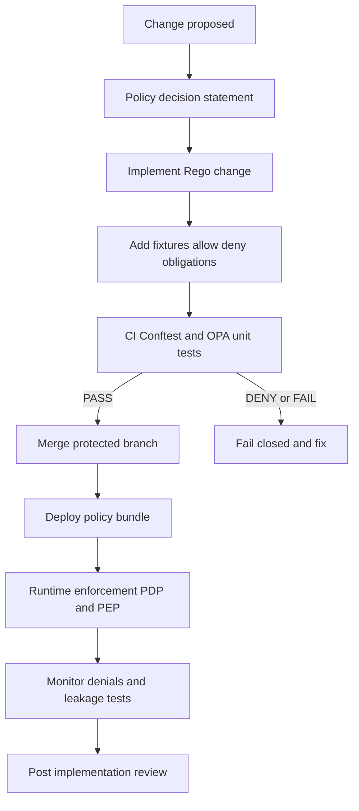

<!-- [KFM_META_BLOCK_V2]
doc_id: kfm://doc/f56312ee-bdd5-4b7f-97f1-d60a3e0d37e3
title: TEMPLATE — Policy Change
type: standard
version: v1
status: published
owners: <TBD>
created: 2026-03-04
updated: 2026-03-04
policy_label: public
related: [docs/templates/, policy/, tools/ci/, docs/governance/]
tags: [kfm, policy, template]
notes: ["Use this template for any change to policy semantics (CI or runtime)."]
[/KFM_META_BLOCK_V2] -->

# TEMPLATE — Policy Change
One file to propose, review, implement, and roll out a change to **KFM policy semantics** (OPA/Rego + enforcement points).

> **IMPACT**
> - **Status:** template (copy + fill)
> - **Owners:** `<TBD>` (typically: Governance + Security + Domain SME)
> - **Review required:** ✅ yes (policy changes are merge-blocking)
> - **Default posture:** deny-by-default, fail-closed
>
> Badges (optional / TODO):
> 
> 
> 
> 

**Quick links:** [How to use](#how-to-use) · [Scope](#scope) · [Change summary](#change-summary) · [Policy decision](#policy-decision) · [Fixtures and tests](#fixtures-and-tests) · [Rollout and rollback](#rollout-and-rollback) · [DoD](#definition-of-done-checklist)

---

## How to use

1. **Copy** this file for your change, e.g.:
   - `docs/policy/changes/YYYY-MM-DD__short-name.md` (recommended), or
   - attach the filled template in your PR description.

2. Replace all placeholders like `<TBD>` and `{{like_this}}`.

3. Your PR should include (at minimum):
   - the **policy code change** (e.g., `policy/` or `policies/`),
   - **fixtures** that demonstrate allow/deny + obligations,
   - CI wiring so the policy runs **fail-closed** (Conftest/OPA tests),
   - a **rollback** plan (even if “revert commit”).

---

## Scope

Describe what is in/out for this change.

### In scope
- Access control decisions (allow/deny).
- Obligation decisions (redaction/generalization/aggregation requirements).
- Any change that affects **what leaves the governed API boundary** (data, Story Nodes, Focus Mode).
- Any policy semantics used in CI **and** at runtime.

### Out of scope
- Pure refactors that provably do not change policy semantics (still require fixture parity).
- Dataset-specific configuration (belongs in that dataset/domain module docs) unless policy needs a new primitive.

---

## Where it fits

This change touches KFM’s **policy-as-code trust membrane**:

- **Policy Decision Point (PDP):** OPA/Rego evaluation (in CI and runtime).
- **Policy Enforcement Points (PEP):** CI gates, runtime API, evidence resolver, and (optionally) UI *badges/notices*.

> Reminder: the **UI must never make policy decisions**. It can display decisions made by the backend.

---

## Inputs

Acceptable inputs for a policy change proposal:

- A clear, testable **decision statement** (allow/deny + obligations).
- Concrete examples (fixtures) for:
  - ✅ allowed cases
  - 🟥 denied cases
  - ⚠️ allowed-with-obligations cases (e.g., generalized geometry)
- Links to impacted endpoints, datasets, and workflows.

---

## Exclusions

Do **not** put these here:

- Secrets, access tokens, private URLs.
- Precise sensitive locations, personally identifying data, or restricted archival content.
- Full copies of third-party policies/licenses (link instead; encode rules in the policy bundle).

---

## Change summary

### What’s changing
- **Policy bundle(s):** `{{policy_bundle_path}}` (e.g., `policy/rego/`, `policies/`)
- **Entry rule(s):** `{{package_and_rule}}` (e.g., `data.kfm.allow`)
- **Enforcement points impacted:** `{{pep_list}}` (CI, runtime API, evidence resolver, UI badge rendering, promotion gates)
- **Change type:** ☐ additive ☐ tightening ☐ loosening ☐ breaking ☐ bugfix

### Why now
- Problem statement:
  - {{describe_the_problem}}

- Goals (measurable):
  - {{goal_1}}
  - {{goal_2}}

- Non-goals:
  - {{non_goal_1}}

---

## Policy decision

Write the policy decision in plain language first, then in machine terms.

### Decision statement (plain language)
- **When** {{condition}}
- **If** {{additional_conditions}}
- **Then**:
  - **Allow?** ☐ allow ☐ deny
  - **Obligations:** {{redaction_generalization_aggregation_attribution_obligations}}
  - **Audit requirements:** {{audit_requirements}}

### Decision statement (machine terms)
- **Input schema:** `{{input_schema}}` (e.g., `run_receipt.json`, `api_request_context.json`)
- **Outputs:** `allow` boolean + `deny[]` reasons + `obligations{...}`

#### Required invariants
- `default allow = false` (deny-by-default)
- Any DENY must **fail-closed** in CI and runtime (no “best effort” bypass).
- CI semantics must match runtime semantics (same fixtures, same outcomes).

---

## Impact analysis

### Impacted surfaces

| Surface | What could change? | Risk | Mitigation |
|---|---|---:|---|
| CI gates | Merge behavior (new denies) | {{low_med_high}} | Add fixtures; communicate in PR; staged rollout |
| Governed API | Access, redaction, response shapes | {{low_med_high}} | Contract tests; versioned responses; audit |
| Evidence resolver | Citation resolution allow/deny | {{low_med_high}} | Evidence bundle tests; deny leakage tests |
| Story Nodes | Publishing gate + coordinate handling | {{low_med_high}} | Review workflow; redact/generalize rules |
| Focus Mode | Cite-or-abstain behavior | {{low_med_high}} | Hard citation gate; abstain paths tested |
| Data promotion | RAW→WORK→PROCESSED/PUBLISHED rules | {{low_med_high}} | Promotion gate checklist + regression tests |

### Sensitivity & rights posture

Fill out what applies:

- Sensitivity class affected: ☐ Public ☐ Restricted ☐ Sensitive-location ☐ Aggregate-only
- Rights/licensing affected: ☐ yes ☐ no
  - If yes, describe changes to allowlists, attribution requirements, “metadata-only reference” behavior, etc.

---

## Fixtures and tests

### Fixtures you must add or update

**Policy fixtures are the contract.** Add fixtures that represent real decision contexts.

| Fixture | Expected | Notes |
|---|---|---|
| `fixtures/{{name}}.json` | ✅ allow | {{why}} |
| `fixtures/{{name}}.json` | 🟥 deny | {{why}} |
| `fixtures/{{name}}.json` | ⚠️ allow + obligations | {{why}} |

### Regression requirements

- Add at least one **non-regression** fixture for a known-bad leak or bypass (must fail forever).
- If you are changing sensitive-location handling:
  - Include a fixture proving **high-precision coordinates are never returned** to unauthorized roles.
  - Include an obligation fixture that requires **generalization** (grid tier / uncertainty radius) when public output is allowed.

### Required CI wiring (examples)

```bash
# Local smoke test (example — adjust paths)
conftest test fixtures/ -p policy/rego

# Optional: unit tests for *_test.rego files
opa test policy/rego -v
```

---

## Rollout and rollback

### Rollout plan
- Rollout style: ☐ immediate ☐ canary ☐ staged-by-domain ☐ feature-flagged
- Kill-switch available? ☐ yes ☐ no  
  - If yes, where: `{{kill_switch_location}}`

Steps:
1. {{step_1}}
2. {{step_2}}
3. {{step_3}}

### Rollback plan (required)
- Primary rollback: ☐ revert commit ☐ policy version pin ☐ kill-switch activate
- Rollback trigger(s):
  - {{trigger_1}}
  - {{trigger_2}}

- Verification after rollback:
  - {{verification_steps}}

---

## Observability and audit

### Audit requirements
- What should be captured in receipts/logs for this change?
  - {{audit_fields}}

- How will we prevent restricted data leakage via logs/receipts?
  - {{log_redaction_strategy}}

### Monitoring / SLO impact
- Expected change in policy denials: ☐ none ☐ increase ☐ decrease
- New alerts needed? ☐ yes ☐ no
  - If yes: {{alerts}}

---

## Approvals and governance

### Required reviewers
- ☐ Governance / policy owners
- ☐ Security / privacy reviewer
- ☐ Domain SME (for impacted datasets)
- ☐ API owner (if response shapes change)

### FAIR + CARE considerations
- Communities potentially impacted: {{communities}}
- Harm analysis (what could go wrong if we get this wrong?):
  - {{harm_1}}
  - {{harm_2}}
- Mitigations:
  - {{mitigation_1}}

---

## Definition of Done checklist

**All boxes must be checked before merge.**

- [ ] Decision statement is complete (allow/deny + obligations).
- [ ] `default allow = false` (deny-by-default) preserved.
- [ ] CI runs policy **fail-closed** (DENY blocks merge).
- [ ] Fixtures added: allow + deny + obligations (as applicable).
- [ ] OPA/Conftest tests run in CI; local command documented.
- [ ] Non-regression fixture added for a prior leak/bypass.
- [ ] Evidence resolver / citation resolution paths tested (no restricted leakage).
- [ ] Focus Mode paths tested: cite-or-abstain works under new rules.
- [ ] Rollout plan written; rollback plan written.
- [ ] Observability updated (metrics/logging/alerts as needed).
- [ ] Docs updated where behavior changes (API docs, runbooks).
- [ ] Policy versioning/audit story is clear (how we attribute decisions to policy bundle version).

---

## Diagram



---

## Appendix

<details>
<summary>Common patterns and snippets</summary>

### 1) Deny-by-default skeleton (Rego)

```rego
package kfm.example

default allow = false

deny[msg] {
  # ...
  msg := "explain why"
}

allow {
  count(deny) == 0
}
```

### 2) “Claims matrix” for evidence discipline (optional)

| Claim | Status (CONFIRMED/PROPOSED/UNKNOWN) | EvidenceRef(s) | Smallest step to confirm |
|---|---|---|---|
| {{claim}} | {{status}} | {{evidence_refs}} | {{verification_step}} |

### 3) Suggested file layout (example)

```text
policy/
  rego/
    access.rego
    sensitivity.rego
    licensing.rego
    *_test.rego
fixtures/
  policy/
    allow_*.json
    deny_*.json
docs/
  policy/
    changes/
      YYYY-MM-DD__short-name.md
```

</details>

---

[Back to top](#template--policy-change)
