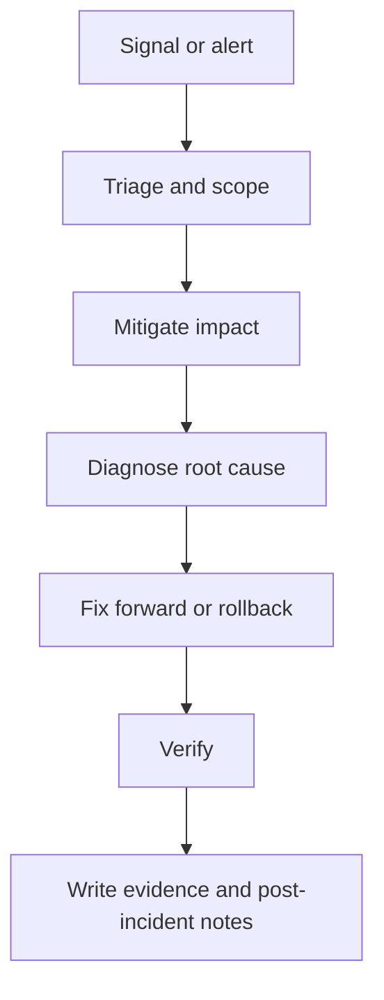

<!-- [KFM_META_BLOCK_V2]
doc_id: kfm://doc/<uuid>
title: RUNBOOK — <SYSTEM_OR_PIPELINE_NAME>
type: standard
version: v1
status: draft
owners: <team or names>
created: YYYY-MM-DD
updated: YYYY-MM-DD
policy_label: public|restricted|...
related: [<paths or kfm:// ids>]
tags: [kfm, runbook]
notes: ["Template. Copy this file and replace placeholders."]
[/KFM_META_BLOCK_V2] -->

<a id="top"></a>

# RUNBOOK — <SYSTEM_OR_PIPELINE_NAME>
One-line purpose: **how to keep <SYSTEM> healthy, mitigate incidents, and restore service safely.**

> **Status:** experimental | active | stable | deprecated  
> **Owners:** <@team or names>  
> **On-call:** <rotation / escalation alias>  
> **Last verified (dry run):** YYYY-MM-DD  
> **SLO page:** <link>  
> **Badges:**  
> [](#)
> [](#)
> [](#)

Quick nav:  
[Scope](#scope) ·
[Where it fits](#where-it-fits) ·
[Inputs](#inputs) ·
[Exclusions](#exclusions) ·
[Service overview](#service-overview) ·
[SLOs](#slos) ·
[Access and permissions](#access-and-permissions) ·
[Normal ops](#normal-ops) ·
[Incident response](#incident-response) ·
[Failure modes](#failure-modes) ·
[Rollback](#rollback) ·
[Evidence and artifacts](#evidence-and-artifacts) ·
[Appendix](#appendix)

---

## Scope
**What this runbook covers**
- <examples: API uptime, pipeline runs, catalog promotion, model inference jobs>
- <define what “healthy” means in measurable terms>

**What this runbook does not cover**
- <out of scope areas>

**Primary audiences**
- On-call engineer (first responder)
- Data/pipeline operator
- Incident commander (IC) / SRE
- Security/governance reviewer (as needed)

---

## Where it fits
**Path:** `docs/runbooks/<system-or-domain>/RUNBOOK__<SYSTEM>.md` (recommended)  
**Upstream:** <ingestion sources, schedulers, CI>  
**Downstream:** <APIs, UI, catalogs, Story/Focus, external clients>

**Related docs**
- Architecture: `docs/architecture/<...>.md`
- Governance: `docs/governance/<...>.md`
- Interfaces/contracts: `docs/specs/<...>.md`
- Dashboards: `docs/ops/dashboards/<...>.md`

---

## Inputs
Acceptable inputs for this runbook (safe to keep in-repo):
- Alert names + links to dashboards
- Queries/commands that are safe for on-call use
- Configuration keys (non-secret)
- Example log lines that do **not** contain sensitive data
- Checklist thresholds (SLOs, error budgets, validation thresholds)

---

## Exclusions
**Do NOT put these in a public runbook:**
- Secrets, tokens, API keys, private cert material
- Raw restricted datasets, personal data, precise sensitive locations
- Step-by-step instructions that would enable abuse (attack playbooks)
- Anything that violates policy classification for this path

If you need any of the above, create a **restricted** companion runbook and link it here.

---

## Service overview

### High-level flow


### Architecture invariants
Document the non-negotiables for your system (fail-closed expectations).

- **Invariant:** UI and external clients do not access storage or databases directly; all access crosses governed APIs and policy boundary.
- **Invariant:** Promotion gates are enforced: RAW → WORK → PROCESSED → PUBLISHED (or your repo’s equivalent).
- **Invariant:** Fail-closed policy: if verification/policy checks fail, the system blocks access/promotion rather than guessing.

> NOTE: Keep these invariants short. Link to the authoritative governance/architecture docs.

---

## SLOs

| SLI | Target | Window | Alert threshold | Notes |
|---|---:|---:|---:|---|
| Availability | <99.9%> | <30d> | <p1 at 99.0%> | <define>
| Latency p95 | <500ms> | <7d> | <p2 at 1s> | <define>
| Pipeline freshness | <6h lag> | <7d> | <p2 at 24h> | <define>
| Data validation pass rate | <99%> | <30d> | <p2 at 95%> | <define>

---

## Access and permissions

### Required roles
- **On-call responder:** <role / group>
- **Operator (promote/publish):** <role / group>
- **Security/governance approver (if needed):** <role / group>

### Systems and URLs
> Put URLs only if they are stable and appropriate for this repo’s policy label.

- Dashboards: <link>
- Logs: <link>
- Traces: <link>
- CI runs: <link>
- Admin consoles: <link>

### Authentication notes (no secrets)
- <SSO, OIDC, VPN requirements>
- <break-glass process (link only)>

---

## Normal ops

### Daily / per-run checklist (10–15 min)
- [ ] Check SLO dashboard: no sustained error budget burn
- [ ] Check “freshness” / ingestion lag < threshold
- [ ] Validate latest catalog promotion gate passed
- [ ] Spot-check recent deploys and config changes
- [ ] Confirm alerts are not flapping

### Known-good verification command(s)
```bash
# Replace with real commands for your stack.
# Examples: health endpoint, smoke test, validation gate, policy check

curl -fsS "<HEALTHCHECK_URL>" | jq .
```

---

## Incident response

### Severity guide

| Severity | Definition | Typical response |
|---|---|---|
| SEV-1 | User-facing outage, security incident, or data corruption risk | Page IC, stop the bleeding, update status every 15 min |
| SEV-2 | Degraded service, significant lag, partial failures | Triage, mitigate, update every 30–60 min |
| SEV-3 | Minor impact, workaround exists | Create ticket, fix in normal cycle |

### First 5 minutes checklist
1. **Confirm** the alert is real (check dashboards + logs).
2. **Scope impact**: which users, which datasets, which regions, since when.
3. **Stop the bleeding**:
   - Pause schedulers / promotions if data integrity is at risk.
   - Rate-limit or disable expensive endpoints if needed.
4. **Communicate**:
   - Open incident channel / ticket.
   - Declare severity and owner.
5. **Capture evidence**:
   - Record timestamps, run IDs, commit SHAs, and any policy decisions.

### Safety rails (fail-closed)
- If you cannot prove an artifact/run is valid, **do not promote it**.
- Prefer reversible mitigation (pause, feature flag off, roll back) before destructive actions.

---

## Failure modes

> Add one subsection per common failure mode. Keep each one copy-paste runnable.

### FM-01: <Example: Pipeline run failed validation gate>
**Signals**
- Alert: `<ALERT_NAME>`
- Symptom: <what users see>

**Likely causes**
- <schema drift, upstream changes, dependency outage>

**Triage**
```bash
# Find the failing run
# (pseudocode) replace with your runner/CI commands
echo "TODO: list recent runs"
```

**Mitigation**
1. Pause promotions: <how>
2. Re-run validation with debug logs: <how>
3. If caused by upstream input change: pin snapshot and open governance review

**Verification**
- [ ] Validation passes
- [ ] Catalog updated (STAC/DCAT/PROV) with checksums
- [ ] Policy gate passes (OPA/Rego or equivalent)

---

### FM-02: <Example: API is up but returning 5xx / timeout>
**Signals**
- Alert: `<ALERT_NAME>`
- p95 latency spike, 5xx rate

**Triage**
```bash
# (examples) replace with your real tooling
curl -fsS "<HEALTHCHECK_URL>" || true
```

**Mitigation options (pick safest first)**
- Scale up / restart stateless service
- Roll back latest deploy
- Disable or degrade non-critical feature
- Add temporary caching / rate limits

**Verification**
- [ ] Error rate back to baseline
- [ ] Latency back under SLO
- [ ] No new error budget burn trend

---

### FM-03: <Example: Storage / database connectivity issues>
**Signals**
- Connection pool exhaustion, timeouts
- DB alerts, disk full

**Mitigation**
- <increase pool, reduce concurrency, rotate logs, scale storage>

**CAUTION:** If you need to run destructive commands, require peer review and record the approval.

---

## Rollback

### Rollback decision checklist
- [ ] Confirm the issue correlates with a specific change (deploy, config, data release)
- [ ] Confirm rollback is safe and reversible
- [ ] Communicate rollback intent (IC/owners)

### Rollback procedure
```bash
# Replace with your real commands.
# Label destructive steps clearly.

echo "TODO: rollback deploy to <VERSION>"
```

### Post-rollback verification
- [ ] Health checks pass
- [ ] SLOs stabilizing
- [ ] Backlog catch-up plan created (if rollbacks paused ingestion)

---

## Evidence and artifacts

### What to save (minimum)
Record enough evidence to reproduce and audit the incident.

- Incident ticket link
- Start/end timestamps (UTC)
- Run IDs / workflow IDs
- Commit SHA(s) and release version(s)
- Input snapshot IDs / checksums
- Output artifact digests / checksums
- Policy decisions (why promotion was allowed/blocked)

### Suggested repo paths (house style)
```text
docs/reports/incidents/YYYY-MM-DD/<incident_id>/
  timeline.md
  screenshots/
  logs/                 # redacted excerpts only
  evidence.manifest.json

mcp/runs/<system>/<run_id>/
  inputs.json
  outputs.json
  validate.log
```

### Evidence discipline
Tag statements in incident notes as:
- **CONFIRMED:** supported by logs/metrics/artifacts
- **PROPOSED:** hypothesis pending verification
- **UNKNOWN:** not enough evidence; list the smallest verification step

---

## Post-incident

### Required outputs
- [ ] Timeline written (what happened, when)
- [ ] Root cause analysis (RCA) with evidence labels
- [ ] Corrective actions with owners + due dates
- [ ] Policy/gate updates if the system failed open
- [ ] Runbook updated with what you learned

### Quick postmortem template
```markdown
## Summary
<one paragraph>

## Impact
- Users affected:
- Duration:
- Data integrity risk:

## Root cause
- CONFIRMED:
- PROPOSED:
- UNKNOWN:

## What went well
- ...

## What went wrong
- ...

## Action items
- [ ] <item> — owner — due date
```

---

## Appendix

### Change log

| Date | Change | Author | Notes |
|---|---|---|---|
| YYYY-MM-DD | Initial runbook | <name> | |

### Runbook Definition of Done
- [ ] Owner + on-call rotation listed
- [ ] At least 1 dry-run verification in the last 90 days
- [ ] SLOs defined with alert thresholds
- [ ] “Stop the bleeding” steps are reversible and documented
- [ ] Rollback steps exist and are tested
- [ ] Evidence/artifact paths defined and policy-safe
- [ ] No secrets included; classification reviewed
- [ ] Mermaid diagram included
- [ ] Links are relative where possible

<details>
<summary>Optional: Advanced troubleshooting notes</summary>

- Dependency matrix
- Known performance footguns
- Load-test / replay procedures
- Data backfill strategy (idempotent, checkpointed)

</details>

---

🧭 Back to top: [Back to top](#top)
