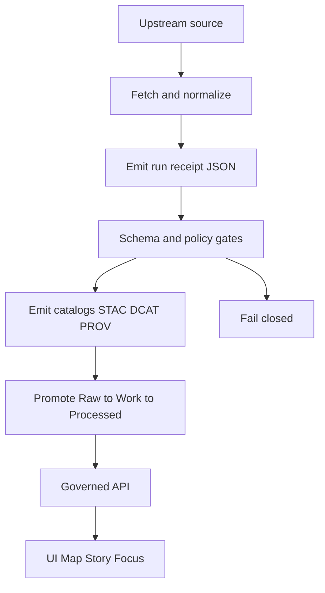

<!-- [KFM_META_BLOCK_V2]
doc_id: kfm://doc/7c5d8b9a-7f9d-4d35-9e9e-0f67c1e6d0a2
title: TEMPLATE__RUN_RECEIPT
type: standard
version: v1
status: draft
owners: ["KFM Core (TODO)"]
created: 2026-03-04
updated: 2026-03-04
policy_label: public
related: ["prov/templates/run.jsonld", "policy/", "catalog/", "receipts/"]
tags: [kfm, template, provenance, receipt, policy]
notes: ["Template + checklist for emitting run receipts (run_receipt/receipt.json) and derived PROV/OpenLineage/policy decision records."]
[/KFM_META_BLOCK_V2] -->

# TEMPLATE — Run Receipt
A run receipt is the machine-readable, **fail-closed** provenance record for a single KFM run (pipeline, watcher, or Focus Mode).

> **IMPACT (required)**  
> **Status:** experimental  
> **Owners:** KFM Core (TODO)  
> **Applies to:** RAW→WORK→PROCESSED pipelines, watchers (dry-run), Focus Mode (governed Q&A)  
> **Last updated:** 2026-03-04  
> **Badges:**     
> **Quick links:** [Scope](#scope) · [Where-it-fits](#where-it-fits) · [Template-json](#template-json) · [Field-matrix](#field-matrix) · [Gates](#validation--policy-gates) · [Checklist](#definition-of-done) · [Appendix](#appendix)

## Scope
Use this template when you need to **create or review** a run receipt JSON file.

A run receipt exists to answer (without ambiguity):

- **What ran?** (spec + code + environment)
- **On what inputs?** (source refs + validators + digests)
- **What outputs were produced?** (artifact paths + digests + media types)
- **What gates were applied?** (schema validation, policy decision, DQ checks)
- **Can we promote / publish?** (pass/fail, with reasons)

## Where it fits
KFM’s “truth path” requires every promoted dataset version (and every governed AI run) to be traceable through **catalogs + provenance + receipts**.

Receipts are the bridge between:

- pipeline execution (runs),
- catalogs (STAC/DCAT/PROV), and
- governed surfaces (API/UI/Focus).

## Acceptable inputs
A run receipt may record (policy-safe) facts about the run, including:

- dataset and version identifiers
- spec URI + deterministic spec hash
- upstream URLs **without secrets**
- HTTP validators (etag, last-modified) and/or input digests
- code provenance (repo, commit SHA)
- toolchain versions (kfm CLI, python, conftest/OPA, cosign)
- output artifact inventory (paths, digests, sizes, media types)
- policy decision and obligations applied

## Exclusions
A run receipt must **not** contain:

- secrets (tokens, cookies, API keys)
- raw restricted content (PII/PHI, sensitive locations) — store *references + digests* instead
- large logs (store a URI/digest pointer)
- “ghost metadata” that reveals restricted existence to unauthorized readers

> **IMPORTANT**: Treat receipts and audit logs as sensitive by default. Redact fields and apply retention rules.

## Evidence & policy trace
This template intentionally distinguishes:

- **CONFIRMED**: explicitly required or described in KFM reference documents.
- **PROPOSED**: recommended additions for v1 hardening (safe to implement additively).
- **UNKNOWN**: needs governance review / decision before becoming required.

| Requirement encoded by this template | Status | Notes |
|---|---:|---|
| Fail-closed: missing/invalid receipt fields block merge/promotion | CONFIRMED | CI/policy gates deny-by-default.
| Promotion gates require checksums + STAC/DCAT/PROV (+ receipts) | CONFIRMED | Receipt is a first-class gate input.
| Deterministic spec hashing (JCS + sha256) for stable IDs | CONFIRMED | Use `jcs:sha256:<hex>`.
| Minimal receipt shape for watchers (kind/version/run_id/watcher/inputs/outputs/checks/provenance) | CONFIRMED | See “Minimal watcher receipt” below.
| Attestation + signing evidence recorded alongside run | PROPOSED | Recommended for governed supply-chain trust.
| OpenLineage run id / events linked from receipt | PROPOSED | Recommended for observability.

## Directory layout
Recommended repo locations (adjust to your actual layout, but keep semantics the same):

```text
docs/templates/
  TEMPLATE__RUN_RECEIPT.md

run_receipt/
  receipt.json                 # canonical machine receipt (this template)

receipts/
  runs/YYYY-MM-DD/<job>/<run_id>/
    receipt.json               # archived copy
    policy_decision.json       # OPA decision record (inputs + reasons)
    prov.jsonld                # derived PROV bundle
    openlineage.events.jsonl   # optional
    attestations/              # optional
      attestation.intoto.jsonl
      cosign.bundle.json
      tsa.rfc3161.tst

catalog/
  stac/
  dcat/
  prov/
```

## Quickstart
Create a receipt, validate it, and use it to generate catalogs.

```bash
# 1) Copy this template’s JSON skeleton into your repo
cp docs/templates/TEMPLATE__RUN_RECEIPT.md /tmp/TEMPLATE__RUN_RECEIPT.md  # (for reference)

# 2) Put the canonical receipt where CI expects it (example)
mkdir -p run_receipt
$EDITOR run_receipt/receipt.json

# 3) Validate JSON syntax
jq . run_receipt/receipt.json >/dev/null

# 4) (Recommended) Policy gate (deny-by-default)
conftest test run_receipt/receipt.json --policy policy/opa

# 5) Emit catalogs from the receipt (examples — replace with real generators)
python src/pipelines/emit_stac.py --receipt run_receipt/receipt.json --out catalog/stac/
python src/pipelines/emit_dcat.py --receipt run_receipt/receipt.json --out catalog/dcat/
python src/pipelines/emit_prov.py --receipt run_receipt/receipt.json --out catalog/prov/
```

## Diagram


## Template JSON
### Minimal watcher receipt (dry-run)
Use this when a watcher detects changes but **must not** publish/promote.

```json
{
  "kind": "kfm.run_receipt",
  "version": "1.0.0",
  "run_id": "__REPLACE_ME__",
  "watcher": {
    "name": "__REPLACE_ME__",
    "mode": "dry-run",
    "commit_sha": "__REPLACE_ME__"
  },
  "inputs": {
    "dataset": "__REPLACE_ME__",
    "etag": "__OPTIONAL__",
    "head": "__REPLACE_ME__"
  },
  "outputs": {
    "artifacts": [],
    "proposed_changes": [
      "__OPTIONAL__"
    ]
  },
  "checks": {
    "schema": "passed",
    "policy": "skipped (dry-run)",
    "size_mb": "__OPTIONAL_NUMBER__"
  },
  "provenance": {
    "source_url": "__REPLACE_ME__",
    "retrieved_at": "__REPLACE_ME_ISO8601__"
  }
}
```

### Full receipt (governed pipeline run)
Use this for runs that may publish/promote artifacts.

```json
{
  "kind": "kfm.run_receipt",
  "version": "1.0.0",
  "run_id": "__REPLACE_ME__",
  "mode": "governed",
  "started_at": "__REPLACE_ME_ISO8601__",
  "ended_at": "__REPLACE_ME_ISO8601__",

  "spec": {
    "spec_uri": "__REPLACE_ME__",
    "spec_hash": "jcs:sha256:__REPLACE_ME__",
    "dataset_id": "__REPLACE_ME__",
    "dataset_version_id": "__REPLACE_ME__"
  },

  "actor": {
    "principal": "__REPLACE_ME__",
    "role": "__REPLACE_ME__"
  },

  "runner": {
    "system": "__REPLACE_ME__",
    "repo": "__REPLACE_ME__",
    "commit_sha": "__REPLACE_ME__",
    "workflow": "__OPTIONAL__",
    "workflow_run_id": "__OPTIONAL__",
    "runner_image": {
      "ref": "__OPTIONAL__",
      "digest": "sha256:__OPTIONAL__"
    },
    "tool_versions": {
      "kfm_cli": "__OPTIONAL__",
      "python": "__OPTIONAL__",
      "conftest": "__OPTIONAL__",
      "opa": "__OPTIONAL__",
      "cosign": "__OPTIONAL__"
    }
  },

  "inputs": [
    {
      "name": "__REPLACE_ME__",
      "source_url": "__REPLACE_ME__",
      "retrieved_at": "__REPLACE_ME_ISO8601__",
      "http_validators": {
        "etag": "__OPTIONAL__",
        "last_modified": "__OPTIONAL__"
      },
      "digest": "sha256:__OPTIONAL__"
    }
  ],

  "assets": [
    {
      "path": "__REPLACE_ME__",
      "digest": "sha256:__REPLACE_ME__",
      "media_type": "__REPLACE_ME__",
      "bytes": "__OPTIONAL_NUMBER__",
      "zone": "PROCESSED",
      "role": "primary"
    }
  ],

  "catalog": {
    "stac": [{ "path": "__OPTIONAL__", "digest": "sha256:__OPTIONAL__" }],
    "dcat": [{ "path": "__OPTIONAL__", "digest": "sha256:__OPTIONAL__" }],
    "prov": [{ "path": "__OPTIONAL__", "digest": "sha256:__OPTIONAL__" }]
  },

  "policy": {
    "decision": "allow",
    "policy_label": "public",
    "bundle": {
      "path": "policy/opa",
      "digest": "sha256:__OPTIONAL__",
      "version": "__OPTIONAL__"
    },
    "obligations_applied": [],
    "decision_record": {
      "path": "__OPTIONAL__",
      "digest": "sha256:__OPTIONAL__"
    }
  },

  "integrity": {
    "manifest": { "path": "__OPTIONAL__", "digest": "sha256:__OPTIONAL__" },
    "sbom": { "path": "__OPTIONAL__", "digest": "sha256:__OPTIONAL__" },
    "attestations": [
      { "type": "in-toto", "path": "__OPTIONAL__", "digest": "sha256:__OPTIONAL__" },
      { "type": "cosign-bundle", "path": "__OPTIONAL__", "digest": "sha256:__OPTIONAL__" }
    ]
  },

  "lineage": {
    "openlineage_run_id": "__OPTIONAL__",
    "events": [{ "path": "__OPTIONAL__", "digest": "sha256:__OPTIONAL__" }]
  },

  "checks": {
    "schema": "pass",
    "policy": "pass",
    "dq": [
      { "id": "__OPTIONAL__", "status": "__OPTIONAL__", "details": "__OPTIONAL__" }
    ],
    "catalog_links": "__OPTIONAL__"
  },

  "sensitivity": {
    "class": "public_default",
    "redaction_profile": "__OPTIONAL__",
    "pii_scan": "__OPTIONAL__"
  },

  "notes": "__OPTIONAL__"
}
```

## Field matrix
This is the **minimum contract** most policy gates should enforce.

| Field | Required | Type | Meaning |
|---|---:|---|---|
| kind | yes | string | Must be `kfm.run_receipt` |
| version | yes | semver string | Receipt schema version (start with `1.0.0`) |
| run_id | yes | string | Unique run identifier (stable enough to be an audit ref) |
| mode | yes | enum | `dry-run` or `governed` (additive future modes ok) |
| spec.spec_uri | governed | string | URI/path of run spec (what was intended) |
| spec.spec_hash | governed | string | Deterministic hash: `jcs:sha256:<hex>` |
| spec.dataset_id | governed | string | Dataset identity |
| spec.dataset_version_id | governed | string | Dataset version identity (if produced) |
| runner.commit_sha | recommended | string | Git commit SHA for reproducibility |
| inputs[] | governed | array | Materials: source URL + validators/digest |
| assets[] | governed | array | Produced artifacts: path + digest + media_type |
| catalog.stac/dcat/prov | governed | array | Paths + digests for generated catalogs |
| policy.decision | governed | enum | `allow` or `deny` (default deny in policy) |
| policy.policy_label | governed | string | `public`/`restricted`/… (policy-safe label) |
| checks.schema | yes | string | `passed`/`pass` etc (standardize in schema) |
| checks.policy | yes | string | `pass`/`fail` or `skipped (dry-run)` |

## Validation & policy gates
Suggested gates (CI + runtime), expressed as requirements:

- Receipt JSON **must** exist at the expected path.
- Receipt JSON **must** validate against the schema.
- **Fail closed**: any missing required field → gate fails.
- For `mode=governed`:
  - `policy.decision` must be `allow`.
  - artifacts + catalogs must be present and cross-linked by digest.
- For `mode=dry-run`:
  - no publish/promote actions are permitted.
  - `outputs.proposed_changes` may be present; `outputs.artifacts` may be empty.

Recommended local check:

```bash
# Run locally
conftest test receipts/ --all-namespaces --combine
```

## Definition of Done
Use this checklist when a PR adds/changes a receipt.

- [ ] Receipt emitted to `run_receipt/receipt.json` (or archived under `receipts/runs/...`).
- [ ] JSON validates (syntax + schema).
- [ ] Policy gate is green (deny-by-default; `allow` only when all obligations satisfied).
- [ ] All produced artifacts have stable digests (sha256) recorded in the receipt.
- [ ] STAC/DCAT/PROV generated from the receipt (or receipt links to their digests).
- [ ] No secrets / restricted raw content embedded in the receipt.
- [ ] If publishable: redactions applied and `policy_label`/`sensitivity.class` are correct.

[Back to top](#template--run-receipt)

## Appendix
<details>
<summary>Receipt viewer (optional UI pattern)</summary>

A receipt viewer should:

- load and render receipt JSON
- show PASS/FAIL with explicit reasons
- remain accessible (semantic HTML + tabbable)
- never “upgrade trust” unless signatures/attestations are verified

</details>

<details>
<summary>PR body machine tag (optional pattern)</summary>

```text
<!-- kfm:run_receipt=receipts/run_receipt.json; schema=v1 -->
```

</details>
