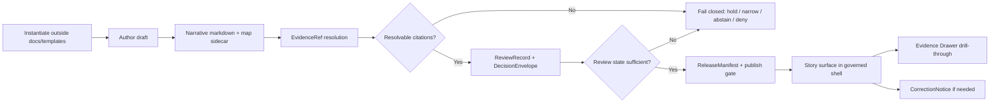

<!-- [KFM_META_BLOCK_V2]
doc_id: kfm://doc/<uuid-needs-verification>
title: TEMPLATE — Story Node v3
type: standard
version: v1
status: draft
owners: @bartytime4life
created: 2025-12-17
updated: 2026-03-29
policy_label: <policy-label-needs-verification>
related: [./README.md, ./TEMPLATE__KFM_UNIVERSAL_DOC.md, ../README.md, ../reports/story_nodes/README.md, ../standards/markdown-rules.md, ../../.github/CODEOWNERS]
tags: [kfm, story-node, template, publication]
notes: [Current public-main path, sibling template cluster, story-node report surface, and broad /docs/ ownership are confirmed. Exact story schema names, runtime routes, loader hooks, doc UUID, policy label, and mounted-checkout parity still need verification before commit.]
[/KFM_META_BLOCK_V2] -->

# TEMPLATE — Story Node v3

Repo-ready starter for governed Story Node authoring in Kansas Frontier Matrix.


| Field | Value |
|---|---|
| Status | `draft` |
| Owners | `@bartytime4life` |
| Path | `docs/templates/TEMPLATE__STORY_NODE_V3.md` |
| Path status | `CONFIRMED` on public `main`; mounted-checkout parity still `NEEDS VERIFICATION` |
| Role | `standard template / copy-adapt authoring seed` |
| Policy label | `<policy-label-needs-verification>` |
| Quick jump | [Scope](#scope) · [Repo fit](#repo-fit) · [Current evidence boundary](#current-evidence-boundary) · [Quickstart](#quickstart) · [Authoring rules](#authoring-rules) · [Copy-adapt template](#copy-adapt-story-node-template) · [Sidecar](#proposed-companion-sidecar-starter) · [Publication gate](#publication-gate-checklist) · [FAQ](#faq) |

**Repo anchors:** [templates README](./README.md) · [universal doc template](./TEMPLATE__KFM_UNIVERSAL_DOC.md) · [docs index](../README.md) · [story_nodes README](../reports/story_nodes/README.md) · [markdown rules](../standards/markdown-rules.md) · [CODEOWNERS](../../.github/CODEOWNERS)

> [!IMPORTANT]
> A Story Node is not free-form narrative. It is a governed publication unit. Claims, dates, map state, perspective, evidence linkage, review state, and correction lineage must remain inspectable at the point of use.

> [!NOTE]
> **Document posture for this template**
> - **CONFIRMED public-main repo evidence:** this template exists on public `main`; `docs/templates/` is a governed scaffold surface; `docs/reports/story_nodes/` exists as a story-facing report lane; and current broad `/docs/` ownership routes to `@bartytime4life`.
> - **CONFIRMED doctrine:** story surfaces stay inside the governed shell; Story Node artifacts keep evidence-linked excerpts, dates, perspective labels, and review or correction state visible; and publication fails closed when review state or citations do not resolve.
> - **PROPOSED starter shape:** the field names, enums, and sidecar layout below.
> - **UNKNOWN / NEEDS VERIFICATION:** exact repo-local schema names, runtime story routes, DTOs, loader hooks, narrower co-owners, policy label, and mounted-checkout parity.

---

## Scope

Use this file as the baseline template for a single **Story Node v3** in KFM.

This template is designed for a story surface that remains inside the same governed shell as the map, timeline, dossier, Evidence Drawer, and Focus Mode. It preserves KFM’s evidence-first posture while staying practical for authors, reviewers, and implementers.

This file is a **reusable scaffold**, not a publish target. Keep the template in `docs/templates/`. Instantiate filled Story Node artifacts in the owning story-facing surface instead of turning the template shelf into a second truth path.

## Repo fit

| Item | Value |
|---|---|
| Template path | `docs/templates/TEMPLATE__STORY_NODE_V3.md` |
| Local role | Reusable Story Node scaffold for governed narrative artifacts |
| Instantiate into | The owning story-facing surface, not `docs/templates/` |
| Current public story-facing docs lane | `docs/reports/story_nodes/` |
| Upstream anchors | [`./README.md`](./README.md) · [`./TEMPLATE__KFM_UNIVERSAL_DOC.md`](./TEMPLATE__KFM_UNIVERSAL_DOC.md) · [`../README.md`](../README.md) · [`../standards/markdown-rules.md`](../standards/markdown-rules.md) · [`../../.github/CODEOWNERS`](../../.github/CODEOWNERS) |
| Downstream consumers | [`../reports/story_nodes/README.md`](../reports/story_nodes/README.md), review-ready story markdown, map-state sidecars, Evidence Drawer drill-through, release/correction summaries |
| Runtime/API boundary | Story schemas, routes, DTOs, renderer hooks, and publish automation remain `UNKNOWN` or `NEEDS VERIFICATION` unless directly rechecked outside this template |

### Current sibling template cluster

```text
docs/templates/
├── README.md
├── TEMPLATE__API_CONTRACT_EXTENSION.md
├── TEMPLATE__KFM_UNIVERSAL_DOC.md
└── TEMPLATE__STORY_NODE_V3.md
```

> [!WARNING]
> Do not let the story surface become a substitute truth system. A Story Node may explain, frame, compare, or guide, but it must not silently replace authoritative records, release state, or evidence paths.

## Current evidence boundary

| Observation | Status | Why it matters here |
|---|---|---|
| This exact file is present on public `main` | **CONFIRMED** | The right move is to revise this template in place, not invent a parallel Story Node scaffold |
| `docs/templates/README.md` defines `docs/templates/` as a governed scaffold shelf | **CONFIRMED** | This file should remain a reusable template, not a filled canonical artifact |
| `docs/reports/story_nodes/` is present on public `main` | **CONFIRMED** | There is a current story-facing docs lane available for instantiated story markdown |
| `docs/reports/story_nodes/README.md` describes story artifacts as downstream of evidence, policy, review, and correction | **CONFIRMED** | Filled Story Nodes should keep visible evidence route, time basis, and surface state |
| `/.github/CODEOWNERS` currently routes `/docs/` to `@bartytime4life` | **CONFIRMED** | Broad ownership can be populated in this template without guessing |
| Attached KFM doctrine treats the story surface as a shell-native, evidence-linked publication surface | **CONFIRMED** | The template should preserve evidence-linked excerpts, dates, perspective labels, and correction visibility |
| Exact story schema filenames, route names, DTOs, loader hooks, and publish workflow coverage | **UNKNOWN** | Keep placeholders visible; do not imply implementation state that is not directly verified |
| `doc_id`, `policy_label`, narrower co-owners, and mounted local checkout parity | **NEEDS VERIFICATION** | These should stay explicit review placeholders until the live repo or governance registry confirms them |

## Status matrix

| Area | Status | Notes |
|---|---|---|
| Story surface as a governed shell surface | **CONFIRMED** | Human-authored narrative stays inside the same trust-visible shell as map, timeline, dossier, Evidence Drawer, and Focus Mode |
| Narrative markdown plus companion map/citation structure | **CONFIRMED doctrine** | Current public story docs describe Story Nodes as narrative artifacts coupled to evidence and map/context state; exact repo-local packet conventions still need verification |
| Broad `/docs/` ownership | **CONFIRMED** | Current public `/.github/CODEOWNERS` maps `/docs/` to `@bartytime4life` |
| Public story-facing docs lane | **CONFIRMED** | `docs/reports/story_nodes/` exists on public `main` and is currently scaffold-light |
| Review state + resolvable citations before publish | **CONFIRMED** | Story publication must fail closed if those conditions are missing |
| Evidence drill-through for consequential claims | **CONFIRMED** | Citations must resolve to inspectable support rather than decorative references |
| Alignment between reader-facing report states and broader doctrinal surface-state grammar | **INFERRED** | Keep the distinction visible instead of flattening multiple state vocabularies into one |
| Exact field names in the template and sidecar below | **PROPOSED** | Adapt to mounted contracts once the schema inventory is directly verified |
| Exact repo-local schema names, route names, loader hooks, and policy labels | **UNKNOWN** | Do not treat placeholders below as settled repo facts |

> [!NOTE]
> **State vocabulary caution**
>
> Current public story docs and broader KFM doctrine expose two adjacent state vocabularies:
>
> - a **report-facing** set such as `Draft`, `Review`, `Published`, `Superseded`, `Withdrawn`, and `Correction-pending`
> - a broader **surface-state** set such as `promoted`, `generalized`, `partial`, `stale-visible`, `abstained`, `denied`, and `withdrawn`
>
> Keep the distinction explicit in instantiated nodes rather than collapsing one layer into the other without review.

## Accepted inputs

Use this template when the instantiated Story Node includes one or more of the following:

- human-authored narrative intended for the KFM story surface
- explicit time scope, event scope, or as-of framing
- map state, selection state, layer state, or compare state relevant to the story
- evidence-linked excerpts, claim references, `EvidenceRef`s, or `EvidenceBundle` references
- review, policy, correction, or public-safe publication notes
- story-facing documentation artifacts that must stay downstream of evidence, policy, review, and correction

## Exclusions

This template is **not** for:

- filled Story Node instances that should live in their owning story-facing surface
- raw source documents or ingest-stage notes
- unpublished scratchpads with unresolved evidence
- hidden reviewer commentary that belongs in review artifacts
- runtime story routes, renderers, workers, or API code
- schemas, DTOs, OpenAPI surfaces, or machine-validated examples
- policy bundles, publish rules, or obligation vocabularies
- canonical data artifacts, receipts, manifests, catalog closure, or `EvidenceBundle` stores
- exact sensitive directions or location disclosure that violate public-safe handling
- implementation claims about repo files, endpoints, or workflows that are not directly verified

## Quickstart

1. Copy this scaffold into the owning story-facing surface.
2. Rename it to a stable story slug.
3. Replace every angle-bracket placeholder before review.
4. Fill **time scope**, **freshness basis**, **support**, **perspective**, and **map state** before polishing prose.
5. Break narrative into claim-sized blocks and attach `EvidenceRef`s before final editing.
6. Run the review/publish gate. If citations do not resolve, hold, narrow, abstain, or deny rather than publishing around the gap.

### Current public-main docs example

```bash
# Current public-main report-surface example.
# If the live repo uses a different owning surface, instantiate there instead.
cp docs/templates/TEMPLATE__STORY_NODE_V3.md \
  docs/reports/story_nodes/<story-slug>.md
```

### Minimum instantiation rule

```text
Template shelf      -> docs/templates/
Filled Story Node   -> owning story/report surface
Runtime/API logic   -> contracts/, schemas/, apps/, packages/, or other owning runtime surfaces
```

## What must stay visible

| Must stay visible | Why it matters |
|---|---|
| Time scope | Prevents snapshot confusion and unsupported historical drift |
| Freshness basis | Makes stale-visible or as-of logic legible to the reader |
| Support | Keeps claims matched to the grain that makes them meaningful |
| Evidence linkage | Preserves reconstructability to inspectable support |
| Perspective | Prevents interpretive writing from posing as neutral omniscience |
| Correction lineage | Keeps supersession, narrowing, and withdrawal visible in-place |
| Map state | Keeps story transitions inside the governed shell rather than detaching into article pages |
| Release or review state | Prevents a polished draft from being mistaken for a promoted public-safe artifact |

---

## Authoring rules

### 0) Instantiate outside `docs/templates`

Copy this scaffold into the owning story-facing surface before you fill it with narrative content. `docs/templates/` is the reusable scaffold shelf; it is not the canonical home of published or review-bearing story artifacts.

### 1) Keep time explicit

Every node should make time visible enough that a reader can tell whether the node is about:

- a single event
- an interval
- an as-of state
- a comparison across dates or releases
- a modeled or interpreted reconstruction

### 2) Keep support explicit

Name the unit of support that makes the node meaningful:

- place
- corridor
- parcel
- county-year table
- raster cell
- scene
- event interval
- other clearly bounded support

### 3) Keep evidence one hop away

Every consequential claim should point to inspectable support. A node may summarize, but it must still allow the reader to reach the supporting evidence path through an `EvidenceRef` or `EvidenceBundle`.

### 4) Keep perspective visible

If the node is interpretive, educational, editorial, steward-authored, or source-dependent, say so. Do not imply neutral omniscience when the node is clearly framed from a perspective.

### 5) Keep correction visible

If a node supersedes, narrows, generalizes, withdraws, or corrects earlier publication, make that visible in-place.

### 6) Fail closed when required

Do not publish the node if any of the following remain unresolved:

- review state is missing
- citations are non-resolvable
- sensitivity/redaction handling is incomplete
- time or support semantics are unclear
- evidence linkage is broken
- correction lineage is required but absent

### 7) Keep map state explicit

Record the extent, selected feature, active layers, time anchor, and any compare or playback anchor that the node assumes. A Story Node belongs in the shell, not as a detached article page.

### 8) Keep surface state and report state legible

If the owning surface distinguishes between internal review state, reader-facing report state, and broader runtime surface state, keep those distinctions visible instead of compressing them into one ambiguous label.

---

## Copy-adapt Story Node template

<!-- Copy from here for a working Story Node. Replace every angle-bracket placeholder before review. -->

```yaml
---
title: "<story-node-title>"
story_node_id: "<story-node-id-needs-verification>"
story_id: "<parent-story-id-needs-verification>"
doc_kind: "story_node"
status: "draft"
review_state: "<draft|review|approved|published|withdrawn-needs-verification>"
surface_state: "<promoted|generalized|partial|stale-visible|abstained|denied|withdrawn-needs-verification>"
perspective_label: "<steward|editorial|educational|interpretive|documentary|other-needs-verification>"
time_scope: "<as_of|interval|event|comparative>"
support: "<place|corridor|parcel|county_year|raster_cell|scene|event_interval|other>"
map_state_ref: "<map-state-ref-or-sidecar-ref>"
review_record_ref: "<review-record-ref-or-null>"
decision_envelope_ref: "<decision-envelope-ref-or-null>"
release_manifest_ref: "<release-manifest-ref-or-null>"
correction_notice_ref: "<correction-notice-ref-or-null>"
audit_ref: "<audit-ref-or-null>"
---
```

## Standfirst

<Write a one- to three-sentence public-safe summary. Do not place uncited consequential claims here.>

## Why this node exists

<State the narrative job of this node in plain language. Good examples: explain a turning point, frame a comparison, summarize a place condition, connect evidence to a user-facing question.>

## Time and place

- **Time scope:** <be explicit>
- **Freshness basis:** <as-of date / release window / observation interval / derived-on date>
- **Geographic support:** <be explicit>
- **Perspective:** <state who is speaking or what editorial lens is active>
- **Map state anchor:** <extent / selected feature / active layers / playback position>
- **Why this support fits the claim:** <brief justification>

## Core narrative

### Claim 1 — <short claim label>

<Claim text. Keep it tight. Avoid stacking multiple major assertions in one block.>

**Evidence linkage**

- `<evidence_ref_1>` — <what this supports>
- `<evidence_ref_2>` — <what this supports>
- `<evidence_bundle_ref_or_dataset_version_ref_optional>` — <optional stronger bundle/version linkage>

**Reader-visible notes**

- **Uncertainty:** <none / low / medium / high / mixed>
- **Mode:** <observed / documentary / modeled / interpreted>
- **Evidence state:** <source-stated / extracted / inferred / reviewed / source-dependent / generalized / unspecified>
- **Rights / reuse note:** <if relevant>
- **Sensitivity / redaction note:** <if relevant>

### Claim 2 — <short claim label>

<Claim text>

**Evidence linkage**

- `<evidence_ref_1>` — <what this supports>
- `<evidence_ref_2>` — <what this supports>
- `<evidence_bundle_ref_or_dataset_version_ref_optional>` — <optional stronger bundle/version linkage>

**Reader-visible notes**

- **Uncertainty:** <...>
- **Mode:** <...>
- **Evidence state:** <...>
- **Rights / reuse note:** <...>
- **Sensitivity / redaction note:** <...>

### Claim 3 — <optional>

<Claim text>

**Evidence linkage**

- `<evidence_ref_1>` — <what this supports>
- `<evidence_bundle_ref_or_dataset_version_ref_optional>` — <optional stronger bundle/version linkage>

**Reader-visible notes**

- **Uncertainty:** <...>
- **Mode:** <...>
- **Evidence state:** <...>
- **Rights / reuse note:** <...>
- **Sensitivity / redaction note:** <...>

## Evidence-linked excerpt(s)

> "<short excerpt, paraphrase placeholder, or excerpt summary>"

- **Source ref:** `<source-ref>`
- **EvidenceBundle ref:** `<evidence-bundle-ref>`
- **Transform / extraction note:** <quote / paraphrase / OCR / summarized extract / other>
- **Date confidence:** <confirmed / inferred / approximate / unknown>
- **Why this excerpt belongs in the story:** <brief note>

## Map behavior for this node

| Field | Value |
|---|---|
| Initial extent | `<extent placeholder>` |
| Active layers | `<layer list placeholder>` |
| Time anchor | `<time anchor placeholder>` |
| Selection anchor | `<selected feature or object ref>` |
| Compare anchor | `<if applicable>` |
| Transition behavior | `<fly-to / dissolve / split / none>` |
| Evidence Drawer trigger | `<what should open when user drills through>` |
| Freshness cue | `<as-of chip / stale-visible rule / release date cue>` |
| Export-safe state | `<yes/no + note>` |

## Reader-visible caveats

> [!NOTE]
> <Write the caveat the reader actually needs. Good examples: partial coverage, modeled output, source conflict, generalized geometry, stale-visible derivative, unresolved comparison basis, or event-time ambiguity.>

## Review and correction state

| Field | Value |
|---|---|
| Review state | `<draft / under review / approved / published / withdrawn>` |
| Reviewer lane | `<role or lane>` |
| ReviewRecord ref | `<review-record-ref>` |
| DecisionEnvelope ref | `<decision-envelope-ref>` |
| Correction status | `<none / superseded / narrowed / generalized / withdrawn / corrected>` |
| CorrectionNotice ref | `<correction-notice-ref-if-any>` |
| Prior node ref | `<older-node-ref-if-any>` |
| Replacement node ref | `<newer-node-ref-if-any>` |

## Export / embed notes

- **Public-safe export allowed:** `<yes/no>`
- **Embeddable excerpt allowed:** `<yes/no>`
- **Map snapshot allowed:** `<yes/no>`
- **Reason if restricted:** `<brief note>`

## Publication gate checklist

- [ ] Title is stable and not misleading
- [ ] Time scope is explicit
- [ ] Freshness basis is explicit where relevant
- [ ] Support is explicit
- [ ] Perspective label is explicit
- [ ] Every consequential claim has resolvable evidence linkage
- [ ] Citation taps or claim chips open the expected Evidence Drawer target
- [ ] Review state is present
- [ ] Correction state is present where required
- [ ] Sensitivity / redaction handling is complete
- [ ] Public-safe wording has been checked
- [ ] Accessibility / docs gate has been checked
- [ ] Export / embed behavior is explicit
- [ ] Missing evidence triggers hold, abstain, deny, or non-public state rather than silent publish

---

## PROPOSED companion sidecar starter

> [!IMPORTANT]
> This block is a **starter shape**, not a confirmed mounted schema. Adapt it to real contracts once the repo tree and schema inventory are directly verified.

```yaml
doc_kind: story_node
story_node_id: "<story-node-id>"
story_id: "<story-id>"
slug: "<slug>"
title: "<title>"
summary: "<summary>"

support:
  type: "<place|corridor|parcel|county_year|raster_cell|scene|event_interval|other>"
  value: "<support-identifier-or-label>"

time_scope:
  kind: "<as_of|interval|event|comparative>"
  start: "<ISO-8601-or-null>"
  end: "<ISO-8601-or-null>"
  as_of: "<ISO-8601-or-null>"
  grain: "<year|month|day|instant|other>"

map_state:
  ref: "<map-state-ref>"
  extent: "<extent-ref-or-inline-placeholder>"
  active_layers: []
  selected_feature_ref: "<feature-ref-or-null>"
  playback_anchor_ref: "<playback-ref-or-null>"
  compare_anchor_ref: "<compare-ref-or-null>"

claims:
  - claim_id: "<claim-id>"
    statement: "<claim statement>"
    evidence_refs:
      - "<evidence-ref>"
    evidence_bundle_refs:
      - "<evidence-bundle-ref>"
    dataset_version_refs:
      - "<dataset-version-ref>"
    mode: "<observed|documentary|modeled|interpreted>"
    evidence_state: "<source-stated|extracted|inferred|reviewed|source-dependent|generalized|unspecified>"
    uncertainty: "<none|low|medium|high|mixed>"

excerpts:
  - excerpt_id: "<excerpt-id>"
    source_ref: "<source-ref>"
    evidence_bundle_ref: "<bundle-ref>"
    transform_note: "<quote|paraphrase|ocr|summary|other>"
    text: "<excerpt-or-placeholder>"

review:
  state: "<draft|review|approved|published|withdrawn>"
  review_record_ref: "<review-record-ref>"
  decision_envelope_ref: "<decision-envelope-ref>"

publication:
  surface_state: "<promoted|generalized|partial|stale-visible|abstained|denied|withdrawn>"
  release_manifest_ref: "<release-manifest-ref>"
  correction_notice_ref: "<correction-notice-ref-or-null>"

policy:
  sensitivity: "<public|restricted|needs-verification>"
  redaction_profile: "<profile-or-null>"
  obligation_codes: []
  public_safe: "<true|false|needs-verification>"

audit:
  audit_ref: "<audit-ref>"
```

### Optional state-mapping note

Use this only if the owning surface distinguishes multiple state layers.

```yaml
state_mapping:
  report_state: "<draft|review|published|superseded|withdrawn|correction_pending|other>"
  review_state_source: "<review-record-ref-or-lane>"
  reader_visible_note: "<optional explanatory note>"
```

## Optional geometry / compare hooks (PROPOSED)

Use only when the mounted implementation actually supports them.

```yaml
spacetime:
  geometry_ref: "<generalized-geometry-ref-or-null>"
  place_labels:
    - "<regional label>"
  route_ref: "<route-ref-or-null>"
  compare_geometry_ref: "<compare-ref-or-null>"
```

> [!CAUTION]
> No Story Node should imply precise directions to a sensitive location when policy requires generalized handling.

---

## Lifecycle diagram



## Quick reviewer prompts

- Does the node say **when** its claims are true?
- Does the node say **what support** makes those claims meaningful?
- Can each claim be reconstructed from inspectable evidence?
- If the node is interpretive, does it say so?
- If the node is partial, modeled, generalized, stale-visible, or corrected, is that visible in-place?
- If a citation breaks, does the workflow fail closed instead of publishing theater?
- Is the instantiated file outside `docs/templates/` and inside the owning story-facing surface?

## FAQ

**Can a Story Node publish without citations?**  
No. Publishing is gated by resolvable citations and review state.

**Can a filled Story Node stay in `docs/templates/`?**  
No. `docs/templates/` is the reusable scaffold shelf. Filled Story Node artifacts belong in the owning story-facing surface.

**Is the companion sidecar optional?**  
The documented Story Node v3 pattern pairs narrative markdown with map state and citations. Treat the exact sidecar schema as adaptable only after mounted verification.

**Can a Story Node replace a dataset or dossier?**  
No. It is a governed publication surface downstream of evidence and policy, not a sovereign truth object.

## Appendix — author notes

<details>
<summary>Optional drafting notes (remove or empty before publish)</summary>

### What not to leave in a publishable node

- unresolved TODOs
- reviewer-only comments
- hidden sensitivity concerns
- “to be sourced later” placeholders
- narrative claims whose evidence cannot be reconstructed
- runtime or schema claims that were not directly rechecked

### Suggested editing rhythm

1. Copy this template into the owning story-facing surface.
2. Write the narrative in plain language.
3. Split large assertions into claim-sized units.
4. Attach evidence refs before polishing prose.
5. Make time, freshness, support, and state visible.
6. Add caveats before review, not after pushback.
7. Confirm correction state before publish.

</details>

[Back to top](#template--story-node-v3)
