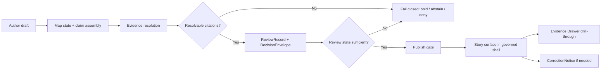

<!-- [KFM_META_BLOCK_V2]
doc_id: kfm://doc/<uuid-needs-verification>
title: TEMPLATE — Story Node v3
type: standard
version: v1
status: draft
owners: <owners-needs-verification>
created: YYYY-MM-DD
updated: YYYY-MM-DD
policy_label: <policy-label-needs-verification>
related: [<related-paths-or-kfm-ids-needs-verification>]
tags: [kfm, story-node, template, publication]
notes: [Source-bounded starter template. Identifiers, owners, dates, policy label, related links, and repo-local schema/route names require direct repo verification before commit.]
[/KFM_META_BLOCK_V2] -->

# TEMPLATE — Story Node v3

Repo-ready starter for governed Story Node authoring in Kansas Frontier Matrix.

> [!IMPORTANT]
> A Story Node is not free-form narrative. It is a governed publication unit. Claims, dates, map state, perspective, evidence linkage, review state, and correction state must remain inspectable at the point of use.

---

## Scope

Use this file as the baseline template for a single **Story Node v3** in KFM.

This template is designed to support a story surface that stays inside the same governed shell as the map, timeline, dossier, Evidence Drawer, and Focus Mode. It is written to preserve KFM’s evidence-first posture while remaining practical for authors, reviewers, and implementers.

## Repo fit

**Target path:** `docs/templates/TEMPLATE__STORY_NODE_V3.md`

**Document role:** standard template / copy-and-adapt authoring seed

**Upstream dependencies:** story-surface doctrine, Story Node publish workflow, evidence-resolution rules, review state, correction lineage, sensitivity/redaction rules

**Downstream consumers:** `NEEDS VERIFICATION` — local story schema, publish gate, renderer, routes, sidecar loader, Evidence Drawer integration, review tooling

## Status matrix

| Area | Status | Notes |
|---|---|---|
| Story Node as governed narrative publication unit | **CONFIRMED** | Preserve evidence-linked publication posture. |
| Markdown body plus companion map/citation structure | **CONFIRMED** | Use a separate companion object if repo implementation requires it. |
| Review state + resolvable citations before publish | **CONFIRMED** | Publishing must fail closed when those conditions are missing. |
| Citations opening or resolving into Evidence Drawer behavior | **CONFIRMED** | Story claims must drill into inspectable evidence. |
| Exact field names in the sidecar starter below | **PROPOSED** | Adapt to mounted schema/contracts once verified. |
| Exact route names, schema filenames, and local loaders | **UNKNOWN** | Do not treat placeholders below as settled repo facts. |

## Accepted inputs

This template belongs here when the node includes one or more of the following:

- human-authored narrative text intended for the KFM story surface
- explicit time scope, event scope, or as-of framing
- map state, selection state, or layer state relevant to the story
- evidence-linked excerpts, claim references, or EvidenceBundle references
- review, policy, correction, or public-safe publication notes

## Exclusions

This template is not for:

- raw source documents or ingest-stage notes
- unpublished research scratchpads with unresolved evidence
- sovereign analysis that bypasses evidence resolution
- hidden reviewer commentary that should live in review artifacts instead
- precise sensitive directions or exact location disclosure that violates public-safe handling
- implementation claims about repo files, endpoints, or workflows that are not directly verified

> [!WARNING]
> Do not let the story surface become a substitute truth system. A Story Node may explain, frame, compare, or guide, but it must not silently replace authoritative records, release state, or evidence paths.

---

## Authoring rules

### 1) Keep time explicit

Every node should make time visible enough that a reader can tell whether the node is about:

- a single event
- an interval
- an as-of state
- a comparison across dates or releases
- a modeled or interpreted reconstruction

### 2) Keep support explicit

Name the unit of support that makes the node meaningful:

- place
- corridor
- service area
- parcel
- county-year table
- raster cell
- scene
- event interval
- other clearly bounded support

### 3) Keep evidence drill-through intact

Every consequential claim should point to inspectable support. A node may summarize, but it must still allow the reader to reach the supporting evidence path.

### 4) Keep perspective visible

If the node is interpretive, educational, editorial, or steward-authored, say so. Do not imply neutral omniscience when the node is clearly framed from a perspective.

### 5) Keep correction visible

If a node supersedes, narrows, generalizes, withdraws, or corrects earlier publication, make that visible in-place.

### 6) Fail closed when required

Do not publish the node if any of the following remain unresolved:

- review state is missing
- citations are non-resolvable
- sensitivity/redaction handling is incomplete
- time or support semantics are unclear
- evidence linkage is broken
- correction lineage is required but absent

---

## Copy/paste node template

<!-- Copy from here for a working Story Node. Replace every angle-bracket placeholder before review. -->

---
title: "<story-node-title>"
story_node_id: "<story-node-id-needs-verification>"
story_id: "<parent-story-id-needs-verification>"
doc_kind: "story_node"
status: "draft"
review_state: "<draft|review|approved|published|withdrawn-needs-verification>"
surface_state: "<promoted|generalized|partial|source-dependent|conflicted|withdrawn|denied|abstained-needs-verification>"
perspective_label: "<editorial|steward|educational|interpretive|other>"
time_scope: "<as-of / interval / event / comparative>"
support: "<place / corridor / parcel / raster-cell / scene / event-interval / other>"
map_state_ref: "<map-state-ref-or-sidecar-ref>"
decision_ref: "<decision-envelope-ref-if-any>"
audit_ref: "<audit-ref-if-any>"
correction_ref: "<correction-notice-ref-if-any>"
release_ref: "<release-ref-if-any>"
---

## Standfirst

<Write a one- to three-sentence public-safe summary. Do not place uncited consequential claims here.>

## Why this node exists

<State the narrative job of this node in plain language. Examples: explain a turning point, frame a comparison, summarize a place condition, connect evidence to a user-facing question.>

## Time and place

- **Time scope:** <be explicit>
- **Geographic support:** <be explicit>
- **Perspective:** <state who is speaking or what editorial lens is active>
- **Map state anchor:** <extent / selected feature / active layers / playback position>
- **Why this support fits the claim:** <brief justification>

## Core narrative

### Claim 1 — <short claim label>

<Claim text. Keep it tight. Avoid stacking multiple major assertions in one block.>

**Evidence linkage**

- `<evidence_ref_1>` — <what this supports>
- `<evidence_ref_2>` — <what this supports>

**Reader-visible notes**

- **Uncertainty:** <none / low / medium / high / mixed>
- **Mode:** <observed / documentary / modeled / interpreted / source-dependent>
- **Rights / reuse note:** <if relevant>
- **Sensitivity / redaction note:** <if relevant>

### Claim 2 — <short claim label>

<Claim text>

**Evidence linkage**

- `<evidence_ref_1>` — <what this supports>
- `<evidence_ref_2>` — <what this supports>

**Reader-visible notes**

- **Uncertainty:** <...>
- **Mode:** <...>
- **Rights / reuse note:** <...>
- **Sensitivity / redaction note:** <...>

### Claim 3 — <optional>

<Claim text>

**Evidence linkage**

- `<evidence_ref_1>` — <what this supports>

## Evidence-linked excerpt(s)

> "<short excerpt, paraphrase placeholder, or excerpt summary>"

- **Source ref:** `<source-ref>`
- **EvidenceBundle ref:** `<evidence-bundle-ref>`
- **Transform / extraction note:** <quote / paraphrase / OCR / summarized extract / other>
- **Date confidence:** <confirmed / inferred / approximate / unknown>
- **Why this excerpt belongs in the story:** <brief note>

## Map behavior for this node

| Field | Value |
|---|---|
| Initial extent | `<extent placeholder>` |
| Active layers | `<layer list placeholder>` |
| Time anchor | `<time anchor placeholder>` |
| Selection anchor | `<selected feature or object ref>` |
| Compare anchor | `<if applicable>` |
| Evidence Drawer trigger | `<what should open when user drills through>` |
| Export-safe state | `<yes/no + note>` |

## Reader-visible caveats

> [!NOTE]
> <Write the caveat the reader actually needs. Good examples: partial coverage, modeled output, source conflict, generalized geometry, stale-visible derivative, unresolved comparison basis, or event-time ambiguity.>

## Review and correction state

| Field | Value |
|---|---|
| Review state | `<draft / under review / approved / published / withdrawn>` |
| Reviewer lane | `<role or lane>` |
| Review record ref | `<review-record-ref>` |
| Decision envelope ref | `<decision-envelope-ref>` |
| Correction status | `<none / superseded / narrowed / generalized / withdrawn / corrected>` |
| Correction notice ref | `<correction-notice-ref-if-any>` |
| Prior node ref | `<older-node-ref-if-any>` |
| Replacement node ref | `<newer-node-ref-if-any>` |

## Export / embed notes

- **Public-safe export allowed:** `<yes/no>`
- **Embeddable excerpt allowed:** `<yes/no>`
- **Map snapshot allowed:** `<yes/no>`
- **Reason if restricted:** `<brief note>`

## Publication gate checklist

- [ ] Title is stable and not misleading
- [ ] Time scope is explicit
- [ ] Support is explicit
- [ ] Perspective label is explicit
- [ ] Every consequential claim has resolvable evidence linkage
- [ ] Evidence Drawer drill-through is defined
- [ ] Review state is present
- [ ] Correction state is present where required
- [ ] Sensitivity / redaction handling is complete
- [ ] Public-safe wording has been checked
- [ ] Accessibility / docs gate has been checked
- [ ] Export / embed behavior is explicit
- [ ] Missing evidence triggers hold, abstain, deny, or non-public state rather than silent publish

---

## PROPOSED companion sidecar starter

> [!IMPORTANT]
> This block is a **starter shape**, not a confirmed repo schema. Adapt it to mounted contracts once the repo tree and schema inventory are directly verified.

```yaml
doc_kind: story_node
story_node_id: "<story-node-id>"
story_id: "<story-id>"
slug: "<slug>"
title: "<title>"
summary: "<summary>"

support:
  type: "<place|corridor|parcel|raster_cell|scene|event_interval|other>"
  value: "<support-identifier-or-label>"

time_scope:
  kind: "<as_of|interval|event|comparative>"
  start: "<ISO-8601-or-null>"
  end: "<ISO-8601-or-null>"
  as_of: "<ISO-8601-or-null>"
  grain: "<year|month|day|instant|other>"

map_state:
  ref: "<map-state-ref>"
  extent: "<extent-ref-or-inline-placeholder>"
  active_layers: []
  selected_feature_ref: "<feature-ref-or-null>"
  compare_anchor_ref: "<compare-ref-or-null>"

claims:
  - claim_id: "<claim-id>"
    statement: "<claim statement>"
    evidence_refs:
      - "<evidence-ref>"
    evidence_bundle_refs:
      - "<evidence-bundle-ref>"
    dataset_refs:
      - "<dataset-version-ref>"
    mode: "<observed|documentary|modeled|interpreted|source-dependent>"
    uncertainty: "<none|low|medium|high|mixed>"

excerpts:
  - excerpt_id: "<excerpt-id>"
    source_ref: "<source-ref>"
    evidence_bundle_ref: "<bundle-ref>"
    transform_note: "<quote|paraphrase|ocr|summary|other>"
    text: "<excerpt-or-placeholder>"

review:
  state: "<draft|review|approved|published|withdrawn>"
  review_record_ref: "<review-record-ref>"
  decision_ref: "<decision-envelope-ref>"

publication:
  surface_state: "<promoted|generalized|partial|source-dependent|conflicted|withdrawn|denied|abstained>"
  release_ref: "<release-ref>"
  correction_ref: "<correction-ref-or-null>"

policy:
  sensitivity: "<public|restricted|needs-verification>"
  redaction_profile: "<profile-or-null>"
  obligation_codes: []
  reason_codes: []

audit:
  audit_ref: "<audit-ref>"
```

## Optional spatial-analysis hooks (PROPOSED)

Use only when the mounted implementation actually supports them.

```yaml
spacetime:
  geometry_ref: "<generalized-geometry-ref-or-null>"
  place_labels:
    - "<regional label>"
  route_ref: "<route-ref-or-null>"
```

> [!CAUTION]
> No Story Node should imply precise directions to a sensitive location when policy requires generalized handling.

---

## Lifecycle diagram



## Quick reviewer prompts

- Does the node say **when** its claims are true?
- Does the node say **what support** makes those claims meaningful?
- Can each claim be reconstructed from inspectable evidence?
- If the node is interpretive, does it say so?
- If the node is partial, modeled, generalized, or corrected, is that visible in-place?
- If a citation breaks, does the workflow fail closed instead of publishing theater?

## Author notes

<details>
<summary>Optional drafting notes (remove or empty before publish)</summary>

### What not to leave in a publishable node

- unresolved TODOs
- reviewer-only comments
- hidden sensitivity concerns
- “to be sourced later” placeholders
- narrative claims whose evidence cannot be reconstructed

### Suggested editing rhythm

1. Write the narrative in plain language.
2. Split large assertions into claim-sized units.
3. Attach evidence refs before polishing prose.
4. Make time and support visible.
5. Add caveats before review, not after pushback.
6. Confirm correction state before publish.

</details>

[Back to top](#template--story-node-v3)
