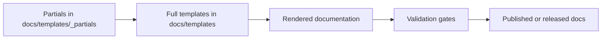

<!-- [KFM_META_BLOCK_V2]
doc_id: kfm://doc/40a265d7-c299-4c76-82fb-37750d829349
title: KFM Doc Template Partials
type: standard
version: v0.1.0
status: draft
owners: TBD
created: 2026-03-04
updated: 2026-03-04
policy_label: public
related: ["docs/templates/", "docs/standards/", "docs/MASTER_GUIDE_v13.md"]
tags: [kfm, docs, templates, partials]
notes: ["Template-only directory. Keep non-sensitive. Update registry table as partials are added."]
[/KFM_META_BLOCK_V2] -->

<div align="center">

# 🧩 **KFM — Doc Template Partials**
`docs/templates/_partials/README.md`

**Purpose:**  
Reusable, governance-friendly *partials* that compose into the governed documentation templates in `docs/templates/`.


[📘 Docs Root](../..) · [🧱 Templates](..) · [🧭 Standards](../../standards) · [🛡 Governance](../../governance)

</div>

> **IMPACT**  
> **Status:** Draft (scaffolding)  
> **Owners:** TBD  
> **Primary users:** Docs maintainers, template authors, pipeline/tool authors  
> **Change risk:** Low (text-only), but **high leverage** because partials can affect many docs

---

## Quick nav

- [Scope](#scope)
- [Where this fits](#where-this-fits)
- [Evidence labels](#evidence-labels)
- [Acceptable inputs](#acceptable-inputs)
- [Exclusions](#exclusions)
- [Directory tree](#directory-tree)
- [Quickstart](#quickstart)
- [Conventions](#conventions)
- [Partials registry](#partials-registry)
- [Gates](#gates)
- [FAQ](#faq)
- [Appendix](#appendix)
- [Back to top](#quick-nav)

---

## Scope

**[PROPOSED]** This folder holds **small, reusable fragments** (“partials”) that are included by higher-level templates in `docs/templates/`.

Examples of what a partial *might* represent:

- a standard header / footer block
- a MetaBlock snippet scaffold
- a consistent badge row
- a standard “Quick nav” block
- a canonical Mermaid diagram snippet (with safe node text)
- a standard “Gates / DoD” checklist

---

## Where this fits

**[CONFIRMED]** `docs/templates/` is the repo home for governed documentation templates (universal doc, story node, API contract extension).  
**[PROPOSED]** `docs/templates/_partials/` is the *shared building-block layer* used by those templates.

### Upstream

- `docs/standards/` — profiles and rules that templates should reflect (governance, metadata, formatting).
- `docs/MASTER_GUIDE_v13.md` — canonical structure expectations and doc discipline (when present).

### Downstream

- `docs/templates/*.md` — full templates that embed partials.
- Generated / published docs (site, PDF, releases) — depends on your build toolchain (**UNKNOWN** which generator is used in this repo).

---

## Evidence labels

KFM docs operate “cite-or-abstain.” For this README:

- **[CONFIRMED]** backed by an existing repo document that explicitly states the fact.
- **[PROPOSED]** a recommended convention for consistency/safety.
- **[UNKNOWN]** requires verification (see “Smallest verification steps” callouts).

> **Smallest verification steps (to turn UNKNOWN → CONFIRMED):**
> 1) Check if `docs/templates/README.md` exists and describes `_partials/`.  
> 2) Find the docs build entrypoint (e.g., `Makefile`, `scripts/`, or CI workflow) that renders templates.  
> 3) Identify the templating engine (Jinja2/Mustache/etc.) and confirm include syntax.

---

## Acceptable inputs

Put **only** template-safe fragments here:

- Markdown fragments (`.md`) intended for inclusion
- Mermaid fragments (`.md` with fenced `mermaid` blocks)
- Small data fragments used by template tooling (**only** if the rendering tool expects them; otherwise keep in tooling code)

**Content posture:**

- **Template-only**
- **Non-sensitive by default**
- **No real dataset values, real coordinates, or restricted narrative content**

---

## Exclusions

Do **not** put these here:

- Generated output (build artifacts, rendered docs, exported PDFs)
- Domain content (belongs under `docs/data/`, `docs/reports/`, etc.)
- Secrets or tokens (never)
- Anything that would force consumers to bypass policy boundaries
- “Convenience” copies of canonical standards (link to standards; don’t duplicate)

---

## Directory tree

**[PROPOSED]** Expected shape (update to match reality once partials exist):

```text
docs/templates/_partials/
├── README.md
├── header.md                      # standard centered header, badges, quick links
├── impact.md                      # standard IMPACT block
├── quick-nav.md                   # standard quick nav snippet
├── metablock.md                   # KFM_META_BLOCK_V2 scaffold
├── footer.md                      # standard footer (license + refs)
├── gates.md                       # checklists for docs/templates
└── mermaid/
    ├── pipeline-overview.md       # canonical KFM pipeline overview (safe)
    └── template-flow.md           # template rendering flow
```

---

## Quickstart

### Add a new partial

1) Create a file with a **clear, stable** name (lowercase, hyphenated).  
2) Keep it **small** and **single-purpose**.  
3) Prefer **relative links** and stable anchors.

```bash
# Example (create a new partial)
touch docs/templates/_partials/callouts.md
```

### Use a partial from a template

**[UNKNOWN]** Include syntax depends on the template engine. Use the correct one for your build.

```text
PSEUDOCODE (choose the correct include syntax for your tooling):

- Jinja2-like:      
- Mustache-like:    {{> _partials/header }}
- MkDocs macros:    {{ include_file("_partials/header.md") }}
- Custom prebuild:  render(template, partials_dir="_partials/")
```

### Render / validate locally

**[UNKNOWN]** Commands differ by repo. Typical patterns in KFM docs include lint + diagram checks.

```bash
# PSEUDOCODE (replace with real targets used in this repo)
make docs-lint
make docs-render
make docs-check
```

---

## Conventions

### Determinism

**[PROPOSED]** Partials should be deterministic:

- stable heading text and ordering
- stable list ordering
- stable placeholders (no time-based defaults)

### Accessibility

**[PROPOSED]**

- provide alt text for images
- avoid meaning conveyed by color alone
- keep Mermaid diagrams readable and free of HTML in node text

### Safety and governance posture

**[PROPOSED]** Treat this directory as **template-only** and **non-sensitive**:

- no protected locations
- no identifying examples
- no “real” operational incident content

---

## Mermaid diagram



---

## Partials registry

Keep this table up to date as files are added.

| Partial | Type | Purpose | Inputs | Output | Sensitivity posture |
|---|---|---|---|---|---|
| `header.md` | Markdown | Standard title + badges + links | doc title, status | header block | Template-only, non-sensitive |
| `metablock.md` | Markdown | KFM_META_BLOCK_V2 scaffold | doc_id, owners | HTML comment block | Template-only, non-sensitive |
| `gates.md` | Markdown | Standard DoD checklist | doc kind | checklist | Template-only, non-sensitive |
| `mermaid/template-flow.md` | Mermaid | Template composition flow | none | diagram | Template-only, non-sensitive |
| `TBD` | TBD | TBD | TBD | TBD | TBD |

---

## Gates

When adding/updating a partial:

- [ ] **No sensitive content** (no protected coordinates, no identifying examples)
- [ ] **Stable formatting** (GitHub-readable, no broken fences)
- [ ] **Relative links** only (or clearly labeled external links)
- [ ] **Mermaid renders** (if present)
- [ ] **Registry updated** (table in this README)
- [ ] **Validation run** (repo lint / docs checks, if available)

---

## FAQ

### Why partials instead of copying blocks into every template?

**[PROPOSED]** Partials reduce drift: one change updates all templates consistently.

### Can partials include code blocks?

Yes—just keep them short and **language-tagged**.

### Can partials include images?

Prefer repo-relative images with meaningful alt text. Avoid embedding sensitive imagery.

---

## Appendix

<details>
<summary>Placeholder tokens and conventions</summary>

**[PROPOSED]** Common placeholder patterns:

- `<latest-commit-hash>` — filled by release tooling or maintainers
- `<release-version>` — filled when publishing under `releases/`
- `TBD` — used when ownership or policy ref is not yet resolved

**[PROPOSED]** Naming:

- use lowercase with hyphens: `quick-nav.md`, `impact.md`
- reserve leading underscore only if your generator requires it

</details>

---

[Back to top](#quick-nav)
