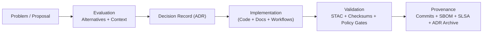

<div align="center">

# 🧱 **Kansas Frontier Matrix — Architecture Decision Record (ADR) Template**  
`docs/templates/adr.md`

**Mission:** Provide a **standardized, reproducible template** for documenting architectural, technical, AI, and governance decisions within the **Kansas Frontier Matrix (KFM)** — ensuring **clarity, provenance, security, and long-term traceability** of every change.

[](../../docs/)
[](../../.github/workflows/docs-validate.yml)
[](../../.github/workflows/policy-check.yml)
[](../../.github/workflows/)
[](../../.github/workflows/sbom.yml)
[](../../LICENSE)

</div>

---

```yaml
---
title: "Kansas Frontier Matrix — ADR Template"
version: "v1.4.0"
last_updated: "2025-10-18"
owners: ["@kfm-architecture","@kfm-docs","@kfm-governance"]
tags: ["adr","architecture","governance","decision-record","mcp","stac","provenance","security","ai","ethics"]
status: "Template"
license: "CC-BY 4.0"
ci_required_checks:
  - docs-validate
  - markdownlint
  - policy-check
semantic_alignment:
  - MCP-DL v6.3
  - STAC 1.0
  - DCAT 2.0
  - FAIR Principles
  - CIDOC CRM
  - OWL-Time
  - GeoSPARQL
  - PROV-O
---
```

> **File naming:** `ADR-YYYY-NNN-<slug>.md` (e.g., `ADR-2025-001-pipeline-structure.md`)  
> **Status flow:** *Proposed → Approved → Implemented → Superseded / Deprecated*

---

## 🧩 ADR Metadata

| Field                          | Description                                                                                |
| :----------------------------- | :----------------------------------------------------------------------------------------- |
| **ADR ID**                     | Unique identifier (e.g., `ADR-2025-001-PIPELINE-STRUCTURE`)                               |
| **Title**                      | Concise title summarizing the decision                                                    |
| **Author(s)**                  | Contributor(s) and roles                                                                   |
| **Date Created**               | YYYY-MM-DD                                                                                 |
| **Last Updated**               | YYYY-MM-DD                                                                                 |
| **Status**                     | Proposed / Approved / Implemented / Superseded / Deprecated                                |
| **Decision Type**              | Technical / Process / Governance / Infrastructure / AI                                     |
| **Related Components**         | e.g., `data/stac/`, `src/pipelines/`, `web/config/`, `src/graph/`, `.github/workflows/`    |
| **Linked Issues / PRs**        | GitHub references (e.g., `#142`, `PR #58`)                                                 |
| **Supersedes / Superseded By** | Older/newer ADR references                                                                  |

---

## 🎯 Context

Describe the **problem**, **motivation**, and **background**.  
Include scalability, interoperability, security, and policy considerations; document competing alternatives.

> *Example:* KFM needs a durable multi-temporal catalog strategy. Options include a flat metadata model vs. hierarchical **STAC Collection → Item** with `derived_from` lineage.

---

## 🧠 Decision

State the **final decision** and the **rationale** (trade-offs, supporting experiments, standards alignment).

> *Example:* Adopt hierarchical **STAC 1.0** with `rel:derived_from` links and PROV-O fields to ensure complete lineage.

---

## ⚙️ Implementation Plan

| Area              | Action                                                                 | Responsible Team  | Due |
| :---------------- | :---------------------------------------------------------------------- | :---------------- | :-- |
| **ETL Pipelines** | Update STAC generation scripts under `src/pipelines/`                   | Data Engineering  |     |
| **Metadata**      | Revise `collection.json` hierarchy and add `derived_from`               | Metadata Curators |     |
| **Automation**    | Update `.github/workflows/stac-validate.yml` for link/extension checks  | CI/CD Team        |     |
| **Docs**          | Add diagram to `docs/architecture/data-architecture.md`                 | Documentation     |     |

---

## 🧮 Decision Drivers

| Factor                  | Justification                                                       |
| :---------------------- | :------------------------------------------------------------------ |
| **Standards Alignment** | STAC 1.0 / DCAT 2.0 / FAIR / CIDOC CRM / OWL-Time compliance        |
| **Reproducibility**     | Deterministic lineage and validation pipelines                       |
| **Maintainability**     | Clear evolution/versioning of schemas and catalogs                   |
| **Security**            | Supply-chain visibility (SBOM/SLSA); policy gates on workflows       |
| **Transparency**        | Provenance surfaces in UI and APIs                                   |
| **Performance**         | Efficient discovery (hierarchical search/indexing)                   |

---

## 🧾 Alternatives Considered

| Option                         | Pros                               | Cons                                |
| :----------------------------- | :---------------------------------- | :----------------------------------- |
| **Flat Metadata Model**        | Simple                              | Poor provenance & temporal hierarchy |
| **Hierarchical STAC (Chosen)** | Interoperable, standard             | More schema complexity               |
| **Hybrid STAC + Graph**        | Semantic inference & linkage        | Higher implementation overhead       |

---

## 🧩 Consequences

| Type        | Impact           | Description                                        |
| :---------- | :--------------- | :------------------------------------------------- |
| ✅ Positive  | Interoperability | Fully aligned to standards; easier data exchange   |
| ⚠️ Negative | Migration Cost   | Re-indexing existing catalogs                      |
| ⚙️ Neutral  | Operations       | Minor changes to CI; no API breaking change        |

---

## 🔐 Security, Supply Chain & Ethics Impact

| Control                    | Action (if applicable)                                      |
| :------------------------- | :---------------------------------------------------------- |
| **SBOM / SLSA**            | Generate SBOM; attach to release; publish SLSA attestation |
| **Secrets / OIDC**         | Verify least-privilege tokens; no plaintext secrets         |
| **Policy-as-Code**         | Add/adjust OPA rules; pin actions by tag/SHA                |
| **Data Ethics**            | Set STAC `properties.data_ethics` (e.g., `restricted-derivatives`) |
| **Access Controls**        | Confirm dataset visibility & artifact retention             |

---

## 🔍 Validation & Provenance

| Validation Step        | Workflow / Tool                        | Evidence                                         |
| :--------------------- | :------------------------------------- | :----------------------------------------------- |
| **STAC Validation**    | `stac-validator`                       | `_reports/adr/<id>_stac_validation.json`         |
| **Checksum Integrity** | `make checksums`                       | `data/checksums/adr/<id>.sha256`                 |
| **Docs Quality**       | `.github/workflows/docs-validate.yml`  | GH Actions logs                                   |
| **Policy Gates**       | `policy-check.yml`                     | OPA/Conftest pass                                 |
| **SBOM/SLSA**          | `sbom.yml` / `slsa.yml`                | SPDX file / `*.intoto.jsonl`                      |

> Archive **all ADR evidence/logs** under `data/work/logs/adr/<adr_id>.log`.

---

## 🧪 Observability & Rollback

- **Metrics/Logs:** Identify new metrics, dashboards, or logs required.  
- **Rollback Strategy:** Steps to revert the decision (config toggles, data restore, index rebuild).  
- **Feature Flags:** Optional flag name and default (e.g., `feature.stac_hierarchy=true`).

---

## 🧭 Governance & Review

| Reviewer            | Role             | Review Date | Decision   |
| :------------------ | :--------------- | :---------- | :--------- |
| Project Lead        | Approval         | YYYY-MM-DD  | ✅ Approved |
| Technical Architect | Peer Review      | YYYY-MM-DD  | ✅ Approved |
| Data Steward        | Compliance Check | YYYY-MM-DD  | ✅ Approved |

> ADRs require **≥2 approvals** (Architecture + Domain) before implementation.

---

## 🧱 Revision & Versioning

| Version | Date       | Author             | Summary                                    |
| :------ | :--------- | :----------------- | :----------------------------------------- |
| v1.0    | 2025-10-05 | Documentation Team | Initial ADR structure and adoption.        |
| v1.1    | 2025-10-17 | KFM Architecture   | Added CI/CD & MCP metadata.                |
| v1.2    | 2025-10-18 | KFM Governance     | Security/ethics/rollback/observability.    |

---

## 🧠 MCP Compliance Summary

| MCP Principle           | Implementation                                        |
| :---------------------- | :---------------------------------------------------- |
| **Documentation-first** | ADR authored and reviewed **before** deployment       |
| **Reproducibility**     | CI validations + deterministic scripts documented     |
| **Open Standards**      | STAC/DCAT/FAIR + CIDOC CRM + OWL-Time + GeoSPARQL     |
| **Provenance**          | Git history + PROV-O + STAC lineage + archived logs   |
| **Auditability**        | Linked validation reports, checksums, and policy runs |

---

## 🧮 Example ADR Diagram



---

## 📎 Related Documentation

| File                                     | Description                   |
| :--------------------------------------- | :---------------------------- |
| `docs/architecture/architecture.md`      | System overview               |
| `docs/architecture/data-architecture.md` | Data lineage & metadata model |
| `docs/architecture/knowledge-graph.md`   | Semantic/ontology integration |
| `docs/architecture/ci-cd.md`             | Automation & governance       |
| `docs/templates/sop.md`                  | Related procedural guidance   |
| `.github/workflows/*.yml`                | CI validations & policy gates |

---

## 🧾 References

1. **STAC 1.0.0 Specification** — <https://stacspec.org>  
2. **W3C DCAT 3 / FAIR** — <https://www.w3.org/TR/vocab-dcat-3/> · <https://www.go-fair.org>  
3. **CIDOC CRM / OWL-Time / GeoSPARQL** — <https://www.cidoc-crm.org> · <https://www.w3.org/TR/owl-time/> · <https://www.ogc.org/standard/geosparql/>  
4. **Documenting Architecture Decisions (Nygard, 2011)** — <https://cognitect.com/blog/2011/11/15/documenting-architecture-decisions.html>  
5. **Master Coder Protocol (MCP-DL)** — KFM Documentation Framework

---

<div align="center">

**Kansas Frontier Matrix © 2025**  
🧭 *“Every Decision Documented. Every Choice Proven.”*  
📍 `docs/templates/adr.md` — MCP-compliant Architecture Decision Record template for reproducible design governance.

</div>