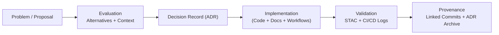

<div align="center">

# 🧱 **Kansas Frontier Matrix — Architecture Decision Record (ADR) Template**  
`docs/templates/adr.md`

**Mission:** Provide a **standardized, reproducible template** for documenting architectural, technical, and governance decisions within the **Kansas Frontier Matrix (KFM)** — ensuring clarity, provenance, and long-term traceability of every change.

[](../../docs/)
[](README.md)
[](README.md)
[](../../LICENSE)

</div>

---

```yaml
---
title: "Kansas Frontier Matrix — ADR Template"
version: "v1.3.0"
last_updated: "2025-10-17"
owners: ["@kfm-architecture","@kfm-docs","@kfm-governance"]
tags: ["adr","architecture","governance","decision-record","mcp","stac","provenance"]
status: "Template"
license: "CC-BY 4.0"
semantic_alignment:
  - MCP-DL v6.3
  - STAC 1.0
  - FAIR Principles
  - DCAT 2.0
ci_required_checks:
  - docs-validate
  - pre-commit
  - markdownlint
  - codeql
---
````

---

## 🧩 ADR Metadata

| Field                          | Description                                                 |
| :----------------------------- | :---------------------------------------------------------- |
| **ADR ID**                     | Unique identifier (e.g., `ADR-2025-001-PIPELINE-STRUCTURE`) |
| **Title**                      | Concise title summarizing the decision                      |
| **Author(s)**                  | Contributor(s) and their roles                              |
| **Date Created**               | YYYY-MM-DD                                                  |
| **Last Updated**               | YYYY-MM-DD                                                  |
| **Status**                     | Proposed / Approved / Implemented / Superseded / Deprecated |
| **Decision Type**              | Technical / Process / Governance / Infrastructure           |
| **Related Components**         | e.g., `data/stac/`, `src/pipelines/`, `web/config/`         |
| **Linked Issues / PRs**        | GitHub references (e.g., `#142`, `PR #58`)                  |
| **Supersedes / Superseded By** | Older/newer ADR references                                  |

---

## 🎯 Context

Describe the **problem**, **motivation**, and **background**.
Include scalability, policy, or interoperability concerns, and document competing alternatives.

> *Example:*
> As KFM expands to handle multi-temporal, multi-modal datasets, a decision is required for catalog hierarchy — between flat metadata structures or a hierarchical STAC Collection → Item model with full provenance linkage.

---

## 🧠 Decision

State the **final decision** and rationale.
Explain the trade-offs and the standards or experiments informing the choice.

> *Example:*
> KFM will adopt **hierarchical STAC 1.0 metadata**, connecting derived datasets via `rel:derived_from` and embedding provenance fields into STAC Items for complete lineage tracking.

---

## ⚙️ Implementation Plan

| Area              | Action                                                         | Responsible Team  |
| :---------------- | :------------------------------------------------------------- | :---------------- |
| **ETL Pipelines** | Update STAC generation scripts in `src/pipelines/`             | Data Engineering  |
| **Metadata**      | Revise `collection.json` to reflect hierarchy                  | Metadata Curators |
| **Automation**    | Update `.github/workflows/stac-validate.yml` to validate links | CI/CD Team        |
| **Docs**          | Add diagram to `docs/architecture/data-architecture.md`        | Documentation     |

---

## 🧮 Decision Drivers

| Factor                  | Justification                                                 |
| :---------------------- | :------------------------------------------------------------ |
| **Standards Alignment** | Maintains compliance with STAC 1.0, DCAT, and FAIR.           |
| **Reproducibility**     | Enables deterministic lineage and validation pipelines.       |
| **Maintainability**     | Simplifies evolution and version control of metadata schemas. |
| **Performance**         | Improves search indexing and data discovery.                  |
| **Transparency**        | Exposes provenance and decision history to all contributors.  |

---

## 🧾 Alternatives Considered

| Option                         | Pros                         | Cons                           |
| :----------------------------- | :--------------------------- | :----------------------------- |
| **Flat Metadata Model**        | Simple structure             | Poor provenance visibility     |
| **Hierarchical STAC (Chosen)** | Standardized, interoperable  | Increased schema complexity    |
| **Hybrid STAC + Graph**        | Enables semantic integration | Higher implementation overhead |

---

## 🧩 Consequences

| Type        | Impact           | Description                                      |
| :---------- | :--------------- | :----------------------------------------------- |
| ✅ Positive  | Interoperability | Fully compliant with STAC and metadata standards |
| ⚠️ Negative | Migration Cost   | Re-indexing of existing datasets required        |
| ⚙️ Neutral  | Operations       | Minimal CI/CD impact; no API changes             |

---

## 🔍 Validation & Provenance

| Validation Step        | Workflow / Tool                          | Evidence                                   |
| :--------------------- | :--------------------------------------- | :----------------------------------------- |
| **STAC Validation**    | `stac-validator`                         | ✅ `_reports/adr/<id>_stac_validation.json` |
| **Checksum Integrity** | `make checksums`                         | ✅ `data/checksums/adr/<id>.sha256`         |
| **Workflow Run**       | `.github/workflows/docs-validate.yml`    | ✅ GitHub Actions Logs                      |
| **Docs Updated**       | `docs/architecture/data-architecture.md` | ✅ Commit linked to ADR                     |

> 🗒️ **All ADR evidence and logs** must be archived under `data/work/logs/adr/<adr_id>.log`.

---

## 🔐 Governance & Review

| Reviewer            | Role             | Review Date | Decision   |
| :------------------ | :--------------- | :---------- | :--------- |
| Project Lead        | Approval         | YYYY-MM-DD  | ✅ Approved |
| Technical Architect | Peer Review      | YYYY-MM-DD  | ✅ Approved |
| Data Steward        | Compliance Check | YYYY-MM-DD  | ✅ Approved |

> All ADRs require at least **two approvals** before implementation.

---

## 🧱 Revision & Versioning

| Version | Date       | Author             | Summary                                 |
| :------ | :--------- | :----------------- | :-------------------------------------- |
| v1.0    | 2025-10-05 | Documentation Team | Initial ADR structure and adoption.     |
| v1.1    | 2025-10-17 | KFM Architecture   | Added CI/CD integration & MCP metadata. |
| v1.2    | TBD        | TBD                | Future decision or supersession.        |

---

## 📎 Related Documentation

| File                                     | Description                   |
| :--------------------------------------- | :---------------------------- |
| `docs/architecture/architecture.md`      | System overview               |
| `docs/architecture/data-architecture.md` | Data lineage & metadata model |
| `docs/architecture/knowledge-graph.md`   | Semantic graph integration    |
| `docs/templates/sop.md`                  | Related procedural guidance   |
| `.github/workflows/stac-validate.yml`    | CI validation of metadata     |

---

## 🧠 MCP Compliance Summary

| MCP Principle           | Implementation                                    |
| :---------------------- | :------------------------------------------------ |
| **Documentation-first** | ADR written and reviewed before deployment.       |
| **Reproducibility**     | Verified via CI/CD and logs.                      |
| **Open Standards**      | Aligned with STAC, DCAT, and FAIR practices.      |
| **Provenance**          | Recorded in Git history and ADR logs.             |
| **Auditability**        | Linked to validation reports and commit evidence. |

---

## 🧮 Example ADR Diagram



---

## 🧾 References

1. **STAC 1.0.0 Specification** — [https://stacspec.org](https://stacspec.org)
2. **OGC / DCAT / FAIR Standards** — [https://ogc.org](https://ogc.org), [https://www.w3.org/TR/vocab-dcat-3/](https://www.w3.org/TR/vocab-dcat-3/)
3. **Documenting Architecture Decisions (Nygard, 2011)** — [https://cognitect.com/blog/2011/11/15/documenting-architecture-decisions.html](https://cognitect.com/blog/2011/11/15/documenting-architecture-decisions.html)
4. **Master Coder Protocol (MCP-DL)** — Kansas Frontier Matrix Documentation Framework

---

<div align="center">

**Kansas Frontier Matrix © 2025**
🧭 *“Every Decision Documented. Every Choice Proven.”*
📍 `docs/templates/adr.md` — MCP-compliant Architecture Decision Record template for reproducible design governance.

</div>
